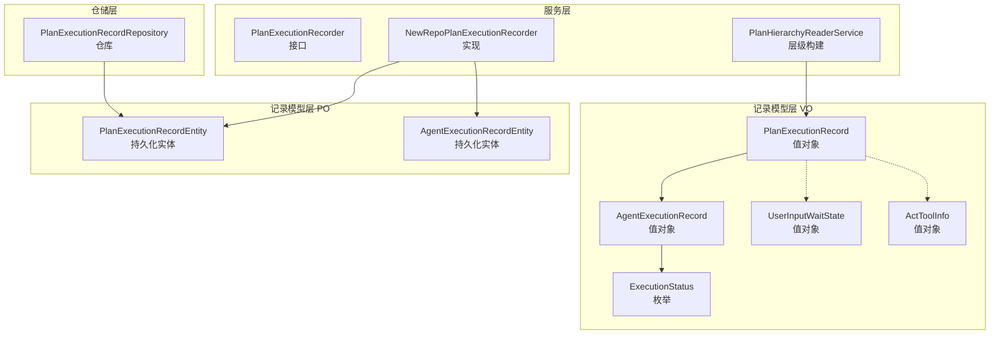
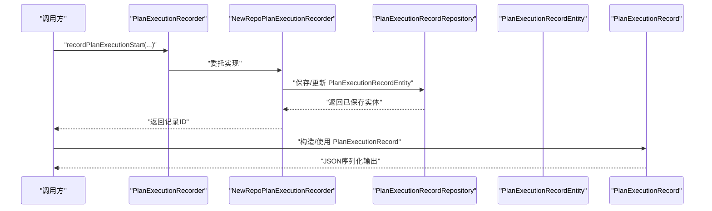
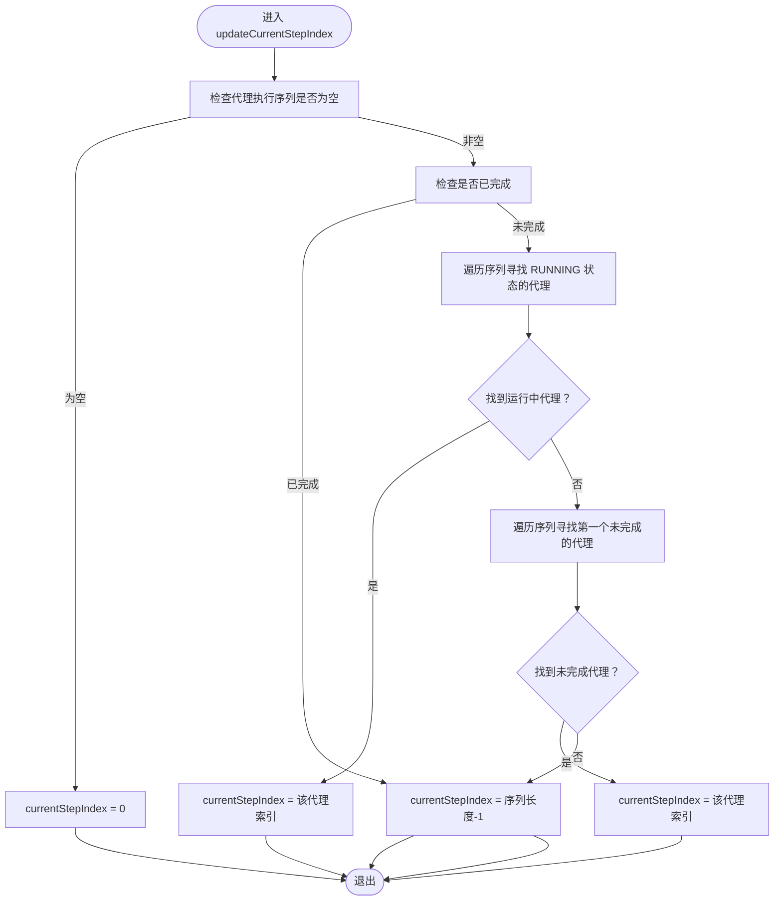
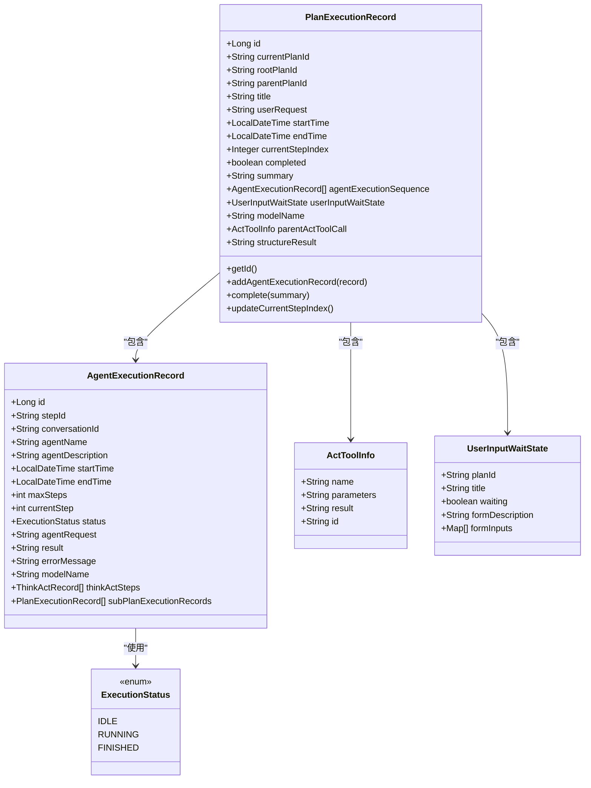

# 值对象定义

<cite>
**本文引用的文件列表**
- [PlanExecutionRecord.java](file://src/main/java/com/alibaba/cloud/ai/lynxe/recorder/entity/vo/PlanExecutionRecord.java)
- [PlanExecutionRecordEntity.java](file://src/main/java/com/alibaba/cloud/ai/lynxe/recorder/entity/po/PlanExecutionRecordEntity.java)
- [AgentExecutionRecord.java](file://src/main/java/com/alibaba/cloud/ai/lynxe/recorder/entity/vo/AgentExecutionRecord.java)
- [ExecutionStatus.java](file://src/main/java/com/alibaba/cloud/ai/lynxe/recorder/entity/vo/ExecutionStatus.java)
- [UserInputWaitState.java](file://src/main/java/com/alibaba/cloud/ai/lynxe/runtime/entity/vo/UserInputWaitState.java)
- [ActToolInfo.java](file://src/main/java/com/alibaba/cloud/ai/lynxe/recorder/entity/vo/ActToolInfo.java)
- [PlanExecutionRecorder.java](file://src/main/java/com/alibaba/cloud/ai/lynxe/recorder/service/PlanExecutionRecorder.java)
- [NewRepoPlanExecutionRecorder.java](file://src/main/java/com/alibaba/cloud/ai/lynxe/recorder/service/NewRepoPlanExecutionRecorder.java)
- [PlanHierarchyReaderService.java](file://src/main/java/com/alibaba/cloud/ai/lynxe/recorder/service/PlanHierarchyReaderService.java)
- [PlanExecutionRecordRepository.java](file://src/main/java/com/alibaba/cloud/ai/lynxe/recorder/repository/PlanExecutionRecordRepository.java)
</cite>

## 目录
1. [简介](#简介)
2. [项目结构](#项目结构)
3. [核心组件](#核心组件)
4. [架构总览](#架构总览)
5. [详细组件分析](#详细组件分析)
6. [依赖分析](#依赖分析)
7. [性能考量](#性能考量)
8. [故障排查指南](#故障排查指南)
9. [结论](#结论)
10. [附录](#附录)

## 简介
本文件围绕 PlanExecutionRecord 值对象进行系统化文档化，目标是帮助读者理解该值对象的设计目的、数据结构、序列化策略、运行时行为以及与持久化实体及执行监控服务的协作方式。文档将从以下维度展开：
- 设计目的：作为“传输载体”，在持久化实体与外部系统（前端/调用方）之间传递执行记录信息。
- 核心字段：执行ID、计划ID、用户请求、执行时间、执行状态、代理执行序列、用户输入等待状态等的定义与用途。
- 序列化机制：对 LocalDateTime 类型通过 Jackson 注解进行 JSR-310 的序列化/反序列化处理。
- 运行时逻辑：updateCurrentStepIndex 方法如何基于代理执行状态动态更新当前步骤索引；addAgentExecutionRecord 与 complete 方法如何维护执行序列与状态。
- ID 生成策略：generateId 的生成规则与在分布式环境下的适用性评估。
- 转换关系：与 PlanExecutionRecordEntity 的映射关系，以及在执行监控服务中的应用。

## 项目结构
PlanExecutionRecord 所属模块位于 recorder 子系统中，与 AgentExecutionRecord、ExecutionStatus、ActToolInfo 等共同构成执行记录的数据模型层，并通过 PlanExecutionRecorder 接口与 NewRepoPlanExecutionRecorder 实现类协同工作，完成从开始到结束的全链路记录。

图表来源
- [PlanExecutionRecord.java](file://src/main/java/com/alibaba/cloud/ai/lynxe/recorder/entity/vo/PlanExecutionRecord.java#L1-L337)
- [PlanExecutionRecordEntity.java](file://src/main/java/com/alibaba/cloud/ai/lynxe/recorder/entity/po/PlanExecutionRecordEntity.java#L1-L283)
- [AgentExecutionRecord.java](file://src/main/java/com/alibaba/cloud/ai/lynxe/recorder/entity/vo/AgentExecutionRecord.java#L1-L318)
- [ExecutionStatus.java](file://src/main/java/com/alibaba/cloud/ai/lynxe/recorder/entity/vo/ExecutionStatus.java#L1-L26)
- [ActToolInfo.java](file://src/main/java/com/alibaba/cloud/ai/lynxe/recorder/entity/vo/ActToolInfo.java#L1-L138)
- [UserInputWaitState.java](file://src/main/java/com/alibaba/cloud/ai/lynxe/runtime/entity/vo/UserInputWaitState.java#L1-L84)
- [PlanExecutionRecorder.java](file://src/main/java/com/alibaba/cloud/ai/lynxe/recorder/service/PlanExecutionRecorder.java#L1-L242)
- [NewRepoPlanExecutionRecorder.java](file://src/main/java/com/alibaba/cloud/ai/lynxe/recorder/service/NewRepoPlanExecutionRecorder.java#L1-L857)
- [PlanHierarchyReaderService.java](file://src/main/java/com/alibaba/cloud/ai/lynxe/recorder/service/PlanHierarchyReaderService.java#L323-L348)
- [PlanExecutionRecordRepository.java](file://src/main/java/com/alibaba/cloud/ai/lynxe/recorder/repository/PlanExecutionRecordRepository.java#L39-L54)

章节来源
- [PlanExecutionRecord.java](file://src/main/java/com/alibaba/cloud/ai/lynxe/recorder/entity/vo/PlanExecutionRecord.java#L1-L337)
- [PlanExecutionRecordEntity.java](file://src/main/java/com/alibaba/cloud/ai/lynxe/recorder/entity/po/PlanExecutionRecordEntity.java#L1-L283)

## 核心组件
- PlanExecutionRecord（值对象）
  - 作用：承载一次计划执行的完整信息，作为对外传输的载体，包含基础信息、计划结构、执行数据、结果摘要等。
  - 关键字段：
    - 执行ID：唯一标识该记录，支持延迟生成。
    - 计划ID：当前计划唯一标识，用于关联上下文。
    - 根计划ID/父计划ID：用于子计划场景的层级关系。
    - 标题、用户请求：计划元信息。
    - 开始/结束时间：执行时间窗口。
    - 当前步骤索引：基于代理执行状态动态计算。
    - 完成标记与摘要：执行结果概要。
    - 代理执行序列：按顺序记录每个代理的执行详情。
    - 用户输入等待状态：表示是否处于等待用户输入的状态。
    - 模型名称：实际调用的模型名。
    - 父级工具调用信息：用于子计划展示。
    - 结构化结果：可选的结构化输出。
- AgentExecutionRecord（值对象）
  - 作用：记录单个代理在某一步骤内的执行过程，包括思考-行动步骤、子计划执行记录等。
- ExecutionStatus（枚举）
  - 作用：统一代理执行状态（空闲、运行中、已完成）。
- ActToolInfo（值对象）
  - 作用：记录动作阶段使用的工具名称、参数、结果与工具调用ID。
- UserInputWaitState（值对象）
  - 作用：封装用户输入等待状态，便于前端渲染与交互提示。

章节来源
- [PlanExecutionRecord.java](file://src/main/java/com/alibaba/cloud/ai/lynxe/recorder/entity/vo/PlanExecutionRecord.java#L46-L113)
- [AgentExecutionRecord.java](file://src/main/java/com/alibaba/cloud/ai/lynxe/recorder/entity/vo/AgentExecutionRecord.java#L55-L110)
- [ExecutionStatus.java](file://src/main/java/com/alibaba/cloud/ai/lynxe/recorder/entity/vo/ExecutionStatus.java#L18-L26)
- [ActToolInfo.java](file://src/main/java/com/alibaba/cloud/ai/lynxe/recorder/entity/vo/ActToolInfo.java#L28-L108)
- [UserInputWaitState.java](file://src/main/java/com/alibaba/cloud/ai/lynxe/runtime/entity/vo/UserInputWaitState.java#L18-L84)

## 架构总览
PlanExecutionRecord 在系统中的位置如下：
- 作为值对象，面向外部系统（前端/调用方），提供 JSON 序列化能力；
- 与 PlanExecutionRecordEntity 形成 VO/PO 映射，支撑持久化；
- 通过 PlanExecutionRecorder 接口与 NewRepoPlanExecutionRecorder 实现，完成从开始到结束的全链路记录；
- 与 AgentExecutionRecord、ExecutionStatus、ActToolInfo 协作，形成完整的执行轨迹；
- 通过 PlanHierarchyReaderService 构建计划层级关系，便于查询与展示。

图表来源
- [PlanExecutionRecorder.java](file://src/main/java/com/alibaba/cloud/ai/lynxe/recorder/service/PlanExecutionRecorder.java#L26-L108)
- [NewRepoPlanExecutionRecorder.java](file://src/main/java/com/alibaba/cloud/ai/lynxe/recorder/service/NewRepoPlanExecutionRecorder.java#L75-L149)
- [PlanExecutionRecordRepository.java](file://src/main/java/com/alibaba/cloud/ai/lynxe/recorder/repository/PlanExecutionRecordRepository.java#L39-L54)
- [PlanExecutionRecord.java](file://src/main/java/com/alibaba/cloud/ai/lynxe/recorder/entity/vo/PlanExecutionRecord.java#L104-L113)

## 详细组件分析

### 值对象设计与字段语义
- 执行ID（id）
  - 生成策略：首次访问时惰性生成；若未设置则组合毫秒时间戳与随机数，保证本地唯一性。
  - 分布式适用性：由于依赖本地时间戳与随机数，存在并发冲突风险；建议在分布式环境下引入全局ID生成器或数据库自增主键策略。
- 计划ID（currentPlanId）、根计划ID（rootPlanId）、父计划ID（parentPlanId）
  - 用于区分主计划与子计划，建立层级关系。
- 标题（title）、用户请求（userRequest）
  - 记录计划元信息，便于检索与展示。
- 执行时间（startTime、endTime）
  - 记录执行起止时刻，支持前端展示耗时与进度。
- 当前步骤索引（currentStepIndex）
  - 动态计算得出，反映当前正在执行或即将执行的步骤。
- 完成标记（completed）与摘要（summary）
  - 标识执行完成并记录总结。
- 代理执行序列（agentExecutionSequence）
  - 有序记录每个代理的执行详情，驱动 currentStepIndex 的动态更新。
- 用户输入等待状态（userInputWaitState）
  - 表示是否等待用户输入，便于前端交互控制。
- 模型名称（modelName）
  - 记录实际调用的模型名，便于审计与追踪。
- 父级工具调用信息（parentActToolCall）
  - 用于子计划展示触发来源。
- 结构化结果（structureResult）
  - 可选的结构化输出，便于后续处理。

章节来源
- [PlanExecutionRecord.java](file://src/main/java/com/alibaba/cloud/ai/lynxe/recorder/entity/vo/PlanExecutionRecord.java#L46-L113)
- [PlanExecutionRecord.java](file://src/main/java/com/alibaba/cloud/ai/lynxe/recorder/entity/vo/PlanExecutionRecord.java#L188-L200)
- [PlanExecutionRecord.java](file://src/main/java/com/alibaba/cloud/ai/lynxe/recorder/entity/vo/PlanExecutionRecord.java#L204-L336)

### 时间字段的序列化处理
- 使用 Jackson 注解对 LocalDateTime 字段进行序列化/反序列化：
  - @JsonSerialize(using = LocalDateTimeSerializer.class)
  - @JsonDeserialize(using = LocalDateTimeDeserializer.class)
- 作用：确保前后端一致地解析/生成 ISO-8601 风格的时间字符串，避免时区与格式差异导致的兼容问题。

章节来源
- [PlanExecutionRecord.java](file://src/main/java/com/alibaba/cloud/ai/lynxe/recorder/entity/vo/PlanExecutionRecord.java#L69-L77)

### updateCurrentStepIndex 的业务逻辑
该方法根据代理执行序列与完成状态，动态确定当前步骤索引。流程如下：

图表来源
- [PlanExecutionRecord.java](file://src/main/java/com/alibaba/cloud/ai/lynxe/recorder/entity/vo/PlanExecutionRecord.java#L150-L186)

章节来源
- [PlanExecutionRecord.java](file://src/main/java/com/alibaba/cloud/ai/lynxe/recorder/entity/vo/PlanExecutionRecord.java#L150-L186)

### addAgentExecutionRecord 与 complete 对执行序列与状态的维护
- addAgentExecutionRecord
  - 将新的代理执行记录加入序列后，立即调用 updateCurrentStepIndex，以保持 currentStepIndex 与最新执行状态一致。
- complete
  - 设置结束时间、完成标记与摘要，并再次调用 updateCurrentStepIndex，确保在完成状态下 currentStepIndex 指向最后一个步骤。

章节来源
- [PlanExecutionRecord.java](file://src/main/java/com/alibaba/cloud/ai/lynxe/recorder/entity/vo/PlanExecutionRecord.java#L115-L148)

### generateId 的 ID 生成策略与分布式适用性
- 策略：当 id 为 null 时，使用 System.currentTimeMillis() 与一个随机数拼接生成，保证本地唯一性。
- 分布式适用性：该策略依赖本地时间戳与随机数，无法保证跨节点全局唯一；在高并发或多实例部署场景下可能产生冲突。建议结合数据库自增主键、雪花算法或 UUID 等全局唯一策略。

章节来源
- [PlanExecutionRecord.java](file://src/main/java/com/alibaba/cloud/ai/lynxe/recorder/entity/vo/PlanExecutionRecord.java#L188-L200)

### 与持久化实体的转换关系
- PlanExecutionRecord（值对象）与 PlanExecutionRecordEntity（持久化实体）一一对应，关键字段映射如下：
  - id、currentPlanId、rootPlanId、parentPlanId、title、userRequest、startTime、endTime、completed、summary、modelName、toolCallId、agentExecutionSequence 等。
- NewRepoPlanExecutionRecorder 在记录开始/结束时，直接操作 PlanExecutionRecordEntity 并持久化；对外暴露的 PlanExecutionRecord 则用于序列化与传输。
- PlanHierarchyReaderService 通过 PlanExecutionRecord 的 subPlanExecutionRecords 字段构建层级关系，便于查询与展示。

章节来源
- [PlanExecutionRecord.java](file://src/main/java/com/alibaba/cloud/ai/lynxe/recorder/entity/vo/PlanExecutionRecord.java#L46-L113)
- [PlanExecutionRecordEntity.java](file://src/main/java/com/alibaba/cloud/ai/lynxe/recorder/entity/po/PlanExecutionRecordEntity.java#L42-L109)
- [NewRepoPlanExecutionRecorder.java](file://src/main/java/com/alibaba/cloud/ai/lynxe/recorder/service/NewRepoPlanExecutionRecorder.java#L75-L149)
- [PlanHierarchyReaderService.java](file://src/main/java/com/alibaba/cloud/ai/lynxe/recorder/service/PlanHierarchyReaderService.java#L323-L348)

### 在执行监控服务中的应用
- PlanExecutionRecorder 接口定义了记录开始、结束、步骤开始/结束、完整代理执行、思考-行动记录等方法，NewRepoPlanExecutionRecorder 提供具体实现。
- PlanExecutionRecord 作为对外传输载体，被前端或调用方消费，用于展示执行进度、状态与结果。
- PlanExecutionRecordRepository 提供按 rootPlanId 查询、按 currentPlanId 删除等能力，支撑执行监控与清理。

章节来源
- [PlanExecutionRecorder.java](file://src/main/java/com/alibaba/cloud/ai/lynxe/recorder/service/PlanExecutionRecorder.java#L26-L108)
- [NewRepoPlanExecutionRecorder.java](file://src/main/java/com/alibaba/cloud/ai/lynxe/recorder/service/NewRepoPlanExecutionRecorder.java#L596-L645)
- [PlanExecutionRecordRepository.java](file://src/main/java/com/alibaba/cloud/ai/lynxe/recorder/repository/PlanExecutionRecordRepository.java#L39-L54)

## 依赖分析
- 组件耦合
  - PlanExecutionRecord 依赖 AgentExecutionRecord、ExecutionStatus、ActToolInfo、UserInputWaitState。
  - NewRepoPlanExecutionRecorder 依赖 PlanExecutionRecordRepository、AgentExecutionRecordRepository、ThinkActRecordRepository、ActToolInfoRepository，并与 PlanExecutionRecordEntity/AgentExecutionRecordEntity 协作。
- 外部依赖
  - Jackson JSR-310 序列化器用于 LocalDateTime 字段的 JSON 处理。
  - JPA 注解用于 PlanExecutionRecordEntity 的持久化映射。

图表来源
- [PlanExecutionRecord.java](file://src/main/java/com/alibaba/cloud/ai/lynxe/recorder/entity/vo/PlanExecutionRecord.java#L46-L336)
- [AgentExecutionRecord.java](file://src/main/java/com/alibaba/cloud/ai/lynxe/recorder/entity/vo/AgentExecutionRecord.java#L55-L318)
- [ExecutionStatus.java](file://src/main/java/com/alibaba/cloud/ai/lynxe/recorder/entity/vo/ExecutionStatus.java#L18-L26)
- [ActToolInfo.java](file://src/main/java/com/alibaba/cloud/ai/lynxe/recorder/entity/vo/ActToolInfo.java#L28-L108)
- [UserInputWaitState.java](file://src/main/java/com/alibaba/cloud/ai/lynxe/runtime/entity/vo/UserInputWaitState.java#L18-L84)

## 性能考量
- updateCurrentStepIndex 的线性扫描复杂度为 O(n)，其中 n 为代理执行序列长度。在步骤较多时应关注更新频率与调用频次。
- addAgentExecutionRecord 与 complete 在每次变更后均触发 updateCurrentStepIndex，建议在批量写入时合并更新，减少重复计算。
- LocalDateTime 的序列化/反序列化开销较低，但需确保 Jackson JSR-310 依赖正确配置，避免额外装箱/拆箱成本。

## 故障排查指南
- 当前步骤索引异常
  - 检查代理执行序列是否为空或状态不一致；确认 RUNNING/FINISHED 状态是否正确设置。
  - 参考路径：[PlanExecutionRecord.updateCurrentStepIndex](file://src/main/java/com/alibaba/cloud/ai/lynxe/recorder/entity/vo/PlanExecutionRecord.java#L150-L186)
- 时间字段序列化失败
  - 确认 Jackson JSR-310 依赖已引入且版本兼容；检查 LocalDateTime 字段上的注解是否正确。
  - 参考路径：[PlanExecutionRecord.startTime/endTime 注解](file://src/main/java/com/alibaba/cloud/ai/lynxe/recorder/entity/vo/PlanExecutionRecord.java#L69-L77)
- 计划完成但摘要缺失
  - 确认 complete 调用是否传入摘要；检查 NewRepoPlanExecutionRecorder.recordPlanCompletion 是否成功保存。
  - 参考路径：[PlanExecutionRecord.complete](file://src/main/java/com/alibaba/cloud/ai/lynxe/recorder/entity/vo/PlanExecutionRecord.java#L140-L148)、[NewRepoPlanExecutionRecorder.recordPlanCompletion](file://src/main/java/com/alibaba/cloud/ai/lynxe/recorder/service/NewRepoPlanExecutionRecorder.java#L606-L645)
- 用户输入等待状态未生效
  - 检查 UserInputWaitState 字段是否正确赋值；确认前端消费逻辑是否读取该字段。
  - 参考路径：[UserInputWaitState](file://src/main/java/com/alibaba/cloud/ai/lynxe/runtime/entity/vo/UserInputWaitState.java#L18-L84)

章节来源
- [PlanExecutionRecord.java](file://src/main/java/com/alibaba/cloud/ai/lynxe/recorder/entity/vo/PlanExecutionRecord.java#L140-L186)
- [NewRepoPlanExecutionRecorder.java](file://src/main/java/com/alibaba/cloud/ai/lynxe/recorder/service/NewRepoPlanExecutionRecorder.java#L606-L645)
- [UserInputWaitState.java](file://src/main/java/com/alibaba/cloud/ai/lynxe/runtime/entity/vo/UserInputWaitState.java#L18-L84)

## 结论
PlanExecutionRecord 作为执行记录的值对象，承担了对外传输与状态计算的关键职责。其通过明确的字段划分、Jackson 对 LocalDateTime 的序列化支持、以及基于代理执行状态的动态索引更新机制，实现了对计划执行过程的完整刻画。在分布式环境中，建议优化 ID 生成策略以满足全局唯一性需求；同时，在高频更新场景下，可通过批处理与缓存策略降低 updateCurrentStepIndex 的调用频次，提升整体性能。

## 附录
- 与持久化实体的映射要点
  - PlanExecutionRecordEntity 采用 JPA 注解进行表映射，包含基本字段、步骤列表、当前步骤索引、完成标记与摘要、代理执行序列等。
  - NewRepoPlanExecutionRecorder 在记录开始/结束时直接操作实体并持久化，对外暴露的 PlanExecutionRecord 仅用于序列化与传输。
- 与执行监控服务的集成点
  - PlanExecutionRecorder 接口定义了完整的记录生命周期；NewRepoPlanExecutionRecorder 提供实现；PlanExecutionRecordRepository 支持按根计划ID查询与按当前计划ID删除，便于监控与清理。

章节来源
- [PlanExecutionRecordEntity.java](file://src/main/java/com/alibaba/cloud/ai/lynxe/recorder/entity/po/PlanExecutionRecordEntity.java#L42-L109)
- [PlanExecutionRecorder.java](file://src/main/java/com/alibaba/cloud/ai/lynxe/recorder/service/PlanExecutionRecorder.java#L26-L108)
- [NewRepoPlanExecutionRecorder.java](file://src/main/java/com/alibaba/cloud/ai/lynxe/recorder/service/NewRepoPlanExecutionRecorder.java#L75-L149)
- [PlanExecutionRecordRepository.java](file://src/main/java/com/alibaba/cloud/ai/lynxe/recorder/repository/PlanExecutionRecordRepository.java#L39-L54)