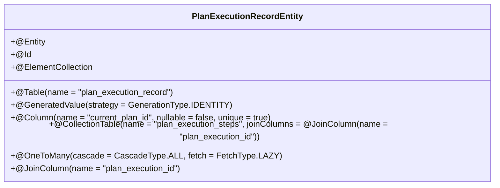
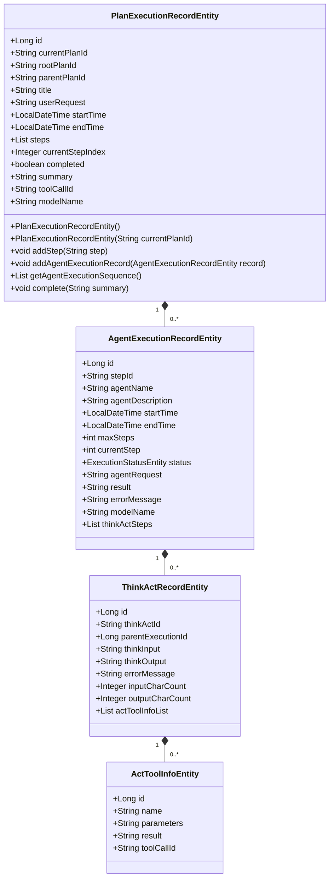

# 执行记录实体定义

<cite>
**本文档引用的文件**   
- [PlanExecutionRecordEntity.java](file://src/main/java/com/alibaba/cloud/ai/lynxe/recorder/entity/po/PlanExecutionRecordEntity.java)
- [PlanExecutionRecord.java](file://src/main/java/com/alibaba/cloud/ai/lynxe/recorder/entity/vo/PlanExecutionRecord.java)
- [AgentExecutionRecordEntity.java](file://src/main/java/com/alibaba/cloud/ai/lynxe/recorder/entity/po/AgentExecutionRecordEntity.java)
- [AgentExecutionRecord.java](file://src/main/java/com/alibaba/cloud/ai/lynxe/recorder/entity/vo/AgentExecutionRecord.java)
- [PlanExecutionRecordRepository.java](file://src/main/java/com/alibaba/cloud/ai/lynxe/recorder/repository/PlanExecutionRecordRepository.java)
- [NewRepoPlanExecutionRecorder.java](file://src/main/java/com/alibaba/cloud/ai/lynxe/recorder/service/NewRepoPlanExecutionRecorder.java)
</cite>

## 目录
1. [引言](#引言)
2. [核心字段设计原理](#核心字段设计原理)
3. [JPA注解配置详解](#jpa注解配置详解)
4. [实体与VO转换逻辑](#实体与vo转换逻辑)
5. [字段说明表](#字段说明表)
6. [构造函数与核心方法](#构造函数与核心方法)
7. [实体关系图](#实体关系图)

## 引言

PlanExecutionRecordEntity是系统中用于持久化计划执行记录的核心实体类，负责跟踪和记录PlanningFlow执行过程的详细信息。该实体采用分层数据结构设计，包含执行基本信息、计划结构、执行数据和执行结果四个主要部分。通过JPA注解实现与数据库的映射，支持完整的CRUD操作，并与PlanExecutionRecord VO实体进行双向转换，为前端展示和业务逻辑处理提供数据支持。

**Section sources**
- [PlanExecutionRecordEntity.java](file://src/main/java/com/alibaba/cloud/ai/lynxe/recorder/entity/po/PlanExecutionRecordEntity.java#L25-L41)

## 核心字段设计原理

PlanExecutionRecordEntity实体的核心字段设计遵循分层结构原则，将执行记录划分为四个逻辑部分：

1. **基础信息**：包含记录的唯一标识、计划ID、标题、执行时间戳和用户原始请求
2. **计划结构**：维护计划步骤列表和当前执行步骤索引
3. **执行数据**：通过OneToMany关系关联AgentExecutionRecordEntity，记录智能代理的执行序列
4. **执行结果**：包含完成状态和执行摘要

这种设计实现了执行过程的完整追踪，支持对执行历史的回溯分析和状态监控。

**Section sources**
- [PlanExecutionRecordEntity.java](file://src/main/java/com/alibaba/cloud/ai/lynxe/recorder/entity/po/PlanExecutionRecordEntity.java#L29-L40)

## JPA注解配置详解

### 实体与表映射


**Diagram sources**
- [PlanExecutionRecordEntity.java](file://src/main/java/com/alibaba/cloud/ai/lynxe/recorder/entity/po/PlanExecutionRecordEntity.java#L42-L43)
- [PlanExecutionRecordEntity.java](file://src/main/java/com/alibaba/cloud/ai/lynxe/recorder/entity/po/PlanExecutionRecordEntity.java#L47-L48)
- [PlanExecutionRecordEntity.java](file://src/main/java/com/alibaba/cloud/ai/lynxe/recorder/entity/po/PlanExecutionRecordEntity.java#L52-L53)
- [PlanExecutionRecordEntity.java](file://src/main/java/com/alibaba/cloud/ai/lynxe/recorder/entity/po/PlanExecutionRecordEntity.java#L80-L83)
- [PlanExecutionRecordEntity.java](file://src/main/java/com/alibaba/cloud/ai/lynxe/recorder/entity/po/PlanExecutionRecordEntity.java#L98-L100)

### 注解使用说明
- **@Entity**：声明该类为JPA实体，可被持久化到数据库
- **@Table**：指定实体映射的数据库表名为"plan_execution_record"
- **@Id**：标识主键字段，使用@GeneratedValue实现自增
- **@Column**：配置字段与数据库列的映射关系，包括列名、约束和数据类型
- **@ElementCollection**：用于映射基本类型集合，配合@CollectionTable存储步骤列表
- **@OneToMany**：建立与AgentExecutionRecordEntity的一对多关系，实现执行序列的关联存储

**Section sources**
- [PlanExecutionRecordEntity.java](file://src/main/java/com/alibaba/cloud/ai/lynxe/recorder/entity/po/PlanExecutionRecordEntity.java#L42-L282)

## 实体与VO转换逻辑

PlanExecutionRecordEntity与PlanExecutionRecord之间的转换通过NewRepoPlanExecutionRecorder服务类实现，遵循以下转换规则：

1. **字段映射**：PO实体与VO实体的同名字段直接映射
2. **数据类型转换**：LocalDateTime字段通过@JsonSerialize和@JsonDeserialize注解处理序列化
3. **业务逻辑处理**：在转换过程中动态更新当前步骤索引，基于代理执行状态确定执行进度
4. **关系转换**：OneToMany关系转换为VO中的List<AgentExecutionRecord>，保持层级结构

转换过程由recordPlanExecutionStart和recordPlanCompletion等方法驱动，确保数据一致性。

**Section sources**
- [PlanExecutionRecordEntity.java](file://src/main/java/com/alibaba/cloud/ai/lynxe/recorder/entity/po/PlanExecutionRecordEntity.java)
- [PlanExecutionRecord.java](file://src/main/java/com/alibaba/cloud/ai/lynxe/recorder/entity/vo/PlanExecutionRecord.java)
- [NewRepoPlanExecutionRecorder.java](file://src/main/java/com/alibaba/cloud/ai/lynxe/recorder/service/NewRepoPlanExecutionRecorder.java)

## 字段说明表

| 字段名称 | 业务含义 | 数据类型 | 约束条件 | 数据库存储方式 |
|---------|--------|--------|--------|-------------|
| id | 记录唯一标识 | Long | 主键，自增 | BIGINT PRIMARY KEY AUTO_INCREMENT |
| currentPlanId | 当前计划唯一标识 | String | 非空，唯一 | VARCHAR(255) NOT NULL UNIQUE |
| rootPlanId | 子计划的根计划ID | String | 可为空 | VARCHAR(255) |
| parentPlanId | 子计划的父计划ID | String | 可为空 | VARCHAR(255) |
| title | 计划标题 | String | 可为空 | VARCHAR(255) |
| userRequest | 用户原始请求 | String | 可为空 | LONGTEXT |
| startTime | 执行开始时间 | LocalDateTime | 可为空 | DATETIME |
| endTime | 执行结束时间 | LocalDateTime | 可为空 | DATETIME |
| steps | 计划步骤列表 | List<String> | 非空 | 通过plan_execution_steps表存储 |
| currentStepIndex | 当前执行步骤索引 | Integer | 可为空 | INT |
| completed | 是否完成 | boolean | 非空，默认false | BOOLEAN NOT NULL DEFAULT 0 |
| summary | 执行摘要 | String | 可为空 | LONGTEXT |
| agentExecutionSequence | 代理执行序列 | List<AgentExecutionRecordEntity> | 非空 | 通过外键关联agent_execution_record表 |
| toolCallId | 触发此计划的工具调用ID | String | 可为空 | VARCHAR(255) |
| modelName | 实际调用的模型 | String | 可为空 | VARCHAR(255) |

**Section sources**
- [PlanExecutionRecordEntity.java](file://src/main/java/com/alibaba/cloud/ai/lynxe/recorder/entity/po/PlanExecutionRecordEntity.java#L46-L280)

## 构造函数与核心方法

### 构造函数
```java
// 默认构造函数 - 用于Jackson等框架
public PlanExecutionRecordEntity() {
    this.steps = new ArrayList<>();
    this.completed = false;
    this.agentExecutionSequence = new ArrayList<>();
}

// 带参数构造函数 - 创建新的执行记录
public PlanExecutionRecordEntity(String currentPlanId) {
    this.currentPlanId = currentPlanId;
    this.steps = new ArrayList<>();
    this.startTime = LocalDateTime.now();
    this.completed = false;
    this.agentExecutionSequence = new ArrayList<>();
}
```

### 核心方法
- **addStep(String step)**：添加执行步骤到步骤列表
- **addAgentExecutionRecord(AgentExecutionRecordEntity record)**：添加代理执行记录到执行序列
- **getAgentExecutionSequence()**：获取按执行顺序排序的代理执行记录列表
- **complete(String summary)**：标记执行完成，设置结束时间和摘要

这些方法实现了对执行记录的动态管理和状态更新，支持执行过程的实时追踪。

**Section sources**
- [PlanExecutionRecordEntity.java](file://src/main/java/com/alibaba/cloud/ai/lynxe/recorder/entity/po/PlanExecutionRecordEntity.java#L113-L166)

## 实体关系图



**Diagram sources**
- [PlanExecutionRecordEntity.java](file://src/main/java/com/alibaba/cloud/ai/lynxe/recorder/entity/po/PlanExecutionRecordEntity.java)
- [AgentExecutionRecordEntity.java](file://src/main/java/com/alibaba/cloud/ai/lynxe/recorder/entity/po/AgentExecutionRecordEntity.java)
- [ThinkActRecordEntity.java](file://src/main/java/com/alibaba/cloud/ai/lynxe/recorder/entity/po/ThinkActRecordEntity.java)
- [ActToolInfoEntity.java](file://src/main/java/com/alibaba/cloud/ai/lynxe/recorder/entity/po/ActToolInfoEntity.java)