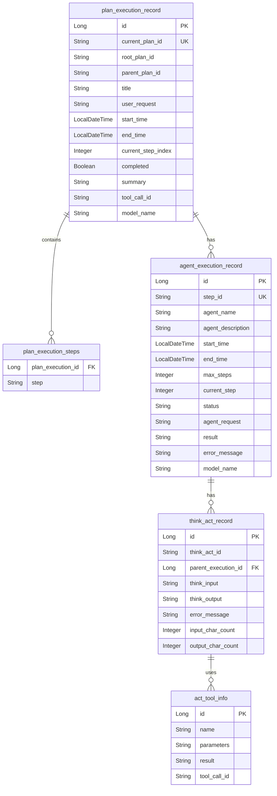
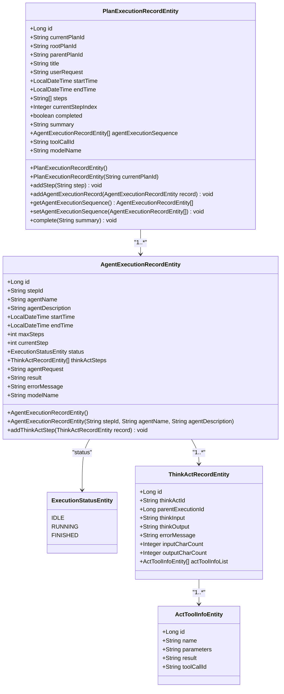
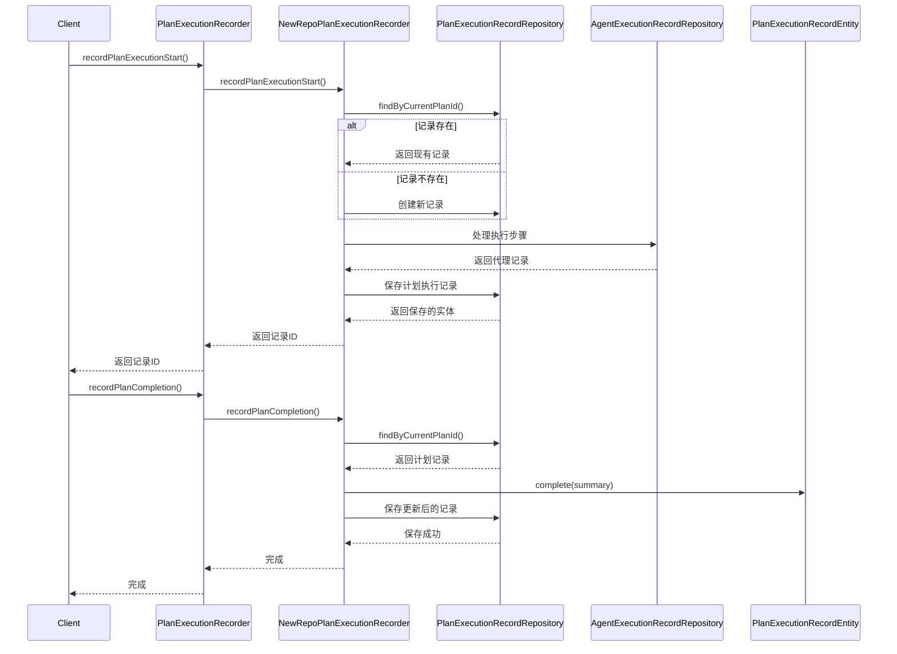

# 持久化实体定义

<cite>
**本文档引用文件**  
- [PlanExecutionRecordEntity.java](file://src/main/java/com/alibaba/cloud/ai/lynxe/recorder/entity/po/PlanExecutionRecordEntity.java)
- [AgentExecutionRecordEntity.java](file://src/main/java/com/alibaba/cloud/ai/lynxe/recorder/entity/po/AgentExecutionRecordEntity.java)
- [ExecutionStatusEntity.java](file://src/main/java/com/alibaba/cloud/ai/lynxe/recorder/entity/po/ExecutionStatusEntity.java)
- [ThinkActRecordEntity.java](file://src/main/java/com/alibaba/cloud/ai/lynxe/recorder/entity/po/ThinkActRecordEntity.java)
- [ActToolInfoEntity.java](file://src/main/java/com/alibaba/cloud/ai/lynxe/recorder/entity/po/ActToolInfoEntity.java)
- [PlanExecutionRecordRepository.java](file://src/main/java/com/alibaba/cloud/ai/lynxe/recorder/repository/PlanExecutionRecordRepository.java)
- [PlanExecutionRecorder.java](file://src/main/java/com/alibaba/cloud/ai/lynxe/recorder/service/PlanExecutionRecorder.java)
- [NewRepoPlanExecutionRecorder.java](file://src/main/java/com/alibaba/cloud/ai/lynxe/recorder/service/NewRepoPlanExecutionRecorder.java)
</cite>

## 目录
1. [引言](#引言)
2. [核心字段设计原理](#核心字段设计原理)
3. [JPA注解配置详解](#jpa注解配置详解)
4. [数据库表映射关系](#数据库表映射关系)
5. [构造函数与核心方法](#构造函数与核心方法)
6. [字段说明表](#字段说明表)
7. [与AgentExecutionRecordEntity的关联关系](#与agentexecutionrecordentity的关联关系)
8. [执行监控中的作用](#执行监控中的作用)

## 引言
`PlanExecutionRecordEntity` 是一个JPA持久化实体，用于跟踪和记录规划流程（PlanningFlow）执行过程的详细信息。该实体作为系统执行监控的核心数据结构，完整记录了计划执行的生命周期，包括执行ID、计划ID、执行状态、时间戳、执行摘要和步骤序列等关键信息。通过与`AgentExecutionRecordEntity`等其他实体的关联，构建了完整的执行追踪体系，为系统调试、性能分析和用户审计提供了数据基础。

**Section sources**
- [PlanExecutionRecordEntity.java](file://src/main/java/com/alibaba/cloud/ai/lynxe/recorder/entity/po/PlanExecutionRecordEntity.java#L25-L41)

## 核心字段设计原理
`PlanExecutionRecordEntity` 的数据结构被划分为四个主要部分：基本信息、计划结构、执行数据和执行结果。这种设计遵循了关注点分离原则，使得数据组织清晰且易于维护。

- **基本信息**：包含记录的唯一标识符（id）、当前计划的唯一标识符（currentPlanId）、计划标题（title）、执行开始时间（startTime）、执行结束时间（endTime）以及用户的原始请求（userRequest）。这些字段构成了执行记录的元数据基础。
- **计划结构**：包含计划步骤列表（steps）和当前正在执行的步骤索引（currentStepIndex），用于描述计划的执行路径和进度。
- **执行数据**：通过`agentExecutionSequence`字段记录每个智能代理的执行记录，形成执行序列。
- **执行结果**：包含完成状态（completed）和执行摘要（summary），用于表示执行的最终状态和结果。

**Section sources**
- [PlanExecutionRecordEntity.java](file://src/main/java/com/alibaba/cloud/ai/lynxe/recorder/entity/po/PlanExecutionRecordEntity.java#L29-L40)

## JPA注解配置详解
`PlanExecutionRecordEntity` 使用了多种JPA注解来配置实体与数据库表的映射关系。

- **@Entity**：声明该类为JPA实体，使其能够被持久化框架管理。
- **@Table(name = "plan_execution_record")**：指定该实体映射到名为`plan_execution_record`的数据库表。
- **@Id**：标识`id`字段为主键。
- **@GeneratedValue(strategy = GenerationType.IDENTITY)**：指定主键生成策略为自增。
- **@Column**：用于配置字段与数据库列的映射，例如`nullable = false`表示该字段不可为空，`unique = true`表示该字段值唯一，`columnDefinition = "LONGTEXT"`指定数据库列的数据类型。
- **@ElementCollection**：用于映射集合类型的字段，如`steps`字段，它将`List<String>`映射到一个单独的关联表`plan_execution_steps`中。
- **@CollectionTable**：与`@ElementCollection`配合使用，指定集合映射的关联表名称和外键列。
- **@OneToMany**：表示`PlanExecutionRecordEntity`与`AgentExecutionRecordEntity`之间的一对多关系，`cascade = CascadeType.ALL`表示级联所有操作，`fetch = FetchType.LAZY`表示延迟加载。

**Section sources**
- [PlanExecutionRecordEntity.java](file://src/main/java/com/alibaba/cloud/ai/lynxe/recorder/entity/po/PlanExecutionRecordEntity.java#L42-L100)

## 数据库表映射关系
`PlanExecutionRecordEntity` 实体与数据库中的`plan_execution_record`表直接映射。其字段与表列的对应关系如下：

- `id` → `id` (主键，自增)
- `currentPlanId` → `current_plan_id` (非空，唯一)
- `rootPlanId` → `root_plan_id`
- `parentPlanId` → `parent_plan_id`
- `title` → `title`
- `userRequest` → `user_request` (LONGTEXT类型)
- `startTime` → `start_time`
- `endTime` → `end_time`
- `currentStepIndex` → `current_step_index`
- `completed` → `completed`
- `summary` → `summary` (LONGTEXT类型)
- `toolCallId` → `tool_call_id`
- `modelName` → `model_name`

`steps`字段通过`@ElementCollection`和`@CollectionTable`注解映射到名为`plan_execution_steps`的关联表中，该表包含`plan_execution_id`（外键）和`step`（步骤描述）两列。

**Diagram sources**
- [PlanExecutionRecordEntity.java](file://src/main/java/com/alibaba/cloud/ai/lynxe/recorder/entity/po/PlanExecutionRecordEntity.java#L43-L83)
- [AgentExecutionRecordEntity.java](file://src/main/java/com/alibaba/cloud/ai/lynxe/recorder/entity/po/AgentExecutionRecordEntity.java#L61-L62)

## 构造函数与核心方法
`PlanExecutionRecordEntity` 提供了两个构造函数和多个核心方法来管理执行记录。

- **默认构造函数**：用于Jackson等框架的反序列化，初始化`steps`、`completed`和`agentExecutionSequence`字段。
- **参数化构造函数**：用于创建新的执行记录，接收`currentPlanId`作为参数，并初始化开始时间、完成状态和执行序列。

核心方法包括：
- **addStep(String step)**：向`steps`列表中添加一个新的执行步骤。
- **addAgentExecutionRecord(AgentExecutionRecordEntity record)**：向`agentExecutionSequence`列表中添加一个代理执行记录。
- **getAgentExecutionSequence()**：获取代理执行记录序列。
- **setAgentExecutionSequence(List<AgentExecutionRecordEntity>)**：设置代理执行记录序列。
- **complete(String summary)**：标记执行完成，设置结束时间和摘要。

**Section sources**
- [PlanExecutionRecordEntity.java](file://src/main/java/com/alibaba/cloud/ai/lynxe/recorder/entity/po/PlanExecutionRecordEntity.java#L113-L166)

## 字段说明表
下表详细说明了`PlanExecutionRecordEntity`的所有字段。

| 字段名 | 业务含义 | 数据类型 | 约束条件 | 存储方式 |
| :--- | :--- | :--- | :--- | :--- |
| id | 记录的唯一标识符 | Long | 主键，自增 | 数据库主键 |
| currentPlanId | 当前计划的唯一标识符 | String | 非空，唯一 | VARCHAR |
| rootPlanId | 子计划的根计划ID（主计划为null） | String | 可空 | VARCHAR |
| parentPlanId | 子计划的父计划ID（根计划为null） | String | 可空 | VARCHAR |
| title | 计划标题 | String | 可空 | VARCHAR |
| userRequest | 用户的原始请求 | String | 可空 | LONGTEXT |
| startTime | 执行开始时间 | LocalDateTime | 可空 | DATETIME |
| endTime | 执行结束时间 | LocalDateTime | 可空 | DATETIME |
| steps | 计划步骤列表 | List<String> | 必填 | 关联表`plan_execution_steps` |
| currentStepIndex | 当前正在执行的步骤索引 | Integer | 可空 | INTEGER |
| completed | 是否完成 | boolean | 必填 | BOOLEAN |
| summary | 执行摘要 | String | 可空 | LONGTEXT |
| agentExecutionSequence | 代理执行记录序列 | List<AgentExecutionRecordEntity> | 必填 | 一对多关联 |
| toolCallId | 触发此计划的工具调用ID（用于子计划） | String | 可空 | VARCHAR |
| modelName | 实际调用的模型 | String | 可空 | VARCHAR |

**Section sources**
- [PlanExecutionRecordEntity.java](file://src/main/java/com/alibaba/cloud/ai/lynxe/recorder/entity/po/PlanExecutionRecordEntity.java#L46-L108)

## 与AgentExecutionRecordEntity的关联关系
`PlanExecutionRecordEntity` 与 `AgentExecutionRecordEntity` 之间存在一对多的关联关系，通过`agentExecutionSequence`字段实现。一个计划执行记录可以包含多个代理执行记录，每个代理执行记录代表计划中的一个执行步骤。

`AgentExecutionRecordEntity` 本身也包含丰富的信息，如代理名称、描述、执行状态、最大步骤数、当前步骤数、思考-行动步骤列表、代理请求、执行结果和错误信息等。其执行状态由`ExecutionStatusEntity`枚举定义，包含`IDLE`、`RUNNING`和`FINISHED`三种状态。

**Diagram sources**
- [PlanExecutionRecordEntity.java](file://src/main/java/com/alibaba/cloud/ai/lynxe/recorder/entity/po/PlanExecutionRecordEntity.java#L97-L100)
- [AgentExecutionRecordEntity.java](file://src/main/java/com/alibaba/cloud/ai/lynxe/recorder/entity/po/AgentExecutionRecordEntity.java#L61-L62)
- [ExecutionStatusEntity.java](file://src/main/java/com/alibaba/cloud/ai/lynxe/recorder/entity/po/ExecutionStatusEntity.java#L21-L23)

## 执行监控中的作用
`PlanExecutionRecordEntity` 在执行监控中扮演着核心角色。通过`PlanExecutionRecorder`服务接口和`NewRepoPlanExecutionRecorder`实现类，系统能够记录计划执行的各个阶段，包括执行开始、步骤开始、思考-行动过程、行动结果、代理执行完成和计划完成。

`NewRepoPlanExecutionRecorder` 类实现了`PlanExecutionRecorder`接口，通过注入`PlanExecutionRecordRepository`、`AgentExecutionRecordRepository`等仓库，实现了对实体的持久化操作。例如，`recordPlanExecutionStart`方法用于记录计划执行的开始，`recordPlanCompletion`方法用于记录计划的完成。这些方法通过事务管理确保了数据的一致性。

**Diagram sources**
- [PlanExecutionRecorder.java](file://src/main/java/com/alibaba/cloud/ai/lynxe/recorder/service/PlanExecutionRecorder.java#L26-L242)
- [NewRepoPlanExecutionRecorder.java](file://src/main/java/com/alibaba/cloud/ai/lynxe/recorder/service/NewRepoPlanExecutionRecorder.java#L48-L857)
- [PlanExecutionRecordRepository.java](file://src/main/java/com/alibaba/cloud/ai/lynxe/recorder/repository/PlanExecutionRecordRepository.java#L27-L54)