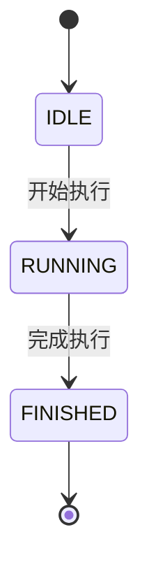
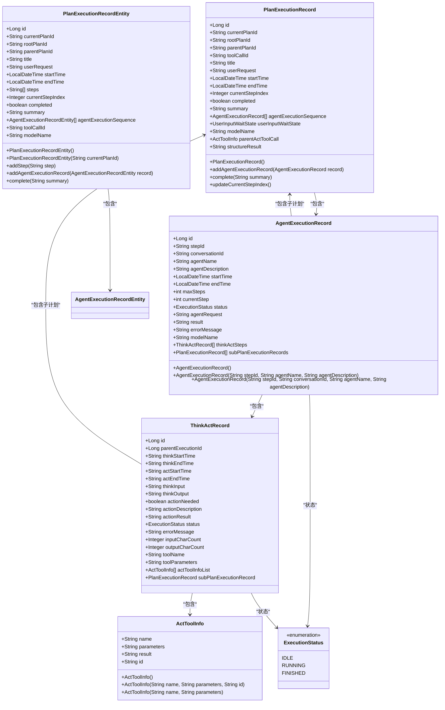

# 执行记录数据模型

<cite>
**本文档引用的文件**  
- [PlanExecutionRecordEntity.java](file://src/main/java/com/alibaba/cloud/ai/lynxe/recorder/entity/po/PlanExecutionRecordEntity.java)
- [PlanExecutionRecord.java](file://src/main/java/com/alibaba/cloud/ai/lynxe/recorder/entity/vo/PlanExecutionRecord.java)
- [plan-execution-record.ts](file://ui-vue3/src/types/plan-execution-record.ts)
- [ExecutionStatus.java](file://src/main/java/com/alibaba/cloud/ai/lynxe/recorder/entity/vo/ExecutionStatus.java)
- [AgentExecutionRecord.java](file://src/main/java/com/alibaba/cloud/ai/lynxe/recorder/entity/vo/AgentExecutionRecord.java)
- [ActToolInfo.java](file://src/main/java/com/alibaba/cloud/ai/lynxe/recorder/entity/vo/ActToolInfo.java)
- [PlanExecutionRecorder.java](file://src/main/java/com/alibaba/cloud/ai/lynxe/recorder/service/PlanExecutionRecorder.java)
</cite>

## 目录
1. [引言](#引言)
2. [核心实体设计](#核心实体设计)
3. [执行状态生命周期](#执行状态生命周期)
4. [前后端数据映射](#前后端数据映射)
5. [JSON示例与字段说明](#json示例与字段说明)
6. [嵌套计划支持](#嵌套计划支持)
7. [数据模型关系图](#数据模型关系图)

## 引言

执行记录数据模型是系统中用于跟踪和记录计划执行过程的核心数据结构。该模型设计用于捕获计划从开始到结束的完整生命周期，包括执行步骤、状态变化、时间戳、执行摘要以及详细的代理执行序列。本文档将深入解析`PlanExecutionRecord`实体的设计原理，阐述其在支持复杂计划执行跟踪中的关键作用。

## 核心实体设计

`PlanExecutionRecord`实体的设计旨在全面记录计划执行的各个方面，其核心字段包括执行ID、状态、时间戳、执行摘要和步骤序列。该实体分为四个主要部分：基本信息、计划结构、执行数据和执行结果。

### 基本信息

基本信息部分包含计划执行记录的唯一标识和元数据。

- **id**: 记录的唯一标识符，由数据库自动生成。
- **currentPlanId**: 当前计划的唯一标识符，用于区分不同的执行实例。
- **title**: 计划标题，提供执行的简要描述。
- **userRequest**: 用户的原始请求，记录了触发计划执行的初始输入。
- **modelName**: 实际调用的模型名称，用于追踪使用的AI模型。

### 计划结构

计划结构部分描述了计划的执行流程和当前进度。

- **steps**: 计划步骤列表，记录了计划执行过程中的各个步骤描述。
- **currentStepIndex**: 当前正在执行的步骤索引，用于指示执行进度。

### 执行数据

执行数据部分维护了代理执行序列，这是跟踪计划执行细节的主要数据源。

- **agentExecutionSequence**: 代理执行记录序列，按执行顺序记录每个智能代理的执行情况。每个`AgentExecutionRecord`包含详细的思考-行动循环记录。

### 执行结果

执行结果部分包含计划执行的最终状态和总结。

- **completed**: 布尔值，指示计划是否已完成。
- **summary**: 执行摘要，提供计划执行结果的简要描述。
- **startTime** 和 **endTime**: 分别记录执行开始和结束的时间戳。

**Section sources**
- [PlanExecutionRecordEntity.java](file://src/main/java/com/alibaba/cloud/ai/lynxe/recorder/entity/po/PlanExecutionRecordEntity.java#L42-L283)
- [PlanExecutionRecord.java](file://src/main/java/com/alibaba/cloud/ai/lynxe/recorder/entity/vo/PlanExecutionRecord.java#L46-L337)

## 执行状态生命周期

执行状态枚举定义了计划和代理执行过程中的不同状态，这些状态在生命周期中流转，反映了执行的当前情况。

### 状态定义

执行状态枚举`ExecutionStatus`包含以下三个值：

- **IDLE**: 空闲状态，表示计划或代理尚未开始执行。
- **RUNNING**: 运行状态，表示计划或代理正在执行中。
- **FINISHED**: 完成状态，表示计划或代理已成功完成执行。

### 状态流转机制

状态流转遵循严格的顺序，确保执行过程的正确跟踪：

1. **初始化**: 当创建新的执行记录时，状态初始化为`IDLE`。
2. **开始执行**: 当计划开始执行时，状态从`IDLE`变为`RUNNING`。
3. **执行中**: 在执行过程中，状态保持为`RUNNING`。
4. **完成**: 当计划成功完成时，状态从`RUNNING`变为`FINISHED`。

状态流转由`PlanExecutionRecorder`服务管理，该服务提供方法来记录执行的开始和完成，确保状态的正确更新。



**Diagram sources**
- [ExecutionStatus.java](file://src/main/java/com/alibaba/cloud/ai/lynxe/recorder/entity/vo/ExecutionStatus.java#L21-L25)
- [PlanExecutionRecorder.java](file://src/main/java/com/alibaba/cloud/ai/lynxe/recorder/service/PlanExecutionRecorder.java#L26-L242)

## 前后端数据映射

执行记录数据模型在后端Java实体和前端TypeScript类型定义之间存在精确的映射关系，确保数据在传输过程中的完整性和一致性。

### 后端实体

后端使用`PlanExecutionRecordEntity`作为持久化实体，该实体与数据库表`plan_execution_record`直接映射。它包含JPA注解，用于定义字段与数据库列的对应关系。

### 前端类型

前端使用`PlanExecutionRecord`接口，该接口定义了与后端实体匹配的结构。前端类型包含额外的计算字段，如`status`、`progress`和`progressText`，用于UI显示。

### 数据转换逻辑

数据转换通过JSON序列化和反序列化自动完成。后端使用Jackson库将`PlanExecutionRecord`对象序列化为JSON，前端通过API获取JSON数据并反序列化为`PlanExecutionRecord`对象。

- **时间戳处理**: Java的`LocalDateTime`被序列化为ISO-8601字符串格式，前端将其解析为JavaScript的`Date`对象。
- **枚举转换**: Java枚举`ExecutionStatus`被序列化为字符串，前端将其映射为TypeScript联合类型`ExecutionStatus`。

**Section sources**
- [PlanExecutionRecordEntity.java](file://src/main/java/com/alibaba/cloud/ai/lynxe/recorder/entity/po/PlanExecutionRecordEntity.java#L42-L283)
- [plan-execution-record.ts](file://ui-vue3/src/types/plan-execution-record.ts#L1-L288)

## JSON示例与字段说明

### JSON示例

```json
{
  "id": 12345,
  "currentPlanId": "plan-001",
  "rootPlanId": "plan-001",
  "parentPlanId": null,
  "title": "数据分析计划",
  "userRequest": "分析销售数据并生成报告",
  "startTime": "2025-01-17T10:30:00",
  "endTime": "2025-01-17T10:45:00",
  "currentStepIndex": 2,
  "completed": true,
  "summary": "成功分析销售数据并生成了详细报告",
  "agentExecutionSequence": [
    {
      "id": 1,
      "stepId": "step-001",
      "agentName": "DataAnalyzer",
      "status": "FINISHED",
      "result": "数据已成功分析"
    }
  ],
  "modelName": "gpt-4",
  "status": "completed",
  "progress": 100,
  "progressText": "执行完成"
}
```

### 字段说明表

| 字段名 | 业务含义 | 数据类型 | 约束条件 |
|--------|----------|----------|----------|
| id | 记录的唯一标识符 | number | 主键，自动生成 |
| currentPlanId | 当前计划的唯一标识符 | string | 非空，唯一 |
| rootPlanId | 根计划ID（子计划为空） | string | 可为空 |
| parentPlanId | 父计划ID（根计划为空） | string | 可为空 |
| title | 计划标题 | string | 可为空 |
| userRequest | 用户的原始请求 | string | 可为空 |
| startTime | 执行开始时间 | string | ISO-8601格式 |
| endTime | 执行结束时间 | string | ISO-8601格式 |
| currentStepIndex | 当前步骤索引 | number | 可为空 |
| completed | 是否完成 | boolean | 必需 |
| summary | 执行摘要 | string | 可为空 |
| agentExecutionSequence | 代理执行序列 | AgentExecutionRecord[] | 必需 |
| modelName | 实际调用模型 | string | 可为空 |
| status | 当前执行状态 | string | 'pending', 'running', 'completed', 'failed', 'paused' |
| progress | 执行进度百分比 | number | 0-100 |
| progressText | 进度描述 | string | 可为空 |

**Section sources**
- [PlanExecutionRecordEntity.java](file://src/main/java/com/alibaba/cloud/ai/lynxe/recorder/entity/po/PlanExecutionRecordEntity.java#L42-L283)
- [plan-execution-record.ts](file://ui-vue3/src/types/plan-execution-record.ts#L1-L288)

## 嵌套计划支持

执行记录数据模型通过层级结构支持嵌套计划和子计划的跟踪，允许复杂计划的分解和执行。

### 层级结构设计

模型通过以下字段支持层级结构：

- **rootPlanId**: 根计划ID，所有子计划都共享相同的根计划ID，用于追踪计划的原始来源。
- **parentPlanId**: 父计划ID，直接指向创建该子计划的父计划，形成父子关系链。
- **toolCallId**: 触发此计划的工具调用ID，用于关联子计划与父计划中的具体工具调用。

### 子计划跟踪机制

当一个计划执行过程中需要调用工具来执行子任务时，会创建一个新的子计划执行记录：

1. **创建子计划**: 当代理决定需要执行子任务时，创建一个新的`PlanExecutionRecord`，设置`parentPlanId`为当前计划ID，`rootPlanId`继承自父计划。
2. **关联工具调用**: `toolCallId`字段记录触发子计划的工具调用ID，建立与父计划的关联。
3. **执行跟踪**: 子计划的执行过程被独立记录，但通过`parentPlanId`和`rootPlanId`与父计划关联。
4. **结果整合**: 子计划完成后，其结果被整合回父计划的执行记录中。

这种设计允许系统跟踪复杂的计划执行树，每个节点都可以是独立的执行单元，同时保持与整个计划执行上下文的连接。

**Section sources**
- [PlanExecutionRecordEntity.java](file://src/main/java/com/alibaba/cloud/ai/lynxe/recorder/entity/po/PlanExecutionRecordEntity.java#L55-L61)
- [PlanExecutionRecord.java](file://src/main/java/com/alibaba/cloud/ai/lynxe/recorder/entity/vo/PlanExecutionRecord.java#L54-L58)

## 数据模型关系图



**Diagram sources**
- [PlanExecutionRecordEntity.java](file://src/main/java/com/alibaba/cloud/ai/lynxe/recorder/entity/po/PlanExecutionRecordEntity.java#L42-L283)
- [PlanExecutionRecord.java](file://src/main/java/com/alibaba/cloud/ai/lynxe/recorder/entity/vo/PlanExecutionRecord.java#L46-L337)
- [AgentExecutionRecord.java](file://src/main/java/com/alibaba/cloud/ai/lynxe/recorder/entity/vo/AgentExecutionRecord.java#L55-L318)
- [ThinkActRecord.java](file://src/main/java/com/alibaba/cloud/ai/lynxe/recorder/entity/vo/ThinkActRecord.java#L54-L111)
- [ActToolInfo.java](file://src/main/java/com/alibaba/cloud/ai/lynxe/recorder/entity/vo/ActToolInfo.java#L28-L138)
- [ExecutionStatus.java](file://src/main/java/com/alibaba/cloud/ai/lynxe/recorder/entity/vo/ExecutionStatus.java#L21-L25)