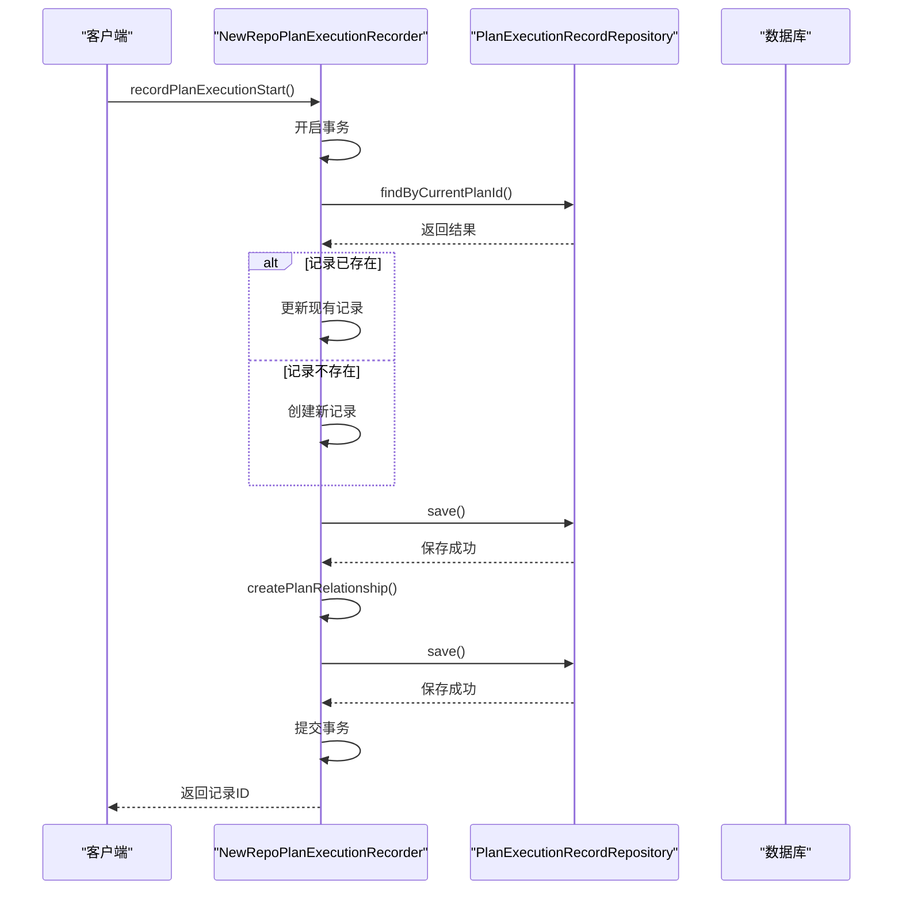
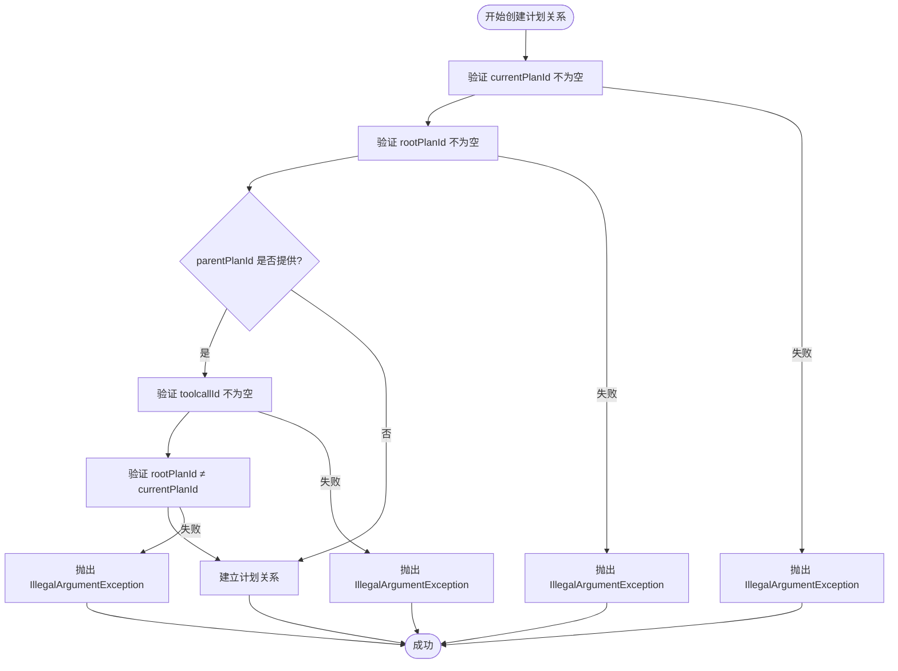

# 执行数据一致性保障

<cite>
**本文档引用的文件**   
- [PlanExecutionRecordEntity.java](file://src/main/java/com/alibaba/cloud/ai/lynxe/recorder/entity/po/PlanExecutionRecordEntity.java)
- [PlanExecutionRecord.java](file://src/main/java/com/alibaba/cloud/ai/lynxe/recorder/entity/vo/PlanExecutionRecord.java)
- [PlanExecutionRecordRepository.java](file://src/main/java/com/alibaba/cloud/ai/lynxe/recorder/repository/PlanExecutionRecordRepository.java)
- [NewRepoPlanExecutionRecorder.java](file://src/main/java/com/alibaba/cloud/ai/lynxe/recorder/service/NewRepoPlanExecutionRecorder.java)
- [ConfigService.java](file://src/main/java/com/alibaba/cloud/ai/lynxe/config/ConfigService.java)
- [TaskInterruptionManager.java](file://src/main/java/com/alibaba/cloud/ai/lynxe/runtime/service/TaskInterruptionManager.java)
- [PlanException.java](file://src/main/java/com/alibaba/cloud/ai/lynxe/exception/PlanException.java)
</cite>

## 目录
1. [引言](#引言)
2. [核心数据结构与实体设计](#核心数据结构与实体设计)
3. [事务管理与Spring事务注解协作](#事务管理与spring事务注解协作)
4. [数据完整性保障机制](#数据完整性保障机制)
5. [异常处理与回滚机制](#异常处理与回滚机制)
6. [并发写入与分布式场景考量](#并发写入与分布式场景考量)
7. [数据持久化流程与关键操作原子性](#数据持久化流程与关键操作原子性)
8. [结论](#结论)

## 引言
本技术文档旨在深入阐述系统中执行数据一致性的保障机制，重点分析`PlanExecutionRecord`在事务管理、并发写入和数据持久化过程中的完整性保障。文档将详细说明Spring事务注解`@Transactional`在服务层与Repository层的协作方式，探讨隔离级别与传播行为的选择依据。同时，文档将解释如何通过数据库约束、唯一索引和业务校验确保数据准确性，并涵盖异常回滚机制、重试策略及分布式场景下的数据同步考虑。通过实际代码示例，展示关键操作的原子性保证。

## 核心数据结构与实体设计
系统通过精心设计的实体类来记录和管理计划执行的全过程，确保数据结构的完整性和可追溯性。

### PlanExecutionRecordEntity 实体
`PlanExecutionRecordEntity`是计划执行记录的核心持久化实体，位于`src/main/java/com/alibaba/cloud/ai/lynxe/recorder/entity/po/`包下。该实体通过JPA注解映射到名为`plan_execution_record`的数据库表。

**核心字段与关系：**
- **基础信息**：`id`（主键）、`currentPlanId`（当前计划唯一标识，带唯一约束）、`rootPlanId`（根计划ID）、`parentPlanId`（父计划ID）、`title`（计划标题）、`userRequest`（用户原始请求）、`startTime`和`endTime`（执行起止时间）。
- **计划结构**：`steps`（计划步骤列表），通过`@ElementCollection`注解映射到独立的`plan_execution_steps`表。
- **执行数据**：`agentExecutionSequence`（智能代理执行序列），通过`@OneToMany`注解与`AgentExecutionRecordEntity`建立一对多关系，形成执行链。
- **执行结果**：`completed`（是否完成）、`summary`（执行摘要）。

该实体设计清晰地划分了计划的四个主要部分，为数据的完整记录提供了基础。

### PlanExecutionRecord 值对象
`PlanExecutionRecord`位于`src/main/java/com/alibaba/cloud/ai/lynxe/recorder/entity/vo/`包下，作为面向视图或外部接口的值对象（VO）。它与`PlanExecutionRecordEntity`结构相似，但包含了一些业务逻辑，例如`updateCurrentStepIndex()`方法，该方法根据`agentExecutionSequence`中代理的执行状态动态更新当前步骤索引，确保了状态的实时性和准确性。

**Section sources**
- [PlanExecutionRecordEntity.java](file://src/main/java/com/alibaba/cloud/ai/lynxe/recorder/entity/po/PlanExecutionRecordEntity.java#L1-L283)
- [PlanExecutionRecord.java](file://src/main/java/com/alibaba/cloud/ai/lynxe/recorder/entity/vo/PlanExecutionRecord.java#L1-L337)

## 事务管理与Spring事务注解协作
系统利用Spring的声明式事务管理来保证数据操作的原子性、一致性、隔离性和持久性（ACID）。

### @Transactional 注解的协作
在`NewRepoPlanExecutionRecorder`服务类中，`@Transactional`注解被广泛应用于关键的业务方法上，确保了服务层与Repository层操作的事务性。

**Diagram sources**
- [NewRepoPlanExecutionRecorder.java](file://src/main/java/com/alibaba/cloud/ai/lynxe/recorder/service/NewRepoPlanExecutionRecorder.java#L75-L156)
- [PlanExecutionRecordRepository.java](file://src/main/java/com/alibaba/cloud/ai/lynxe/recorder/repository/PlanExecutionRecordRepository.java#L27-L54)

### 隔离级别与传播行为
文档中未明确指定`@Transactional`注解的隔离级别（isolation）和传播行为（propagation），这意味着它们使用了Spring的默认值。
- **隔离级别**：默认为`ISOLATION_DEFAULT`，即使用底层数据库的默认隔离级别（如MySQL的REPEATABLE_READ）。
- **传播行为**：默认为`PROPAGATION_REQUIRED`。这表示如果当前存在事务，则加入该事务；如果当前没有事务，则创建一个新的事务。这种行为非常适合`recordPlanExecutionStart`和`recordPlanCompletion`等方法，确保了整个操作的原子性。

## 数据完整性保障机制
系统通过多层次的机制来确保数据的准确性和完整性。

### 数据库约束与唯一索引
在`PlanExecutionRecordEntity`实体中，`currentPlanId`字段被标记为`unique = true`，这会在数据库层面创建唯一索引，防止插入具有相同`currentPlanId`的重复记录，从根本上保证了计划执行记录的唯一性。

### 业务校验
在`createPlanRelationship`私有方法中，实现了严格的业务校验逻辑：
1.  `currentPlanId`和`rootPlanId`是必填项。
2.  如果提供了`parentPlanId`，则`toolcallId`也必须提供。
3.  如果提供了`parentPlanId`，则`rootPlanId`不能与`currentPlanId`相同。
这些校验在事务内部执行，如果校验失败，会抛出`IllegalArgumentException`，导致事务回滚，从而阻止了不合法的数据状态被持久化。

**Diagram sources**
- [NewRepoPlanExecutionRecorder.java](file://src/main/java/com/alibaba/cloud/ai/lynxe/recorder/service/NewRepoPlanExecutionRecorder.java#L784-L800)

**Section sources**
- [PlanExecutionRecordEntity.java](file://src/main/java/com/alibaba/cloud/ai/lynxe/recorder/entity/po/PlanExecutionRecordEntity.java#L52-L53)
- [NewRepoPlanExecutionRecorder.java](file://src/main/java/com/alibaba/cloud/ai/lynxe/recorder/service/NewRepoPlanExecutionRecorder.java#L782-L800)

## 异常处理与回滚机制
系统通过Spring的事务管理机制和自定义异常来实现可靠的异常处理和数据回滚。

### Spring事务回滚
当在`@Transactional`注解的方法中抛出未检查异常（`RuntimeException`及其子类）时，Spring会自动将当前事务标记为回滚。在`NewRepoPlanExecutionRecorder`中，所有关键的`record*`方法都使用了`@Transactional`，并且在捕获到异常时会记录日志并返回`null`或`false`，但更重要的是，如果异常是`RuntimeException`类型，事务会自动回滚，确保数据库状态不会被部分更新。

### 自定义异常
系统定义了`PlanException`作为运行时异常，用于表示计划执行过程中的特定错误。当业务逻辑中检测到不可恢复的错误时，可以抛出此异常，从而触发事务回滚。

**Section sources**
- [NewRepoPlanExecutionRecorder.java](file://src/main/java/com/alibaba/cloud/ai/lynxe/recorder/service/NewRepoPlanExecutionRecorder.java#L151-L155)
- [PlanException.java](file://src/main/java/com/alibaba/cloud/ai/lynxe/exception/PlanException.java#L1-L46)

## 并发写入与分布式场景考量
系统在设计上考虑了并发和分布式环境下的数据一致性问题。

### 数据库驱动的协调
`TaskInterruptionManager`服务类使用了`@Transactional`注解，并通过数据库表`RootTaskManagerEntity`来协调任务中断。这种基于数据库的协调机制非常适合分布式或无状态的多机环境，因为所有实例都可以通过读写同一个数据库表来达成一致的状态，避免了在内存中维护状态带来的不一致问题。

### 乐观并发控制
虽然代码中未直接体现，但JPA通常支持乐观锁（通过`@Version`注解）。如果`PlanExecutionRecordEntity`或`AgentExecutionRecordEntity`包含版本号字段，那么在并发更新同一记录时，后提交的事务会因为版本号不匹配而失败，从而避免了脏写。

**Section sources**
- [TaskInterruptionManager.java](file://src/main/java/com/alibaba/cloud/ai/lynxe/runtime/service/TaskInterruptionManager.java#L36-L39)

## 数据持久化流程与关键操作原子性
`recordPlanExecutionStart`方法是数据持久化的核心，其流程保证了操作的原子性。

### 关键操作原子性保证
1.  **查询与创建/更新**：首先根据`currentPlanId`查询是否存在记录，然后决定是创建新记录还是更新现有记录。
2.  **关联关系建立**：在保存`PlanExecutionRecordEntity`后，立即调用`createPlanRelationship`方法来建立计划间的父子关系。
3.  **事务边界**：整个`recordPlanExecutionStart`方法被`@Transactional`注解包裹。这意味着从查询、创建/更新到建立关系的所有数据库操作都在同一个数据库事务中执行。只有当所有步骤都成功完成时，事务才会提交，数据才会真正写入数据库。任何一步失败（如校验失败或数据库异常），整个事务都会回滚，保证了数据的一致性。

**Section sources**
- [NewRepoPlanExecutionRecorder.java](file://src/main/java/com/alibaba/cloud/ai/lynxe/recorder/service/NewRepoPlanExecutionRecorder.java#L75-L156)

## 结论
本系统通过结合Spring的声明式事务管理、数据库层面的约束（唯一索引）以及服务层的业务校验，构建了一个健壮的执行数据一致性保障体系。`@Transactional`注解确保了关键业务操作的原子性，而`PlanExecutionRecord`实体的设计则为数据的完整记录提供了坚实的基础。在分布式场景下，系统采用数据库驱动的协调模式来维护状态一致性。尽管未显式配置隔离级别，但默认的`PROPAGATION_REQUIRED`传播行为和数据库的默认隔离级别足以应对大多数并发场景。整体设计有效地防止了数据不一致、重复记录和脏写等问题，确保了系统在复杂执行流程中的数据可靠性。