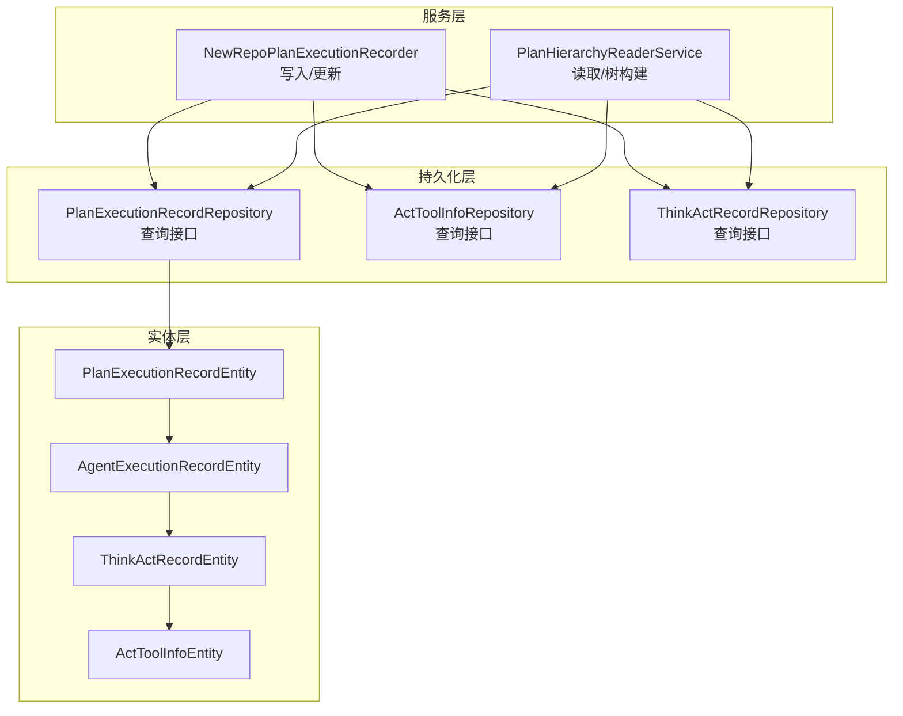
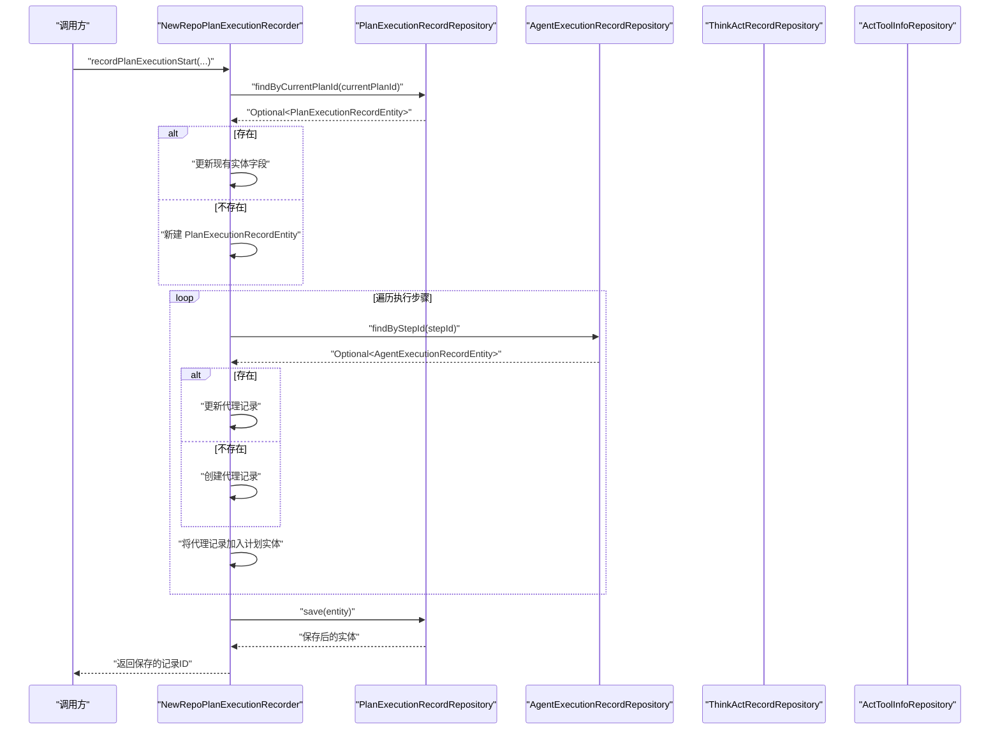
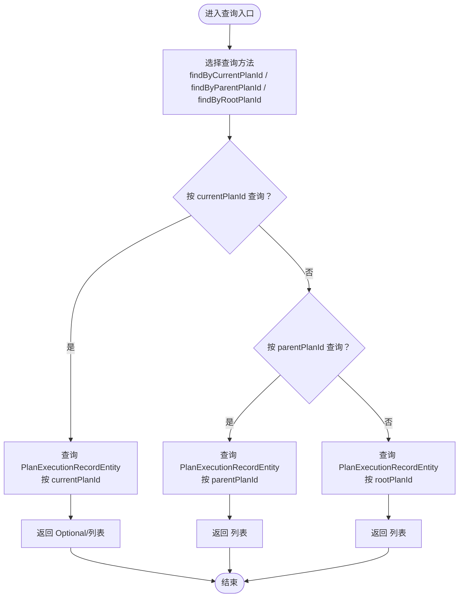
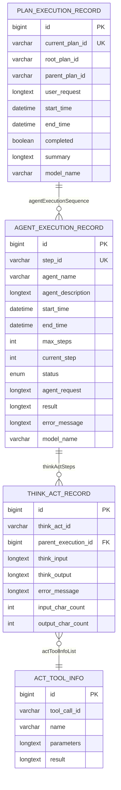
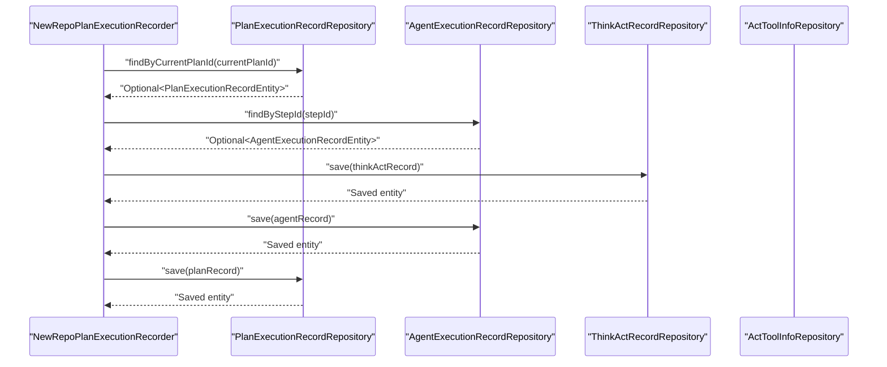
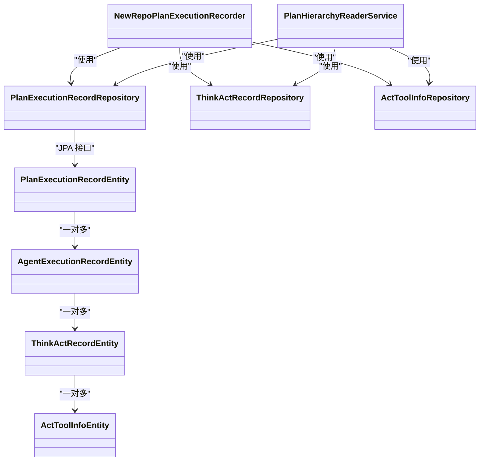

# 执行数据持久化

<cite>
**本文引用的文件列表**
- [PlanExecutionRecordRepository.java](file://src/main/java/com/alibaba/cloud/ai/lynxe/recorder/repository/PlanExecutionRecordRepository.java)
- [PlanExecutionRecordEntity.java](file://src/main/java/com/alibaba/cloud/ai/lynxe/recorder/entity/po/PlanExecutionRecordEntity.java)
- [AgentExecutionRecordEntity.java](file://src/main/java/com/alibaba/cloud/ai/lynxe/recorder/entity/po/AgentExecutionRecordEntity.java)
- [ThinkActRecordEntity.java](file://src/main/java/com/alibaba/cloud/ai/lynxe/recorder/entity/po/ThinkActRecordEntity.java)
- [ActToolInfoEntity.java](file://src/main/java/com/alibaba/cloud/ai/lynxe/recorder/entity/po/ActToolInfoEntity.java)
- [ActToolInfoRepository.java](file://src/main/java/com/alibaba/cloud/ai/lynxe/recorder/repository/ActToolInfoRepository.java)
- [ThinkActRecordRepository.java](file://src/main/java/com/alibaba/cloud/ai/lynxe/recorder/repository/ThinkActRecordRepository.java)
- [NewRepoPlanExecutionRecorder.java](file://src/main/java/com/alibaba/cloud/ai/lynxe/recorder/service/NewRepoPlanExecutionRecorder.java)
- [PlanHierarchyReaderService.java](file://src/main/java/com/alibaba/cloud/ai/lynxe/recorder/service/PlanHierarchyReaderService.java)
- [application.yml](file://src/main/resources/application.yml)
- [application-mysql.yml](file://src/main/resources/application-mysql.yml)
- [application-postgres.yml](file://src/main/resources/application-postgres.yml)
- [LynxeController.java](file://src/main/java/com/alibaba/cloud/ai/lynxe/runtime/controller/LynxeController.java)
</cite>

## 目录
1. [简介](#简介)
2. [项目结构](#项目结构)
3. [核心组件](#核心组件)
4. [架构总览](#架构总览)
5. [详细组件分析](#详细组件分析)
6. [依赖关系分析](#依赖关系分析)
7. [性能与优化](#性能与优化)
8. [故障排查指南](#故障排查指南)
9. [结论](#结论)
10. [附录](#附录)

## 简介
本文件聚焦于“执行数据持久化层”，系统性解析 PlanExecutionRecordRepository 数据访问模式，覆盖 findByCurrentPlanId、findByParentPlanId、findByRootPlanId 等查询方法的实现与优化策略；深入说明 JPA 实体关系映射与数据库查询优化方法；阐述数据访问层如何支持计划执行记录的增删改查操作，并处理并发访问与事务一致性；提供数据库表结构设计图与索引优化建议，总结分页查询与性能调优最佳实践。

## 项目结构
围绕执行数据持久化的核心模块位于 recorder 包下，包含：
- 实体层：PlanExecutionRecordEntity、AgentExecutionRecordEntity、ThinkActRecordEntity、ActToolInfoEntity
- 仓库层：PlanExecutionRecordRepository、ActToolInfoRepository、ThinkActRecordRepository
- 服务层：NewRepoPlanExecutionRecorder（写入/更新）、PlanHierarchyReaderService（读取/树构建）

图表来源
- [PlanExecutionRecordRepository.java](file://src/main/java/com/alibaba/cloud/ai/lynxe/recorder/repository/PlanExecutionRecordRepository.java#L1-L54)
- [ActToolInfoRepository.java](file://src/main/java/com/alibaba/cloud/ai/lynxe/recorder/repository/ActToolInfoRepository.java#L1-L43)
- [ThinkActRecordRepository.java](file://src/main/java/com/alibaba/cloud/ai/lynxe/recorder/repository/ThinkActRecordRepository.java#L36-L54)
- [PlanExecutionRecordEntity.java](file://src/main/java/com/alibaba/cloud/ai/lynxe/recorder/entity/po/PlanExecutionRecordEntity.java#L42-L109)
- [AgentExecutionRecordEntity.java](file://src/main/java/com/alibaba/cloud/ai/lynxe/recorder/entity/po/AgentExecutionRecordEntity.java#L61-L123)
- [ThinkActRecordEntity.java](file://src/main/java/com/alibaba/cloud/ai/lynxe/recorder/entity/po/ThinkActRecordEntity.java#L53-L68)
- [ActToolInfoEntity.java](file://src/main/java/com/alibaba/cloud/ai/lynxe/recorder/entity/po/ActToolInfoEntity.java#L44-L117)
- [NewRepoPlanExecutionRecorder.java](file://src/main/java/com/alibaba/cloud/ai/lynxe/recorder/service/NewRepoPlanExecutionRecorder.java#L75-L150)
- [PlanHierarchyReaderService.java](file://src/main/java/com/alibaba/cloud/ai/lynxe/recorder/service/PlanHierarchyReaderService.java#L83-L146)

章节来源
- [PlanExecutionRecordRepository.java](file://src/main/java/com/alibaba/cloud/ai/lynxe/recorder/repository/PlanExecutionRecordRepository.java#L1-L54)
- [PlanExecutionRecordEntity.java](file://src/main/java/com/alibaba/cloud/ai/lynxe/recorder/entity/po/PlanExecutionRecordEntity.java#L42-L109)
- [AgentExecutionRecordEntity.java](file://src/main/java/com/alibaba/cloud/ai/lynxe/recorder/entity/po/AgentExecutionRecordEntity.java#L61-L123)
- [ThinkActRecordEntity.java](file://src/main/java/com/alibaba/cloud/ai/lynxe/recorder/entity/po/ThinkActRecordEntity.java#L53-L68)
- [ActToolInfoEntity.java](file://src/main/java/com/alibaba/cloud/ai/lynxe/recorder/entity/po/ActToolInfoEntity.java#L44-L117)
- [NewRepoPlanExecutionRecorder.java](file://src/main/java/com/alibaba/cloud/ai/lynxe/recorder/service/NewRepoPlanExecutionRecorder.java#L75-L150)
- [PlanHierarchyReaderService.java](file://src/main/java/com/alibaba/cloud/ai/lynxe/recorder/service/PlanHierarchyReaderService.java#L83-L146)

## 核心组件
- PlanExecutionRecordRepository：基于 Spring Data JPA 的仓库接口，提供按 currentPlanId、parentPlanId、rootPlanId 查询及存在性检查、删除等方法。
- PlanExecutionRecordEntity：计划执行记录主实体，包含计划基本信息、步骤集合、代理执行序列、模型名称等字段。
- AgentExecutionRecordEntity：代理执行记录实体，包含代理名称、状态、think-act 步骤、请求/结果/错误信息等。
- ThinkActRecordEntity：思考-行动步骤实体，记录 think 输入输出、act 工具调用信息。
- ActToolInfoEntity：工具调用信息实体，记录工具名、参数、结果、工具调用 ID。
- NewRepoPlanExecutionRecorder：负责计划执行开始、步骤开始/结束、思考-行动记录、动作结果回填、计划完成标记等写入/更新流程。
- PlanHierarchyReaderService：负责按根计划 ID 读取计划树、转换为 VO 并构建层级关系。

章节来源
- [PlanExecutionRecordRepository.java](file://src/main/java/com/alibaba/cloud/ai/lynxe/recorder/repository/PlanExecutionRecordRepository.java#L26-L54)
- [PlanExecutionRecordEntity.java](file://src/main/java/com/alibaba/cloud/ai/lynxe/recorder/entity/po/PlanExecutionRecordEntity.java#L42-L157)
- [AgentExecutionRecordEntity.java](file://src/main/java/com/alibaba/cloud/ai/lynxe/recorder/entity/po/AgentExecutionRecordEntity.java#L61-L123)
- [ThinkActRecordEntity.java](file://src/main/java/com/alibaba/cloud/ai/lynxe/recorder/entity/po/ThinkActRecordEntity.java#L53-L68)
- [ActToolInfoEntity.java](file://src/main/java/com/alibaba/cloud/ai/lynxe/recorder/entity/po/ActToolInfoEntity.java#L44-L117)
- [NewRepoPlanExecutionRecorder.java](file://src/main/java/com/alibaba/cloud/ai/lynxe/recorder/service/NewRepoPlanExecutionRecorder.java#L75-L150)
- [PlanHierarchyReaderService.java](file://src/main/java/com/alibaba/cloud/ai/lynxe/recorder/service/PlanHierarchyReaderService.java#L83-L146)

## 架构总览
执行数据持久化采用“实体-仓库-服务”三层结构，配合 JPA/Hibernate 自动建模与查询扩展，实现计划执行记录的全生命周期管理。

图表来源
- [NewRepoPlanExecutionRecorder.java](file://src/main/java/com/alibaba/cloud/ai/lynxe/recorder/service/NewRepoPlanExecutionRecorder.java#L75-L150)
- [PlanExecutionRecordRepository.java](file://src/main/java/com/alibaba/cloud/ai/lynxe/recorder/repository/PlanExecutionRecordRepository.java#L26-L54)

## 详细组件分析

### PlanExecutionRecordRepository 查询方法详解
- findByCurrentPlanId：按当前计划唯一标识查询单条记录，用于“更新现有记录或创建新记录”的判断。
- findByParentPlanId：按父计划 ID 查询所有子计划记录，用于层级关系构建与子计划筛选。
- findByRootPlanId：按根计划 ID 查询所有同根计划记录，用于读取整棵计划树。
- existsByCurrentPlanId：存在性检查，避免重复创建。
- deleteByCurrentPlanId：按当前计划 ID 删除记录。

图表来源
- [PlanExecutionRecordRepository.java](file://src/main/java/com/alibaba/cloud/ai/lynxe/recorder/repository/PlanExecutionRecordRepository.java#L26-L54)

章节来源
- [PlanExecutionRecordRepository.java](file://src/main/java/com/alibaba/cloud/ai/lynxe/recorder/repository/PlanExecutionRecordRepository.java#L26-L54)

### JPA 实体关系映射与查询优化
- PlanExecutionRecordEntity
  - 主键自增 id
  - 唯一约束 current_plan_id
  - 可空 root_plan_id、parent_plan_id
  - 一对多关联 agentExecutionSequence（代理执行记录）
  - 元素集合 steps 使用 ElementCollection 映射
- AgentExecutionRecordEntity
  - 唯一约束 step_id
  - 索引 @Index(columnList = "step_id")
  - 一对多关联 thinkActSteps（思考-行动记录）
- ThinkActRecordEntity
  - 外键 parent_execution_id 关联代理执行记录
- ActToolInfoEntity
  - 字段 tool_call_id 作为业务键

图表来源
- [PlanExecutionRecordEntity.java](file://src/main/java/com/alibaba/cloud/ai/lynxe/recorder/entity/po/PlanExecutionRecordEntity.java#L42-L157)
- [AgentExecutionRecordEntity.java](file://src/main/java/com/alibaba/cloud/ai/lynxe/recorder/entity/po/AgentExecutionRecordEntity.java#L61-L123)
- [ThinkActRecordEntity.java](file://src/main/java/com/alibaba/cloud/ai/lynxe/recorder/entity/po/ThinkActRecordEntity.java#L53-L68)
- [ActToolInfoEntity.java](file://src/main/java/com/alibaba/cloud/ai/lynxe/recorder/entity/po/ActToolInfoEntity.java#L44-L117)

章节来源
- [PlanExecutionRecordEntity.java](file://src/main/java/com/alibaba/cloud/ai/lynxe/recorder/entity/po/PlanExecutionRecordEntity.java#L42-L157)
- [AgentExecutionRecordEntity.java](file://src/main/java/com/alibaba/cloud/ai/lynxe/recorder/entity/po/AgentExecutionRecordEntity.java#L61-L123)
- [ThinkActRecordEntity.java](file://src/main/java/com/alibaba/cloud/ai/lynxe/recorder/entity/po/ThinkActRecordEntity.java#L53-L68)
- [ActToolInfoEntity.java](file://src/main/java/com/alibaba/cloud/ai/lynxe/recorder/entity/po/ActToolInfoEntity.java#L44-L117)

### 数据访问层 CRUD 与事务一致性
- 写入/更新
  - recordPlanExecutionStart：按 currentPlanId 查找或新建，填充计划字段，遍历执行步骤生成/更新代理记录，保存后建立层级关系。
  - recordStepStart/recordStepEnd：按 stepId 查找代理记录，更新状态与时间戳。
  - recordThinkingAndAction：为代理记录新增 think-act 步骤，并回填 act 工具信息。
  - recordActionResult：按 toolCallId 回填 act 工具结果。
  - recordPlanCompletion：按 currentPlanId 完成计划并设置结束时间与摘要。
- 读取
  - readPlanTreeByRootId：按 rootPlanId 获取整棵树，转换为 VO 并构建层级关系。
  - readSinglePlanById：按 currentPlanId 读取单个计划。
  - getAgentExecutionDetail：按 stepId 获取代理执行详情（含 think-act 步骤）。
- 事务控制
  - 新增/更新方法标注 @Transactional，确保写入一致性。
  - 读取方法标注 @Transactional(readOnly = true)，提升只读场景性能。

图表来源
- [NewRepoPlanExecutionRecorder.java](file://src/main/java/com/alibaba/cloud/ai/lynxe/recorder/service/NewRepoPlanExecutionRecorder.java#L75-L150)
- [PlanExecutionRecordRepository.java](file://src/main/java/com/alibaba/cloud/ai/lynxe/recorder/repository/PlanExecutionRecordRepository.java#L26-L54)
- [ThinkActRecordRepository.java](file://src/main/java/com/alibaba/cloud/ai/lynxe/recorder/repository/ThinkActRecordRepository.java#L36-L54)
- [ActToolInfoRepository.java](file://src/main/java/com/alibaba/cloud/ai/lynxe/recorder/repository/ActToolInfoRepository.java#L1-L43)

章节来源
- [NewRepoPlanExecutionRecorder.java](file://src/main/java/com/alibaba/cloud/ai/lynxe/recorder/service/NewRepoPlanExecutionRecorder.java#L75-L150)
- [PlanHierarchyReaderService.java](file://src/main/java/com/alibaba/cloud/ai/lynxe/recorder/service/PlanHierarchyReaderService.java#L83-L146)

### 并发访问与事务一致性
- 事务传播
  - 写入方法使用 @Transactional，保证同一事务内的多次写入原子性。
  - 读取方法使用 @Transactional(readOnly = true)，避免不必要的锁竞争。
- 锁策略
  - 当前实现未显式使用悲观/乐观锁注解，依赖数据库默认隔离级别与 JPA 事务语义。
  - 对于高并发写入，建议结合业务场景引入版本号字段与乐观锁以减少冲突。
- 并发读取
  - findByCurrentPlanId、findByParentPlanId、findByRootPlanId 均为只读查询，适合在只读事务中执行。

章节来源
- [NewRepoPlanExecutionRecorder.java](file://src/main/java/com/alibaba/cloud/ai/lynxe/recorder/service/NewRepoPlanExecutionRecorder.java#L75-L150)
- [PlanHierarchyReaderService.java](file://src/main/java/com/alibaba/cloud/ai/lynxe/recorder/service/PlanHierarchyReaderService.java#L83-L146)

## 依赖关系分析
- PlanExecutionRecordRepository 依赖 PlanExecutionRecordEntity
- NewRepoPlanExecutionRecorder 依赖 PlanExecutionRecordRepository、AgentExecutionRecordRepository、ThinkActRecordRepository、ActToolInfoRepository
- PlanHierarchyReaderService 依赖 PlanExecutionRecordRepository、AgentExecutionRecordRepository、ThinkActRecordRepository、ActToolInfoRepository
- ThinkActRecordRepository 提供自定义 JPQL 查询（JOIN ActToolInfo）
- ActToolInfoRepository 提供按 tool_call_id 的查询

图表来源
- [PlanExecutionRecordRepository.java](file://src/main/java/com/alibaba/cloud/ai/lynxe/recorder/repository/PlanExecutionRecordRepository.java#L26-L54)
- [PlanExecutionRecordEntity.java](file://src/main/java/com/alibaba/cloud/ai/lynxe/recorder/entity/po/PlanExecutionRecordEntity.java#L42-L157)
- [AgentExecutionRecordEntity.java](file://src/main/java/com/alibaba/cloud/ai/lynxe/recorder/entity/po/AgentExecutionRecordEntity.java#L61-L123)
- [ThinkActRecordEntity.java](file://src/main/java/com/alibaba/cloud/ai/lynxe/recorder/entity/po/ThinkActRecordEntity.java#L53-L68)
- [ActToolInfoEntity.java](file://src/main/java/com/alibaba/cloud/ai/lynxe/recorder/entity/po/ActToolInfoEntity.java#L44-L117)
- [NewRepoPlanExecutionRecorder.java](file://src/main/java/com/alibaba/cloud/ai/lynxe/recorder/service/NewRepoPlanExecutionRecorder.java#L75-L150)
- [PlanHierarchyReaderService.java](file://src/main/java/com/alibaba/cloud/ai/lynxe/recorder/service/PlanHierarchyReaderService.java#L83-L146)
- [ThinkActRecordRepository.java](file://src/main/java/com/alibaba/cloud/ai/lynxe/recorder/repository/ThinkActRecordRepository.java#L36-L54)
- [ActToolInfoRepository.java](file://src/main/java/com/alibaba/cloud/ai/lynxe/recorder/repository/ActToolInfoRepository.java#L1-L43)

章节来源
- [PlanExecutionRecordRepository.java](file://src/main/java/com/alibaba/cloud/ai/lynxe/recorder/repository/PlanExecutionRecordRepository.java#L26-L54)
- [NewRepoPlanExecutionRecorder.java](file://src/main/java/com/alibaba/cloud/ai/lynxe/recorder/service/NewRepoPlanExecutionRecorder.java#L75-L150)
- [PlanHierarchyReaderService.java](file://src/main/java/com/alibaba/cloud/ai/lynxe/recorder/service/PlanHierarchyReaderService.java#L83-L146)
- [ThinkActRecordRepository.java](file://src/main/java/com/alibaba/cloud/ai/lynxe/recorder/repository/ThinkActRecordRepository.java#L36-L54)
- [ActToolInfoRepository.java](file://src/main/java/com/alibaba/cloud/ai/lynxe/recorder/repository/ActToolInfoRepository.java#L1-L43)

## 性能与优化
- 查询优化
  - findByCurrentPlanId：current_plan_id 唯一索引，查询高效；建议在高频过滤场景下保持该列非空。
  - findByParentPlanId：parent_plan_id 无索引，建议在生产环境添加索引以提升子计划查询性能。
  - findByRootPlanId：root_plan_id 无索引，建议添加索引以提升整树读取性能。
- 关系查询
  - 通过 ThinkActRecordRepository 的 JPQL JOIN ActToolInfo，可按 tool_call_id 快速定位 think-act 记录，避免 N+1 查询。
- 分页查询
  - 在读取大量计划或代理记录时，建议使用 Pageable 分页，结合 root_plan_id 或 parent_plan_id 进行分页过滤。
- 缓存与只读
  - 对只读查询（如 readPlanTreeByRootId、readSinglePlanById）使用 @Transactional(readOnly = true) 提升性能。
- 数据库配置
  - application.yml 中已开启 Hikari 连接池配置，建议根据实例规模调整 maximum-pool-size、minimum-idle 等参数。
  - application-mysql.yml 与 application-postgres.yml 提供方言与 ddl-auto=update，便于本地开发与自动建模。

章节来源
- [PlanExecutionRecordRepository.java](file://src/main/java/com/alibaba/cloud/ai/lynxe/recorder/repository/PlanExecutionRecordRepository.java#L26-L54)
- [ThinkActRecordRepository.java](file://src/main/java/com/alibaba/cloud/ai/lynxe/recorder/repository/ThinkActRecordRepository.java#L36-L54)
- [application.yml](file://src/main/resources/application.yml#L21-L32)
- [application-mysql.yml](file://src/main/resources/application-mysql.yml#L1-L15)
- [application-postgres.yml](file://src/main/resources/application-postgres.yml#L1-L15)

## 故障排查指南
- 计划未找到
  - findByCurrentPlanId 返回空：确认 currentPlanId 是否正确传入，是否已创建。
  - findByRootPlanId 返回空：确认 rootPlanId 是否一致，是否存在子计划。
- 代理记录缺失
  - findByStepId 返回空：确认 stepId 是否正确，是否在 recordPlanExecutionStart 时已创建。
- 工具调用结果未回填
  - findByToolCallId 返回空：确认 tool_call_id 是否正确，是否在 recordActionResult 中成功回填。
- 计划完成标记失败
  - recordPlanCompletion 报错：确认 currentPlanId 是否有效，实体是否已保存。
- 控制器删除接口
  - removeExecutionDetails：控制器返回“无需删除”，表明数据库作为持久化存储，不进行物理删除。

章节来源
- [PlanHierarchyReaderService.java](file://src/main/java/com/alibaba/cloud/ai/lynxe/recorder/service/PlanHierarchyReaderService.java#L83-L146)
- [NewRepoPlanExecutionRecorder.java](file://src/main/java/com/alibaba/cloud/ai/lynxe/recorder/service/NewRepoPlanExecutionRecorder.java#L606-L645)
- [LynxeController.java](file://src/main/java/com/alibaba/cloud/ai/lynxe/runtime/controller/LynxeController.java#L443-L459)

## 结论
本持久化层通过清晰的实体-仓库-服务分层，结合 JPA 的自动建模与自定义查询，实现了计划执行记录的高效增删改查与层级关系构建。针对高频查询建议补充索引，结合分页与只读事务提升性能；在高并发场景可考虑引入乐观锁增强一致性保障。整体设计具备良好的扩展性与可维护性。

## 附录
- 数据库表结构与索引建议
  - plan_execution_record：current_plan_id（唯一）、root_plan_id、parent_plan_id
  - agent_execution_record：step_id（唯一）、index(step_id)
  - think_act_record：parent_execution_id
  - act_tool_info：tool_call_id
- 配置参考
  - application.yml：连接池、JPA、日志、计划轮询等
  - application-mysql.yml / application-postgres.yml：数据源与方言配置

章节来源
- [PlanExecutionRecordEntity.java](file://src/main/java/com/alibaba/cloud/ai/lynxe/recorder/entity/po/PlanExecutionRecordEntity.java#L42-L157)
- [AgentExecutionRecordEntity.java](file://src/main/java/com/alibaba/cloud/ai/lynxe/recorder/entity/po/AgentExecutionRecordEntity.java#L61-L123)
- [application.yml](file://src/main/resources/application.yml#L21-L32)
- [application-mysql.yml](file://src/main/resources/application-mysql.yml#L1-L15)
- [application-postgres.yml](file://src/main/resources/application-postgres.yml#L1-L15)