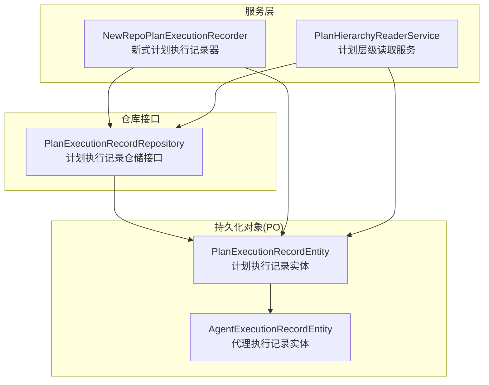
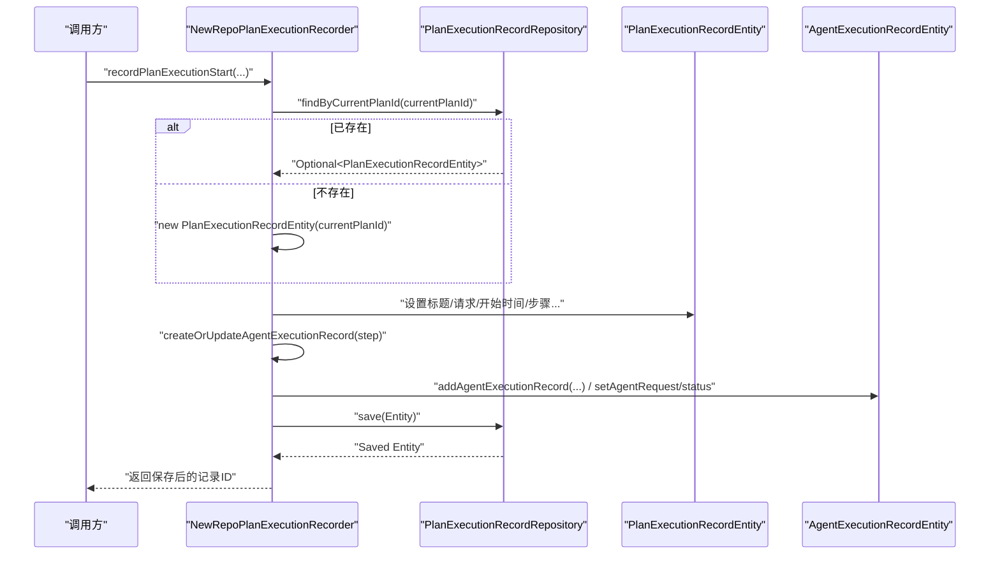
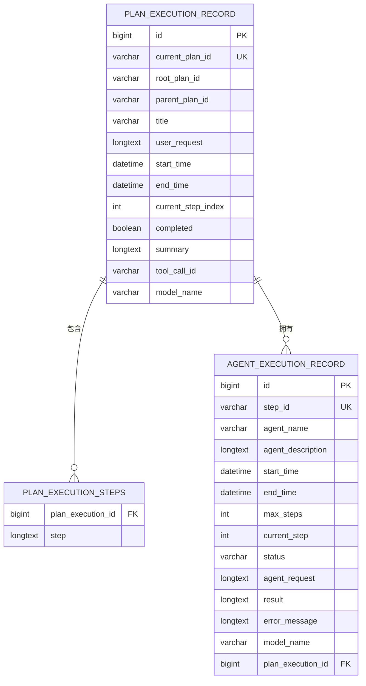
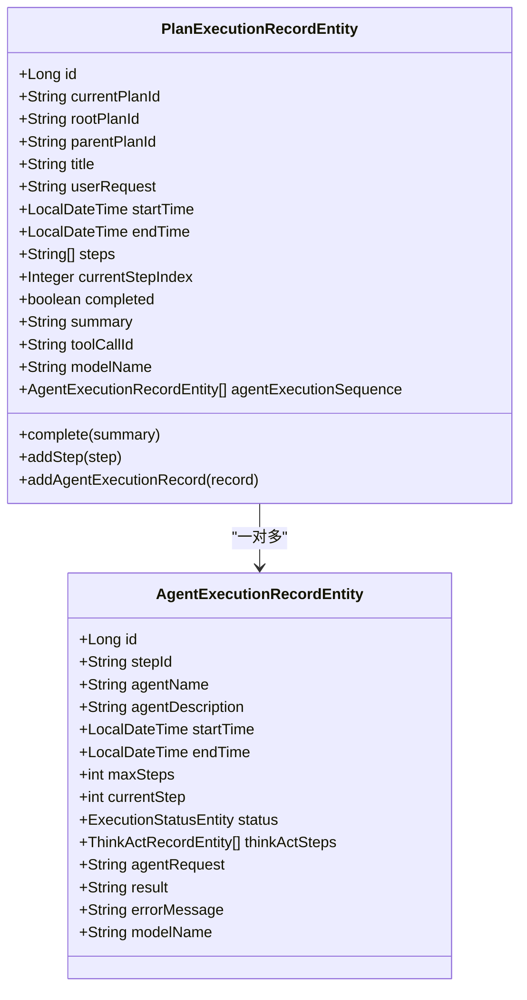
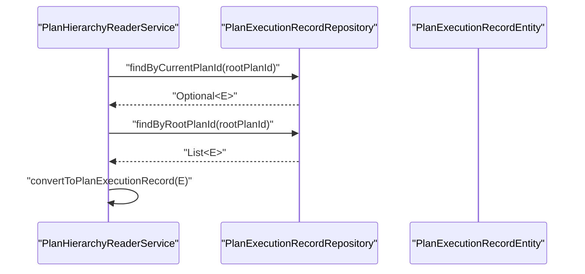

# 计划执行记录实体

<cite>
**本文引用的文件列表**
- [PlanExecutionRecordEntity.java](file://src/main/java/com/alibaba/cloud/ai/lynxe/recorder/entity/po/PlanExecutionRecordEntity.java)
- [AgentExecutionRecordEntity.java](file://src/main/java/com/alibaba/cloud/ai/lynxe/recorder/entity/po/AgentExecutionRecordEntity.java)
- [PlanExecutionRecordRepository.java](file://src/main/java/com/alibaba/cloud/ai/lynxe/recorder/repository/PlanExecutionRecordRepository.java)
- [NewRepoPlanExecutionRecorder.java](file://src/main/java/com/alibaba/cloud/ai/lynxe/recorder/service/NewRepoPlanExecutionRecorder.java)
- [PlanHierarchyReaderService.java](file://src/main/java/com/alibaba/cloud/ai/lynxe/recorder/service/PlanHierarchyReaderService.java)
- [ExecutionStatusEntity.java](file://src/main/java/com/alibaba/cloud/ai/lynxe/recorder/entity/po/ExecutionStatusEntity.java)
- [PlanExecutionRecord.java（VO）](file://src/main/java/com/alibaba/cloud/ai/lynxe/recorder/entity/vo/PlanExecutionRecord.java)
</cite>

## 目录
1. [简介](#简介)
2. [项目结构](#项目结构)
3. [核心组件](#核心组件)
4. [架构总览](#架构总览)
5. [详细组件分析](#详细组件分析)
6. [依赖关系分析](#依赖关系分析)
7. [性能考量](#性能考量)
8. [故障排查指南](#故障排查指南)
9. [结论](#结论)
10. [附录](#附录)

## 简介
本文件围绕“计划执行记录实体”进行系统化数据模型文档化，目标包括：
- 明确实体字段定义、数据类型、主键策略与业务含义
- 解释JPA注解配置（如@Entity、@Table、@OneToMany、@ElementCollection等）
- 描述与执行状态、代理执行记录等实体的关系映射
- 给出数据库表结构示意、索引设计与数据完整性约束
- 说明实体生命周期管理、数据验证规则与Repository层交互模式

## 项目结构
与“计划执行记录实体”直接相关的核心模块位于recorder子包下，涉及PO（持久化对象）、VO（值对象）、Repository与服务层的协作。

图表来源
- [PlanExecutionRecordEntity.java](file://src/main/java/com/alibaba/cloud/ai/lynxe/recorder/entity/po/PlanExecutionRecordEntity.java#L42-L109)
- [AgentExecutionRecordEntity.java](file://src/main/java/com/alibaba/cloud/ai/lynxe/recorder/entity/po/AgentExecutionRecordEntity.java#L61-L123)
- [PlanExecutionRecordRepository.java](file://src/main/java/com/alibaba/cloud/ai/lynxe/recorder/repository/PlanExecutionRecordRepository.java#L26-L54)
- [NewRepoPlanExecutionRecorder.java](file://src/main/java/com/alibaba/cloud/ai/lynxe/recorder/service/NewRepoPlanExecutionRecorder.java#L70-L149)
- [PlanHierarchyReaderService.java](file://src/main/java/com/alibaba/cloud/ai/lynxe/recorder/service/PlanHierarchyReaderService.java#L90-L139)

章节来源
- [PlanExecutionRecordEntity.java](file://src/main/java/com/alibaba/cloud/ai/lynxe/recorder/entity/po/PlanExecutionRecordEntity.java#L42-L109)
- [PlanExecutionRecordRepository.java](file://src/main/java/com/alibaba/cloud/ai/lynxe/recorder/repository/PlanExecutionRecordRepository.java#L26-L54)

## 核心组件
- 计划执行记录实体（PO）：承载一次计划执行的完整生命周期数据，包含基础信息、步骤序列、代理执行顺序、结果汇总等。
- 代理执行记录实体（PO）：记录单个代理在某一步骤中的执行详情，支持嵌套的思考-行动步骤。
- 计划执行记录仓储接口：提供按当前计划ID、父计划ID、根计划ID查询与删除的能力。
- 服务层：
  - 新式计划执行记录器：负责创建/更新计划执行记录并维护层级关系。
  - 计划层级读取服务：将PO转换为VO，并构建树形层级结构。

章节来源
- [PlanExecutionRecordEntity.java](file://src/main/java/com/alibaba/cloud/ai/lynxe/recorder/entity/po/PlanExecutionRecordEntity.java#L110-L282)
- [AgentExecutionRecordEntity.java](file://src/main/java/com/alibaba/cloud/ai/lynxe/recorder/entity/po/AgentExecutionRecordEntity.java#L61-L123)
- [PlanExecutionRecordRepository.java](file://src/main/java/com/alibaba/cloud/ai/lynxe/recorder/repository/PlanExecutionRecordRepository.java#L26-L54)
- [NewRepoPlanExecutionRecorder.java](file://src/main/java/com/alibaba/cloud/ai/lynxe/recorder/service/NewRepoPlanExecutionRecorder.java#L70-L149)
- [PlanHierarchyReaderService.java](file://src/main/java/com/alibaba/cloud/ai/lynxe/recorder/service/PlanHierarchyReaderService.java#L90-L139)

## 架构总览
下面以代码级视角展示实体与仓储、服务之间的交互流程。

图表来源
- [NewRepoPlanExecutionRecorder.java](file://src/main/java/com/alibaba/cloud/ai/lynxe/recorder/service/NewRepoPlanExecutionRecorder.java#L70-L149)
- [PlanExecutionRecordRepository.java](file://src/main/java/com/alibaba/cloud/ai/lynxe/recorder/repository/PlanExecutionRecordRepository.java#L31-L33)
- [PlanExecutionRecordEntity.java](file://src/main/java/com/alibaba/cloud/ai/lynxe/recorder/entity/po/PlanExecutionRecordEntity.java#L131-L157)

## 详细组件分析

### 数据模型与字段定义
- 主键策略
  - 自增主键：Long id；由JPA生成策略控制。
- 关键字段与业务含义
  - currentPlanId：当前计划唯一标识，非空且唯一，用于幂等创建/更新。
  - rootPlanId：根计划ID，用于多层子计划场景；根计划为空。
  - parentPlanId：父计划ID，用于子计划场景；根计划为空。
  - title：计划标题。
  - userRequest：用户原始请求内容，采用长文本存储。
  - startTime/endTime：执行起止时间戳。
  - steps：计划步骤列表，使用元素集合映射到独立表，支持长文本。
  - currentStepIndex：当前执行步骤索引。
  - completed：是否完成。
  - summary：执行摘要，支持长文本。
  - agentExecutionSequence：代理执行记录序列，一对多关联。
  - toolCallId：触发该计划的工具调用ID（子计划场景）。
  - modelName：实际调用模型名称。
- 字段类型与约束
  - 基础类型：Long、String、Integer、LocalDateTime、List<String>、List<AgentExecutionRecordEntity>。
  - 约束：currentPlanId非空且唯一；steps与summary使用长文本列定义；agentExecutionSequence使用外键关联。

章节来源
- [PlanExecutionRecordEntity.java](file://src/main/java/com/alibaba/cloud/ai/lynxe/recorder/entity/po/PlanExecutionRecordEntity.java#L46-L109)

### JPA注解配置解析
- 实体声明与表映射
  - @Entity：标记为JPA实体。
  - @Table(name = "plan_execution_record")：指定持久化表名为plan_execution_record。
- 主键与生成策略
  - @Id + @GeneratedValue(strategy = GenerationType.IDENTITY)：自增主键。
- 列映射与约束
  - @Column(name = "...", nullable = ..., unique = ...)：列名、可空性、唯一性。
  - @Column(name = "...", columnDefinition = "LONGTEXT")：长文本列定义。
- 集合映射
  - @ElementCollection + @CollectionTable：将steps映射为独立表plan_execution_steps，通过joinColumns关联。
  - @OneToMany(cascade = CascadeType.ALL, fetch = FetchType.LAZY) + @JoinColumn：将agentExecutionSequence映射为一对多关系，外键列plan_execution_id。
- 生命周期方法
  - complete(summary)：结束执行时设置结束时间、完成标志与摘要。
  - addStep(step)/addAgentExecutionRecord(record)：便捷添加步骤与代理执行记录。

章节来源
- [PlanExecutionRecordEntity.java](file://src/main/java/com/alibaba/cloud/ai/lynxe/recorder/entity/po/PlanExecutionRecordEntity.java#L42-L109)
- [PlanExecutionRecordEntity.java](file://src/main/java/com/alibaba/cloud/ai/lynxe/recorder/entity/po/PlanExecutionRecordEntity.java#L131-L167)

### 关系映射与业务语义
- 与代理执行记录的关系
  - 一对多：一个计划执行记录包含多个代理执行记录，表示该计划在不同步骤中由不同代理执行。
  - 外键：AgentExecutionRecordEntity中存在plan_execution_id列作为外键指向PlanExecutionRecordEntity。
- 与执行状态的关系
  - 代理执行记录内部使用ExecutionStatusEntity枚举（IDLE、RUNNING、FINISHED），用于表达代理执行阶段状态。
- 层级关系
  - rootPlanId与parentPlanId共同构成树形层级：根计划的rootPlanId为空，子计划的rootPlanId指向根计划ID，parentPlanId指向父计划ID。
  - 服务层通过findByRootPlanId批量读取同一根下的全部子计划，并构建层级结构。

章节来源
- [PlanExecutionRecordEntity.java](file://src/main/java/com/alibaba/cloud/ai/lynxe/recorder/entity/po/PlanExecutionRecordEntity.java#L96-L100)
- [AgentExecutionRecordEntity.java](file://src/main/java/com/alibaba/cloud/ai/lynxe/recorder/entity/po/AgentExecutionRecordEntity.java#L98-L106)
- [ExecutionStatusEntity.java](file://src/main/java/com/alibaba/cloud/ai/lynxe/recorder/entity/po/ExecutionStatusEntity.java#L21-L25)
- [PlanHierarchyReaderService.java](file://src/main/java/com/alibaba/cloud/ai/lynxe/recorder/service/PlanHierarchyReaderService.java#L90-L139)

### 数据库表结构示意
以下为基于实体映射的数据库表结构示意（概念图，不对应具体SQL脚本）：

图表来源
- [PlanExecutionRecordEntity.java](file://src/main/java/com/alibaba/cloud/ai/lynxe/recorder/entity/po/PlanExecutionRecordEntity.java#L46-L109)
- [AgentExecutionRecordEntity.java](file://src/main/java/com/alibaba/cloud/ai/lynxe/recorder/entity/po/AgentExecutionRecordEntity.java#L61-L123)

### 索引设计与数据完整性约束
- 表与列
  - PLAN_EXECUTION_RECORD：主键id；唯一索引current_plan_id；可选索引root_plan_id、parent_plan_id（建议）。
  - PLAN_EXECUTION_STEPS：复合主键或至少plan_execution_id+序号，便于按计划检索步骤。
  - AGENT_EXECUTION_RECORD：主键id；唯一索引step_id；外键plan_execution_id指向PLAN_EXECUTION_RECORD。
- 完整性约束
  - current_plan_id非空且唯一，保证同计划仅有一条执行记录。
  - 外键约束确保代理执行记录归属有效计划。
  - status枚举约束（ExecutionStatusEntity）保证代理状态合法。

章节来源
- [PlanExecutionRecordEntity.java](file://src/main/java/com/alibaba/cloud/ai/lynxe/recorder/entity/po/PlanExecutionRecordEntity.java#L52-L53)
- [AgentExecutionRecordEntity.java](file://src/main/java/com/alibaba/cloud/ai/lynxe/recorder/entity/po/AgentExecutionRecordEntity.java#L71-L72)
- [PlanExecutionRecordRepository.java](file://src/main/java/com/alibaba/cloud/ai/lynxe/recorder/repository/PlanExecutionRecordRepository.java#L31-L33)

### 实体生命周期管理
- 创建阶段
  - 通过构造函数初始化默认值（如startTime、completed、空步骤与代理序列）。
- 更新阶段
  - 通过服务层根据currentPlanId查询并复用现有记录，避免重复创建。
- 结束阶段
  - 调用complete(summary)设置endTime、completed与summary。
- 删除阶段
  - 提供按currentPlanId删除的方法，便于清理过期或无效记录。

章节来源
- [PlanExecutionRecordEntity.java](file://src/main/java/com/alibaba/cloud/ai/lynxe/recorder/entity/po/PlanExecutionRecordEntity.java#L119-L167)
- [PlanExecutionRecordRepository.java](file://src/main/java/com/alibaba/cloud/ai/lynxe/recorder/repository/PlanExecutionRecordRepository.java#L49-L52)
- [NewRepoPlanExecutionRecorder.java](file://src/main/java/com/alibaba/cloud/ai/lynxe/recorder/service/NewRepoPlanExecutionRecorder.java#L70-L149)

### 数据验证规则
- 必填校验
  - currentPlanId非空且唯一；title、userRequest可为空但建议填充。
- 状态一致性
  - 当completed为true时，endTime应存在；steps与agentExecutionSequence应反映真实执行进度。
- 层级一致性
  - 子计划必须提供rootPlanId；根计划rootPlanId为空；parentPlanId与rootPlanId需与实际层级一致。
- 代理状态
  - 代理执行记录的status应来自ExecutionStatusEntity枚举，避免非法值。

章节来源
- [PlanExecutionRecordEntity.java](file://src/main/java/com/alibaba/cloud/ai/lynxe/recorder/entity/po/PlanExecutionRecordEntity.java#L52-L53)
- [ExecutionStatusEntity.java](file://src/main/java/com/alibaba/cloud/ai/lynxe/recorder/entity/po/ExecutionStatusEntity.java#L21-L25)
- [NewRepoPlanExecutionRecorder.java](file://src/main/java/com/alibaba/cloud/ai/lynxe/recorder/service/NewRepoPlanExecutionRecorder.java#L119-L140)

### 与Repository层的交互模式
- 查询模式
  - 按currentPlanId查询单条记录，用于幂等创建/更新。
  - 按parentPlanId查询子计划集合。
  - 按rootPlanId查询整棵子树，用于层级构建。
- 写入模式
  - save(entity)持久化；existsByCurrentPlanId用于存在性检查。
- 删除模式
  - deleteByCurrentPlanId按计划ID删除，适合清理任务。

章节来源
- [PlanExecutionRecordRepository.java](file://src/main/java/com/alibaba/cloud/ai/lynxe/recorder/repository/PlanExecutionRecordRepository.java#L31-L52)
- [PlanHierarchyReaderService.java](file://src/main/java/com/alibaba/cloud/ai/lynxe/recorder/service/PlanHierarchyReaderService.java#L90-L139)

## 依赖关系分析
- 类关系图（实体间）

图表来源
- [PlanExecutionRecordEntity.java](file://src/main/java/com/alibaba/cloud/ai/lynxe/recorder/entity/po/PlanExecutionRecordEntity.java#L46-L109)
- [AgentExecutionRecordEntity.java](file://src/main/java/com/alibaba/cloud/ai/lynxe/recorder/entity/po/AgentExecutionRecordEntity.java#L61-L123)

- 服务与仓储交互图

图表来源
- [PlanHierarchyReaderService.java](file://src/main/java/com/alibaba/cloud/ai/lynxe/recorder/service/PlanHierarchyReaderService.java#L90-L139)
- [PlanExecutionRecordRepository.java](file://src/main/java/com/alibaba/cloud/ai/lynxe/recorder/repository/PlanExecutionRecordRepository.java#L31-L42)

## 性能考量
- 查询优化
  - 为rootPlanId、parentPlanId建立索引，提升层级查询效率。
  - 对currentPlanId建立唯一索引，避免重复写入带来的锁竞争。
- 写入优化
  - 使用懒加载fetch = LAZY减少不必要的代理执行记录加载。
  - 批量保存时注意事务边界，避免超大集合一次性提交。
- 存储优化
  - 长文本字段（userRequest、summary、agentRequest、result、error_message）可能占用较大空间，建议结合归档策略或分表。

## 故障排查指南
- 常见问题
  - 重复创建：确认currentPlanId唯一性，使用existsByCurrentPlanId检查。
  - 层级错误：核对rootPlanId与parentPlanId一致性，必要时回滚并修正。
  - 代理状态异常：检查ExecutionStatusEntity取值范围，避免非法状态写入。
- 日志定位
  - 服务层记录关键操作日志（创建、更新、层级关系创建），便于定位失败点。
- 清理策略
  - 使用deleteByCurrentPlanId清理无效记录，防止脏数据积累。

章节来源
- [PlanExecutionRecordRepository.java](file://src/main/java/com/alibaba/cloud/ai/lynxe/recorder/repository/PlanExecutionRecordRepository.java#L49-L52)
- [NewRepoPlanExecutionRecorder.java](file://src/main/java/com/alibaba/cloud/ai/lynxe/recorder/service/NewRepoPlanExecutionRecorder.java#L119-L140)
- [PlanHierarchyReaderService.java](file://src/main/java/com/alibaba/cloud/ai/lynxe/recorder/service/PlanHierarchyReaderService.java#L90-L139)

## 结论
“计划执行记录实体”通过清晰的字段划分与严格的JPA映射，完整覆盖了计划执行的全生命周期数据需求。配合代理执行记录的一对多关系与层级查询能力，能够高效支撑复杂计划的可视化与追踪。建议在生产环境中完善索引、状态校验与清理策略，确保数据一致性与查询性能。

## 附录
- VO与PO对比
  - VO（PlanExecutionRecord）用于对外展示与前端交互，包含动态计算的currentStepIndex与父工具调用信息。
  - PO（PlanExecutionRecordEntity）用于持久化，包含steps与agentExecutionSequence的集合映射。

章节来源
- [PlanExecutionRecord.java（VO）](file://src/main/java/com/alibaba/cloud/ai/lynxe/recorder/entity/vo/PlanExecutionRecord.java#L46-L113)
- [PlanExecutionRecordEntity.java](file://src/main/java/com/alibaba/cloud/ai/lynxe/recorder/entity/po/PlanExecutionRecordEntity.java#L79-L100)