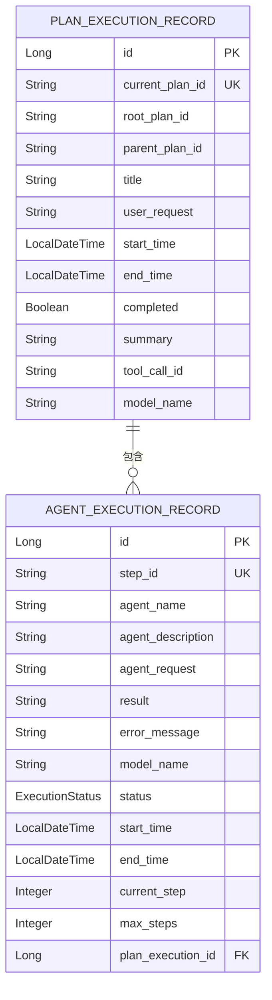
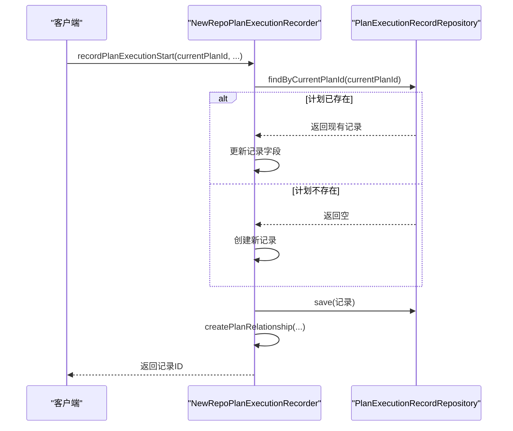
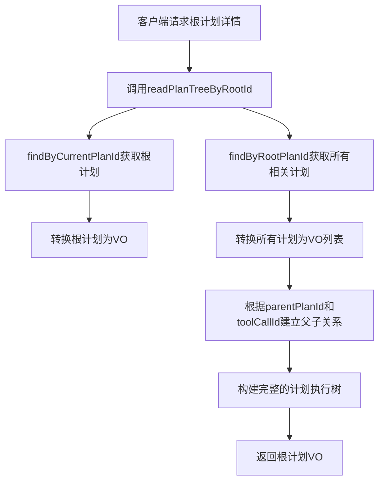

# 计划执行记录查询方法

<cite>
**本文档引用的文件**   
- [PlanExecutionRecordRepository.java](file://src/main/java/com/alibaba/cloud/ai/lynxe/recorder/repository/PlanExecutionRecordRepository.java)
- [PlanExecutionRecordEntity.java](file://src/main/java/com/alibaba/cloud/ai/lynxe/recorder/entity/po/PlanExecutionRecordEntity.java)
- [NewRepoPlanExecutionRecorder.java](file://src/main/java/com/alibaba/cloud/ai/lynxe/recorder/service/NewRepoPlanExecutionRecorder.java)
- [PlanHierarchyReaderService.java](file://src/main/java/com/alibaba/cloud/ai/lynxe/recorder/service/PlanHierarchyReaderService.java)
- [application.yml](file://src/main/resources/application.yml)
</cite>

## 目录
1. [引言](#引言)
2. [核心查询方法详解](#核心查询方法详解)
3. [实体结构与数据模型](#实体结构与数据模型)
4. [服务层使用与调用流程](#服务层使用与调用流程)
5. [性能优化与索引策略](#性能优化与索引策略)
6. [事务边界与异常处理](#事务边界与异常处理)
7. [常见问题排查指南](#常见问题排查指南)
8. [总结](#总结)

## 引言

计划执行记录查询方法是系统监控和追踪计划执行过程的核心组件。`PlanExecutionRecordRepository`接口定义了基于不同计划ID（当前计划ID、父计划ID、根计划ID）的查询方法，为计划执行监控提供了基础数据支持。这些查询方法不仅用于获取单个计划的执行详情，还支持构建完整的计划执行树形结构，实现对复杂计划层级关系的全面追踪。本文档将深入解析这些查询方法的实现原理、使用场景及性能优化策略。

## 核心查询方法详解

`PlanExecutionRecordRepository`接口继承自`JpaRepository`，提供了多个基于Spring Data JPA命名约定的查询方法。这些方法无需手动编写JPQL或原生SQL，由Spring Data JPA根据方法名自动生成对应的查询语句。

### findByCurrentPlanId 方法

该方法用于根据当前计划的唯一标识符精确查找单个计划执行记录。

**方法签名**:
```java
Optional<PlanExecutionRecordEntity> findByCurrentPlanId(String currentPlanId);
```

**实现原理**:
- **参数传递**: 接收一个`String`类型的`currentPlanId`参数，该参数对应数据库表`plan_execution_record`中的`current_plan_id`字段。
- **返回类型**: 返回`Optional<PlanExecutionRecordEntity>`，这是一种安全的编程模式，可以避免`null`值带来的`NullPointerException`。当查询结果不存在时，返回`Optional.empty()`，而非`null`。
- **生成的JPQL**: Spring Data JPA会自动生成类似`SELECT p FROM PlanExecutionRecordEntity p WHERE p.currentPlanId = ?1`的JPQL查询语句。
- **使用场景**: 主要用于获取特定计划的详细信息，例如在用户请求查看某个计划的执行详情时。

**Section sources**
- [PlanExecutionRecordRepository.java](file://src/main/java/com/alibaba/cloud/ai/lynxe/recorder/repository/PlanExecutionRecordRepository.java#L32)

### findByParentPlanId 方法

该方法用于查找所有以指定计划为父计划的子计划执行记录。

**方法签名**:
```java
List<PlanExecutionRecordEntity> findByParentPlanId(String parentPlanId);
```

**实现原理**:
- **参数传递**: 接收一个`String`类型的`parentPlanId`参数，该参数对应数据库表中的`parent_plan_id`字段。
- **返回类型**: 返回`List<PlanExecutionRecordEntity>`，因为一个父计划可能触发多个子计划，所以结果是一个列表。
- **生成的JPQL**: 生成的JPQL类似于`SELECT p FROM PlanExecutionRecordEntity p WHERE p.parentPlanId = ?1`。
- **使用场景**: 在构建计划执行树时，用于查找某个计划节点下的所有直接子节点。

**Section sources**
- [PlanExecutionRecordRepository.java](file://src/main/java/com/alibaba/cloud/ai/lynxe/recorder/repository/PlanExecutionRecordRepository.java#L37)

### findByRootPlanId 方法

该方法用于查找属于同一个根计划的所有计划执行记录，包括根计划本身及其所有层级的子计划。

**方法签名**:
```java
List<PlanExecutionRecordEntity> findByRootPlanId(String rootPlanId);
```

**实现原理**:
- **参数传递**: 接收一个`String`类型的`rootPlanId`参数，该参数对应数据库表中的`root_plan_id`字段。
- **返回类型**: 返回`List<PlanExecutionRecordEntity>`，因为一个根计划会关联其整个执行树中的所有计划。
- **生成的JPQL**: 生成的JPQL类似于`SELECT p FROM PlanExecutionRecordEntity p WHERE p.rootPlanId = ?1`。
- **使用场景**: 这是构建完整计划执行树的关键方法。通过`rootPlanId`，可以一次性获取整个计划执行过程的所有记录，然后在服务层进行树形结构的组装。

**Section sources**
- [PlanExecutionRecordRepository.java](file://src/main/java/com/alibaba/cloud/ai/lynxe/recorder/repository/PlanExecutionRecordRepository.java#L42)

### 其他辅助查询方法

除了上述三个核心查询方法，该接口还定义了其他辅助方法：
- `existsByCurrentPlanId(String currentPlanId)`: 用于检查某个计划ID是否已存在，避免重复创建。
- `deleteByCurrentPlanId(String currentPlanId)`: 用于根据计划ID删除记录，实现数据清理。

## 实体结构与数据模型

`PlanExecutionRecordEntity`实体类定义了计划执行记录的数据结构，与数据库表`plan_execution_record`一一对应。

### 核心字段

- **`id`**: 主键，由数据库自动生成。
- **`currentPlanId`**: 当前计划的唯一标识符，标记为`nullable = false, unique = true`，确保了其唯一性，是`findByCurrentPlanId`查询的高效基础。
- **`rootPlanId`**: 根计划ID，用于标识该计划属于哪个根计划。所有子计划的`rootPlanId`都指向其根计划的`currentPlanId`。
- **`parentPlanId`**: 父计划ID，用于标识该计划是由哪个计划触发的。根计划的`parentPlanId`为`null`。
- **`toolCallId`**: 触发该子计划的工具调用ID，是建立父子计划关联的关键。

### 关系映射

该实体通过JPA注解定义了与其他实体的关系：
- `@OneToMany(cascade = CascadeType.ALL, fetch = FetchType.LAZY)`: 表示一个计划执行记录可以包含多个智能体执行记录（`AgentExecutionRecordEntity`），并配置为懒加载（`LAZY`），以避免不必要的性能开销。



**Diagram sources **
- [PlanExecutionRecordEntity.java](file://src/main/java/com/alibaba/cloud/ai/lynxe/recorder/entity/po/PlanExecutionRecordEntity.java)
- [NewRepoPlanExecutionRecorder.java](file://src/main/java/com/alibaba/cloud/ai/lynxe/recorder/service/NewRepoPlanExecutionRecorder.java)

**Section sources**
- [PlanExecutionRecordEntity.java](file://src/main/java/com/alibaba/cloud/ai/lynxe/recorder/entity/po/PlanExecutionRecordEntity.java#L42)

## 服务层使用与调用流程

查询方法在服务层被`NewRepoPlanExecutionRecorder`和`PlanHierarchyReaderService`等类调用，形成了完整的业务逻辑链。

### 记录创建与更新流程

在`NewRepoPlanExecutionRecorder.recordPlanExecutionStart`方法中，首先调用`findByCurrentPlanId`检查计划是否已存在。如果存在，则更新现有记录；如果不存在，则创建新记录。这确保了计划执行记录的幂等性。



**Diagram sources **
- [NewRepoPlanExecutionRecorder.java](file://src/main/java/com/alibaba/cloud/ai/lynxe/recorder/service/NewRepoPlanExecutionRecorder.java#L80)

### 计划执行树构建流程

`PlanHierarchyReaderService.readPlanTreeByRootId`方法是查询方法的典型使用案例。其调用流程如下：
1.  调用`findByCurrentPlanId`获取根计划本身。
2.  调用`findByRootPlanId`获取所有属于该根计划的记录（包括根计划和所有子计划）。
3.  在内存中将这些记录转换为VO对象，并通过`parentPlanId`和`toolCallId`等字段建立父子关系，最终构建出一棵完整的计划执行树。



**Diagram sources **
- [PlanHierarchyReaderService.java](file://src/main/java/com/alibaba/cloud/ai/lynxe/recorder/service/PlanHierarchyReaderService.java#L93)

**Section sources**
- [PlanHierarchyReaderService.java](file://src/main/java/com/alibaba/cloud/ai/lynxe/recorder/service/PlanHierarchyReaderService.java#L84)

## 性能优化与索引策略

尽管项目中未提供显式的数据库迁移文件，但根据实体定义和查询模式，可以推断出关键的性能优化策略。

### 索引使用

- **唯一索引 (Unique Index)**: `current_plan_id`字段被标记为`unique = true`，数据库会自动为其创建唯一索引。这使得`findByCurrentPlanId`查询非常高效，时间复杂度接近O(1)，是精确查找的理想选择。
- **普通索引 (Normal Index)**: 虽然实体定义中未明确指定，但`root_plan_id`和`parent_plan_id`是高频查询字段。在生产环境中，强烈建议为这两个字段创建普通索引，以加速`findByRootPlanId`和`findByParentPlanId`的查询速度，避免全表扫描。

### 懒加载配置

`PlanExecutionRecordEntity`与`AgentExecutionRecordEntity`之间的关系被配置为`FetchType.LAZY`。这意味着当查询一个计划执行记录时，其关联的智能体执行序列不会立即加载，而是在真正访问`agentExecutionSequence`字段时才进行查询。这种策略有效减少了单次查询的数据量，提升了查询性能。

### 分页处理

当前的查询方法（如`findByRootPlanId`）返回的是完整的`List`。如果一个根计划下有成千上万个子计划，这可能导致内存溢出。一个优化方向是引入分页机制，例如修改方法为`Page<PlanExecutionRecordEntity> findByRootPlanId(String rootPlanId, Pageable pageable)`，从而支持分页查询。

## 事务边界与异常处理

### 事务边界

- **写操作**: `NewRepoPlanExecutionRecorder`中的`recordPlanExecutionStart`和`recordPlanCompletion`等写入方法都使用了`@Transactional`注解。这确保了这些操作的原子性。例如，在`recordPlanExecutionStart`中，更新计划记录和创建计划关系（`createPlanRelationship`）是在同一个数据库事务中完成的，要么全部成功，要么全部回滚。
- **读操作**: `PlanHierarchyReaderService`中的查询方法使用了`@Transactional(readOnly = true)`。这向数据库和JPA提供了一个提示，表明这是一个只读操作，可以进行优化（如使用更宽松的隔离级别），并防止在该事务中意外修改数据。

### 异常处理机制

服务层实现了完善的异常处理：
- **参数验证**: 在方法入口处检查`null`或空字符串，提前抛出`IllegalArgumentException`，防止无效参数进入数据库查询。
- **资源未找到**: 当`findByCurrentPlanId`返回`Optional.empty()`时，服务层会记录警告日志，并返回`null`或抛出业务异常，而不是让`NullPointerException`传播。
- **运行时异常**: 所有数据库操作都被`try-catch`块包围，捕获`Exception`并记录详细的错误日志（包括`currentPlanId`等上下文信息），然后向调用方返回一个安全的默认值（如`null`）或封装后的错误信息，保证了服务的健壮性。

## 常见问题排查指南

### 查询性能缓慢

**现象**: `findByRootPlanId`查询耗时过长。
**排查步骤**:
1.  检查数据库中`root_plan_id`字段是否有索引。使用`SHOW INDEX FROM plan_execution_record;`命令进行确认。
2.  检查该根计划下的子计划数量。如果数量巨大，考虑实现分页查询。
3.  检查`application.yml`中的`spring.jpa.show-sql`设置为`true`，观察生成的SQL语句是否正确使用了索引。

### 无法找到计划记录

**现象**: `findByCurrentPlanId`返回`Optional.empty()`，但预期应存在。
**排查步骤**:
1.  确认传入的`currentPlanId`参数是否正确，注意大小写和空格。
2.  检查数据库中`plan_execution_record`表，确认该`currentPlanId`的记录确实存在。
3.  检查`NewRepoPlanExecutionRecorder`是否成功调用了`save`方法，查看相关日志是否有保存失败的记录。

### 计划树结构不完整

**现象**: `readPlanTreeByRootId`返回的树缺少某些子计划。
**排查步骤**:
1.  确认子计划的`root_plan_id`字段是否正确设置为根计划的ID。
2.  确认子计划的`parent_plan_id`和`tool_call_id`是否正确设置。
3.  检查`PlanHierarchyReaderService`中的`findSubPlansForAgent`方法逻辑，确保`ActToolInfo`和`ThinkActRecord`的关联查询正确无误。

## 总结

`PlanExecutionRecordRepository`中的查询方法是系统计划执行监控功能的基石。通过`findByCurrentPlanId`、`findByParentPlanId`和`findByRootPlanId`三个核心方法，结合`currentPlanId`、`parentPlanId`和`rootPlanId`三个关键字段，系统能够高效地实现对单个计划的精确查询和对整个计划执行树的构建。服务层通过合理的事务管理和异常处理，确保了数据的一致性和系统的稳定性。未来可通过为`root_plan_id`和`parent_plan_id`添加数据库索引，并引入分页机制，进一步提升大规模数据场景下的查询性能。