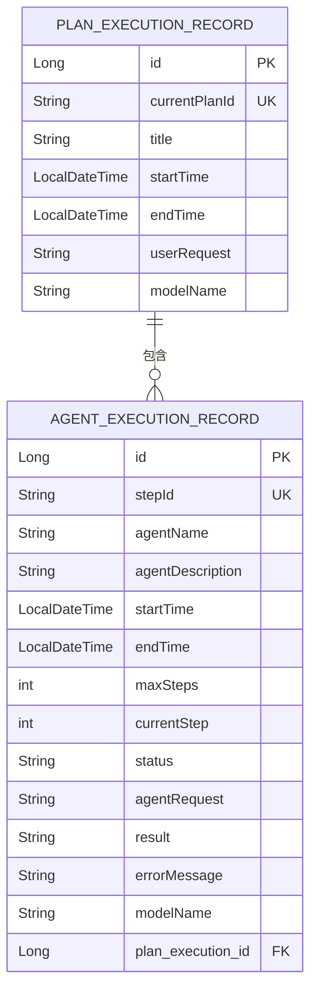
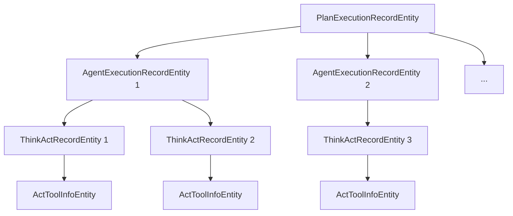

# 代理执行记录实体

<cite>
**本文档引用的文件**  
- [AgentExecutionRecordEntity.java](file://src/main/java/com/alibaba/cloud/ai/lynxe/recorder/entity/po/AgentExecutionRecordEntity.java)
- [PlanExecutionRecordEntity.java](file://src/main/java/com/alibaba/cloud/ai/lynxe/recorder/entity/po/PlanExecutionRecordEntity.java)
- [ThinkActRecordEntity.java](file://src/main/java/com/alibaba/cloud/ai/lynxe/recorder/entity/po/ThinkActRecordEntity.java)
- [ActToolInfoEntity.java](file://src/main/java/com/alibaba/cloud/ai/lynxe/recorder/entity/po/ActToolInfoEntity.java)
- [AgentExecutionRecordRepository.java](file://src/main/java/com/alibaba/cloud/ai/lynxe/recorder/repository/AgentExecutionRecordRepository.java)
- [PlanExecutionRecordRepository.java](file://src/main/java/com/alibaba/cloud/ai/lynxe/recorder/repository/PlanExecutionRecordRepository.java)
- [NewRepoPlanExecutionRecorder.java](file://src/main/java/com/alibaba/cloud/ai/lynxe/recorder/service/NewRepoPlanExecutionRecorder.java)
- [ExecutionStatusEntity.java](file://src/main/java/com/alibaba/cloud/ai/lynxe/recorder/entity/po/ExecutionStatusEntity.java)
</cite>

## 目录
1. [引言](#引言)
2. [实体字段构成](#实体字段构成)
3. [与计划执行记录的关系](#与计划执行记录的关系)
4. [多代理协作场景下的数据组织](#多代理协作场景下的数据组织)
5. [执行追踪与调试作用](#执行追踪与调试作用)
6. [JPA配置与序列化策略](#jpa配置与序列化策略)
7. [与LLM服务的交互数据流](#与llm服务的交互数据流)
8. [典型查询用例](#典型查询用例)
9. [性能优化建议](#性能优化建议)
10. [结论](#结论)

## 引言
`AgentExecutionRecordEntity` 是系统中用于追踪和记录智能代理（Agent）执行过程的核心实体。该实体详细记录了代理在执行任务过程中的各个阶段信息，包括上下文、角色、提示词内容、模型调用详情等。它与 `PlanExecutionRecordEntity` 构成一对多关系，是实现复杂任务编排、执行追踪和调试分析的关键数据结构。本文档将深入分析该实体的技术细节，涵盖其字段构成、关系模型、数据组织方式及在系统中的关键作用。

## 实体字段构成
`AgentExecutionRecordEntity` 实体的数据结构分为三个主要部分：基础信息、执行数据和执行结果。

### 基础信息
这部分字段用于标识记录本身和代理的基本属性。
- **id**: 记录的唯一标识符，由数据库自动生成。
- **stepId**: 所属执行步骤的唯一标识符，在数据库中具有唯一性约束。
- **agentName**: 创建此记录的代理名称。
- **agentDescription**: 代理的描述信息，使用 `LONGTEXT` 类型存储，可容纳大量文本。
- **startTime**: 执行开始的时间戳。
- **endTime**: 执行结束的时间戳。

### 执行数据
这部分字段记录了执行过程中的动态信息。
- **maxSteps**: 允许的最大执行步数。
- **currentStep**: 当前执行的步骤编号。
- **status**: 执行状态，使用 `ExecutionStatusEntity` 枚举类型（IDLE, RUNNING, FINISHED）存储，映射为字符串。
- **thinkActSteps**: 一个 `ThinkActRecordEntity` 对象列表，记录了代理在单个执行步骤中的“思考-行动”子步骤。通过 `@OneToMany` 注解与 `ThinkActRecordEntity` 建立一对多关系，并通过 `@JoinColumn` 指定外键 `agent_execution_record_id`。
- **agentRequest**: 代理执行的输入提示词模板，使用 `LONGTEXT` 类型存储。

### 执行结果
这部分字段记录了执行的最终结果和相关信息。
- **result**: 执行结果，使用 `LONGTEXT` 类型存储。
- **errorMessage**: 执行过程中遇到问题时的错误消息，使用 `LONGTEXT` 类型存储。
- **modelName**: 实际调用的LLM模型名称。

**Section sources**
- [AgentExecutionRecordEntity.java](file://src/main/java/com/alibaba/cloud/ai/lynxe/recorder/entity/po/AgentExecutionRecordEntity.java#L65-L274)

## 与计划执行记录的关系
`AgentExecutionRecordEntity` 与 `PlanExecutionRecordEntity` 之间存在明确的一对多外键约束关系，这是实现任务分层执行和追踪的核心机制。

### 关系模型
`PlanExecutionRecordEntity` 代表一个完整的计划执行过程，而一个计划通常由多个代理（Agent）按顺序或并行执行。因此，一个 `PlanExecutionRecordEntity` 可以关联多个 `AgentExecutionRecordEntity`。

在 `PlanExecutionRecordEntity` 类中，定义了如下字段来维护这种关系：
```java
@OneToMany(cascade = CascadeType.ALL, fetch = FetchType.LAZY)
@JoinColumn(name = "plan_execution_id")
private List<AgentExecutionRecordEntity> agentExecutionSequence;
```
这表明 `PlanExecutionRecordEntity` 拥有一个 `AgentExecutionRecordEntity` 的列表，外键为 `plan_execution_id`，存储在 `agent_execution_record` 表中。

### 外键约束机制
该关系通过JPA的 `@OneToMany` 和 `@JoinColumn` 注解实现。当一个 `PlanExecutionRecordEntity` 被保存时，其关联的 `AgentExecutionRecordEntity` 会通过级联操作（`CascadeType.ALL`）一并保存。`agent_execution_record` 表中的 `plan_execution_id` 字段作为外键，指向 `plan_execution_record` 表的主键 `id`，确保了数据的引用完整性。



**Diagram sources**
- [PlanExecutionRecordEntity.java](file://src/main/java/com/alibaba/cloud/ai/lynxe/recorder/entity/po/PlanExecutionRecordEntity.java#L98-L100)
- [AgentExecutionRecordEntity.java](file://src/main/java/com/alibaba/cloud/ai/lynxe/recorder/entity/po/AgentExecutionRecordEntity.java)

**Section sources**
- [PlanExecutionRecordEntity.java](file://src/main/java/com/alibaba/cloud/ai/lynxe/recorder/entity/po/PlanExecutionRecordEntity.java#L98-L100)
- [AgentExecutionRecordEntity.java](file://src/main/java/com/alibaba/cloud/ai/lynxe/recorder/entity/po/AgentExecutionRecordEntity.java)

## 多代理协作场景下的数据组织
在复杂的多代理协作场景中，`AgentExecutionRecordEntity` 通过其层级结构和关联关系，有效地组织了执行数据。

### 数据组织方式
1.  **层级结构**: 系统以 `PlanExecutionRecordEntity` 为根节点，形成一个执行树。每个 `PlanExecutionRecordEntity` 包含一个 `agentExecutionSequence` 列表，该列表按执行顺序记录了所有参与的代理。
2.  **步骤分解**: 每个 `AgentExecutionRecordEntity` 代表一个代理的一次执行。它进一步通过 `thinkActSteps` 列表，将自身的执行过程分解为更细粒度的“思考-行动”循环。
3.  **工具调用**: 在 `ThinkActRecordEntity` 中，通过 `actToolInfoList` 列表记录了行动阶段调用的具体工具（如数据库查询、文件操作等），形成了完整的执行链路。

这种“计划 -> 代理执行 -> 思考-行动循环 -> 工具调用”的四级结构，使得系统能够清晰地追踪任何复杂任务的执行路径。



**Diagram sources**
- [PlanExecutionRecordEntity.java](file://src/main/java/com/alibaba/cloud/ai/lynxe/recorder/entity/po/PlanExecutionRecordEntity.java)
- [AgentExecutionRecordEntity.java](file://src/main/java/com/alibaba/cloud/ai/lynxe/recorder/entity/po/AgentExecutionRecordEntity.java)
- [ThinkActRecordEntity.java](file://src/main/java/com/alibaba/cloud/ai/lynxe/recorder/entity/po/ThinkActRecordEntity.java)
- [ActToolInfoEntity.java](file://src/main/java/com/alibaba/cloud/ai/lynxe/recorder/entity/po/ActToolInfoEntity.java)

**Section sources**
- [PlanExecutionRecordEntity.java](file://src/main/java/com/alibaba/cloud/ai/lynxe/recorder/entity/po/PlanExecutionRecordEntity.java)
- [AgentExecutionRecordEntity.java](file://src/main/java/com/alibaba/cloud/ai/lynxe/recorder/entity/po/AgentExecutionRecordEntity.java)

## 执行追踪和调试中的关键作用
`AgentExecutionRecordEntity` 是系统执行追踪和调试功能的核心，提供了全面的执行上下文。

### 追踪与调试功能
1.  **完整执行链路**: 通过查询 `PlanExecutionRecordEntity` 及其关联的 `AgentExecutionRecordEntity`，可以完整还原整个任务的执行流程，包括每个代理的执行顺序和耗时。
2.  **问题定位**: 当执行失败时，可以逐层下钻到具体的 `AgentExecutionRecordEntity`，查看其 `errorMessage` 和 `thinkActSteps`。通过分析 `ThinkActRecordEntity` 中的 `thinkInput` 和 `thinkOutput`，可以精确地定位到是哪个思考步骤或工具调用导致了问题。
3.  **性能分析**: 记录了 `startTime` 和 `endTime`，可以计算每个代理和每个“思考-行动”循环的执行时间，便于进行性能瓶颈分析。
4.  **输入输出审计**: `agentRequest` 和 `result` 字段完整保存了代理的输入提示词和最终输出，满足了审计和复现的需求。

**Section sources**
- [AgentExecutionRecordEntity.java](file://src/main/java/com/alibaba/cloud/ai/lynxe/recorder/entity/po/AgentExecutionRecordEntity.java)
- [ThinkActRecordEntity.java](file://src/main/java/com/alibaba/cloud/ai/lynxe/recorder/entity/po/ThinkActRecordEntity.java)

## JPA配置与序列化策略
该实体的持久化和数据传输配置遵循了最佳实践。

### JPA配置
- **实体映射**: 使用 `@Entity` 和 `@Table(name = "agent_execution_record")` 注解将类映射到数据库表。
- **主键生成**: 使用 `@Id` 和 `@GeneratedValue(strategy = GenerationType.IDENTITY)` 配置主键自增。
- **索引优化**: 在 `step_id` 字段上创建了索引（`@Index(columnList = "step_id")`），以加速通过 `stepId` 查询记录的性能。
- **关系映射**: 使用 `@OneToMany` 和 `@JoinColumn` 正确配置了与 `ThinkActRecordEntity` 的一对多关系，并设置了级联保存和延迟加载（`fetch = FetchType.LAZY`）。

### 序列化策略
虽然 `AgentExecutionRecordEntity` 本身是JPA实体，但系统在数据传输时通常使用其对应的VO类 `AgentExecutionRecord`。该VO类使用了Jackson注解进行序列化配置：
- **时间序列化**: 使用 `@JsonSerialize(using = LocalDateTimeSerializer.class)` 和 `@JsonDeserialize(using = LocalDateTimeDeserializer.class)` 确保 `LocalDateTime` 类型能正确地在JSON和Java对象之间转换。
- **字段命名**: 保持Java驼峰命名与JSON的兼容性。

**Section sources**
- [AgentExecutionRecordEntity.java](file://src/main/java/com/alibaba/cloud/ai/lynxe/recorder/entity/po/AgentExecutionRecordEntity.java)
- [AgentExecutionRecord.java](file://src/main/java/com/alibaba/cloud/ai/lynxe/recorder/entity/vo/AgentExecutionRecord.java)

## 与LLM服务的交互数据流
`AgentExecutionRecordEntity` 是LLM服务交互过程的忠实记录者。

### 数据流分析
1.  **输入捕获**: 当代理需要调用LLM时，其输入提示词（Prompt）会被完整地记录在 `AgentExecutionRecordEntity` 的 `agentRequest` 字段中。
2.  **过程记录**: LLM的“思考”过程被记录在 `ThinkActRecordEntity` 的 `thinkInput` 和 `thinkOutput` 字段中。
3.  **行动执行**: 如果LLM决定调用工具，该工具的名称、参数和结果会被记录在 `ActToolInfoEntity` 中。
4.  **结果存储**: 代理的最终执行结果（可能经过多次“思考-行动”循环）被汇总并存储在 `AgentExecutionRecordEntity` 的 `result` 字段中。
5.  **模型追踪**: 实际调用的模型名称被记录在 `modelName` 字段，便于进行模型效果分析和成本核算。

这个数据流确保了所有与LLM的交互都是可追溯、可审计的。

**Section sources**
- [AgentExecutionRecordEntity.java](file://src/main/java/com/alibaba/cloud/ai/lynxe/recorder/entity/po/AgentExecutionRecordEntity.java)
- [ThinkActRecordEntity.java](file://src/main/java/com/alibaba/cloud/ai/lynxe/recorder/entity/po/ThinkActRecordEntity.java)
- [ActToolInfoEntity.java](file://src/main/java/com/alibaba/cloud/ai/lynxe/recorder/entity/po/ActToolInfoEntity.java)

## 典型查询用例
以下是针对 `AgentExecutionRecordEntity` 的典型查询场景。

### 查询用例
1.  **根据步骤ID查询**: 通过 `AgentExecutionRecordRepository.findByStepId(String stepId)` 方法，可以快速定位到特定步骤的执行记录，这是最常用的查询方式。
2.  **根据计划ID查询所有代理记录**: 通过 `PlanExecutionRecordRepository` 加载 `PlanExecutionRecordEntity` 后，访问其 `getAgentExecutionSequence()` 方法，即可获取该计划下所有代理的执行记录。
3.  **检查记录是否存在**: 使用 `AgentExecutionRecordRepository.existsByStepId(String stepId)` 方法，在创建新记录前检查是否已存在，避免重复。
4.  **查询执行详情**: 结合 `AgentExecutionRecordEntity` 和其关联的 `thinkActSteps`，可以构建一个完整的执行详情视图，用于前端展示。

**Section sources**
- [AgentExecutionRecordRepository.java](file://src/main/java/com/alibaba/cloud/ai/lynxe/recorder/repository/AgentExecutionRecordRepository.java)
- [PlanExecutionRecordRepository.java](file://src/main/java/com/alibaba/cloud/ai/lynxe/recorder/repository/PlanExecutionRecordRepository.java)

## 性能优化建议
为确保系统在高并发场景下的性能，提出以下优化建议。

### 优化建议
1.  **索引优化**: 确保 `agent_execution_record` 表的 `step_id` 字段有唯一索引，这是查询性能的关键。如果需要根据 `currentPlanId` 或 `agentName` 进行频繁查询，也应考虑添加索引。
2.  **延迟加载**: `thinkActSteps` 关系已配置为 `FetchType.LAZY`，这非常重要。在大多数情况下，我们只需要代理的概要信息（如状态、结果），无需加载完整的“思考-行动”历史，避免了不必要的数据库I/O。
3.  **分页查询**: 当一个计划包含大量代理执行记录时，应实现分页查询，避免一次性加载过多数据导致内存溢出。
4.  **数据归档**: 对于历史执行记录，可以考虑定期归档到冷存储，以保持主数据库的性能。
5.  **缓存策略**: 对于频繁读取但不常变更的记录（如已完成的执行记录），可以引入Redis等缓存机制，减少数据库压力。

**Section sources**
- [AgentExecutionRecordEntity.java](file://src/main/java/com/alibaba/cloud/ai/lynxe/recorder/entity/po/AgentExecutionRecordEntity.java)
- [AgentExecutionRecordRepository.java](file://src/main/java/com/alibaba/cloud/ai/lynxe/recorder/repository/AgentExecutionRecordRepository.java)

## 结论
`AgentExecutionRecordEntity` 是一个设计精良、功能完备的核心实体。它不仅详细记录了代理的执行全过程，还通过与 `PlanExecutionRecordEntity` 的层级关系，构建了一个强大的任务执行追踪体系。其JPA配置合理，序列化策略完善，能够有效支持多代理协作、执行调试和性能分析等关键业务场景。遵循本文档中的性能优化建议，可以确保该实体在大规模应用中依然保持高效和稳定。