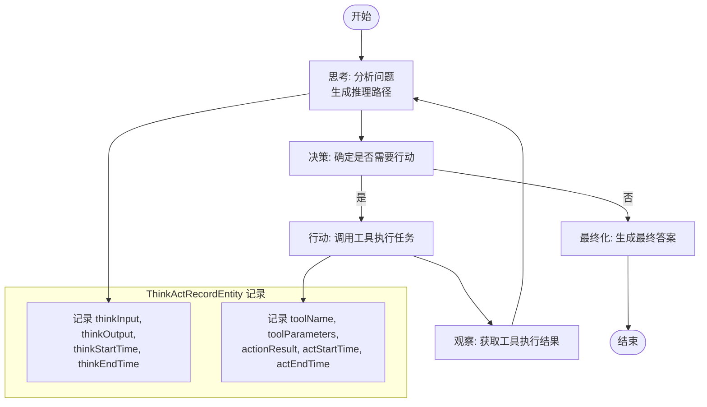
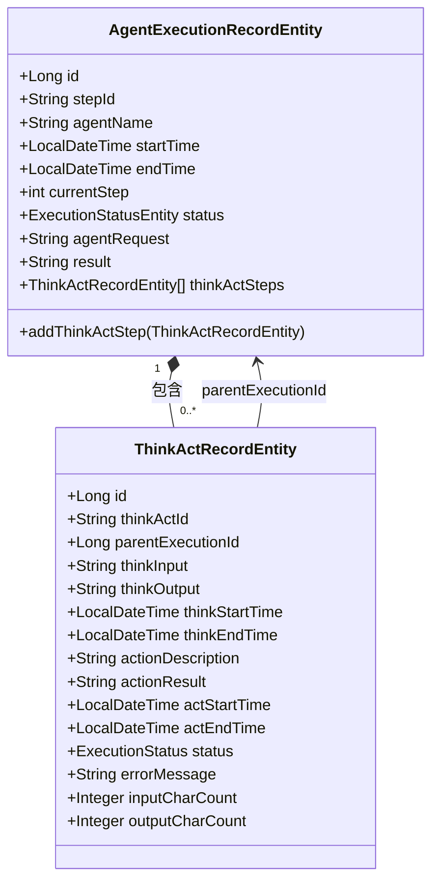
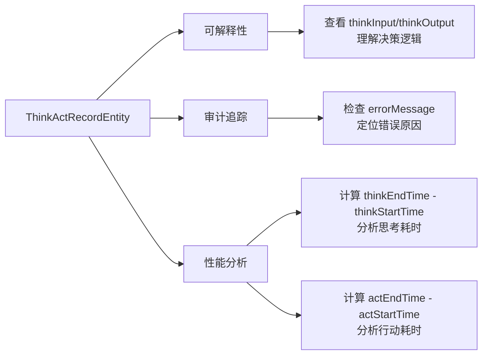

# 思考与行动记录实体

<cite>
**本文档引用的文件**  
- [ThinkActRecordEntity.java](file://src/main/java/com/alibaba/cloud/ai/lynxe/recorder/entity/po/ThinkActRecordEntity.java)
- [AgentExecutionRecordEntity.java](file://src/main/java/com/alibaba/cloud/ai/lynxe/recorder/entity/po/AgentExecutionRecordEntity.java)
- [ActToolInfoEntity.java](file://src/main/java/com/alibaba/cloud/ai/lynxe/recorder/entity/po/ActToolInfoEntity.java)
- [ThinkActRecord.java](file://src/main/java/com/alibaba/cloud/ai/lynxe/recorder/entity/vo/ThinkActRecord.java)
- [AgentExecutionRecord.java](file://src/main/java/com/alibaba/cloud/ai/lynxe/recorder/entity/vo/AgentExecutionRecord.java)
- [ActToolInfo.java](file://src/main/java/com/alibaba/cloud/ai/lynxe/recorder/entity/vo/ActToolInfo.java)
- [ThinkActRecordRepository.java](file://src/main/java/com/alibaba/cloud/ai/lynxe/recorder/repository/ThinkActRecordRepository.java)
- [NewRepoPlanExecutionRecorder.java](file://src/main/java/com/alibaba/cloud/ai/lynxe/recorder/service/NewRepoPlanExecutionRecorder.java)
</cite>

## 目录
1. [引言](#引言)
2. [核心字段设计](#核心字段设计)
3. [ReAct代理决策循环中的角色](#react代理决策循环中的角色)
4. [与AgentExecutionRecordEntity的聚合关系](#与agentexecutionrecordentity的聚合关系)
5. [可解释性与审计追踪支持](#可解释性与审计追踪支持)
6. [数据库存储策略](#数据库存储策略)
7. [大文本字段处理方案](#大文本字段处理方案)
8. [流式响应集成机制](#流式响应集成机制)
9. [监控与可视化实践指南](#监控与可视化实践指南)
10. [结论](#结论)

## 引言

`ThinkActRecordEntity` 是系统中用于记录智能代理在单个执行步骤中思考与行动过程的核心实体。该实体作为 `AgentExecutionRecordEntity` 的子步骤存在，专注于记录代理在思考阶段和行动阶段的详细处理信息。通过结构化的日志记录，该实体为代理决策过程提供了完整的可追溯性，支持错误回溯、性能分析和审计追踪功能。本文档将深入分析该实体的设计细节、在ReAct代理循环中的核心地位、与父实体的聚合关系，以及相关的存储策略和监控实践。

**本文档引用的文件**  
- [ThinkActRecordEntity.java](file://src/main/java/com/alibaba/cloud/ai/lynxe/recorder/entity/po/ThinkActRecordEntity.java)
- [AgentExecutionRecordEntity.java](file://src/main/java/com/alibaba/cloud/ai/lynxe/recorder/entity/po/AgentExecutionRecordEntity.java)

## 核心字段设计

`ThinkActRecordEntity` 的数据结构分为三个主要部分：基础信息、思考阶段和行动阶段。

### 基础信息
- **id**: 记录的唯一标识符，由数据库自动生成。
- **thinkActId**: 以字符串形式表示的Think-Act ID，用于外部引用。
- **parentExecutionId**: 父级执行记录ID，关联到 `AgentExecutionRecordEntity`，建立父子关系。

### 思考阶段
- **thinkInput**: 思考过程的输入内容，存储为 `LONGTEXT` 类型，用于记录发送给大语言模型的完整上下文。
- **thinkOutput**: 思考过程的输出结果，同样为 `LONGTEXT` 类型，记录模型生成的推理和决策内容。
- **thinkStartTime** 和 **thinkEndTime**: 分别记录思考阶段的开始和结束时间，用于计算思考耗时。

### 行动阶段
- **actionNeeded**: 布尔值，指示思考阶段是否确定需要执行行动。
- **actionDescription**: 行动描述，记录代理决定执行的具体操作。
- **actionResult**: 行动执行结果，记录工具调用后的返回值。
- **actStartTime** 和 **actEndTime**: 记录行动阶段的开始和结束时间，用于计算行动耗时。
- **status**: 执行状态（如IDLE, RUNNING, FINISHED），反映该思考-行动循环的当前状态。
- **errorMessage**: 如果循环遇到问题，记录错误信息。

此外，该实体还包含性能统计字段：
- **inputCharCount**: 输入字符数，统计发送给LLM的所有消息的总字符数。
- **outputCharCount**: 输出字符数，统计LLM响应的总字符数。

**本文档引用的文件**  
- [ThinkActRecordEntity.java](file://src/main/java/com/alibaba/cloud/ai/lynxe/recorder/entity/po/ThinkActRecordEntity.java)

## ReAct代理决策循环中的角色

`ThinkActRecordEntity` 在ReAct代理决策循环中扮演着核心记录者的角色。ReAct（Reasoning and Acting）模式是智能代理实现复杂任务处理的关键机制，其核心在于“思考-行动”的迭代循环。

**图表来源**  
- [ThinkActRecordEntity.java](file://src/main/java/com/alibaba/cloud/ai/lynxe/recorder/entity/po/ThinkActRecordEntity.java)

在每次循环中，`ThinkActRecordEntity` 实例被创建并填充：
1.  **思考阶段**：当代理开始推理时，`startThinking` 方法被调用，记录 `thinkInput` 和 `thinkStartTime`。推理完成后，`finishThinking` 方法被调用，记录 `thinkOutput` 和 `thinkEndTime`。
2.  **行动阶段**：如果决策需要调用工具，`startAction` 方法被调用，记录 `actionDescription`、`toolName`、`toolParameters` 和 `actStartTime`。工具执行后，`finishAction` 方法被调用，记录 `actionResult` 和 `actEndTime`。

这种精确的时序记录使得整个决策过程完全透明，任何步骤的耗时和内容都可以被精确回溯。

**本文档引用的文件**  
- [ThinkActRecordEntity.java](file://src/main/java/com/alibaba/cloud/ai/lynxe/recorder/entity/po/ThinkActRecordEntity.java)
- [ThinkActRecord.java](file://src/main/java/com/alibaba/cloud/ai/lynxe/recorder/entity/vo/ThinkActRecord.java)

## 与AgentExecutionRecordEntity的聚合关系

`ThinkActRecordEntity` 与 `AgentExecutionRecordEntity` 之间存在明确的聚合关系，前者是后者的组成部分。

**图表来源**  
- [AgentExecutionRecordEntity.java](file://src/main/java/com/alibaba/cloud/ai/lynxe/recorder/entity/po/AgentExecutionRecordEntity.java)
- [ThinkActRecordEntity.java](file://src/main/java/com/alibaba/cloud/ai/lynxe/recorder/entity/po/ThinkActRecordEntity.java)

这种关系通过以下方式实现：
1.  **外键关联**：`ThinkActRecordEntity` 中的 `parentExecutionId` 字段直接指向 `AgentExecutionRecordEntity` 的 `id`，建立数据库层面的关联。
2.  **集合属性**：`AgentExecutionRecordEntity` 拥有一个 `thinkActSteps` 的 `List<ThinkActRecordEntity>` 集合，通过 `@OneToMany` JPA 注解进行映射。
3.  **生命周期管理**：`AgentExecutionRecordEntity` 提供了 `addThinkActStep` 方法，用于向其步骤列表中添加新的 `ThinkActRecordEntity` 实例，并自动更新 `currentStep` 计数器。

这种设计使得一个完整的代理执行过程（`AgentExecutionRecordEntity`）可以被分解为多个有序的思考-行动步骤（`ThinkActRecordEntity`），从而实现了对复杂任务执行过程的精细化记录。

**本文档引用的文件**  
- [AgentExecutionRecordEntity.java](file://src/main/java/com/alibaba/cloud/ai/lynxe/recorder/entity/po/AgentExecutionRecordEntity.java)
- [ThinkActRecordEntity.java](file://src/main/java/com/alibaba/cloud/ai/lynxe/recorder/entity/po/ThinkActRecordEntity.java)

## 可解释性与审计追踪支持

`ThinkActRecordEntity` 是系统实现可解释性（Explainability）和审计追踪（Audit Trail）功能的核心。

### 结构化日志记录
该实体通过结构化的字段设计，将非结构化的代理决策过程转化为结构化的数据。每个 `thinkInput` 和 `thinkOutput` 都完整记录了代理与LLM交互的原始内容，使得“黑盒”决策过程变得透明。开发者和审计人员可以清晰地看到代理是如何一步步进行推理并做出决策的。

### 错误回溯
当执行过程出现错误时，`errorMessage` 字段会记录详细的错误信息。结合 `thinkOutput` 中的推理内容和 `actionResult` 中的工具执行结果，可以快速定位问题根源。例如，是推理逻辑错误导致了错误的工具调用，还是工具本身执行失败。

### 性能分析
通过 `thinkStartTime`/`thinkEndTime` 和 `actStartTime`/`actEndTime` 这两组时间戳，可以精确计算出每个思考-行动循环中，思考阶段和行动阶段各自的耗时。结合 `inputCharCount` 和 `outputCharCount`，可以进一步分析LLM的响应效率和成本。

**图表来源**  
- [ThinkActRecordEntity.java](file://src/main/java/com/alibaba/cloud/ai/lynxe/recorder/entity/po/ThinkActRecordEntity.java)

**本文档引用的文件**  
- [ThinkActRecordEntity.java](file://src/main/java/com/alibaba/cloud/ai/lynxe/recorder/entity/po/ThinkActRecordEntity.java)
- [NewRepoPlanExecutionRecorder.java](file://src/main/java/com/alibaba/cloud/ai/lynxe/recorder/service/NewRepoPlanExecutionRecorder.java)

## 数据库存储策略

`ThinkActRecordEntity` 的数据库存储策略通过JPA注解和表结构设计来实现。

### 表结构
- **表名**: `think_act_record`
- **主键**: `id` (BIGINT, AUTO_INCREMENT)
- **索引**: 通过 `@JoinColumn(name = "agent_execution_record_id")` 在 `agent_execution_record_id` 列上自动创建外键索引，确保与父记录的高效关联查询。

### 关系映射
- **一对多关系**: `AgentExecutionRecordEntity` 与 `ThinkActRecordEntity` 之间是一对多关系。`@OneToMany(cascade = CascadeType.ALL, fetch = FetchType.LAZY)` 注解确保了当父实体被保存或删除时，其关联的子实体也会被级联操作，并且采用懒加载策略以提高查询效率。
- **外键列**: `@JoinColumn(name = "agent_execution_record_id")` 明确指定了外键列的名称。

### 字段存储
- **大文本字段**: `thinkInput` 和 `thinkOutput` 使用 `columnDefinition = "LONGTEXT"`，能够存储大量的文本内容，适应LLM输入输出可能很长的特点。
- **枚举类型**: `status` 字段使用 `@Enumerated(EnumType.STRING)` 存储为字符串，提高可读性。

**本文档引用的文件**  
- [ThinkActRecordEntity.java](file://src/main/java/com/alibaba/cloud/ai/lynxe/recorder/entity/po/ThinkActRecordEntity.java)
- [AgentExecutionRecordEntity.java](file://src/main/java/com/alibaba/cloud/ai/lynxe/recorder/entity/po/AgentExecutionRecordEntity.java)

## 大文本字段处理方案

针对 `thinkInput` 和 `thinkOutput` 这类可能包含大量文本的字段，系统采用了以下处理方案：

1.  **数据库类型**: 使用 `LONGTEXT` 类型，该类型在MySQL中可存储高达4GB的文本数据，足以容纳复杂的提示词和长篇幅的模型响应。
2.  **序列化**: 在Java实体中，这些字段直接映射为 `String` 类型，由JPA提供者（如Hibernate）负责与数据库的 `LONGTEXT` 类型进行转换。
3.  **性能考量**: 由于这些字段可能非常大，查询时应避免不必要的 `SELECT *` 操作。在需要获取完整记录的场景（如审计），可以使用 `JOIN FETCH` 策略一次性加载；而在仅需元数据的场景（如列表展示），应避免加载这些大字段。

**本文档引用的文件**  
- [ThinkActRecordEntity.java](file://src/main/java/com/alibaba/cloud/ai/lynxe/recorder/entity/po/ThinkActRecordEntity.java)

## 流式响应集成机制

`ThinkActRecordEntity` 的设计支持与流式响应（Streaming Response）的集成。虽然实体本身记录的是完整的输入和输出，但其时间戳字段为流式场景提供了分析基础。

在流式响应中，LLM的输出是分块（chunk）返回的。系统可以在接收到第一个响应块时设置 `thinkStartTime`，在接收到最后一个块时设置 `thinkEndTime`。这样，`thinkOutput` 字段最终会拼接所有块的内容，而 `thinkEndTime - thinkStartTime` 则精确反映了整个流式响应的持续时间，这对于监控LLM的首字节时间（Time to First Token）和整体响应延迟至关重要。

**本文档引用的文件**  
- [ThinkActRecordEntity.java](file://src/main/java/com/alibaba/cloud/ai/lynxe/recorder/entity/po/ThinkActRecordEntity.java)

## 监控与可视化实践指南

基于 `ThinkActRecordEntity` 的丰富数据，可以构建强大的监控和可视化系统。

### 监控指标
- **思考耗时**: `thinkEndTime - thinkStartTime`，监控LLM推理延迟。
- **行动耗时**: `actEndTime - actStartTime`，监控工具执行效率。
- **错误率**: 统计 `errorMessage` 不为空的 `ThinkActRecordEntity` 占比。
- **Token消耗**: 通过 `inputCharCount` 和 `outputCharCount` 估算，用于成本监控。

### 可视化实践
1.  **执行流程图**: 将 `AgentExecutionRecordEntity` 的 `thinkActSteps` 列表可视化为一个时间线，每个 `ThinkActRecordEntity` 作为一个节点，展示思考和行动的交替过程。
2.  **性能热力图**: 展示不同代理或不同工具的平均思考耗时和行动耗时，识别性能瓶颈。
3.  **审计日志视图**: 提供一个可展开的详细日志视图，允许用户点击某个 `ThinkActRecordEntity` 查看其完整的 `thinkInput` 和 `thinkOutput`，实现决策过程的完全透明化。

**本文档引用的文件**  
- [ThinkActRecordEntity.java](file://src/main/java/com/alibaba/cloud/ai/lynxe/recorder/entity/po/ThinkActRecordEntity.java)
- [AgentExecutionRecordEntity.java](file://src/main/java/com/alibaba/cloud/ai/lynxe/recorder/entity/po/AgentExecutionRecordEntity.java)

## 结论

`ThinkActRecordEntity` 是一个设计精良的核心实体，它通过结构化的字段设计，完整记录了ReAct代理在单个执行步骤中的思考与行动全过程。它与 `AgentExecutionRecordEntity` 构成的聚合关系，实现了对复杂任务执行的精细化分解和记录。该实体不仅支撑了系统的可解释性和审计追踪能力，还为性能分析、错误诊断和成本监控提供了坚实的数据基础。其数据库存储策略和对大文本字段的处理方案，确保了在高负载和大数据量场景下的稳定性和效率。通过有效的监控与可视化实践，可以充分利用该实体的数据价值，持续优化代理的性能和可靠性。