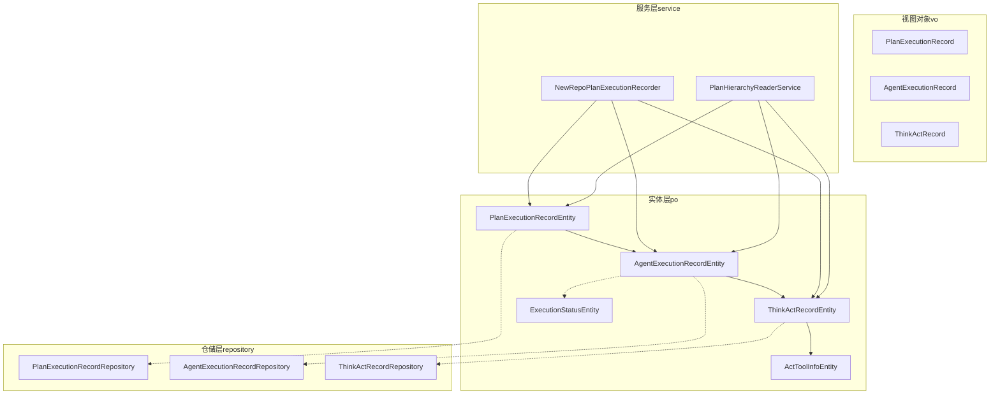
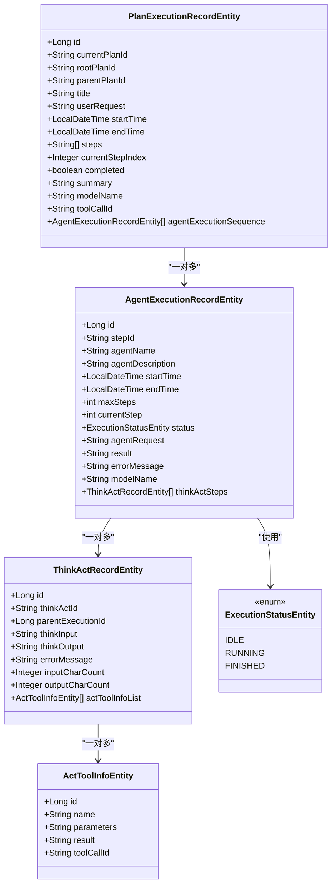
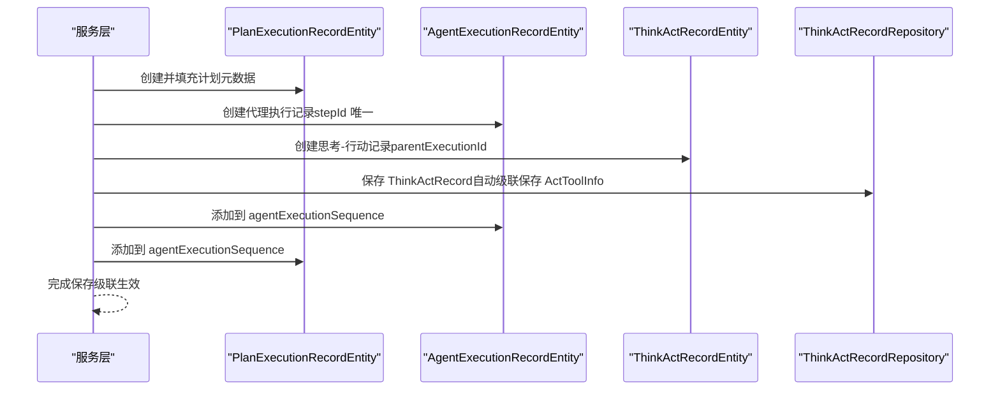
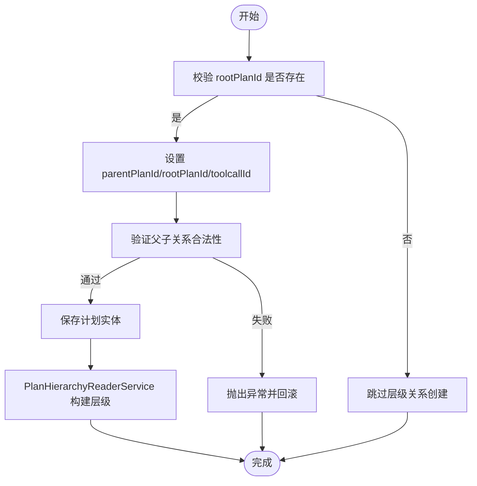

# 执行记录数据模型

<cite>
**本文引用的文件**
- [PlanExecutionRecordEntity.java](file://src/main/java/com/alibaba/cloud/ai/lynxe/recorder/entity/po/PlanExecutionRecordEntity.java)
- [AgentExecutionRecordEntity.java](file://src/main/java/com/alibaba/cloud/ai/lynxe/recorder/entity/po/AgentExecutionRecordEntity.java)
- [ThinkActRecordEntity.java](file://src/main/java/com/alibaba/cloud/ai/lynxe/recorder/entity/po/ThinkActRecordEntity.java)
- [ExecutionStatusEntity.java](file://src/main/java/com/alibaba/cloud/ai/lynxe/recorder/entity/po/ExecutionStatusEntity.java)
- [ActToolInfoEntity.java](file://src/main/java/com/alibaba/cloud/ai/lynxe/recorder/entity/po/ActToolInfoEntity.java)
- [PlanExecutionRecordRepository.java](file://src/main/java/com/alibaba/cloud/ai/lynxe/recorder/repository/PlanExecutionRecordRepository.java)
- [AgentExecutionRecordRepository.java](file://src/main/java/com/alibaba/cloud/ai/lynxe/recorder/repository/AgentExecutionRecordRepository.java)
- [ThinkActRecordRepository.java](file://src/main/java/com/alibaba/cloud/ai/lynxe/recorder/repository/ThinkActRecordRepository.java)
- [PlanExecutionRecord.java](file://src/main/java/com/alibaba/cloud/ai/lynxe/recorder/entity/vo/PlanExecutionRecord.java)
- [AgentExecutionRecord.java](file://src/main/java/com/alibaba/cloud/ai/lynxe/recorder/entity/vo/AgentExecutionRecord.java)
- [ThinkActRecord.java](file://src/main/java/com/alibaba/cloud/ai/lynxe/recorder/entity/vo/ThinkActRecord.java)
- [NewRepoPlanExecutionRecorder.java](file://src/main/java/com/alibaba/cloud/ai/lynxe/recorder/service/NewRepoPlanExecutionRecorder.java)
- [PlanHierarchyReaderService.java](file://src/main/java/com/alibaba/cloud/ai/lynxe/recorder/service/PlanHierarchyReaderService.java)
</cite>

## 目录
1. [简介](#简介)
2. [项目结构](#项目结构)
3. [核心组件](#核心组件)
4. [架构总览](#架构总览)
5. [详细组件分析](#详细组件分析)
6. [依赖关系分析](#依赖关系分析)
7. [性能与一致性](#性能与一致性)
8. [故障排查指南](#故障排查指南)
9. [结论](#结论)

## 简介
本文件聚焦于“执行记录数据模型”，系统性解析三个核心实体：PlanExecutionRecordEntity（计划执行记录）、AgentExecutionRecordEntity（智能体执行记录）与ThinkActRecordEntity（思考-行动记录）。文档覆盖字段定义、数据类型与约束、业务语义、实体间一对多/多对一关系、状态转换与生命周期管理，并通过ER图与序列图直观展示数据流与控制流，最后给出一致性维护策略与级联操作配置建议。

## 项目结构
围绕执行记录的核心代码位于 recorder 模块，包含：
- 实体层（po）：PlanExecutionRecordEntity、AgentExecutionRecordEntity、ThinkActRecordEntity、ActToolInfoEntity、ExecutionStatusEntity
- 视图对象（vo）：PlanExecutionRecord、AgentExecutionRecord、ThinkActRecord
- 仓储层（repository）：PlanExecutionRecordRepository、AgentExecutionRecordRepository、ThinkActRecordRepository
- 服务层（service）：NewRepoPlanExecutionRecorder、PlanHierarchyReaderService

图表来源
- [PlanExecutionRecordEntity.java](file://src/main/java/com/alibaba/cloud/ai/lynxe/recorder/entity/po/PlanExecutionRecordEntity.java#L1-L283)
- [AgentExecutionRecordEntity.java](file://src/main/java/com/alibaba/cloud/ai/lynxe/recorder/entity/po/AgentExecutionRecordEntity.java#L1-L275)
- [ThinkActRecordEntity.java](file://src/main/java/com/alibaba/cloud/ai/lynxe/recorder/entity/po/ThinkActRecordEntity.java#L1-L185)
- [ActToolInfoEntity.java](file://src/main/java/com/alibaba/cloud/ai/lynxe/recorder/entity/po/ActToolInfoEntity.java#L1-L118)
- [ExecutionStatusEntity.java](file://src/main/java/com/alibaba/cloud/ai/lynxe/recorder/entity/po/ExecutionStatusEntity.java#L1-L26)
- [PlanExecutionRecordRepository.java](file://src/main/java/com/alibaba/cloud/ai/lynxe/recorder/repository/PlanExecutionRecordRepository.java#L1-L55)
- [AgentExecutionRecordRepository.java](file://src/main/java/com/alibaba/cloud/ai/lynxe/recorder/repository/AgentExecutionRecordRepository.java#L1-L44)
- [ThinkActRecordRepository.java](file://src/main/java/com/alibaba/cloud/ai/lynxe/recorder/repository/ThinkActRecordRepository.java#L1-L55)
- [PlanExecutionRecord.java](file://src/main/java/com/alibaba/cloud/ai/lynxe/recorder/entity/vo/PlanExecutionRecord.java#L1-L337)
- [AgentExecutionRecord.java](file://src/main/java/com/alibaba/cloud/ai/lynxe/recorder/entity/vo/AgentExecutionRecord.java#L1-L318)
- [ThinkActRecord.java](file://src/main/java/com/alibaba/cloud/ai/lynxe/recorder/entity/vo/ThinkActRecord.java#L1-L334)
- [NewRepoPlanExecutionRecorder.java](file://src/main/java/com/alibaba/cloud/ai/lynxe/recorder/service/NewRepoPlanExecutionRecorder.java#L115-L856)
- [PlanHierarchyReaderService.java](file://src/main/java/com/alibaba/cloud/ai/lynxe/recorder/service/PlanHierarchyReaderService.java#L323-L391)

章节来源
- [PlanExecutionRecordEntity.java](file://src/main/java/com/alibaba/cloud/ai/lynxe/recorder/entity/po/PlanExecutionRecordEntity.java#L1-L283)
- [AgentExecutionRecordEntity.java](file://src/main/java/com/alibaba/cloud/ai/lynxe/recorder/entity/po/AgentExecutionRecordEntity.java#L1-L275)
- [ThinkActRecordEntity.java](file://src/main/java/com/alibaba/cloud/ai/lynxe/recorder/entity/po/ThinkActRecordEntity.java#L1-L185)

## 核心组件
- 计划执行记录（PlanExecutionRecordEntity）
  - 职责：承载一次规划流程的完整执行信息，包含计划元数据、步骤列表、代理执行顺序、完成状态与摘要等。
  - 关键字段：currentPlanId（唯一标识当前计划）、rootPlanId（根计划ID，用于子计划树）、parentPlanId（父计划ID，用于子计划）、steps（计划步骤列表）、agentExecutionSequence（按序的代理执行记录集合）。
  - 约束：currentPlanId 唯一；支持 LONGTEXT 字段存储长文本；通过 @OneToMany 维护与代理执行记录的一对多关系。
- 智能体执行记录（AgentExecutionRecordEntity）
  - 职责：记录单个智能体在某一步骤内的执行过程，包含状态、思考-行动步骤、请求内容、结果与错误信息等。
  - 关键字段：stepId（步骤唯一标识，唯一索引）、maxSteps/currentStep（最大步数与当前步数）、status（执行状态枚举）、thinkActSteps（思考-行动步骤列表）、agentRequest/result/errorMessage/modelName。
  - 约束：stepId 唯一；status 使用 ExecutionStatusEntity 枚举；通过 @OneToMany 维护与 ThinkActRecord 的一对多关系。
- 思考-行动记录（ThinkActRecordEntity）
  - 职责：记录智能体在单次执行步骤中的“思考”与“行动”阶段，包含输入输出、字符计数、工具调用信息等。
  - 关键字段：thinkActId（记录标识）、parentExecutionId（父代理执行记录ID）、thinkInput/thinkOutput、actionDescription/actionResult、inputCharCount/outputCharCount、actToolInfoList（工具调用明细）。
  - 约束：actToolInfoList 为一对一或一对多（取决于是否允许并行工具调用），通过 @OneToMany 维护与 ActToolInfo 的一对多关系。

章节来源
- [PlanExecutionRecordEntity.java](file://src/main/java/com/alibaba/cloud/ai/lynxe/recorder/entity/po/PlanExecutionRecordEntity.java#L42-L118)
- [AgentExecutionRecordEntity.java](file://src/main/java/com/alibaba/cloud/ai/lynxe/recorder/entity/po/AgentExecutionRecordEntity.java#L61-L128)
- [ThinkActRecordEntity.java](file://src/main/java/com/alibaba/cloud/ai/lynxe/recorder/entity/po/ThinkActRecordEntity.java#L53-L104)

## 架构总览
执行记录数据模型采用三层分离：
- 实体层（po）：持久化实体，定义表结构与关系映射。
- 视图对象（vo）：面向接口与展示的轻量对象，便于序列化与跨层传输。
- 仓储层（repository）：基于 JPA 的数据访问接口，提供按 ID/层级查询能力。
- 服务层（service）：协调实体创建、关系建立与层级构建。

图表来源
- [PlanExecutionRecordEntity.java](file://src/main/java/com/alibaba/cloud/ai/lynxe/recorder/entity/po/PlanExecutionRecordEntity.java#L96-L100)
- [AgentExecutionRecordEntity.java](file://src/main/java/com/alibaba/cloud/ai/lynxe/recorder/entity/po/AgentExecutionRecordEntity.java#L98-L106)
- [ThinkActRecordEntity.java](file://src/main/java/com/alibaba/cloud/ai/lynxe/recorder/entity/po/ThinkActRecordEntity.java#L90-L94)
- [ActToolInfoEntity.java](file://src/main/java/com/alibaba/cloud/ai/lynxe/recorder/entity/po/ActToolInfoEntity.java#L27-L51)
- [ExecutionStatusEntity.java](file://src/main/java/com/alibaba/cloud/ai/lynxe/recorder/entity/po/ExecutionStatusEntity.java#L21-L25)

## 详细组件分析

### 计划执行记录（PlanExecutionRecordEntity）
- 字段与约束
  - 基础标识：id（自增主键）、currentPlanId（非空且唯一）、rootPlanId、parentPlanId、toolCallId（子计划触发来源）。
  - 元信息：title、userRequest（LONGTEXT）、modelName。
  - 时间线：startTime、endTime。
  - 步骤与进度：steps（LONGTEXT 列表）、currentStepIndex。
  - 结果：completed（布尔）、summary（LONGTEXT）。
  - 关系：agentExecutionSequence（@OneToMany，级联保存，懒加载）。
- 生命周期与状态
  - 创建：构造函数设置 currentPlanId、默认 steps 与 agentExecutionSequence、开始时间。
  - 运行中：addStep/addAgentExecutionRecord 更新步骤与代理序列。
  - 完成：complete 设置结束时间、完成标记与摘要。
- 复杂度与性能
  - steps 与 agentExecutionSequence 为集合，查询时注意懒加载与批量抓取策略。
  - LONGTEXT 字段适合大文本，但需注意数据库索引与查询性能。

章节来源
- [PlanExecutionRecordEntity.java](file://src/main/java/com/alibaba/cloud/ai/lynxe/recorder/entity/po/PlanExecutionRecordEntity.java#L46-L118)
- [PlanExecutionRecordEntity.java](file://src/main/java/com/alibaba/cloud/ai/lynxe/recorder/entity/po/PlanExecutionRecordEntity.java#L131-L167)

### 智能体执行记录（AgentExecutionRecordEntity）
- 字段与约束
  - 基础标识：id（自增主键）、stepId（唯一索引）。
  - 元信息：agentName、agentDescription（LONGTEXT）、modelName。
  - 时间线：startTime、endTime。
  - 步骤与状态：maxSteps、currentStep、status（ExecutionStatusEntity）。
  - 结果：agentRequest（LONGTEXT）、result（LONGTEXT）、errorMessage（LONGTEXT）。
  - 关系：thinkActSteps（@OneToMany，级联保存，懒加载）。
- 生命周期与状态
  - 创建：构造函数初始化状态为 IDLE，开始时间与空步骤列表。
  - 运行中：addThinkActStep 动态更新 currentStep。
  - 完成：结束时间与最终结果由上层服务写入。
- 复杂度与性能
  - thinkActSteps 为集合，建议在读取时使用 JOIN FETCH 或分页策略避免 N+1 查询。

章节来源
- [AgentExecutionRecordEntity.java](file://src/main/java/com/alibaba/cloud/ai/lynxe/recorder/entity/po/AgentExecutionRecordEntity.java#L61-L128)
- [AgentExecutionRecordEntity.java](file://src/main/java/com/alibaba/cloud/ai/lynxe/recorder/entity/po/AgentExecutionRecordEntity.java#L140-L151)

### 思考-行动记录（ThinkActRecordEntity）
- 字段与约束
  - 基础标识：id（自增主键）、thinkActId。
  - 关系：parentExecutionId（父代理执行记录ID）。
  - 思考阶段：thinkInput/thinkOutput（LONGTEXT）、thinkStartTime/thinkEndTime。
  - 行动阶段：actionDescription/actionResult（LONGTEXT）、actStartTime/actEndTime、toolName/toolParameters（LONGTEXT）、actionNeeded。
  - 计数：inputCharCount、outputCharCount。
  - 工具调用：actToolInfoList（@OneToMany，级联保存，懒加载）。
- 生命周期与状态
  - 创建：构造函数可传入 parentExecutionId。
  - 运行中：通过上层服务记录 think/act 阶段的开始与结束。
  - 完成：根据状态枚举与错误信息标记。
- 复杂度与性能
  - actToolInfoList 可能较大，建议按需抓取与分页。

章节来源
- [ThinkActRecordEntity.java](file://src/main/java/com/alibaba/cloud/ai/lynxe/recorder/entity/po/ThinkActRecordEntity.java#L53-L104)
- [ThinkActRecordEntity.java](file://src/main/java/com/alibaba/cloud/ai/lynxe/recorder/entity/po/ThinkActRecordEntity.java#L105-L184)

### 工具调用明细（ActToolInfoEntity）
- 字段与约束
  - 基础标识：id（自增主键）、toolCallId（唯一标识一次工具调用）。
  - 信息：name、parameters（LONGTEXT）、result（LONGTEXT）。
- 用途
  - 作为 ThinkActRecord 的子项，记录每次行动阶段使用的工具名称、参数与结果。

章节来源
- [ActToolInfoEntity.java](file://src/main/java/com/alibaba/cloud/ai/lynxe/recorder/entity/po/ActToolInfoEntity.java#L27-L51)

### 视图对象（vo）对比
- PlanExecutionRecord/AgentExecutionRecord/ThinkActRecord 提供与 po 对应的视图对象，用于对外传输与前端渲染，字段与 po 对应，但不包含 JPA 注解与级联配置。
- 作用：隔离持久化细节，统一序列化格式。

章节来源
- [PlanExecutionRecord.java](file://src/main/java/com/alibaba/cloud/ai/lynxe/recorder/entity/vo/PlanExecutionRecord.java#L46-L114)
- [AgentExecutionRecord.java](file://src/main/java/com/alibaba/cloud/ai/lynxe/recorder/entity/vo/AgentExecutionRecord.java#L55-L114)
- [ThinkActRecord.java](file://src/main/java/com/alibaba/cloud/ai/lynxe/recorder/entity/vo/ThinkActRecord.java#L43-L121)

## 依赖关系分析

### 实体关系与级联
- PlanExecutionRecordEntity 与 AgentExecutionRecordEntity：一对多（一个计划包含多个代理执行记录），通过 @JoinColumn("plan_execution_id") 建立外键。
- AgentExecutionRecordEntity 与 ThinkActRecordEntity：一对多（一个代理执行包含多个思考-行动步骤），通过 @JoinColumn("agent_execution_record_id") 建立外键。
- ThinkActRecordEntity 与 ActToolInfoEntity：一对多（一次思考-行动可能包含多个工具调用明细），通过 @JoinColumn("think_act_record_id") 建立外键。
- 级联策略：所有关系均使用 CascadeType.ALL，表示保存/更新/删除时级联传播。

图表来源
- [PlanExecutionRecordEntity.java](file://src/main/java/com/alibaba/cloud/ai/lynxe/recorder/entity/po/PlanExecutionRecordEntity.java#L96-L100)
- [AgentExecutionRecordEntity.java](file://src/main/java/com/alibaba/cloud/ai/lynxe/recorder/entity/po/AgentExecutionRecordEntity.java#L103-L106)
- [ThinkActRecordEntity.java](file://src/main/java/com/alibaba/cloud/ai/lynxe/recorder/entity/po/ThinkActRecordEntity.java#L90-L94)
- [ThinkActRecordRepository.java](file://src/main/java/com/alibaba/cloud/ai/lynxe/recorder/repository/ThinkActRecordRepository.java#L28-L55)

### 层级关系与父子计划
- 子计划与父计划：PlanExecutionRecordEntity 支持 rootPlanId、parentPlanId、toolCallId 字段，用于表达树形层级。
- 关系建立：服务层在保存计划后，校验并设置层级关系，确保 parentPlanId 与 toolcallId 的一致性。
- 层级构建：PlanHierarchyReaderService 通过工具调用 ID 与父执行记录 ID 的映射，将子计划挂载到对应代理执行记录的子计划列表中。

图表来源
- [NewRepoPlanExecutionRecorder.java](file://src/main/java/com/alibaba/cloud/ai/lynxe/recorder/service/NewRepoPlanExecutionRecorder.java#L115-L140)
- [NewRepoPlanExecutionRecorder.java](file://src/main/java/com/alibaba/cloud/ai/lynxe/recorder/service/NewRepoPlanExecutionRecorder.java#L797-L854)
- [PlanHierarchyReaderService.java](file://src/main/java/com/alibaba/cloud/ai/lynxe/recorder/service/PlanHierarchyReaderService.java#L323-L391)

## 性能与一致性

### 数据一致性维护策略
- 唯一性约束
  - currentPlanId（计划唯一标识）：唯一索引，防止重复创建。
  - stepId（代理执行步骤唯一标识）：唯一索引，保证步骤幂等。
  - toolCallId（工具调用唯一标识）：用于子计划定位与层级构建。
- 级联策略
  - 所有关系使用 CascadeType.ALL，确保保存/更新/删除时级联传播，避免悬挂数据。
- 约束与校验
  - 服务层在创建层级关系前进行参数校验，防止非法父子关系与空值问题。
- 分页与抓取
  - 对集合字段（如 agentExecutionSequence、thinkActSteps、actToolInfoList）建议使用 JOIN FETCH 或分页查询，避免 N+1 问题。

### 级联操作配置
- PlanExecutionRecordEntity -> AgentExecutionRecordEntity：@OneToMany + @JoinColumn("plan_execution_id") + Cascade.ALL
- AgentExecutionRecordEntity -> ThinkActRecordEntity：@OneToMany + @JoinColumn("agent_execution_record_id") + Cascade.ALL
- ThinkActRecordEntity -> ActToolInfoEntity：@OneToMany + @JoinColumn("think_act_record_id") + Cascade.ALL

章节来源
- [PlanExecutionRecordEntity.java](file://src/main/java/com/alibaba/cloud/ai/lynxe/recorder/entity/po/PlanExecutionRecordEntity.java#L96-L100)
- [AgentExecutionRecordEntity.java](file://src/main/java/com/alibaba/cloud/ai/lynxe/recorder/entity/po/AgentExecutionRecordEntity.java#L103-L106)
- [ThinkActRecordEntity.java](file://src/main/java/com/alibaba/cloud/ai/lynxe/recorder/entity/po/ThinkActRecordEntity.java#L90-L94)
- [NewRepoPlanExecutionRecorder.java](file://src/main/java/com/alibaba/cloud/ai/lynxe/recorder/service/NewRepoPlanExecutionRecorder.java#L797-L854)

## 故障排查指南
- 常见问题
  - 重复创建计划：检查 currentPlanId 是否已存在，避免违反唯一约束。
  - 代理步骤冲突：检查 stepId 是否唯一，避免违反唯一索引。
  - 层级关系异常：当 parentPlanId 不为空时必须提供 toolcallId，且 rootPlanId 不能等于 currentPlanId。
  - 工具调用缺失：若通过工具触发子计划，需确保 ThinkActRecordRepository 能通过 toolCallId 关联到对应记录。
- 排查步骤
  - 使用仓库接口按 ID 查询是否存在：PlanExecutionRecordRepository.findByCurrentPlanId、AgentExecutionRecordRepository.findByStepId、ThinkActRecordRepository.findById。
  - 通过工具调用 ID 查询 ThinkActRecord：ThinkActRecordRepository.findByActToolInfoToolCallId。
  - 查看服务日志：NewRepoPlanExecutionRecorder 与 PlanHierarchyReaderService 中的错误日志与异常抛出点。

章节来源
- [PlanExecutionRecordRepository.java](file://src/main/java/com/alibaba/cloud/ai/lynxe/recorder/repository/PlanExecutionRecordRepository.java#L26-L55)
- [AgentExecutionRecordRepository.java](file://src/main/java/com/alibaba/cloud/ai/lynxe/recorder/repository/AgentExecutionRecordRepository.java#L18-L44)
- [ThinkActRecordRepository.java](file://src/main/java/com/alibaba/cloud/ai/lynxe/recorder/repository/ThinkActRecordRepository.java#L28-L55)
- [NewRepoPlanExecutionRecorder.java](file://src/main/java/com/alibaba/cloud/ai/lynxe/recorder/service/NewRepoPlanExecutionRecorder.java#L797-L854)
- [PlanHierarchyReaderService.java](file://src/main/java/com/alibaba/cloud/ai/lynxe/recorder/service/PlanHierarchyReaderService.java#L323-L391)

## 结论
执行记录数据模型以 PlanExecutionRecordEntity 为核心，向下拆分为 AgentExecutionRecordEntity 与 ThinkActRecordEntity，形成清晰的“计划-代理-思考-行动”层次结构。通过唯一性约束、级联策略与服务层校验，保障了数据一致性与层级完整性。建议在高并发场景下配合 JOIN FETCH 与分页策略优化查询性能，并在工具调用链路中严格维护 toolCallId 的唯一性与可追踪性。