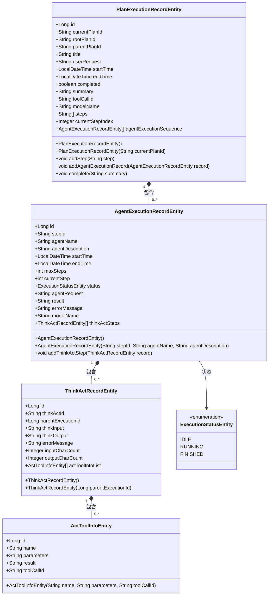
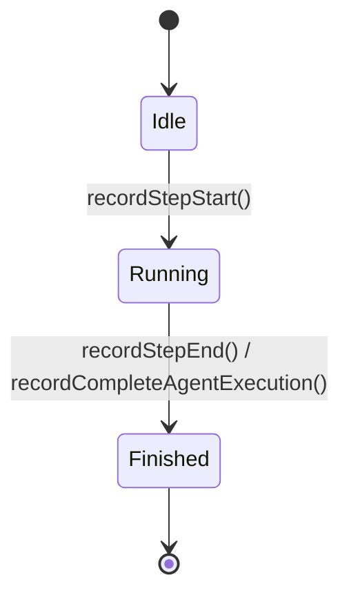
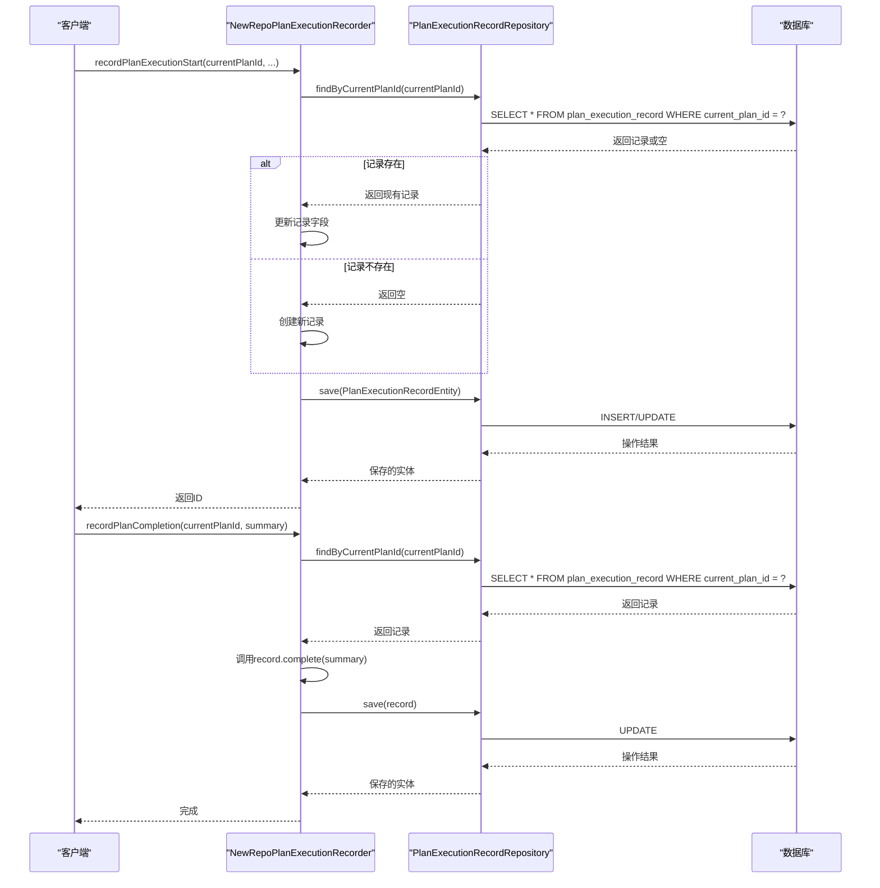

# 计划执行记录实体

<cite>
**本文档引用的文件**  
- [PlanExecutionRecordEntity.java](file://src/main/java/com/alibaba/cloud/ai/lynxe/recorder/entity/po/PlanExecutionRecordEntity.java)
- [AgentExecutionRecordEntity.java](file://src/main/java/com/alibaba/cloud/ai/lynxe/recorder/entity/po/AgentExecutionRecordEntity.java)
- [ExecutionStatusEntity.java](file://src/main/java/com/alibaba/cloud/ai/lynxe/recorder/entity/po/ExecutionStatusEntity.java)
- [PlanExecutionRecordRepository.java](file://src/main/java/com/alibaba/cloud/ai/lynxe/recorder/repository/PlanExecutionRecordRepository.java)
- [AgentExecutionRecordRepository.java](file://src/main/java/com/alibaba/cloud/ai/lynxe/recorder/repository/AgentExecutionRecordRepository.java)
- [NewRepoPlanExecutionRecorder.java](file://src/main/java/com/alibaba/cloud/ai/lynxe/recorder/service/NewRepoPlanExecutionRecorder.java)
- [ThinkActRecordEntity.java](file://src/main/java/com/alibaba/cloud/ai/lynxe/recorder/entity/po/ThinkActRecordEntity.java)
- [ActToolInfoEntity.java](file://src/main/java/com/alibaba/cloud/ai/lynxe/recorder/entity/po/ActToolInfoEntity.java)
- [PlanExecutionRecord.java](file://src/main/java/com/alibaba/cloud/ai/lynxe/recorder/entity/vo/PlanExecutionRecord.java)
- [application.yml](file://src/main/resources/application.yml)
</cite>

## 目录
1. [引言](#引言)
2. [核心字段定义](#核心字段定义)
3. [实体角色与关联关系](#实体角色与关联关系)
4. [执行生命周期与状态转换](#执行生命周期与状态转换)
5. [JPA映射与数据库设计](#jpa映射与数据库设计)
6. [持久化策略与查询模式](#持久化策略与查询模式)
7. [性能优化建议](#性能优化建议)
8. [总结](#总结)

## 引言

`PlanExecutionRecordEntity` 是系统中用于记录和追踪计划执行过程的核心实体。它作为执行记录的根实体，负责捕获计划执行的完整生命周期，包括用户输入、执行状态、时间戳以及与智能代理执行的关联。该实体在系统中扮演着关键角色，为计划的监控、调试和审计提供了数据基础。通过分析其结构、行为和与其他实体的关系，可以深入理解系统的执行流程和数据持久化机制。

**Section sources**
- [PlanExecutionRecordEntity.java](file://src/main/java/com/alibaba/cloud/ai/lynxe/recorder/entity/po/PlanExecutionRecordEntity.java)

## 核心字段定义

`PlanExecutionRecordEntity` 实体包含多个核心字段，这些字段共同描述了计划执行的各个方面。

### 基础信息字段
这些字段是实体的标识和基本信息。
- **执行ID (`id`)**: `Long` 类型，是数据库中的主键，由 `GenerationType.IDENTITY` 策略自动生成。它是记录在数据库中的唯一标识。
- **计划ID (`currentPlanId`)**: `String` 类型，标记为 `@Column(nullable = false, unique = true)`。这是计划在业务逻辑中的唯一标识符，不允许为空且必须唯一，是查询和关联的核心字段。
- **根计划ID (`rootPlanId`)**: `String` 类型，用于标识子计划所属的根计划。在主计划中为 `null`，在子计划中指向其根计划的 `currentPlanId`，用于建立计划的层次结构。
- **父计划ID (`parentPlanId`)**: `String` 类型，用于标识直接父计划。在根计划或主计划中为 `null`，在子计划中指向其直接父计划的 `currentPlanId`。
- **执行标题 (`title`)**: `String` 类型，存储计划的标题或名称，便于用户识别。
- **用户输入 (`userRequest`)**: `String` 类型，使用 `columnDefinition = "LONGTEXT"` 定义，用于存储用户发起计划时的原始请求内容。由于可能包含大量文本，使用了 `LONGTEXT` 数据类型。

### 时间与状态字段
这些字段记录了执行的时间线和最终状态。
- **开始时间 (`startTime`)**: `LocalDateTime` 类型，记录计划执行开始的时间戳。在 `PlanExecutionRecordEntity` 的构造函数中初始化为 `LocalDateTime.now()`。
- **结束时间 (`endTime`)**: `LocalDateTime` 类型，记录计划执行结束的时间戳。当计划完成时，通过 `complete()` 方法设置。
- **执行状态 (`completed`)**: `boolean` 类型，一个简单的标志位，表示计划是否已成功完成。`true` 表示完成，`false` 表示仍在进行中或失败。
- **执行摘要 (`summary`)**: `String` 类型，同样使用 `LONGTEXT`，用于存储计划执行完成后的总结性结果。

### 执行过程与关联字段
这些字段记录了计划的执行过程和与其他实体的关联。
- **步骤列表 (`steps`)**: `List<String>` 类型，使用 `@ElementCollection` 和 `@CollectionTable` 注解映射到独立的 `plan_execution_steps` 表。它存储了计划执行的步骤描述序列。
- **当前步骤索引 (`currentStepIndex`)**: `Integer` 类型，指示当前正在执行的步骤在 `steps` 列表中的索引。
- **代理执行序列 (`agentExecutionSequence`)**: `List<AgentExecutionRecordEntity>` 类型，使用 `@OneToMany` 双向关联，是 `PlanExecutionRecordEntity` 的核心关联。它维护了该计划下所有智能代理执行记录的有序列表。
- **工具调用ID (`toolCallId`)**: `String` 类型，对于由工具调用触发的子计划，此字段存储触发该计划的工具调用ID。
- **模型名称 (`modelName`)**: `String` 类型，记录实际用于执行该计划的LLM（大语言模型）的名称。

**Section sources**
- [PlanExecutionRecordEntity.java](file://src/main/java/com/alibaba/cloud/ai/lynxe/recorder/entity/po/PlanExecutionRecordEntity.java)

## 实体角色与关联关系

`PlanExecutionRecordEntity` 作为执行记录的根实体，在系统中处于核心地位，与其他执行记录实体构成了清晰的层次化关联关系。

### 作为根实体的角色
`PlanExecutionRecordEntity` 是计划执行的顶层容器。它负责：
1.  **生命周期管理**：从 `recordPlanExecutionStart` 到 `recordPlanCompletion`，完整地记录一个计划的开始、过程和结束。
2.  **数据聚合**：将用户请求、执行时间、状态、摘要等所有与该计划相关的元数据聚合在一起。
3.  **层次结构建立**：通过 `rootPlanId` 和 `parentPlanId` 字段，明确地定义了计划的父子关系，支持复杂的嵌套计划执行场景。

### 与其他执行记录实体的关联
`PlanExecutionRecordEntity` 与 `AgentExecutionRecordEntity` 存在一对多的聚合关系，而 `AgentExecutionRecordEntity` 又与 `ThinkActRecordEntity` 存在一对多关系，形成了一条清晰的执行链。

**Diagram sources**
- [PlanExecutionRecordEntity.java](file://src/main/java/com/alibaba/cloud/ai/lynxe/recorder/entity/po/PlanExecutionRecordEntity.java)
- [AgentExecutionRecordEntity.java](file://src/main/java/com/alibaba/cloud/ai/lynxe/recorder/entity/po/AgentExecutionRecordEntity.java)
- [ThinkActRecordEntity.java](file://src/main/java/com/alibaba/cloud/ai/lynxe/recorder/entity/po/ThinkActRecordEntity.java)
- [ActToolInfoEntity.java](file://src/main/java/com/alibaba/cloud/ai/lynxe/recorder/entity/po/ActToolInfoEntity.java)
- [ExecutionStatusEntity.java](file://src/main/java/com/alibaba/cloud/ai/lynxe/recorder/entity/po/ExecutionStatusEntity.java)

**Section sources**
- [PlanExecutionRecordEntity.java](file://src/main/java/com/alibaba/cloud/ai/lynxe/recorder/entity/po/PlanExecutionRecordEntity.java)
- [AgentExecutionRecordEntity.java](file://src/main/java/com/alibaba/cloud/ai/lynxe/recorder/entity/po/AgentExecutionRecordEntity.java)

## 执行生命周期与状态转换

`PlanExecutionRecordEntity` 的生命周期由 `NewRepoPlanExecutionRecorder` 服务类驱动，遵循一个清晰的流程。

### 生命周期流程
1.  **开始 (`recordPlanExecutionStart`)**: 当一个新计划启动时，调用此方法。它会创建一个新的 `PlanExecutionRecordEntity` 实例（如果不存在），设置 `currentPlanId`、`startTime`、`userRequest` 等基础信息，并将其持久化到数据库。
2.  **执行中**: 在计划执行过程中，系统会为每个执行步骤创建或更新 `AgentExecutionRecordEntity`，并将其添加到 `PlanExecutionRecordEntity` 的 `agentExecutionSequence` 列表中。`AgentExecutionRecordEntity` 的状态会从 `IDLE` 变为 `RUNNING`。
3.  **完成 (`recordPlanCompletion`)**: 当计划成功执行完毕，调用此方法。它会找到对应的 `PlanExecutionRecordEntity`，调用其 `complete()` 方法，设置 `endTime`、`completed` 为 `true` 和 `summary`，然后保存回数据库。

### 状态转换逻辑
`PlanExecutionRecordEntity` 本身的状态主要通过 `completed` 布尔值来体现，其转换是单向的：
- **初始状态**: `completed = false` (未完成)
- **完成状态**: 调用 `complete()` 方法后，`completed = true` (已完成)

其内部关联的 `AgentExecutionRecordEntity` 则有更复杂的状态机，由 `ExecutionStatusEntity` 枚举定义：
- **IDLE**: 代理已创建，但尚未开始执行。
- **RUNNING**: 代理正在执行中。
- **FINISHED**: 代理执行已结束（无论成功或失败）。

状态转换由 `recordStepStart` 和 `recordStepEnd` 等方法驱动。

**Diagram sources**
- [NewRepoPlanExecutionRecorder.java](file://src/main/java/com/alibaba/cloud/ai/lynxe/recorder/service/NewRepoPlanExecutionRecorder.java)
- [PlanExecutionRecordEntity.java](file://src/main/java/com/alibaba/cloud/ai/lynxe/recorder/entity/po/PlanExecutionRecordEntity.java)

**Section sources**
- [NewRepoPlanExecutionRecorder.java](file://src/main/java/com/alibaba/cloud/ai/lynxe/recorder/service/NewRepoPlanExecutionRecorder.java)
- [PlanExecutionRecordEntity.java](file://src/main/java/com/alibaba/cloud/ai/lynxe/recorder/entity/po/PlanExecutionRecordEntity.java)

## JPA映射与数据库设计

`PlanExecutionRecordEntity` 的JPA映射和数据库设计遵循了最佳实践，确保了数据的完整性和查询效率。

### JPA映射细节
- **实体与表**: 使用 `@Entity` 和 `@Table(name = "plan_execution_record")` 注解，将实体映射到名为 `plan_execution_record` 的数据库表。
- **主键生成**: `id` 字段使用 `@GeneratedValue(strategy = GenerationType.IDENTITY)`，依赖数据库的自增主键机制。
- **字段映射**: 大多数字段使用 `@Column` 注解进行映射。对于 `userRequest` 和 `summary` 等可能包含大量文本的字段，使用了 `columnDefinition = "LONGTEXT"` 来指定数据库列类型。
- **集合映射**: `steps` 字段使用 `@ElementCollection` 映射到一个独立的 `plan_execution_steps` 表，实现了 `PlanExecutionRecordEntity` 与 `String` 的一对多关系。
- **关联映射**: `agentExecutionSequence` 字段使用 `@OneToMany(cascade = CascadeType.ALL, fetch = FetchType.LAZY)`，表示一个 `PlanExecutionRecordEntity` 拥有多个 `AgentExecutionRecordEntity`。`cascade = CascadeType.ALL` 意味着对父实体的持久化操作（如保存、删除）会级联到子实体。`fetch = FetchType.LAZY` 表示延迟加载，只有在访问该列表时才会从数据库查询。

### 数据库表结构建议
基于JPA映射，`plan_execution_record` 表的结构建议如下：
| 列名 | 数据类型 | 约束 | 说明 |
| :--- | :--- | :--- | :--- |
| `id` | BIGINT | PRIMARY KEY, AUTO_INCREMENT | 主键 |
| `current_plan_id` | VARCHAR(255) | NOT NULL, UNIQUE | 计划ID |
| `root_plan_id` | VARCHAR(255) | | 根计划ID |
| `parent_plan_id` | VARCHAR(255) | | 父计划ID |
| `tool_call_id` | VARCHAR(255) | | 触发工具调用ID |
| `title` | VARCHAR(255) | | 计划标题 |
| `user_request` | LONGTEXT | | 用户原始请求 |
| `start_time` | DATETIME | | 开始时间 |
| `end_time` | DATETIME | | 结束时间 |
| `current_step_index` | INTEGER | | 当前步骤索引 |
| `completed` | BOOLEAN | | 是否完成 |
| `summary` | LONGTEXT | | 执行摘要 |
| `model_name` | VARCHAR(255) | | 模型名称 |

**Section sources**
- [PlanExecutionRecordEntity.java](file://src/main/java/com/alibaba/cloud/ai/lynxe/recorder/entity/po/PlanExecutionRecordEntity.java)

## 持久化策略与查询模式

`PlanExecutionRecordEntity` 的持久化和查询由 `PlanExecutionRecordRepository` 和 `NewRepoPlanExecutionRecorder` 服务协同完成。

### 持久化策略
持久化操作主要在 `NewRepoPlanExecutionRecorder` 类中实现，采用事务性操作以保证数据一致性。
- **创建/更新**: `recordPlanExecutionStart` 方法首先尝试通过 `findByCurrentPlanId` 查找现有记录，如果存在则更新，否则创建新记录。整个操作在 `@Transactional` 注解的保护下进行。
- **完成**: `recordPlanCompletion` 方法通过 `findByCurrentPlanId` 找到记录，调用其 `complete()` 方法，然后调用 `save()` 进行更新。
- **删除**: `PlanExecutionRecordRepository` 提供了 `deleteByCurrentPlanId` 方法，支持按计划ID删除记录。

### 查询模式
`PlanExecutionRecordRepository` 定义了多种查询方法，满足不同的业务需求：
- **按计划ID查询**: `findByCurrentPlanId(String currentPlanId)` 是最常用的查询，用于获取单个计划的完整执行记录。
- **按父计划ID查询**: `findByParentPlanId(String parentPlanId)` 用于获取某个父计划下的所有子计划执行记录，支持计划层次结构的遍历。
- **按根计划ID查询**: `findByRootPlanId(String rootPlanId)` 用于获取某个根计划下的所有执行记录（包括自身和所有子计划），用于全局分析。
- **存在性检查**: `existsByCurrentPlanId(String currentPlanId)` 用于快速判断某个计划ID的记录是否存在，避免重复创建。

**Diagram sources**
- [NewRepoPlanExecutionRecorder.java](file://src/main/java/com/alibaba/cloud/ai/lynxe/recorder/service/NewRepoPlanExecutionRecorder.java)
- [PlanExecutionRecordRepository.java](file://src/main/java/com/alibaba/cloud/ai/lynxe/recorder/repository/PlanExecutionRecordRepository.java)

**Section sources**
- [NewRepoPlanExecutionRecorder.java](file://src/main/java/com/alibaba/cloud/ai/lynxe/recorder/service/NewRepoPlanExecutionRecorder.java)
- [PlanExecutionRecordRepository.java](file://src/main/java/com/alibaba/cloud/ai/lynxe/recorder/repository/PlanExecutionRecordRepository.java)

## 性能优化建议

为了确保 `PlanExecutionRecordEntity` 在高并发和大数据量场景下的性能，可以采取以下优化措施。

### 索引优化方案
数据库索引是提升查询性能的关键。
- **唯一索引**: `current_plan_id` 字段上的 `UNIQUE` 约束已经是一个高效的索引，确保了按ID查询的 `O(1)` 复杂度。
- **普通索引**: 建议为 `parent_plan_id` 和 `root_plan_id` 字段创建普通索引，以加速 `findByParentPlanId` 和 `findByRootPlanId` 的查询。
- **复合索引**: 如果存在按状态和时间范围查询的场景（如“查找过去一小时所有未完成的计划”），可以考虑创建 `(completed, start_time)` 的复合索引。

### 性能调优建议
- **延迟加载**: `agentExecutionSequence` 使用 `FetchType.LAZY` 是正确的选择。在不需要代理执行详情的场景（如计划列表页），避免加载庞大的关联数据，减少数据库I/O。
- **分页查询**: 对于 `findByParentPlanId` 和 `findByRootPlanId` 这类可能返回大量结果的查询，应在服务层实现分页，避免一次性加载过多数据导致内存溢出。
- **缓存策略**: 对于频繁读取但不常变更的计划记录（如已完成的计划），可以引入Redis等缓存机制，将查询压力从数据库转移到内存。
- **批量操作**: 在需要处理大量计划记录时，考虑使用JPA的批量操作API，减少数据库交互次数。

**Section sources**
- [PlanExecutionRecordEntity.java](file://src/main/java/com/alibaba/cloud/ai/lynxe/recorder/entity/po/PlanExecutionRecordEntity.java)
- [PlanExecutionRecordRepository.java](file://src/main/java/com/alibaba/cloud/ai/lynxe/recorder/repository/PlanExecutionRecordRepository.java)

## 总结

`PlanExecutionRecordEntity` 是一个设计精良的根实体，它通过清晰的字段定义、合理的JPA映射和有效的关联关系，完整地记录了计划的执行过程。其与 `AgentExecutionRecordEntity` 等实体的层次化结构，能够很好地支持复杂的AI代理执行流程。通过 `NewRepoPlanExecutionRecorder` 服务实现的事务性持久化和 `PlanExecutionRecordRepository` 提供的多样化查询，确保了数据的一致性和可访问性。结合适当的索引和性能优化策略，该实体能够高效地支撑系统的监控、分析和审计需求。