# 执行过程记录机制

<cite>
**本文档引用的文件**   
- [PlanExecutionRecorder.java](file://src/main/java/com/alibaba/cloud/ai/lynxe/recorder/service/PlanExecutionRecorder.java)
- [NewRepoPlanExecutionRecorder.java](file://src/main/java/com/alibaba/cloud/ai/lynxe/recorder/service/NewRepoPlanExecutionRecorder.java)
- [PlanExecutionRecordRepository.java](file://src/main/java/com/alibaba/cloud/ai/lynxe/recorder/repository/PlanExecutionRecordRepository.java)
- [PlanExecutionRecordEntity.java](file://src/main/java/com/alibaba/cloud/ai/lynxe/recorder/entity/po/PlanExecutionRecordEntity.java)
- [AgentExecutionRecordEntity.java](file://src/main/java/com/alibaba/cloud/ai/lynxe/recorder/entity/po/AgentExecutionRecordEntity.java)
- [ThinkActRecordEntity.java](file://src/main/java/com/alibaba/cloud/ai/lynxe/recorder/entity/po/ThinkActRecordEntity.java)
- [ActToolInfoEntity.java](file://src/main/java/com/alibaba/cloud/ai/lynxe/recorder/entity/po/ActToolInfoEntity.java)
- [LynxeEventPublisher.java](file://src/main/java/com/alibaba/cloud/ai/lynxe/event/LynxeEventPublisher.java)
</cite>

## 目录
1. [引言](#引言)
2. [核心组件分析](#核心组件分析)
3. [执行记录服务实现机制](#执行记录服务实现机制)
4. [新存储库支持与事务管理](#新存储库支持与事务管理)
5. [数据访问模式与查询优化](#数据访问模式与查询优化)
6. [执行记录生命周期管理](#执行记录生命周期管理)
7. [服务调用时序图](#服务调用时序图)
8. [事件发布与记录服务集成](#事件发布与记录服务集成)

## 引言
执行过程记录机制是JManus系统中的关键组件，负责捕获和持久化计划执行的完整生命周期。该机制通过PlanExecutionRecorder服务实现，能够记录计划的开始、中间步骤和完成事件，并将这些事件以结构化的方式存储到数据库中。本技术文档深入解析该机制的实现细节，包括服务接口设计、数据模型、事务管理策略以及与事件系统的集成方式。

## 核心组件分析

**执行记录核心组件关系**

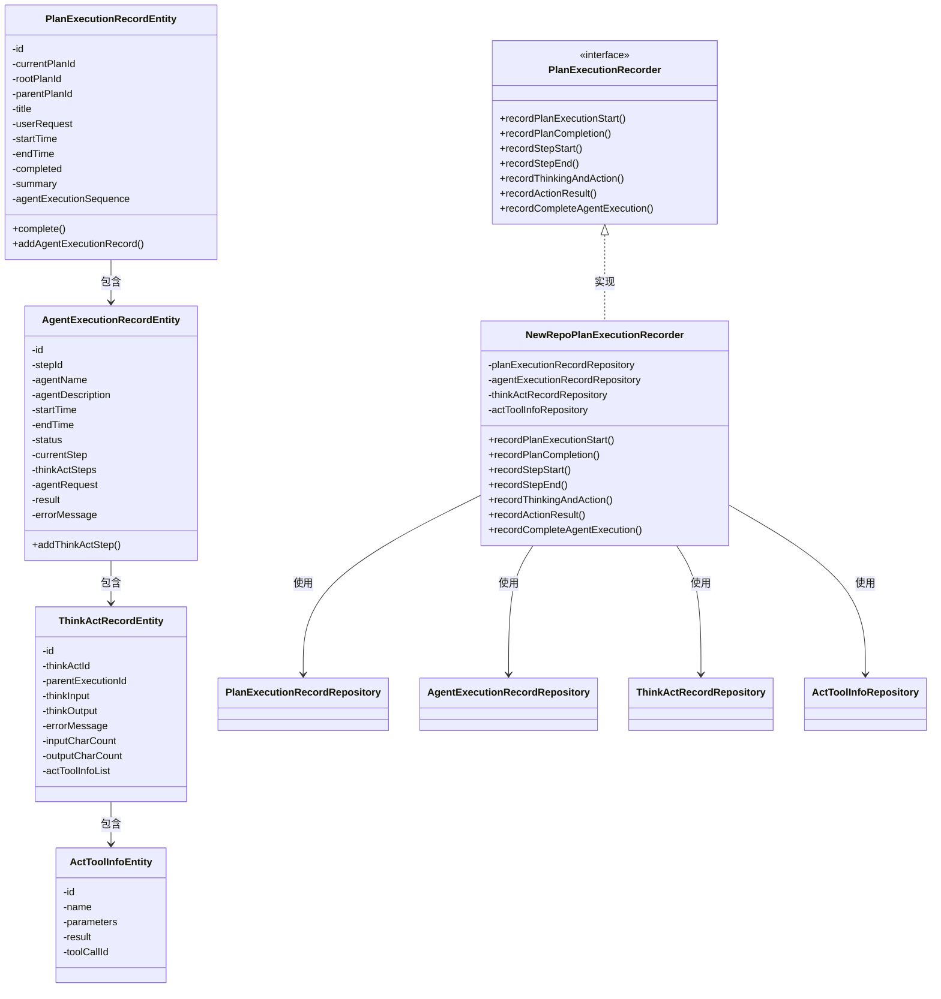

**图示来源**
- [PlanExecutionRecorder.java](file://src/main/java/com/alibaba/cloud/ai/lynxe/recorder/service/PlanExecutionRecorder.java)
- [NewRepoPlanExecutionRecorder.java](file://src/main/java/com/alibaba/cloud/ai/lynxe/recorder/service/NewRepoPlanExecutionRecorder.java)
- [PlanExecutionRecordEntity.java](file://src/main/java/com/alibaba/cloud/ai/lynxe/recorder/entity/po/PlanExecutionRecordEntity.java)
- [AgentExecutionRecordEntity.java](file://src/main/java/com/alibaba/cloud/ai/lynxe/recorder/entity/po/AgentExecutionRecordEntity.java)
- [ThinkActRecordEntity.java](file://src/main/java/com/alibaba/cloud/ai/lynxe/recorder/entity/po/ThinkActRecordEntity.java)
- [ActToolInfoEntity.java](file://src/main/java/com/alibaba/cloud/ai/lynxe/recorder/entity/po/ActToolInfoEntity.java)

**核心组件关系说明**
执行过程记录机制由多个核心组件构成，形成了一个层次化的数据记录体系。`PlanExecutionRecorder`接口定义了所有执行记录操作的契约，`NewRepoPlanExecutionRecorder`是其具体实现。数据模型采用嵌套结构：`PlanExecutionRecordEntity`记录整个计划的执行信息，包含多个`AgentExecutionRecordEntity`实例，每个代理执行记录又包含多个`ThinkActRecordEntity`实例，而每个思考-行动记录可以关联多个`ActToolInfoEntity`工具调用信息。

## 执行记录服务实现机制

执行记录服务通过`PlanExecutionRecorder`接口提供统一的API，实现了对计划执行全过程的精细化记录。服务能够捕获计划的开始、中间步骤和完成事件，并将这些事件持久化到数据库。

**计划执行开始记录**

当计划开始执行时，`recordPlanExecutionStart`方法被调用，创建或更新`PlanExecutionRecordEntity`实例。该方法接收当前计划ID、标题、用户请求、执行步骤列表以及层次信息（父计划ID、根计划ID、工具调用ID）。

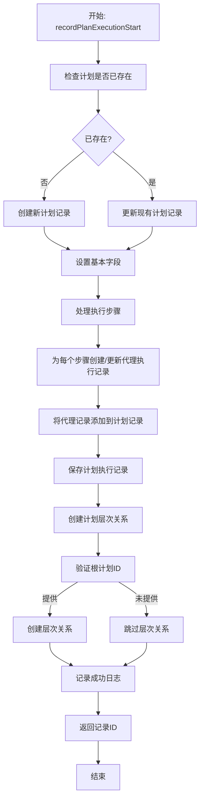

**图示来源**
- [NewRepoPlanExecutionRecorder.java](file://src/main/java/com/alibaba/cloud/ai/lynxe/recorder/service/NewRepoPlanExecutionRecorder.java#L75-L156)

**步骤执行记录**

服务提供了`recordStepStart`和`recordStepEnd`方法来记录每个执行步骤的开始和结束。这些方法通过步骤ID查找对应的`AgentExecutionRecordEntity`，并更新其状态和时间戳。

**思考-行动过程记录**

`recordThinkingAndAction`方法用于记录代理的思考过程，创建`ThinkActRecordEntity`实例并关联到相应的代理执行记录。`recordActionResult`方法则用于记录行动结果，更新`ActToolInfoEntity`中的结果信息。

**完整代理执行记录**

`recordCompleteAgentExecution`方法在代理执行完成后被调用，更新代理执行记录的最终状态、结果和错误信息。

**执行记录服务接口**

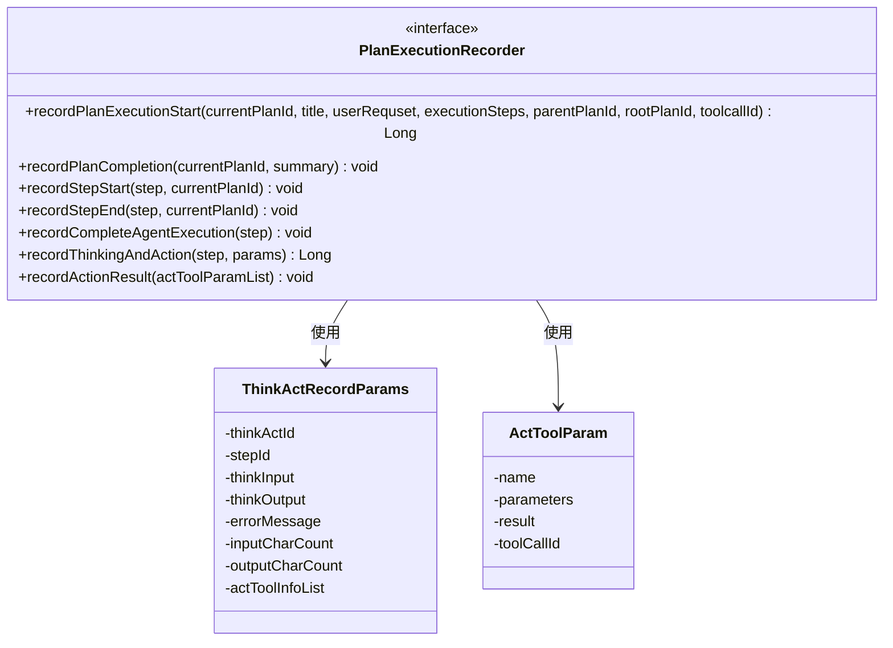

**图示来源**
- [PlanExecutionRecorder.java](file://src/main/java/com/alibaba/cloud/ai/lynxe/recorder/service/PlanExecutionRecorder.java)

**执行记录服务实现**

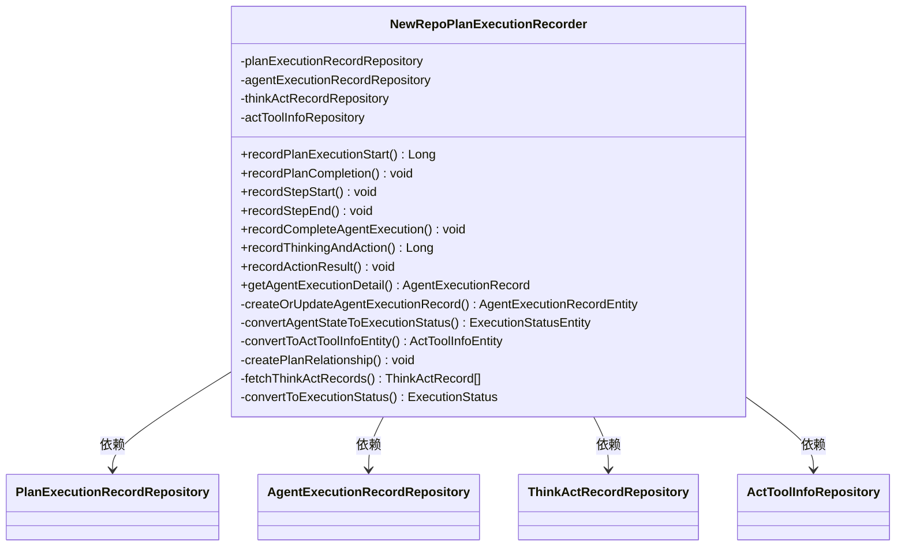

**图示来源**
- [NewRepoPlanExecutionRecorder.java](file://src/main/java/com/alibaba/cloud/ai/lynxe/recorder/service/NewRepoPlanExecutionRecorder.java)

## 新存储库支持与事务管理

`NewRepoPlanExecutionRecorder`服务实现了对新存储库的全面支持，并采用了Spring的声明式事务管理策略来确保数据一致性。

**事务管理策略**

服务中的关键方法使用`@Transactional`注解来确保操作的原子性。例如，`recordPlanExecutionStart`和`recordThinkingAndAction`方法都标记为事务性方法，确保在发生异常时能够回滚所有数据库操作。

**层次关系创建**

`createPlanRelationship`私有方法负责建立计划之间的层次结构，包含严格的验证规则：
1. `currentPlanId`和`rootPlanId`是必需的
2. 如果提供了`parentPlanId`，则必须同时提供`toolcallId`
3. 如果提供了`parentPlanId`，则`rootPlanId`不能与`currentPlanId`相同

**新存储库支持特性**

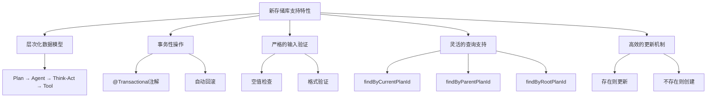

**图示来源**
- [NewRepoPlanExecutionRecorder.java](file://src/main/java/com/alibaba/cloud/ai/lynxe/recorder/service/NewRepoPlanExecutionRecorder.java#L782-L857)

**事务管理实现**

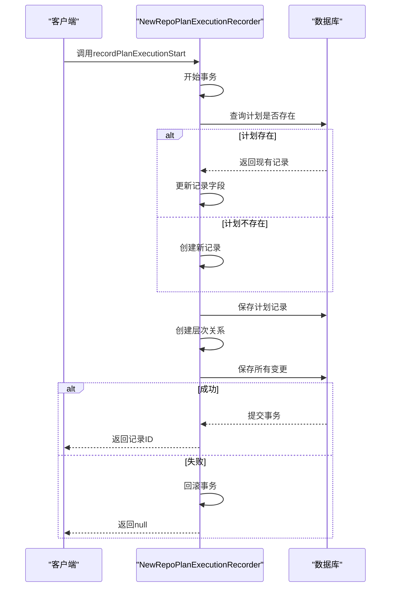

**图示来源**
- [NewRepoPlanExecutionRecorder.java](file://src/main/java/com/alibaba/cloud/ai/lynxe/recorder/service/NewRepoPlanExecutionRecorder.java#L75-L156)

## 数据访问模式与查询优化

执行记录机制采用了JPA Repository模式进行数据访问，并通过精心设计的实体关系和查询方法实现高效的数据库操作。

**数据访问模式**

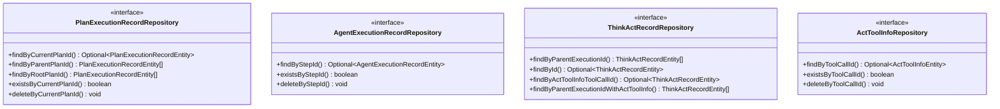

**图示来源**
- [PlanExecutionRecordRepository.java](file://src/main/java/com/alibaba/cloud/ai/lynxe/recorder/repository/PlanExecutionRecordRepository.java)
- [AgentExecutionRecordRepository.java](file://src/main/java/com/alibaba/cloud/ai/lynxe/recorder/repository/AgentExecutionRecordRepository.java)
- [ThinkActRecordRepository.java](file://src/main/java/com/alibaba/cloud/ai/lynxe/recorder/repository/ThinkActRecordRepository.java)
- [ActToolInfoRepository.java](file://src/main/java/com/alibaba/cloud/ai/lynxe/recorder/repository/ActToolInfoRepository.java)

**实体关系映射**

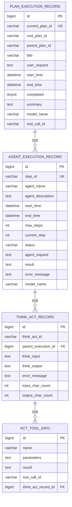

**图示来源**
- [PlanExecutionRecordEntity.java](file://src/main/java/com/alibaba/cloud/ai/lynxe/recorder/entity/po/PlanExecutionRecordEntity.java)
- [AgentExecutionRecordEntity.java](file://src/main/java/com/alibaba/cloud/ai/lynxe/recorder/entity/po/AgentExecutionRecordEntity.java)
- [ThinkActRecordEntity.java](file://src/main/java/com/alibaba/cloud/ai/lynxe/recorder/entity/po/ThinkActRecordEntity.java)
- [ActToolInfoEntity.java](file://src/main/java/com/alibaba/cloud/ai/lynxe/recorder/entity/po/ActToolInfoEntity.java)

**查询优化方法**

1. **索引优化**：在`AgentExecutionRecordEntity`的`step_id`字段上创建了唯一索引，确保快速查找。
2. **关联查询优化**：`ThinkActRecordRepository`提供了`findByParentExecutionIdWithActToolInfo`方法，使用`LEFT JOIN FETCH`一次性加载思考-行动记录及其关联的工具信息，避免N+1查询问题。
3. **存在性检查**：提供了`existsByXxx`方法，用于快速检查记录是否存在，避免不必要的对象加载。
4. **批量操作**：支持通过ID列表进行批量删除操作，提高清理效率。

## 执行记录生命周期管理

执行记录的生命周期管理涵盖了数据的写入、更新和最终状态固化过程，确保了执行过程的完整性和一致性。

**执行记录生命周期**

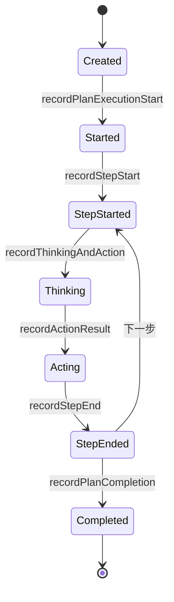

**图示来源**
- [NewRepoPlanExecutionRecorder.java](file://src/main/java/com/alibaba/cloud/ai/lynxe/recorder/service/NewRepoPlanExecutionRecorder.java)

**数据写入流程**

1. **计划创建**：调用`recordPlanExecutionStart`方法，创建`PlanExecutionRecordEntity`实例
2. **步骤开始**：调用`recordStepStart`方法，创建或更新`AgentExecutionRecordEntity`实例
3. **思考过程**：调用`recordThinkingAndAction`方法，创建`ThinkActRecordEntity`实例
4. **行动结果**：调用`recordActionResult`方法，更新`ActToolInfoEntity`实例
5. **步骤结束**：调用`recordStepEnd`方法，更新`AgentExecutionRecordEntity`状态
6. **计划完成**：调用`recordPlanCompletion`方法，固化`PlanExecutionRecordEntity`状态

**数据更新机制**

服务采用了"存在则更新，不存在则创建"的策略：
- 对于计划记录，通过`currentPlanId`查找，存在则更新，不存在则创建
- 对于代理执行记录，通过`stepId`查找，存在则更新，不存在则创建
- 对于工具调用信息，通过`toolCallId`查找，存在则更新，不存在则创建

**最终状态固化**

当计划完成时，`recordPlanCompletion`方法被调用，执行以下操作：
1. 通过`currentPlanId`查找计划执行记录
2. 调用实体的`complete`方法，设置结束时间、完成标志和摘要
3. 保存更新后的记录

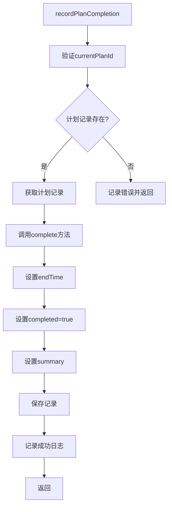

**图示来源**
- [NewRepoPlanExecutionRecorder.java](file://src/main/java/com/alibaba/cloud/ai/lynxe/recorder/service/NewRepoPlanExecutionRecorder.java#L607-L645)
- [PlanExecutionRecordEntity.java](file://src/main/java/com/alibaba/cloud/ai/lynxe/recorder/entity/po/PlanExecutionRecordEntity.java#L162-L166)

## 服务调用时序图

以下时序图展示了执行记录服务的关键方法调用流程。

**计划执行开始时序图**

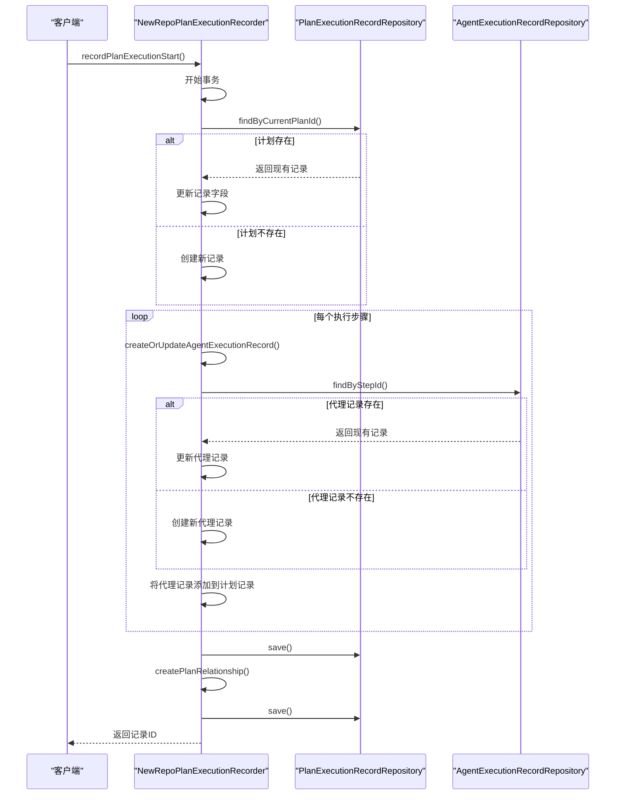

**图示来源**
- [NewRepoPlanExecutionRecorder.java](file://src/main/java/com/alibaba/cloud/ai/lynxe/recorder/service/NewRepoPlanExecutionRecorder.java#L75-L156)

**思考-行动记录时序图**

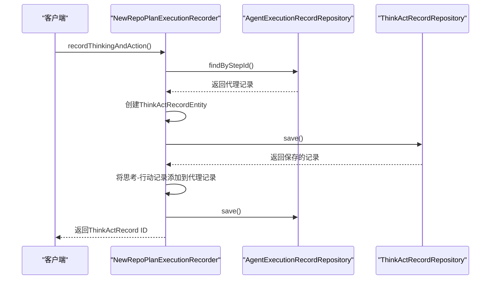

**图示来源**
- [NewRepoPlanExecutionRecorder.java](file://src/main/java/com/alibaba/cloud/ai/lynxe/recorder/service/NewRepoPlanExecutionRecorder.java#L389-L449)

**行动结果记录时序图**

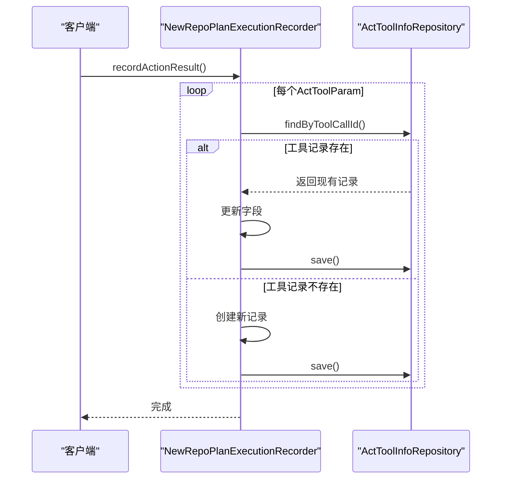

**图示来源**
- [NewRepoPlanExecutionRecorder.java](file://src/main/java/com/alibaba/cloud/ai/lynxe/recorder/service/NewRepoPlanExecutionRecorder.java#L453-L520)

## 事件发布与记录服务集成

执行记录服务与系统的事件机制紧密集成，通过事件驱动的方式捕获执行过程中的关键事件。

**事件发布机制**

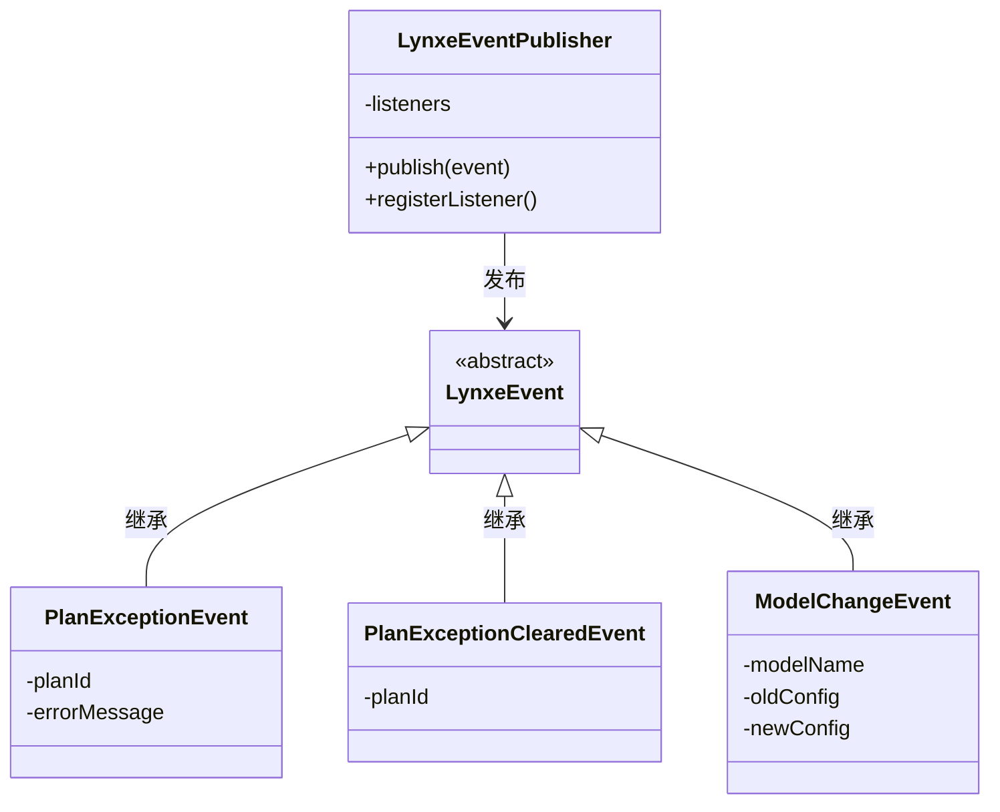

**图示来源**
- [LynxeEventPublisher.java](file://src/main/java/com/alibaba/cloud/ai/lynxe/event/LynxeEventPublisher.java)
- [LynxeEvent.java](file://src/main/java/com/alibaba/cloud/ai/lynxe/event/LynxeEvent.java)

**事件与记录服务集成**

虽然当前代码中没有直接显示事件监听器与执行记录服务的集成，但系统设计支持通过事件驱动的方式来触发记录操作。例如，可以创建一个`LynxeListener`来监听`PlanExceptionEvent`，并在异常发生时调用`recordCompleteAgentExecution`方法记录错误信息。

**集成方式建议**

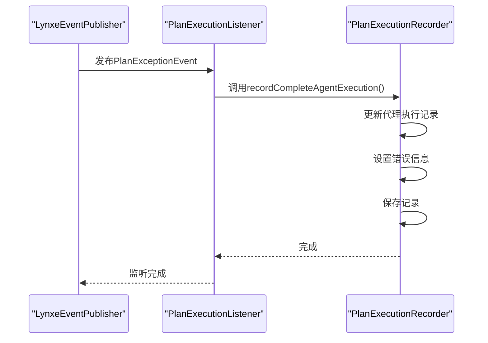

**图示来源**
- [LynxeEventPublisher.java](file://src/main/java/com/alibaba/cloud/ai/lynxe/event/LynxeEventPublisher.java)
- [PlanExecutionRecorder.java](file://src/main/java/com/alibaba/cloud/ai/lynxe/recorder/service/PlanExecutionRecorder.java)

**事件集成优势**

1. **解耦**：事件机制实现了执行逻辑与记录逻辑的解耦，使系统更加灵活和可扩展。
2. **响应性**：通过事件驱动，可以实时响应执行过程中的各种状态变化。
3. **可扩展性**：可以轻松添加新的监听器来处理不同的事件类型，而无需修改核心执行逻辑。
4. **可靠性**：事件发布具有错误处理机制，确保即使某个监听器失败，也不会影响其他监听器的执行。

**执行记录服务与事件系统集成点**

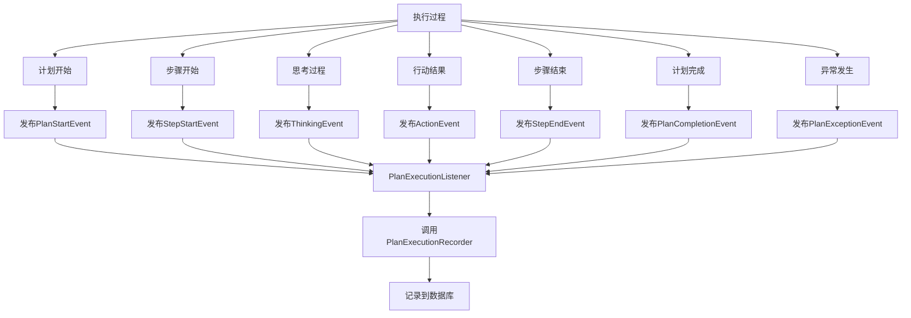

**图示来源**
- [LynxeEventPublisher.java](file://src/main/java/com/alibaba/cloud/ai/lynxe/event/LynxeEventPublisher.java)
- [PlanExecutionRecorder.java](file://src/main/java/com/alibaba/cloud/ai/lynxe/recorder/service/PlanExecutionRecorder.java)