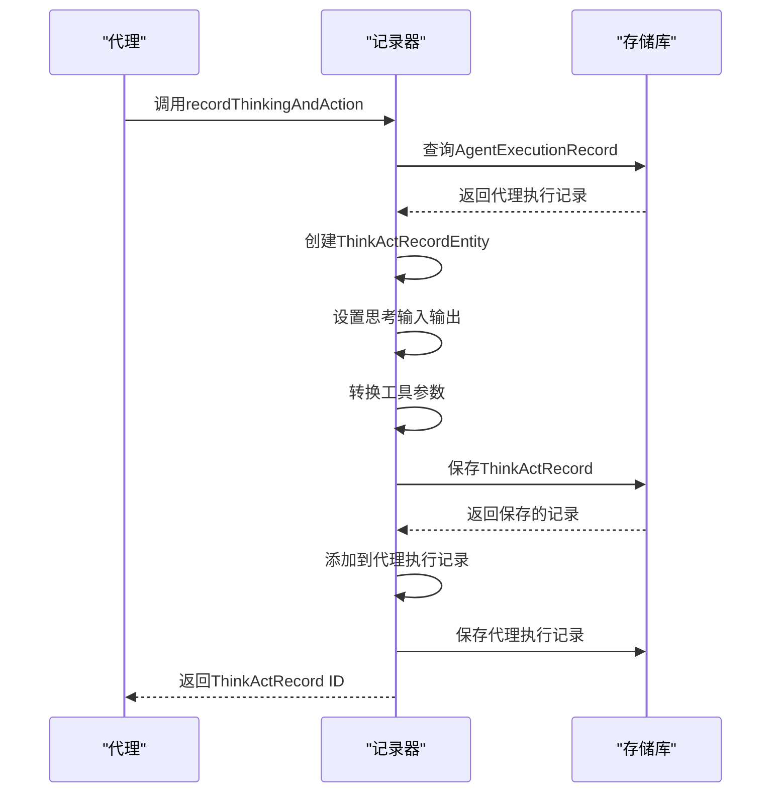
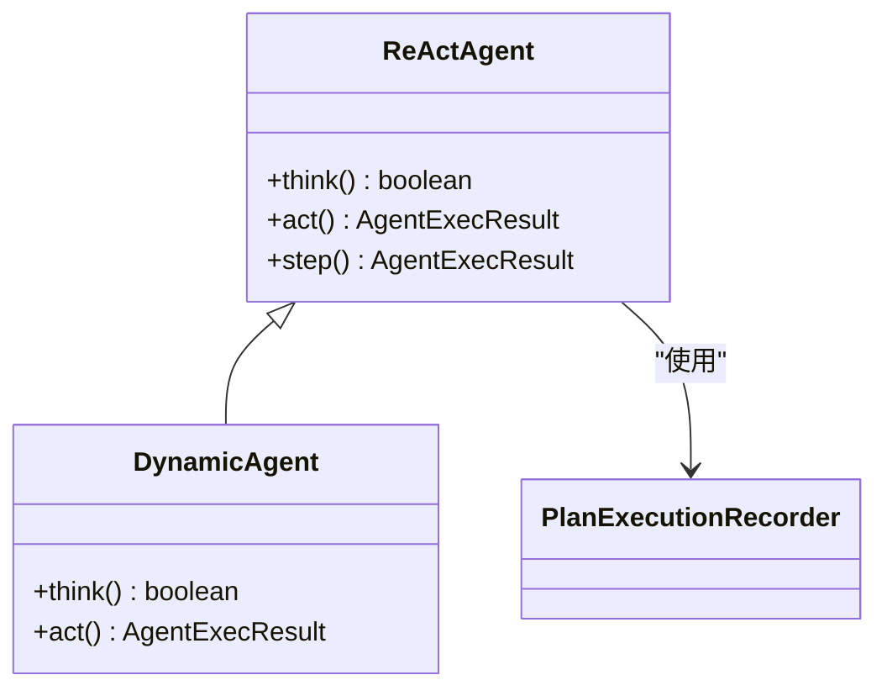
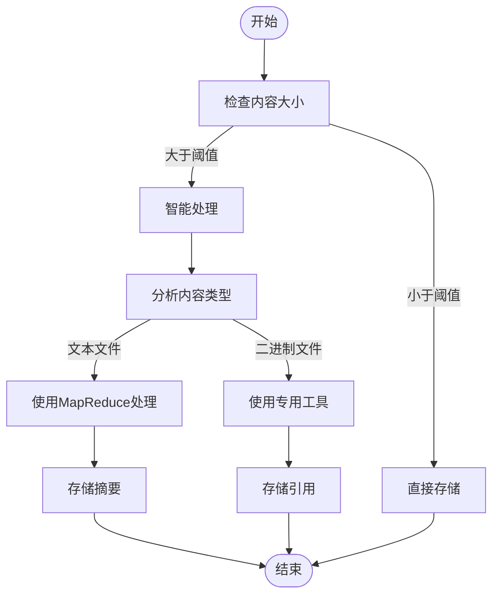

# 思考与动作记录

<cite>
**本文档引用的文件**   
- [ThinkActRecordEntity.java](file://src/main/java/com/alibaba/cloud/ai/lynxe/recorder/entity/po/ThinkActRecordEntity.java)
- [PlanExecutionRecorder.java](file://src/main/java/com/alibaba/cloud/ai/lynxe/recorder/service/PlanExecutionRecorder.java)
- [NewRepoPlanExecutionRecorder.java](file://src/main/java/com/alibaba/cloud/ai/lynxe/recorder/service/NewRepoPlanExecutionRecorder.java)
- [ReActAgent.java](file://src/main/java/com/alibaba/cloud/ai/lynxe/agent/ReActAgent.java)
- [LlmTraceRecorder.java](file://src/main/java/com/alibaba/cloud/ai/lynxe/llm/LlmTraceRecorder.java)
- [ActToolInfoEntity.java](file://src/main/java/com/alibaba/cloud/ai/lynxe/recorder/entity/po/ActToolInfoEntity.java)
</cite>

## 目录
1. [引言](#引言)
2. [核心组件](#核心组件)
3. [recordThinkingAndAction方法实现](#recordthinkingandaction方法实现)
4. [ReAct代理模式支持](#react代理模式支持)
5. [大文本存储优化](#大文本存储优化)
6. [敏感信息脱敏](#敏感信息脱敏)
7. [性能优化建议](#性能优化建议)
8. [结论](#结论)

## 引言
本文档详细描述了JManus系统中思考与动作记录功能的技术实现。该功能是ReAct代理模式的核心组成部分，用于跟踪代理在执行过程中的思考和行动轨迹。通过详细记录LLM推理内容、工具调用参数和执行结果，系统能够完整地重现代理的决策过程，为调试、分析和优化提供重要支持。

## 核心组件

思考与动作记录功能由多个核心组件构成，这些组件协同工作以实现完整的记录功能。主要组件包括ThinkActRecordEntity实体类、PlanExecutionRecorder服务接口以及NewRepoPlanExecutionRecorder实现类。

ThinkActRecordEntity是记录思考与动作过程的核心实体，它包含了思考阶段的输入输出内容、行动阶段的工具调用信息以及执行状态等关键数据。该实体作为AgentExecutionRecordEntity的子步骤存在，专注于记录思考和行动阶段的处理消息。

PlanExecutionRecorder是计划执行记录器接口，定义了记录和检索计划执行详情的方法。该接口提供了recordThinkingAndAction和recordActionResult等关键方法，实现了对思考和行动过程的记录。

**Section sources**
- [ThinkActRecordEntity.java](file://src/main/java/com/alibaba/cloud/ai/lynxe/recorder/entity/po/ThinkActRecordEntity.java#L31-L117)
- [PlanExecutionRecorder.java](file://src/main/java/com/alibaba/cloud/ai/lynxe/recorder/service/PlanExecutionRecorder.java#L26-L241)

## recordThinkingAndAction方法实现

recordThinkingAndAction方法是思考与动作记录功能的核心实现，负责创建ThinkActRecordEntity实体并记录思考过程。该方法的实现流程如下：

首先，方法接收ExecutionStep和ThinkActRecordParams参数，验证输入参数的有效性。如果ExecutionStep、stepId或ThinkActRecordParams为null，则记录警告并返回null。

**Diagram sources**
- [NewRepoPlanExecutionRecorder.java](file://src/main/java/com/alibaba/cloud/ai/lynxe/recorder/service/NewRepoPlanExecutionRecorder.java#L390-L449)

接着，通过agentExecutionRecordRepository.findByStepId方法查询与当前步骤关联的代理执行记录。如果未找到对应的代理执行记录，则记录错误并返回null。

创建新的ThinkActRecordEntity实例，并设置其父执行ID、思考ID、思考输入、思考输出、错误消息、输入字符数和输出字符数等属性。对于工具调用信息，将ThinkActRecordParams中的ActToolParam列表转换为ActToolInfoEntity实体列表，并设置到ThinkActRecordEntity中。

最后，通过thinkActRecordRepository.save方法保存ThinkActRecordEntity，并将其添加到代理执行记录的思考-行动步骤列表中，再保存代理执行记录。整个过程在事务中执行，确保数据的一致性。

**Section sources**
- [NewRepoPlanExecutionRecorder.java](file://src/main/java/com/alibaba/cloud/ai/lynxe/recorder/service/NewRepoPlanExecutionRecorder.java#L390-L449)

## ReAct代理模式支持

思考与动作记录功能为ReAct（Reasoning + Acting）代理模式提供了完整的支持。ReActAgent作为ReAct模式的基类，实现了思考和行动的交替执行机制。

**Diagram sources**
- [ReActAgent.java](file://src/main/java/com/alibaba/cloud/ai/lynxe/agent/ReActAgent.java#L30-L96)

ReActAgent的step方法实现了完整的思考-行动循环。首先调用抽象方法think()进行逻辑推理，决定是否需要执行行动。如果不需要行动，则返回"思考完成-无需行动"的结果；否则调用抽象方法act()执行具体操作。

在think()方法执行过程中，系统通过LlmTraceRecorder记录LLM的请求和响应，包括输入字符数和输出字符数。这些信息通过recordThinkingAndAction方法记录到ThinkActRecordEntity中，形成完整的思考过程记录。

当act()方法执行工具调用时，系统通过recordActionResult方法记录行动结果。该方法接收ActToolParam列表，根据toolCallId查找或创建ActToolInfoEntity，并更新其名称、参数和结果等信息。

**Section sources**
- [ReActAgent.java](file://src/main/java/com/alibaba/cloud/ai/lynxe/agent/ReActAgent.java#L58-L96)
- [NewRepoPlanExecutionRecorder.java](file://src/main/java/com/alibaba/cloud/ai/lynxe/recorder/service/NewRepoPlanExecutionRecorder.java#L453-L520)

## 大文本存储优化

针对大文本内容的存储，系统采用了多种优化策略。在数据库层面，ThinkActRecordEntity的thinkInput、thinkOutput和errorMessage字段均使用LONGTEXT类型定义，能够存储大容量的文本数据。

**Diagram sources**
- [ThinkActRecordEntity.java](file://src/main/java/com/alibaba/cloud/ai/lynxe/recorder/entity/po/ThinkActRecordEntity.java#L71-L80)
- [SmartContentSavingService.java](file://src/main/java/com/alibaba/cloud/ai/lynxe/tool/innerStorage/SmartContentSavingService.java#L79-L94)

对于特别大的文件处理，系统提供了专门的优化策略。当文件大小超过50MB时，系统建议使用extract_relevant_content工具进行MapReduce处理；对于5-50MB的中等文件，可以使用常规工具或extract_relevant_content；小于5MB的小文件则可以直接处理。

在Excel处理方面，系统实现了并行批处理机制。通过processExcelInParallelBatches方法，使用生产者-消费者模式的优化流式方法，单线程读取器和固定线程池处理器实现并行处理，显著提高了大文件处理性能。

**Section sources**
- [ThinkActRecordEntity.java](file://src/main/java/com/alibaba/cloud/ai/lynxe/recorder/entity/po/ThinkActRecordEntity.java#L71-L80)
- [ExcelProcessingService.java](file://src/main/java/com/alibaba/cloud/ai/lynxe/tool/excelProcessor/ExcelProcessingService.java#L510-L518)

## 敏感信息脱敏

系统通过LlmTraceRecorder组件实现了敏感信息的脱敏处理。该组件负责记录LLM请求和响应的跟踪信息，同时确保敏感数据不会被不当暴露。

LlmTraceRecorder在记录请求时，会计算输入字符数但不会直接记录完整的请求内容。对于包含媒体内容的消息，系统会跳过字符计数，避免处理可能包含敏感信息的非文本内容。

在错误处理方面，系统区分了不同类型的异常。对于WebClientResponseException，只记录状态码和错误消息，而不记录完整的响应体内容，防止敏感信息泄露。对于其他异常，只记录错误消息而不记录完整的堆栈跟踪。

系统还实现了异步持久化策略，通过CompletableFuture实现非阻塞执行，防止线程池耗尽。ParallelExecutionTool的applyAsync方法是主要的异步实现，确保了系统的响应性和稳定性。

**Section sources**
- [LlmTraceRecorder.java](file://src/main/java/com/alibaba/cloud/ai/lynxe/llm/LlmTraceRecorder.java#L56-L121)
- [ParallelExecutionTool.java](file://src/main/java/com/alibaba/cloud/ai/lynxe/tool/mapreduce/ParallelExecutionTool.java#L216-L245)

## 性能优化建议

为提高思考与动作记录功能的性能，建议采用以下优化策略：

1. **批量写入**：对于大量数据的写入操作，建议使用批量处理机制。如JdbcChatMemoryRepository中的saveAll方法，通过batchUpdate实现批量插入，显著减少数据库交互次数。

2. **异步持久化**：对于非关键路径的记录操作，建议采用异步持久化策略。通过CompletableFuture实现非阻塞执行，避免阻塞主线程，提高系统响应性。

3. **懒加载优化**：在实体关系映射中，合理使用懒加载策略。如ThinkActRecordEntity中的actToolInfoList使用FetchType.LAZY，避免不必要的关联数据加载。

4. **缓存机制**：对于频繁访问但不经常变更的数据，建议引入缓存机制。通过减少数据库查询次数来提高访问性能。

5. **索引优化**：在数据库表的关键查询字段上创建适当索引，如think_act_record表的parent_execution_id字段，提高查询效率。

**Section sources**
- [JdbcChatMemoryRepository.java](file://src/main/java/com/alibaba/cloud/ai/lynxe/workspace/conversation/repository/JdbcChatMemoryRepository.java#L91-L96)
- [ParallelExecutionTool.java](file://src/main/java/com/alibaba/cloud/ai/lynxe/tool/mapreduce/ParallelExecutionTool.java#L216-L245)
- [ThinkActRecordEntity.java](file://src/main/java/com/alibaba/cloud/ai/lynxe/recorder/entity/po/ThinkActRecordEntity.java#L92-L94)

## 结论
思考与动作记录功能为JManus系统的ReAct代理模式提供了强大的支持。通过完善的实体设计、清晰的接口定义和高效的实现机制，系统能够完整、准确地记录代理的思考和行动过程。结合大文本存储优化、敏感信息脱敏和性能优化策略，该功能在保证功能完整性的同时，也具备了良好的性能和安全性。