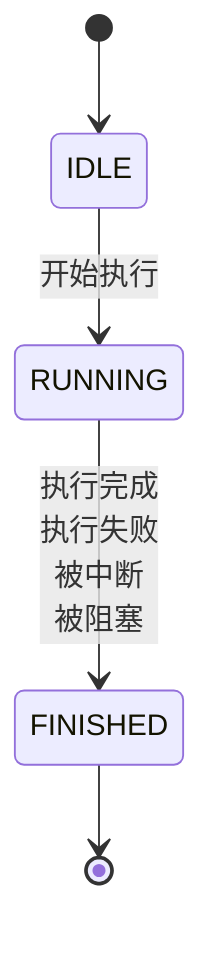
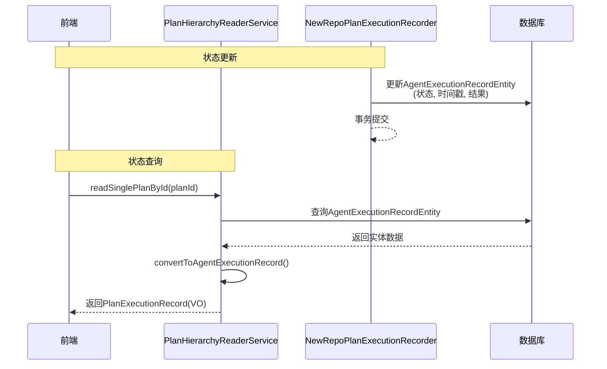

# 执行状态更新

<cite>
**本文档引用的文件**   
- [NewRepoPlanExecutionRecorder.java](file://src/main/java/com/alibaba/cloud/ai/lynxe/recorder/service/NewRepoPlanExecutionRecorder.java)
- [PlanHierarchyReaderService.java](file://src/main/java/com/alibaba/cloud/ai/lynxe/recorder/service/PlanHierarchyReaderService.java)
- [AgentExecutionRecordEntity.java](file://src/main/java/com/alibaba/cloud/ai/lynxe/recorder/entity/po/AgentExecutionRecordEntity.java)
- [AgentExecutionRecord.java](file://src/main/java/com/alibaba/cloud/ai/lynxe/recorder/entity/vo/AgentExecutionRecord.java)
- [ExecutionStatusEntity.java](file://src/main/java/com/alibaba/cloud/ai/lynxe/recorder/entity/po/ExecutionStatusEntity.java)
- [PlanExecutionRecordEntity.java](file://src/main/java/com/alibaba/cloud/ai/lynxe/recorder/entity/po/PlanExecutionRecordEntity.java)
- [AgentState.java](file://src/main/java/com/alibaba/cloud/ai/lynxe/agent/AgentState.java)
- [ThinkActRecord.java](file://src/main/java/com/alibaba/cloud/ai/lynxe/recorder/entity/vo/ThinkActRecord.java)
- [useMessageDialog.ts](file://ui-vue3/src/composables/useMessageDialog.ts)
- [useMessageDialogSM.ts](file://ui-vue3/src/composables/useMessageDialogSM.ts)
</cite>

## 目录
1. [引言](#引言)
2. [核心组件分析](#核心组件分析)
3. [状态机转换规则](#状态机转换规则)
4. [最终状态固化机制](#最终状态固化机制)
5. [时间戳更新策略](#时间戳更新策略)
6. [幂等性与一致性保证](#幂等性与一致性保证)
7. [与PlanHierarchyReaderService的协作关系](#与planhierarchyreaderservice的协作关系)
8. [错误处理示例](#错误处理示例)
9. [执行状态更新流程图](#执行状态更新流程图)
10. [结论](#结论)

## 引言
执行状态更新功能是系统执行流程监控的核心机制，负责跟踪和记录智能代理（Agent）及计划（Plan）的执行生命周期。该功能通过精确的状态转换、时间戳管理和错误处理，确保执行过程的可追溯性和可靠性。本文档详细阐述`updateExecutionStatus`方法的设计原理，包括状态机转换规则、最终状态固化机制、时间戳更新策略，以及如何确保状态变更的幂等性和一致性。同时，文档描述了该方法与`PlanHierarchyReaderService`的协作关系，以支持执行状态的实时查询，并提供在异常中断情况下正确更新执行状态的处理示例。

## 核心组件分析

执行状态更新功能主要由以下几个核心组件构成：

1.  **NewRepoPlanExecutionRecorder**: 该服务是执行状态更新的核心实现类，负责记录和更新代理（Agent）和计划（Plan）的执行状态。它通过`recordCompleteAgentExecution`和`recordPlanCompletion`等方法，将执行过程中的状态变化持久化到数据库中。

2.  **PlanHierarchyReaderService**: 该服务负责从数据库中读取执行记录，并将其转换为包含层级关系的视图对象（VO）。它与`NewRepoPlanExecutionRecorder`协同工作，前者负责写入，后者负责读取，共同实现了执行状态的实时查询。

3.  **AgentExecutionRecordEntity**: 这是数据库中的持久化对象（PO），用于存储单个代理执行步骤的详细信息，包括状态、开始/结束时间、错误信息等。

4.  **AgentExecutionRecord**: 这是面向前端的视图对象（VO），由`PlanHierarchyReaderService`从`AgentExecutionRecordEntity`转换而来，用于在UI层展示执行状态。

5.  **ExecutionStatusEntity**: 这是一个枚举类型，定义了数据库中存储的执行状态，包括`IDLE`、`RUNNING`和`FINISHED`。

6.  **AgentState**: 这是代理在运行时的状态枚举，包括`NOT_STARTED`、`IN_PROGRESS`、`COMPLETED`、`BLOCKED`、`FAILED`和`INTERRUPTED`。`NewRepoPlanExecutionRecorder`会将`AgentState`映射为`ExecutionStatusEntity`。

**Section sources**
- [NewRepoPlanExecutionRecorder.java](file://src/main/java/com/alibaba/cloud/ai/lynxe/recorder/service/NewRepoPlanExecutionRecorder.java#L223-L302)
- [PlanHierarchyReaderService.java](file://src/main/java/com/alibaba/cloud/ai/lynxe/recorder/service/PlanHierarchyReaderService.java#L57-L68)
- [AgentExecutionRecordEntity.java](file://src/main/java/com/alibaba/cloud/ai/lynxe/recorder/entity/po/AgentExecutionRecordEntity.java#L1-L275)
- [AgentExecutionRecord.java](file://src/main/java/com/alibaba/cloud/ai/lynxe/recorder/entity/vo/AgentExecutionRecord.java#L1-L318)
- [ExecutionStatusEntity.java](file://src/main/java/com/alibaba/cloud/ai/lynxe/recorder/entity/po/ExecutionStatusEntity.java#L1-L26)
- [AgentState.java](file://src/main/java/com/alibaba/cloud/ai/lynxe/agent/AgentState.java#L1-L34)

## 状态机转换规则

执行状态更新遵循一套严格的有限状态机（FSM）转换规则，确保状态变更的逻辑正确性。状态转换主要发生在代理执行完成时，由`NewRepoPlanExecutionRecorder`的`convertAgentStateToExecutionStatus`方法实现。

### 状态转换映射表

| AgentState (运行时状态) | ExecutionStatusEntity (持久化状态) | 说明 |
| :--- | :--- | :--- |
| `NOT_STARTED` | `IDLE` | 代理尚未开始执行。 |
| `IN_PROGRESS` | `RUNNING` | 代理正在执行中。 |
| `COMPLETED` | `FINISHED` | 代理成功完成执行。 |
| `INTERRUPTED` | `FINISHED` | 代理被用户或系统中断，执行终止。 |
| `BLOCKED` | `FINISHED` | 代理因外部条件阻塞而无法继续，执行终止。 |
| `FAILED` | `FINISHED` | 代理执行失败，执行终止。 |

**关键规则说明**：
- **单向转换**：状态转换是单向的，一旦进入`FINISHED`状态，便不可再变更为`RUNNING`或`IDLE`。
- **多对一映射**：`COMPLETED`、`INTERRUPTED`、`BLOCKED`和`FAILED`四种运行时状态均映射为`FINISHED`这一最终状态。这表明无论执行是成功、失败还是被中断，其生命周期都已结束。
- **中间状态**：`RUNNING`是唯一的中间状态，表示执行正在进行中。



**Diagram sources **
- [NewRepoPlanExecutionRecorder.java](file://src/main/java/com/alibaba/cloud/ai/lynxe/recorder/service/NewRepoPlanExecutionRecorder.java#L255-L274)
- [ExecutionStatusEntity.java](file://src/main/java/com/alibaba/cloud/ai/lynxe/recorder/entity/po/ExecutionStatusEntity.java#L21-L24)

## 最终状态固化机制

为了确保执行状态的不可逆性，系统实现了最终状态固化机制。一旦执行状态被标记为`FINISHED`，其状态和关键时间戳将被永久锁定，防止后续操作意外修改。

### 固化机制实现

1.  **状态不可逆**：如上文状态机所示，`FINISHED`是终止状态，没有向其他状态的转换路径。
2.  **时间戳锁定**：当代理执行完成时，`recordCompleteAgentExecution`方法会检查并设置结束时间（`endTime`）。如果`endTime`已经存在，则不会被覆盖，从而保证了结束时间的准确性。
    ```java
    // Set end time if not already set
    if (agentRecord.getEndTime() == null) {
        agentRecord.setEndTime(LocalDateTime.now());
    }
    ```
3.  **结果与错误信息固化**：执行的最终结果（`result`）和错误信息（`errorMessage`）在`recordCompleteAgentExecution`方法中被设置。一旦设置，这些信息将作为该执行步骤的最终记录，不会被后续的临时状态更新所覆盖。

此机制确保了执行历史的完整性和可审计性，即使在系统异常或并发操作的情况下，也能保证最终状态的正确性。

**Section sources**
- [NewRepoPlanExecutionRecorder.java](file://src/main/java/com/alibaba/cloud/ai/lynxe/recorder/service/NewRepoPlanExecutionRecorder.java#L566-L569)
- [AgentExecutionRecordEntity.java](file://src/main/java/com/alibaba/cloud/ai/lynxe/recorder/entity/po/AgentExecutionRecordEntity.java#L86-L88)

## 时间戳更新策略

系统采用精确的时间戳更新策略来记录执行过程的生命周期，为性能分析和问题排查提供数据支持。

### 时间戳更新规则

| 时间戳类型 | 更新时机 | 更新方法 |
| :--- | :--- | :--- |
| **开始时间 (startTime)** | 代理执行步骤开始时 | 在`AgentExecutionRecordEntity`的构造函数中设置为`LocalDateTime.now()`。 |
| **结束时间 (endTime)** | 代理执行步骤完成时 | 在`recordCompleteAgentExecution`方法中，仅当`endTime`为空时，才将其设置为`LocalDateTime.now()`。 |

**策略说明**：
- **惰性更新**：`endTime`采用“惰性更新”策略，即只在第一次需要设置时才进行更新。这防止了在执行过程中因临时状态变化而错误地更新结束时间。
- **原子性**：时间戳的更新与状态更新在同一个数据库事务中完成，保证了数据的一致性。

**Section sources**
- [AgentExecutionRecordEntity.java](file://src/main/java/com/alibaba/cloud/ai/lynxe/recorder/entity/po/AgentExecutionRecordEntity.java#L134)
- [NewRepoPlanExecutionRecorder.java](file://src/main/java/com/alibaba/cloud/ai/lynxe/recorder/service/NewRepoPlanExecutionRecorder.java#L566-L569)

## 幂等性与一致性保证

`updateExecutionStatus`方法的设计确保了状态变更的幂等性和数据一致性。

### 幂等性保证

幂等性是指同一个操作执行一次或多次，其结果都是相同的。本系统通过以下方式保证幂等性：
1.  **状态机约束**：状态机的单向转换特性天然保证了幂等性。例如，多次将一个`RUNNING`状态的代理更新为`RUNNING`，其结果不变。而将一个`FINISHED`状态的代理再次更新为`FINISHED`，也不会改变其最终状态。
2.  **数据库唯一键**：`AgentExecutionRecordEntity`的`stepId`字段被定义为唯一键（`unique = true`）。这确保了每个执行步骤在数据库中只有一个记录，避免了因重复插入导致的状态不一致。

### 一致性保证

一致性是指数据在任何时刻都处于有效状态。系统通过以下方式保证一致性：
1.  **事务性操作**：`NewRepoPlanExecutionRecorder`中的`recordCompleteAgentExecution`和`recordPlanCompletion`方法使用了`@Transactional`注解。这意味着对数据库的读取和更新操作在一个数据库事务中执行，保证了操作的原子性，防止了脏读和不可重复读。
2.  **状态与时间戳同步**：状态的更新与`endTime`的设置是同步进行的。例如，当状态被设置为`FINISHED`时，`endTime`也会被设置（如果尚未设置），确保了状态和时间戳的逻辑一致。

**Section sources**
- [NewRepoPlanExecutionRecorder.java](file://src/main/java/com/alibaba/cloud/ai/lynxe/recorder/service/NewRepoPlanExecutionRecorder.java#L594)
- [AgentExecutionRecordEntity.java](file://src/main/java/com/alibaba/cloud/ai/lynxe/recorder/entity/po/AgentExecutionRecordEntity.java#L71-L72)

## 与PlanHierarchyReaderService的协作关系

`NewRepoPlanExecutionRecorder`（写入）和`PlanHierarchyReaderService`（读取）构成了执行状态管理的读写分离架构，共同支持执行状态的实时查询。

### 协作流程

1.  **写入**：当代理执行状态发生变化时，`NewRepoPlanExecutionRecorder`负责将最新的状态、时间戳和结果信息持久化到数据库的`agent_execution_record`表中。
2.  **读取**：当用户或前端需要查询执行状态时，会调用`PlanHierarchyReaderService`的`readSinglePlanById`或`readPlanTreeByRootId`方法。
3.  **转换与组装**：`PlanHierarchyReaderService`从数据库读取`AgentExecutionRecordEntity`，并调用`convertToAgentExecutionRecord`方法将其转换为`AgentExecutionRecord`（VO）。在此过程中，它会根据`ExecutionStatusEntity`的值，通过`convertExecutionStatus`方法将其转换为前端可用的`ExecutionStatus`枚举。
4.  **返回**：`PlanHierarchyReaderService`将组装好的、包含完整层级关系的`PlanExecutionRecord`对象返回给调用方。

这种协作模式实现了关注点分离，写入服务专注于数据的准确记录，读取服务专注于数据的高效查询和结构化展示。



**Diagram sources **
- [PlanHierarchyReaderService.java](file://src/main/java/com/alibaba/cloud/ai/lynxe/recorder/service/PlanHierarchyReaderService.java#L153-L181)
- [NewRepoPlanExecutionRecorder.java](file://src/main/java/com/alibaba/cloud/ai/lynxe/recorder/service/NewRepoPlanExecutionRecorder.java#L523-L598)

## 错误处理示例

在异常中断情况下，系统能够正确地更新执行状态，确保用户获得准确的反馈。

### 异常中断处理流程

1.  **中断检测**：系统通过`TaskInterruptionCheckerService`检测到用户发出了中断请求。
2.  **状态更新**：`PlanFinalizer`组件在最终化执行时，会检查中断状态。如果检测到中断，它会将执行结果标记为失败，并设置特定的错误信息。
    ```java
    // PlanFinalizer.java
    if (shouldInterrupt) {
        result.setSuccess(false);
        result.setErrorMessage("Task execution was interrupted by user");
        return true;
    }
    ```
3.  **记录完成**：随后，`NewRepoPlanExecutionRecorder`的`recordCompleteAgentExecution`方法被调用。它会将`AgentState.INTERRUPTED`映射为`ExecutionStatusEntity.FINISHED`，并保存错误信息和结束时间。
4.  **错误信息清理**：在`PlanHierarchyReaderService`将数据返回给前端之前，它会检查错误信息。如果执行状态为`FINISHED`且有非空结果，但错误信息是系统内部的瞬时错误（以"System execution error at step"开头），则该错误信息会被清除，避免向用户展示无关的内部错误。
    ```java
    // PlanHierarchyReaderService.java
    if (status == ExecutionStatusEntity.FINISHED && result != null && !result.trim().isEmpty()
            && errorMessage.startsWith("System execution error at step")) {
        vo.setErrorMessage(null); // 清除瞬时错误信息
    }
    ```

此流程确保了在用户中断执行时，系统能正确地将状态固化为`FINISHED`，并提供清晰的“任务被用户中断”提示，而不是内部错误堆栈。

**Section sources**
- [PlanFinalizer.java](file://src/main/java/com/alibaba/cloud/ai/lynxe/planning/service/PlanFinalizer.java#L291-L324)
- [PlanHierarchyReaderService.java](file://src/main/java/com/alibaba/cloud/ai/lynxe/recorder/service/PlanHierarchyReaderService.java#L275-L286)
- [BaseAgent.java](file://src/main/java/com/alibaba/cloud/ai/lynxe/agent/BaseAgent.java#L353-L365)

## 执行状态更新流程图

以下流程图概括了从代理执行完成到状态被查询的完整流程。

```mermaid
flowchart TD
A[代理执行完成] --> B{状态检查}
B --> |COMPLETED, INTERRUPTED, BLOCKED, FAILED| C[NewRepoPlanExecutionRecorder<br/>recordCompleteAgentExecution]
C --> D[转换AgentState为<br/>ExecutionStatusEntity]
D --> E[设置endTime (如果为空)]
E --> F[保存到数据库]
F --> G[状态更新完成]
H[前端请求状态] --> I[PlanHierarchyReaderService<br/>readSinglePlanById]
I --> J[从数据库查询<br/>AgentExecutionRecordEntity]
J --> K[转换ExecutionStatusEntity为<br/>ExecutionStatus]
K --> L{状态为FINISHED且<br/>有结果但错误信息为<br/>系统瞬时错误?}
L --> |是| M[清除错误信息]
L --> |否| N[保留错误信息]
M --> O[返回PlanExecutionRecord(VO)]
N --> O
O --> P[前端展示执行状态]
```

**Diagram sources **
- [NewRepoPlanExecutionRecorder.java](file://src/main/java/com/alibaba/cloud/ai/lynxe/recorder/service/NewRepoPlanExecutionRecorder.java#L523-L598)
- [PlanHierarchyReaderService.java](file://src/main/java/com/alibaba/cloud/ai/lynxe/recorder/service/PlanHierarchyReaderService.java#L153-L181)

## 结论

执行状态更新功能通过精心设计的状态机、最终状态固化机制和时间戳策略，构建了一个健壮、可靠的执行监控系统。`NewRepoPlanExecutionRecorder`作为核心写入服务，确保了状态变更的幂等性和一致性；`PlanHierarchyReaderService`作为核心读取服务，提供了高效的实时查询能力。两者通过清晰的职责分离和协作，共同实现了对执行过程的精确跟踪。在异常处理方面，系统能够优雅地处理中断等场景，为用户提供清晰、准确的状态反馈。该设计为系统的可观察性和稳定性奠定了坚实的基础。