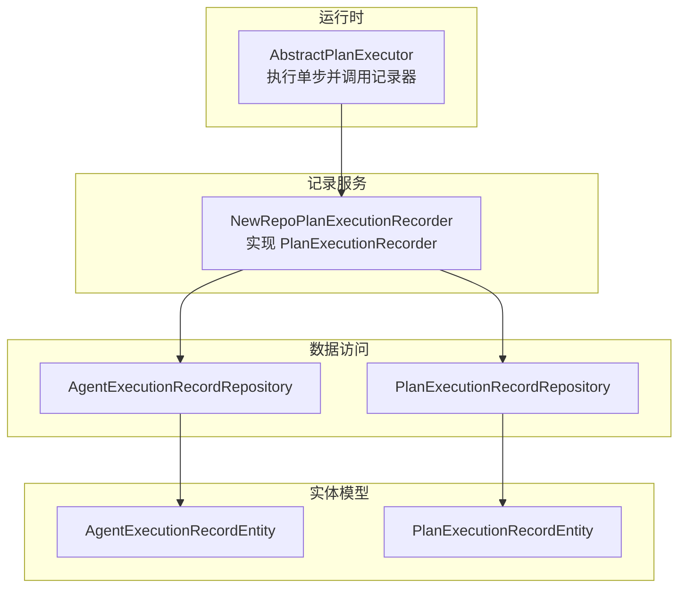
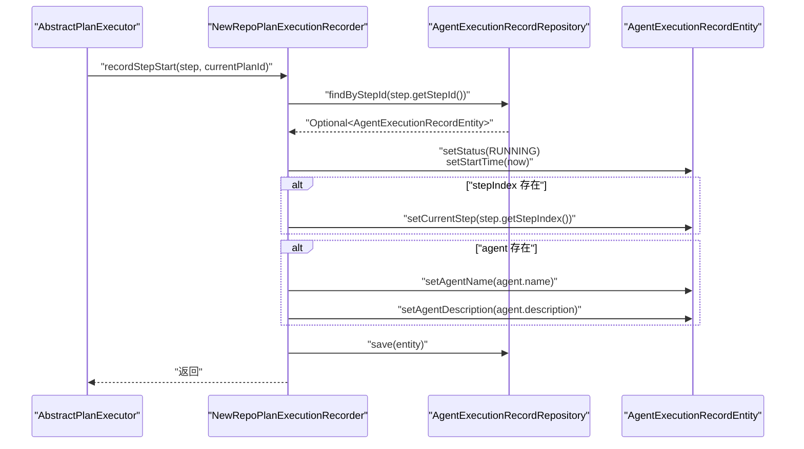
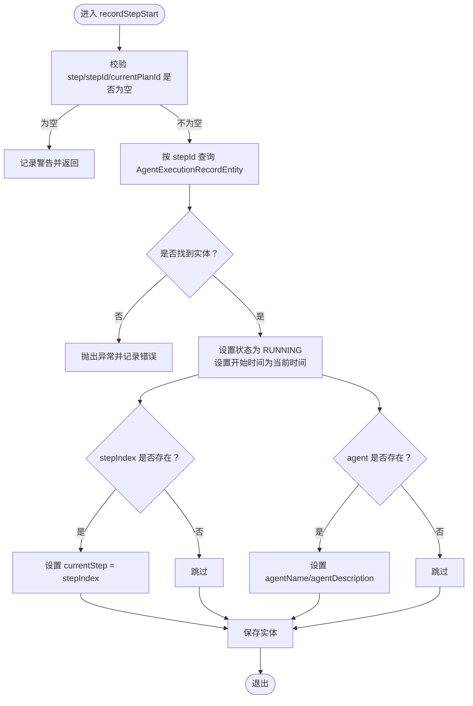
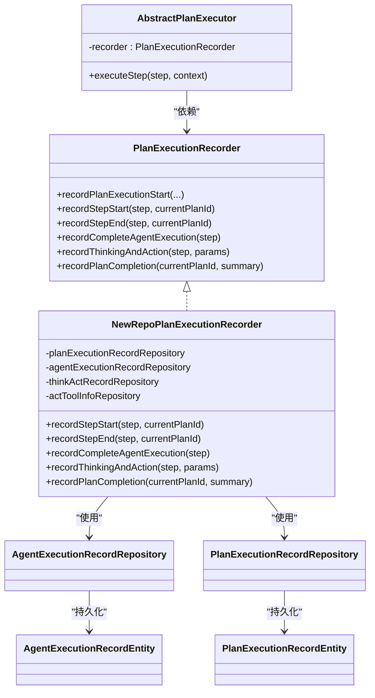

# 步骤执行记录

<cite>
**本文引用的文件**
- [NewRepoPlanExecutionRecorder.java](file://src/main/java/com/alibaba/cloud/ai/lynxe/recorder/service/NewRepoPlanExecutionRecorder.java)
- [PlanExecutionRecorder.java](file://src/main/java/com/alibaba/cloud/ai/lynxe/recorder/service/PlanExecutionRecorder.java)
- [AbstractPlanExecutor.java](file://src/main/java/com/alibaba/cloud/ai/lynxe/runtime/executor/AbstractPlanExecutor.java)
- [ExecutionStep.java](file://src/main/java/com/alibaba/cloud/ai/lynxe/runtime/entity/vo/ExecutionStep.java)
- [AgentExecutionRecordEntity.java](file://src/main/java/com/alibaba/cloud/ai/lynxe/recorder/entity/po/AgentExecutionRecordEntity.java)
- [PlanExecutionRecordEntity.java](file://src/main/java/com/alibaba/cloud/ai/lynxe/recorder/entity/po/PlanExecutionRecordEntity.java)
- [AgentExecutionRecordRepository.java](file://src/main/java/com/alibaba/cloud/ai/lynxe/recorder/repository/AgentExecutionRecordRepository.java)
- [PlanExecutionRecordRepository.java](file://src/main/java/com/alibaba/cloud/ai/lynxe/recorder/repository/PlanExecutionRecordRepository.java)
- [PlanHierarchyReaderService.java](file://src/main/java/com/alibaba/cloud/ai/lynxe/recorder/service/PlanHierarchyReaderService.java)
</cite>

## 目录
1. [简介](#简介)
2. [项目结构](#项目结构)
3. [核心组件](#核心组件)
4. [架构总览](#架构总览)
5. [详细组件分析](#详细组件分析)
6. [依赖关系分析](#依赖关系分析)
7. [性能考量](#性能考量)
8. [故障排查指南](#故障排查指南)
9. [结论](#结论)
10. [附录](#附录)

## 简介
本技术文档围绕“步骤执行记录”功能展开，重点解析 recordStepStart 方法的工作机制，涵盖以下方面：
- ExecutionStep 实体的构建与字段语义
- 步骤编号（stepIndex）的来源与维护
- 执行时间戳的记录策略
- 状态转换逻辑与 AgentState 到 ExecutionStatusEntity 的映射
- 如何维护执行步骤的有序性并建立与父级计划执行记录的层级关联
- 并发执行场景下的线程安全处理策略
- 动态代理执行器调用 recordStepStart 的典型模式

## 项目结构
与“步骤执行记录”直接相关的模块分布如下：
- 运行时执行器：负责在执行每个 ExecutionStep 前后调用记录器接口，以记录开始与结束状态
- 计划执行记录服务：实现记录器接口，持久化 AgentExecutionRecordEntity 与 PlanExecutionRecordEntity，并维护层级关系
- 数据访问层：通过 JPA Repository 提供按 stepId/planId 查询与更新能力
- 实体模型：描述 Agent 与计划执行过程的数据结构

图表来源
- [AbstractPlanExecutor.java](file://src/main/java/com/alibaba/cloud/ai/lynxe/runtime/executor/AbstractPlanExecutor.java#L97-L166)
- [PlanExecutionRecorder.java](file://src/main/java/com/alibaba/cloud/ai/lynxe/recorder/service/PlanExecutionRecorder.java#L37-L60)
- [NewRepoPlanExecutionRecorder.java](file://src/main/java/com/alibaba/cloud/ai/lynxe/recorder/service/NewRepoPlanExecutionRecorder.java#L292-L338)
- [AgentExecutionRecordRepository.java](file://src/main/java/com/alibaba/cloud/ai/lynxe/recorder/repository/AgentExecutionRecordRepository.java#L25-L43)
- [PlanExecutionRecordRepository.java](file://src/main/java/com/alibaba/cloud/ai/lynxe/recorder/repository/PlanExecutionRecordRepository.java#L26-L54)
- [AgentExecutionRecordEntity.java](file://src/main/java/com/alibaba/cloud/ai/lynxe/recorder/entity/po/AgentExecutionRecordEntity.java#L61-L120)
- [PlanExecutionRecordEntity.java](file://src/main/java/com/alibaba/cloud/ai/lynxe/recorder/entity/po/PlanExecutionRecordEntity.java#L43-L109)

章节来源
- [AbstractPlanExecutor.java](file://src/main/java/com/alibaba/cloud/ai/lynxe/runtime/executor/AbstractPlanExecutor.java#L97-L166)
- [PlanExecutionRecorder.java](file://src/main/java/com/alibaba/cloud/ai/lynxe/recorder/service/PlanExecutionRecorder.java#L37-L60)
- [NewRepoPlanExecutionRecorder.java](file://src/main/java/com/alibaba/cloud/ai/lynxe/recorder/service/NewRepoPlanExecutionRecorder.java#L292-L338)

## 核心组件
- ExecutionStep：封装一次执行步骤的关键信息，包含 stepId、stepIndex、stepRequirement、agent、selectedToolKeys、modelName、status、terminateColumns 等；其中 stepId 为唯一标识，用于与 AgentExecutionRecordEntity 建立一对一映射。
- AgentExecutionRecordEntity：记录单个 ExecutionStep 对应的 Agent 执行详情，包含起止时间、当前/最大步数、状态、请求内容、结果与错误信息等。
- PlanExecutionRecordEntity：记录整个计划的执行信息，包含当前/根/父计划 ID、步骤列表、当前执行步索引、完成状态与摘要等。
- PlanExecutionRecorder 接口：定义记录计划/步骤/思考-行动/完成 Agent 执行等能力。
- NewRepoPlanExecutionRecorder：记录器接口的具体实现，负责创建/更新 Agent 执行记录、记录步骤开始/结束、记录思考-行动、记录计划完成、建立层级关系等。

章节来源
- [ExecutionStep.java](file://src/main/java/com/alibaba/cloud/ai/lynxe/runtime/entity/vo/ExecutionStep.java#L27-L177)
- [AgentExecutionRecordEntity.java](file://src/main/java/com/alibaba/cloud/ai/lynxe/recorder/entity/po/AgentExecutionRecordEntity.java#L61-L120)
- [PlanExecutionRecordEntity.java](file://src/main/java/com/alibaba/cloud/ai/lynxe/recorder/entity/po/PlanExecutionRecordEntity.java#L43-L109)
- [PlanExecutionRecorder.java](file://src/main/java/com/alibaba/cloud/ai/lynxe/recorder/service/PlanExecutionRecorder.java#L37-L89)
- [NewRepoPlanExecutionRecorder.java](file://src/main/java/com/alibaba/cloud/ai/lynxe/recorder/service/NewRepoPlanExecutionRecorder.java#L292-L338)

## 架构总览
recordStepStart 在执行器中被调用，流程如下：
- 执行器在执行前调用 recorder.recordStepStart(step, currentPlanId)
- 记录器根据 step.getStepId() 查询 AgentExecutionRecordEntity
- 将状态置为 RUNNING，并设置开始时间
- 可选地更新当前步骤索引与 Agent 名称/描述
- 最终保存实体

图表来源
- [AbstractPlanExecutor.java](file://src/main/java/com/alibaba/cloud/ai/lynxe/runtime/executor/AbstractPlanExecutor.java#L106-L118)
- [NewRepoPlanExecutionRecorder.java](file://src/main/java/com/alibaba/cloud/ai/lynxe/recorder/service/NewRepoPlanExecutionRecorder.java#L292-L338)
- [AgentExecutionRecordRepository.java](file://src/main/java/com/alibaba/cloud/ai/lynxe/recorder/repository/AgentExecutionRecordRepository.java#L25-L43)
- [AgentExecutionRecordEntity.java](file://src/main/java/com/alibaba/cloud/ai/lynxe/recorder/entity/po/AgentExecutionRecordEntity.java#L178-L208)

## 详细组件分析

### recordStepStart 方法工作机制
- 输入参数校验：若 step 为空或 stepId 为空或 currentPlanId 为空，则记录警告并跳过
- 查询实体：通过 AgentExecutionRecordRepository.findByStepId(step.getStepId()) 获取已存在的 AgentExecutionRecordEntity
- 更新状态与时间：将状态置为 RUNNING，设置开始时间为当前时间
- 同步步骤索引：若 step.getStepIndex() 非空，则同步到实体的 currentStep 字段
- 同步 Agent 信息：若 step.getAgent() 非空，则同步 agent.name 与 agent.description
- 持久化：调用 agentExecutionRecordRepository.save(entity) 写入数据库

图表来源
- [NewRepoPlanExecutionRecorder.java](file://src/main/java/com/alibaba/cloud/ai/lynxe/recorder/service/NewRepoPlanExecutionRecorder.java#L292-L338)

章节来源
- [NewRepoPlanExecutionRecorder.java](file://src/main/java/com/alibaba/cloud/ai/lynxe/recorder/service/NewRepoPlanExecutionRecorder.java#L292-L338)

### ExecutionStep 实体的构建与字段语义
- stepId：唯一标识，用于与 AgentExecutionRecordEntity 建立一对一映射
- stepIndex：步骤序号，用于维护执行顺序与 currentStep 同步
- stepRequirement：步骤需求文本，可包含“[AGENT_NAME] 请求内容”的格式，记录器会解析提取 agentName
- agent：执行该步骤的 Agent 实例，用于记录名称与描述
- status：AgentState，决定最终状态映射
- 其他：selectedToolKeys、modelName、terminateColumns、result、errorMessage 等

章节来源
- [ExecutionStep.java](file://src/main/java/com/alibaba/cloud/ai/lynxe/runtime/entity/vo/ExecutionStep.java#L27-L177)

### 步骤编号生成与维护
- 步骤编号生成：ExecutionStep 默认构造函数会生成一个基于 UUID 的唯一 stepId
- 步骤索引维护：在 recordPlanExecutionStart 中，会遍历 ExecutionStep 列表，调用 createOrUpdateAgentExecutionRecord，将 step.getStepIndex() 同步到 AgentExecutionRecordEntity.currentStep
- 有序性保证：通过 stepIndex 与 currentStep 的同步，确保执行序列的顺序一致性

章节来源
- [ExecutionStep.java](file://src/main/java/com/alibaba/cloud/ai/lynxe/runtime/entity/vo/ExecutionStep.java#L37-L43)
- [NewRepoPlanExecutionRecorder.java](file://src/main/java/com/alibaba/cloud/ai/lynxe/recorder/service/NewRepoPlanExecutionRecorder.java#L102-L113)
- [NewRepoPlanExecutionRecorder.java](file://src/main/java/com/alibaba/cloud/ai/lynxe/recorder/service/NewRepoPlanExecutionRecorder.java#L234-L236)

### 执行时间戳记录
- 开始时间：recordStepStart 设置 startTime 为当前时间
- 结束时间：recordStepEnd 设置 endTime 为当前时间
- 计划完成时间：recordPlanCompletion 调用 PlanExecutionRecordEntity.complete(summary)，内部设置 endTime 与 completed

章节来源
- [NewRepoPlanExecutionRecorder.java](file://src/main/java/com/alibaba/cloud/ai/lynxe/recorder/service/NewRepoPlanExecutionRecorder.java#L313-L314)
- [NewRepoPlanExecutionRecorder.java](file://src/main/java/com/alibaba/cloud/ai/lynxe/recorder/service/NewRepoPlanExecutionRecorder.java#L361-L362)
- [PlanExecutionRecordEntity.java](file://src/main/java/com/alibaba/cloud/ai/lynxe/recorder/entity/po/PlanExecutionRecordEntity.java#L160-L166)

### 状态转换逻辑
- AgentState 到 ExecutionStatusEntity 的映射：
  - NOT_STARTED → IDLE
  - IN_PROGRESS → RUNNING
  - COMPLETED/INTERRUPTED → FINISHED
  - BLOCKED/FAILED → FINISHED
- recordStepStart 将状态置为 RUNNING
- recordStepEnd 将状态置为 FINISHED
- recordCompleteAgentExecution 根据 step.getStatus() 决定最终状态，并设置结束时间与结果/错误信息

章节来源
- [NewRepoPlanExecutionRecorder.java](file://src/main/java/com/alibaba/cloud/ai/lynxe/recorder/service/NewRepoPlanExecutionRecorder.java#L255-L275)
- [NewRepoPlanExecutionRecorder.java](file://src/main/java/com/alibaba/cloud/ai/lynxe/recorder/service/NewRepoPlanExecutionRecorder.java#L313-L314)
- [NewRepoPlanExecutionRecorder.java](file://src/main/java/com/alibaba/cloud/ai/lynxe/recorder/service/NewRepoPlanExecutionRecorder.java#L361-L362)
- [NewRepoPlanExecutionRecorder.java](file://src/main/java/com/alibaba/cloud/ai/lynxe/recorder/service/NewRepoPlanExecutionRecorder.java#L547-L564)

### 维护执行步骤的有序性与父级计划关联
- 有序性：通过 ExecutionStep 的 stepIndex 与 AgentExecutionRecordEntity.currentStep 同步，确保步骤顺序一致
- 父级计划关联：
  - recordPlanExecutionStart 中，当 rootPlanId 非空时，调用 createPlanRelationship(currentPlanId, parentPlanId, rootPlanId, toolcallId) 建立层级关系
  - PlanExecutionRecordEntity 维护 rootPlanId、parentPlanId、toolCallId 字段
  - PlanHierarchyReaderService 通过查询 PlanExecutionRecordRepository 的 findByParentPlanId/findByRootPlanId 构建层级树

章节来源
- [NewRepoPlanExecutionRecorder.java](file://src/main/java/com/alibaba/cloud/ai/lynxe/recorder/service/NewRepoPlanExecutionRecorder.java#L118-L140)
- [NewRepoPlanExecutionRecorder.java](file://src/main/java/com/alibaba/cloud/ai/lynxe/recorder/service/NewRepoPlanExecutionRecorder.java#L782-L839)
- [PlanExecutionRecordEntity.java](file://src/main/java/com/alibaba/cloud/ai/lynxe/recorder/entity/po/PlanExecutionRecordEntity.java#L55-L61)
- [PlanExecutionRecordRepository.java](file://src/main/java/com/alibaba/cloud/ai/lynxe/recorder/repository/PlanExecutionRecordRepository.java#L31-L41)
- [PlanHierarchyReaderService.java](file://src/main/java/com/alibaba/cloud/ai/lynxe/recorder/service/PlanHierarchyReaderService.java#L323-L348)

### 并发执行场景下的线程安全处理策略
- 方法级别事务：recordStepStart 使用 @Transactional 注解包裹，确保数据库操作的原子性
- Repository 查询与更新：findByStepId 与 save 在同一事务内执行，避免并发写冲突
- 执行器调用模式：AbstractPlanExecutor 在 try/catch 中调用 recordStepStart，finally 中调用 recordStepEnd，确保无论成功与否都会记录结束状态
- 并发建议：不同 ExecutionStep 的 stepId 不同，按 stepId 查询与更新不会互相影响；如需跨步骤协调，应在上层业务逻辑中引入锁或幂等设计

章节来源
- [NewRepoPlanExecutionRecorder.java](file://src/main/java/com/alibaba/cloud/ai/lynxe/recorder/service/NewRepoPlanExecutionRecorder.java#L292-L338)
- [AbstractPlanExecutor.java](file://src/main/java/com/alibaba/cloud/ai/lynxe/runtime/executor/AbstractPlanExecutor.java#L106-L118)
- [AbstractPlanExecutor.java](file://src/main/java/com/alibaba/cloud/ai/lynxe/runtime/executor/AbstractPlanExecutor.java#L157-L164)

### 动态代理执行器调用 recordStepStart 的典型模式
- 执行器在执行单步前调用 recorder.recordStepStart(step, context.getCurrentPlanId())
- 执行完成后在 finally 中调用 recorder.recordStepEnd(step, context.getCurrentPlanId())
- 执行过程中根据 AgentState 设置 step 的状态与结果，以便后续记录完整执行信息

章节来源
- [AbstractPlanExecutor.java](file://src/main/java/com/alibaba/cloud/ai/lynxe/runtime/executor/AbstractPlanExecutor.java#L106-L118)
- [AbstractPlanExecutor.java](file://src/main/java/com/alibaba/cloud/ai/lynxe/runtime/executor/AbstractPlanExecutor.java#L157-L164)

## 依赖关系分析
- 执行器依赖记录器接口：AbstractPlanExecutor 通过 PlanExecutionRecorder 接口进行记录
- 记录器实现依赖 Repository：NewRepoPlanExecutionRecorder 通过 AgentExecutionRecordRepository 与 PlanExecutionRecordRepository 进行持久化
- 实体模型：AgentExecutionRecordEntity 与 PlanExecutionRecordEntity 描述了记录的数据结构
- 层级关系：PlanExecutionRecordEntity 维护 rootPlanId、parentPlanId、toolCallId，支持层级树构建

图表来源
- [PlanExecutionRecorder.java](file://src/main/java/com/alibaba/cloud/ai/lynxe/recorder/service/PlanExecutionRecorder.java#L37-L89)
- [NewRepoPlanExecutionRecorder.java](file://src/main/java/com/alibaba/cloud/ai/lynxe/recorder/service/NewRepoPlanExecutionRecorder.java#L292-L338)
- [AbstractPlanExecutor.java](file://src/main/java/com/alibaba/cloud/ai/lynxe/runtime/executor/AbstractPlanExecutor.java#L97-L166)
- [AgentExecutionRecordRepository.java](file://src/main/java/com/alibaba/cloud/ai/lynxe/recorder/repository/AgentExecutionRecordRepository.java#L25-L43)
- [PlanExecutionRecordRepository.java](file://src/main/java/com/alibaba/cloud/ai/lynxe/recorder/repository/PlanExecutionRecordRepository.java#L26-L54)
- [AgentExecutionRecordEntity.java](file://src/main/java/com/alibaba/cloud/ai/lynxe/recorder/entity/po/AgentExecutionRecordEntity.java#L61-L120)
- [PlanExecutionRecordEntity.java](file://src/main/java/com/alibaba/cloud/ai/lynxe/recorder/entity/po/PlanExecutionRecordEntity.java#L43-L109)

## 性能考量
- 数据库写入：recordStepStart/recordStepEnd 仅更新单条记录，写入量小，性能开销低
- 事务范围：方法级事务确保原子性，避免频繁提交带来的额外开销
- 查询路径：按 stepId 查询，Repository 层具备索引支持，查询效率高
- 并发写入：不同 stepId 的记录互不影响，天然具备良好的并发扩展性

## 故障排查指南
- 记录开始失败
  - 现象：日志出现“Failed to record step start...”
  - 可能原因：step 或 stepId 为空；未在 recordPlanExecutionStart 中提前创建 AgentExecutionRecordEntity
  - 处理：确认 stepId 有效；检查 recordPlanExecutionStart 是否已为所有 ExecutionStep 创建记录
- 记录结束失败
  - 现象：日志出现“Failed to record step end...”
  - 可能原因：step 或 stepId 为空；AgentExecutionRecordEntity 不存在
  - 处理：确保 recordStepStart 已成功创建并保存；检查 stepId 与 ExecutionStep 的一致性
- 状态映射异常
  - 现象：状态不符合预期
  - 可能原因：AgentState 未正确设置或非法值
  - 处理：检查 AgentState 设置逻辑；确认 convertAgentStateToExecutionStatus 的分支覆盖
- 层级关系缺失
  - 现象：子计划无法定位到父计划
  - 可能原因：rootPlanId 为空或校验失败；createPlanRelationship 抛出异常
  - 处理：确保传入 rootPlanId；检查 parentPlanId 与 toolcallId 的配对规则

章节来源
- [NewRepoPlanExecutionRecorder.java](file://src/main/java/com/alibaba/cloud/ai/lynxe/recorder/service/NewRepoPlanExecutionRecorder.java#L292-L338)
- [NewRepoPlanExecutionRecorder.java](file://src/main/java/com/alibaba/cloud/ai/lynxe/recorder/service/NewRepoPlanExecutionRecorder.java#L340-L386)
- [NewRepoPlanExecutionRecorder.java](file://src/main/java/com/alibaba/cloud/ai/lynxe/recorder/service/NewRepoPlanExecutionRecorder.java#L782-L839)

## 结论
recordStepStart 通过统一的 stepId 映射与事务化的持久化，实现了对单步执行的可靠记录。配合 ExecutionStep 的 stepIndex 与 AgentExecutionRecordEntity 的 currentStep，保证了执行顺序的一致性；结合 PlanExecutionRecordEntity 的层级字段与 PlanHierarchyReaderService 的查询能力，建立了清晰的父级计划关联。在并发场景下，方法级事务与按 stepId 的独立更新，提供了良好的线程安全与扩展性。动态代理执行器的调用模式则确保了开始与结束记录的完整性。

## 附录
- 关键实现位置参考
  - recordStepStart 定义与实现：[NewRepoPlanExecutionRecorder.java](file://src/main/java/com/alibaba/cloud/ai/lynxe/recorder/service/NewRepoPlanExecutionRecorder.java#L292-L338)
  - 执行器调用模式：[AbstractPlanExecutor.java](file://src/main/java/com/alibaba/cloud/ai/lynxe/runtime/executor/AbstractPlanExecutor.java#L106-L118)
  - ExecutionStep 字段与构造：[ExecutionStep.java](file://src/main/java/com/alibaba/cloud/ai/lynxe/runtime/entity/vo/ExecutionStep.java#L27-L177)
  - Agent 执行记录实体：[AgentExecutionRecordEntity.java](file://src/main/java/com/alibaba/cloud/ai/lynxe/recorder/entity/po/AgentExecutionRecordEntity.java#L61-L120)
  - 计划执行记录实体：[PlanExecutionRecordEntity.java](file://src/main/java/com/alibaba/cloud/ai/lynxe/recorder/entity/po/PlanExecutionRecordEntity.java#L43-L109)
  - 记录器接口：[PlanExecutionRecorder.java](file://src/main/java/com/alibaba/cloud/ai/lynxe/recorder/service/PlanExecutionRecorder.java#L37-L89)
  - Repository 接口：[AgentExecutionRecordRepository.java](file://src/main/java/com/alibaba/cloud/ai/lynxe/recorder/repository/AgentExecutionRecordRepository.java#L25-L43), [PlanExecutionRecordRepository.java](file://src/main/java/com/alibaba/cloud/ai/lynxe/recorder/repository/PlanExecutionRecordRepository.java#L26-L54)
  - 层级关系构建：[PlanHierarchyReaderService.java](file://src/main/java/com/alibaba/cloud/ai/lynxe/recorder/service/PlanHierarchyReaderService.java#L323-L348)