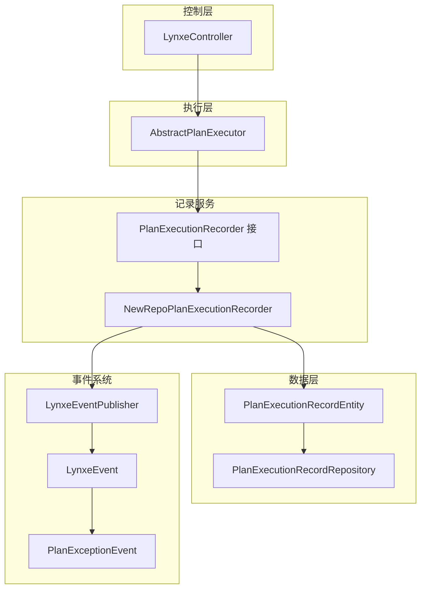
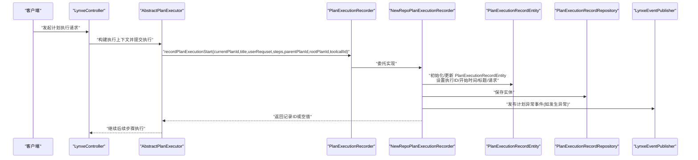
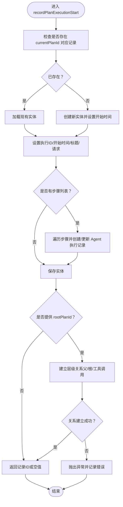
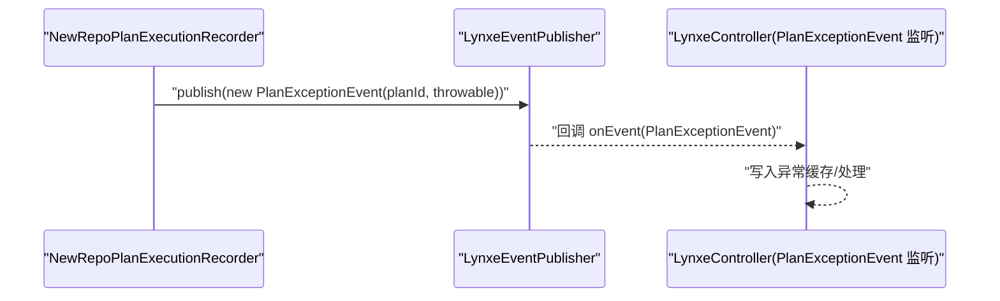
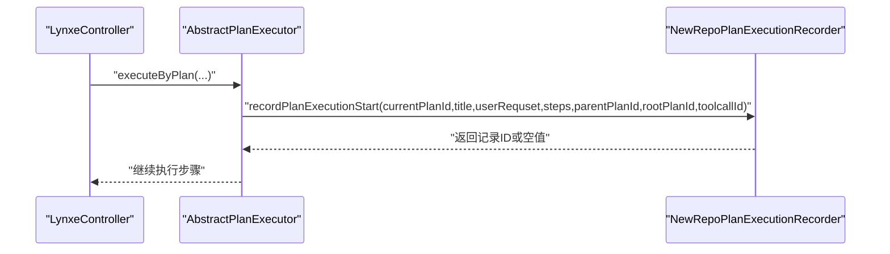
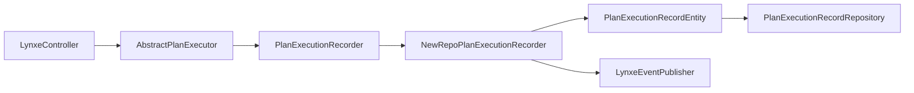

# 计划执行开始记录

<cite>
**本文引用的文件**
- [LynxeController.java](file://src/main/java/com/alibaba/cloud/ai/lynxe/runtime/controller/LynxeController.java)
- [AbstractPlanExecutor.java](file://src/main/java/com/alibaba/cloud/ai/lynxe/runtime/executor/AbstractPlanExecutor.java)
- [NewRepoPlanExecutionRecorder.java](file://src/main/java/com/alibaba/cloud/ai/lynxe/recorder/service/NewRepoPlanExecutionRecorder.java)
- [PlanExecutionRecorder.java](file://src/main/java/com/alibaba/cloud/ai/lynxe/recorder/service/PlanExecutionRecorder.java)
- [PlanExecutionRecordEntity.java](file://src/main/java/com/alibaba/cloud/ai/lynxe/recorder/entity/po/PlanExecutionRecordEntity.java)
- [PlanExecutionRecordRepository.java](file://src/main/java/com/alibaba/cloud/ai/lynxe/recorder/repository/PlanExecutionRecordRepository.java)
- [LynxeEventPublisher.java](file://src/main/java/com/alibaba/cloud/ai/lynxe/event/LynxeEventPublisher.java)
- [LynxeEvent.java](file://src/main/java/com/alibaba/cloud/ai/lynxe/event/LynxeEvent.java)
- [PlanExceptionEvent.java](file://src/main/java/com/alibaba/cloud/ai/lynxe/event/PlanExceptionEvent.java)
</cite>

## 目录
1. [简介](#简介)
2. [项目结构](#项目结构)
3. [核心组件](#核心组件)
4. [架构总览](#架构总览)
5. [详细组件分析](#详细组件分析)
6. [依赖关系分析](#依赖关系分析)
7. [性能考量](#性能考量)
8. [故障排查指南](#故障排查指南)
9. [结论](#结论)

## 简介
本技术文档围绕“计划执行开始记录”能力展开，聚焦 recordPlanExecutionStart 方法的实现逻辑与调用链路，涵盖以下关键点：
- 初始化 PlanExecutionRecordEntity 实体：设置执行ID、开始时间、标题、用户请求、步骤序列等。
- 与事件系统的集成：在计划启动时通过事件发布器触发异常事件（如计划异常），用于统一监控与告警。
- 事务边界与异常处理：使用 @Transactional 确保记录的原子性，并对异常进行分类处理与日志记录。
- 调用上下文示例：从 LynxeController 到执行器再到记录服务的完整调用链路。

## 项目结构
与“计划执行开始记录”直接相关的模块分布如下：
- 控制层：LynxeController 提供对外接口，协调计划执行与记录。
- 执行层：AbstractPlanExecutor 在执行前调用记录服务，完成计划启动记录。
- 记录服务：NewRepoPlanExecutionRecorder 实现记录接口，负责持久化与层级关系建立。
- 数据模型与仓库：PlanExecutionRecordEntity 与 PlanExecutionRecordRepository 定义实体与查询。
- 事件系统：LynxeEventPublisher、LynxeEvent、PlanExceptionEvent 支持异常事件的发布与监听。

图表来源
- [LynxeController.java](file://src/main/java/com/alibaba/cloud/ai/lynxe/runtime/controller/LynxeController.java#L1-L1205)
- [AbstractPlanExecutor.java](file://src/main/java/com/alibaba/cloud/ai/lynxe/runtime/executor/AbstractPlanExecutor.java#L260-L397)
- [NewRepoPlanExecutionRecorder.java](file://src/main/java/com/alibaba/cloud/ai/lynxe/recorder/service/NewRepoPlanExecutionRecorder.java#L46-L855)
- [PlanExecutionRecorder.java](file://src/main/java/com/alibaba/cloud/ai/lynxe/recorder/service/PlanExecutionRecorder.java#L1-L242)
- [PlanExecutionRecordEntity.java](file://src/main/java/com/alibaba/cloud/ai/lynxe/recorder/entity/po/PlanExecutionRecordEntity.java#L41-L283)
- [PlanExecutionRecordRepository.java](file://src/main/java/com/alibaba/cloud/ai/lynxe/recorder/repository/PlanExecutionRecordRepository.java#L1-L55)
- [LynxeEventPublisher.java](file://src/main/java/com/alibaba/cloud/ai/lynxe/event/LynxeEventPublisher.java#L1-L66)
- [LynxeEvent.java](file://src/main/java/com/alibaba/cloud/ai/lynxe/event/LynxeEvent.java#L1-L26)
- [PlanExceptionEvent.java](file://src/main/java/com/alibaba/cloud/ai/lynxe/event/PlanExceptionEvent.java#L1-L50)

章节来源
- [LynxeController.java](file://src/main/java/com/alibaba/cloud/ai/lynxe/runtime/controller/LynxeController.java#L1-L1205)
- [AbstractPlanExecutor.java](file://src/main/java/com/alibaba/cloud/ai/lynxe/runtime/executor/AbstractPlanExecutor.java#L260-L397)
- [NewRepoPlanExecutionRecorder.java](file://src/main/java/com/alibaba/cloud/ai/lynxe/recorder/service/NewRepoPlanExecutionRecorder.java#L46-L855)
- [PlanExecutionRecorder.java](file://src/main/java/com/alibaba/cloud/ai/lynxe/recorder/service/PlanExecutionRecorder.java#L1-L242)
- [PlanExecutionRecordEntity.java](file://src/main/java/com/alibaba/cloud/ai/lynxe/recorder/entity/po/PlanExecutionRecordEntity.java#L41-L283)
- [PlanExecutionRecordRepository.java](file://src/main/java/com/alibaba/cloud/ai/lynxe/recorder/repository/PlanExecutionRecordRepository.java#L1-L55)
- [LynxeEventPublisher.java](file://src/main/java/com/alibaba/cloud/ai/lynxe/event/LynxeEventPublisher.java#L1-L66)
- [LynxeEvent.java](file://src/main/java/com/alibaba/cloud/ai/lynxe/event/LynxeEvent.java#L1-L26)
- [PlanExceptionEvent.java](file://src/main/java/com/alibaba/cloud/ai/lynxe/event/PlanExceptionEvent.java#L1-L50)

## 核心组件
- 记录接口 PlanExecutionRecorder：定义计划执行记录的统一入口，包括 recordPlanExecutionStart、recordPlanCompletion、recordStepStart、recordStepEnd、recordThinkingAndAction、recordActionResult、recordCompleteAgentExecution 等。
- 记录实现 NewRepoPlanExecutionRecorder：具体实现记录逻辑，包含事务控制、实体初始化、步骤处理、层级关系建立、异常处理与日志记录。
- 实体与仓库 PlanExecutionRecordEntity/PlanExecutionRecordRepository：持久化计划执行记录，支持按 currentPlanId、parentPlanId、rootPlanId 查询。
- 控制器 LynxeController：对外提供执行接口，内部协调计划模板解析、参数替换、记忆存储、任务管理与记录服务调用。
- 执行器 AbstractPlanExecutor：在执行流程中调用 recordPlanExecutionStart，确保每次计划启动都有对应的记录。
- 事件系统 LynxeEventPublisher/LynxeEvent/PlanExceptionEvent：提供事件发布能力，便于统一处理计划异常等事件。

章节来源
- [PlanExecutionRecorder.java](file://src/main/java/com/alibaba/cloud/ai/lynxe/recorder/service/PlanExecutionRecorder.java#L1-L242)
- [NewRepoPlanExecutionRecorder.java](file://src/main/java/com/alibaba/cloud/ai/lynxe/recorder/service/NewRepoPlanExecutionRecorder.java#L46-L855)
- [PlanExecutionRecordEntity.java](file://src/main/java/com/alibaba/cloud/ai/lynxe/recorder/entity/po/PlanExecutionRecordEntity.java#L41-L283)
- [PlanExecutionRecordRepository.java](file://src/main/java/com/alibaba/cloud/ai/lynxe/recorder/repository/PlanExecutionRecordRepository.java#L1-L55)
- [LynxeController.java](file://src/main/java/com/alibaba/cloud/ai/lynxe/runtime/controller/LynxeController.java#L1-L1205)
- [AbstractPlanExecutor.java](file://src/main/java/com/alibaba/cloud/ai/lynxe/runtime/executor/AbstractPlanExecutor.java#L260-L397)
- [LynxeEventPublisher.java](file://src/main/java/com/alibaba/cloud/ai/lynxe/event/LynxeEventPublisher.java#L1-L66)
- [LynxeEvent.java](file://src/main/java/com/alibaba/cloud/ai/lynxe/event/LynxeEvent.java#L1-L26)
- [PlanExceptionEvent.java](file://src/main/java/com/alibaba/cloud/ai/lynxe/event/PlanExceptionEvent.java#L1-L50)

## 架构总览
下图展示了从控制器到执行器再到记录服务的整体调用链路，以及记录服务内部的数据流与事务边界。

图表来源
- [LynxeController.java](file://src/main/java/com/alibaba/cloud/ai/lynxe/runtime/controller/LynxeController.java#L560-L720)
- [AbstractPlanExecutor.java](file://src/main/java/com/alibaba/cloud/ai/lynxe/runtime/executor/AbstractPlanExecutor.java#L260-L397)
- [PlanExecutionRecorder.java](file://src/main/java/com/alibaba/cloud/ai/lynxe/recorder/service/PlanExecutionRecorder.java#L25-L110)
- [NewRepoPlanExecutionRecorder.java](file://src/main/java/com/alibaba/cloud/ai/lynxe/recorder/service/NewRepoPlanExecutionRecorder.java#L74-L155)
- [PlanExecutionRecordEntity.java](file://src/main/java/com/alibaba/cloud/ai/lynxe/recorder/entity/po/PlanExecutionRecordEntity.java#L120-L170)
- [PlanExecutionRecordRepository.java](file://src/main/java/com/alibaba/cloud/ai/lynxe/recorder/repository/PlanExecutionRecordRepository.java#L26-L55)
- [LynxeEventPublisher.java](file://src/main/java/com/alibaba/cloud/ai/lynxe/event/LynxeEventPublisher.java#L32-L66)

## 详细组件分析

### recordPlanExecutionStart 方法实现逻辑
- 实体初始化与更新
  - 若已存在相同 currentPlanId 的记录，则复用；否则新建 PlanExecutionRecordEntity 并设置当前时间戳。
  - 设置执行ID（currentPlanId）、开始时间、标题、用户请求。
- 步骤处理
  - 遍历传入的 ExecutionStep 列表，为每个步骤创建或更新 AgentExecutionRecordEntity，并加入到 PlanExecutionRecordEntity 的执行序列中。
- 持久化与层级关系
  - 使用 PlanExecutionRecordRepository 保存实体。
  - 当提供 rootPlanId 时，尝试建立层级关系（父/根计划 ID、工具调用 ID）；若校验失败则抛出异常，其他异常包装为运行时异常。
- 返回值与异常处理
  - 成功返回记录 ID；失败返回空值并记录错误日志。

图表来源
- [NewRepoPlanExecutionRecorder.java](file://src/main/java/com/alibaba/cloud/ai/lynxe/recorder/service/NewRepoPlanExecutionRecorder.java#L74-L155)
- [PlanExecutionRecordEntity.java](file://src/main/java/com/alibaba/cloud/ai/lynxe/recorder/entity/po/PlanExecutionRecordEntity.java#L120-L170)
- [PlanExecutionRecordRepository.java](file://src/main/java/com/alibaba/cloud/ai/lynxe/recorder/repository/PlanExecutionRecordRepository.java#L26-L55)

章节来源
- [NewRepoPlanExecutionRecorder.java](file://src/main/java/com/alibaba/cloud/ai/lynxe/recorder/service/NewRepoPlanExecutionRecorder.java#L74-L155)
- [PlanExecutionRecordEntity.java](file://src/main/java/com/alibaba/cloud/ai/lynxe/recorder/entity/po/PlanExecutionRecordEntity.java#L120-L170)
- [PlanExecutionRecordRepository.java](file://src/main/java/com/alibaba/cloud/ai/lynxe/recorder/repository/PlanExecutionRecordRepository.java#L26-L55)

### 与事件系统的集成
- 异常事件发布
  - 记录服务在建立层级关系时捕获非法参数与状态异常，并将其转换为运行时异常；同时通过事件发布器发布 PlanExceptionEvent，便于统一监控与告警。
- 控制器侧事件监听
  - LynxeController 实现了 PlanExceptionEvent 的监听，可将异常缓存并在后续查询中抛出，提升用户体验与一致性。

图表来源
- [NewRepoPlanExecutionRecorder.java](file://src/main/java/com/alibaba/cloud/ai/lynxe/recorder/service/NewRepoPlanExecutionRecorder.java#L118-L140)
- [LynxeEventPublisher.java](file://src/main/java/com/alibaba/cloud/ai/lynxe/event/LynxeEventPublisher.java#L32-L66)
- [PlanExceptionEvent.java](file://src/main/java/com/alibaba/cloud/ai/lynxe/event/PlanExceptionEvent.java#L1-L50)
- [LynxeController.java](file://src/main/java/com/alibaba/cloud/ai/lynxe/runtime/controller/LynxeController.java#L1-L1205)

章节来源
- [LynxeEventPublisher.java](file://src/main/java/com/alibaba/cloud/ai/lynxe/event/LynxeEventPublisher.java#L32-L66)
- [PlanExceptionEvent.java](file://src/main/java/com/alibaba/cloud/ai/lynxe/event/PlanExceptionEvent.java#L1-L50)
- [LynxeController.java](file://src/main/java/com/alibaba/cloud/ai/lynxe/runtime/controller/LynxeController.java#L1-L1205)

### 事务边界与异常处理机制
- 事务注解
  - recordPlanExecutionStart 使用 @Transactional，确保实体保存与层级关系建立在单个事务内完成，保证原子性。
- 异常分类与处理
  - 参数校验异常（IllegalArgumentException）：直接抛出，指示编程问题。
  - 状态异常（IllegalStateException）：直接抛出，指示系统状态问题。
  - 其他异常：包装为运行时异常并记录错误日志，避免外部调用方被底层异常细节污染。
- 日志策略
  - 成功路径记录调试/信息级别日志；失败路径记录错误级别日志，便于定位问题。

章节来源
- [NewRepoPlanExecutionRecorder.java](file://src/main/java/com/alibaba/cloud/ai/lynxe/recorder/service/NewRepoPlanExecutionRecorder.java#L74-L155)

### 调用上下文示例：从 LynxeController 到记录服务
- 控制器侧
  - LynxeController 在执行计划模板后，会通过 PlanningCoordinator 启动异步执行，并在执行过程中调用记录服务进行启动记录。
- 执行器侧
  - AbstractPlanExecutor 在执行前调用 recordPlanExecutionStart，传入 currentPlanId、标题、用户请求、步骤列表、父计划ID、根计划ID、工具调用ID等参数。
- 记录服务侧
  - NewRepoPlanExecutionRecorder 完成实体初始化、保存、层级关系建立与异常事件发布。

图表来源
- [LynxeController.java](file://src/main/java/com/alibaba/cloud/ai/lynxe/runtime/controller/LynxeController.java#L560-L720)
- [AbstractPlanExecutor.java](file://src/main/java/com/alibaba/cloud/ai/lynxe/runtime/executor/AbstractPlanExecutor.java#L260-L397)
- [NewRepoPlanExecutionRecorder.java](file://src/main/java/com/alibaba/cloud/ai/lynxe/recorder/service/NewRepoPlanExecutionRecorder.java#L74-L155)

章节来源
- [LynxeController.java](file://src/main/java/com/alibaba/cloud/ai/lynxe/runtime/controller/LynxeController.java#L560-L720)
- [AbstractPlanExecutor.java](file://src/main/java/com/alibaba/cloud/ai/lynxe/runtime/executor/AbstractPlanExecutor.java#L260-L397)
- [NewRepoPlanExecutionRecorder.java](file://src/main/java/com/alibaba/cloud/ai/lynxe/recorder/service/NewRepoPlanExecutionRecorder.java#L74-L155)

## 依赖关系分析
- 组件耦合
  - 控制器依赖执行器与记录服务；执行器依赖记录接口；记录实现依赖实体与仓库；事件发布器独立于业务逻辑但被记录服务使用。
- 外部依赖
  - JPA 仓库支持按多种维度查询；事件系统提供发布/订阅能力。
- 循环依赖
  - 未发现循环依赖迹象；各模块职责清晰，接口分离良好。

图表来源
- [LynxeController.java](file://src/main/java/com/alibaba/cloud/ai/lynxe/runtime/controller/LynxeController.java#L1-L1205)
- [AbstractPlanExecutor.java](file://src/main/java/com/alibaba/cloud/ai/lynxe/runtime/executor/AbstractPlanExecutor.java#L260-L397)
- [PlanExecutionRecorder.java](file://src/main/java/com/alibaba/cloud/ai/lynxe/recorder/service/PlanExecutionRecorder.java#L1-L242)
- [NewRepoPlanExecutionRecorder.java](file://src/main/java/com/alibaba/cloud/ai/lynxe/recorder/service/NewRepoPlanExecutionRecorder.java#L46-L855)
- [PlanExecutionRecordEntity.java](file://src/main/java/com/alibaba/cloud/ai/lynxe/recorder/entity/po/PlanExecutionRecordEntity.java#L41-L283)
- [PlanExecutionRecordRepository.java](file://src/main/java/com/alibaba/cloud/ai/lynxe/recorder/repository/PlanExecutionRecordRepository.java#L1-L55)
- [LynxeEventPublisher.java](file://src/main/java/com/alibaba/cloud/ai/lynxe/event/LynxeEventPublisher.java#L1-L66)

章节来源
- [PlanExecutionRecorder.java](file://src/main/java/com/alibaba/cloud/ai/lynxe/recorder/service/PlanExecutionRecorder.java#L1-L242)
- [NewRepoPlanExecutionRecorder.java](file://src/main/java/com/alibaba/cloud/ai/lynxe/recorder/service/NewRepoPlanExecutionRecorder.java#L46-L855)
- [PlanExecutionRecordEntity.java](file://src/main/java/com/alibaba/cloud/ai/lynxe/recorder/entity/po/PlanExecutionRecordEntity.java#L41-L283)
- [PlanExecutionRecordRepository.java](file://src/main/java/com/alibaba/cloud/ai/lynxe/recorder/repository/PlanExecutionRecordRepository.java#L1-L55)
- [LynxeEventPublisher.java](file://src/main/java/com/alibaba/cloud/ai/lynxe/event/LynxeEventPublisher.java#L1-L66)

## 性能考量
- 事务范围
  - 将实体保存与层级关系建立置于同一事务，减少跨事务一致性风险，但需注意事务持续时间与锁竞争。
- 批量操作
  - 步骤列表处理采用逐条创建/更新 Agent 执行记录，建议在高并发场景评估批量插入/更新策略以降低数据库压力。
- 日志开销
  - 调试/信息/错误日志分级记录，避免在高频路径上产生过多 I/O。

## 故障排查指南
- 常见问题
  - 记录为空：确认 recordPlanExecutionStart 是否返回空值；检查输入参数（currentPlanId、steps、rootPlanId）是否有效。
  - 层级关系未建立：当 rootPlanId 为空时会跳过层级关系创建；确保调用链正确传递 rootPlanId。
  - 异常事件未触发：检查事件发布器注册与监听逻辑；确认异常类型被捕获并发布。
- 关键定位点
  - 记录服务异常分支：参数校验异常、状态异常、其他异常的处理与日志。
  - 控制器异常缓存：PlanExceptionEvent 的监听与异常缓存读取逻辑。

章节来源
- [NewRepoPlanExecutionRecorder.java](file://src/main/java/com/alibaba/cloud/ai/lynxe/recorder/service/NewRepoPlanExecutionRecorder.java#L118-L155)
- [LynxeController.java](file://src/main/java/com/alibaba/cloud/ai/lynxe/runtime/controller/LynxeController.java#L370-L440)
- [PlanExceptionEvent.java](file://src/main/java/com/alibaba/cloud/ai/lynxe/event/PlanExceptionEvent.java#L1-L50)

## 结论
recordPlanExecutionStart 方法通过统一的记录接口与实现，实现了计划执行启动阶段的标准化记录。其具备明确的事务边界、完善的异常处理与事件发布机制，并与控制器与执行器形成清晰的调用链路。在实际部署中，建议结合业务场景优化事务粒度与日志策略，确保在高并发下的稳定性与可观测性。