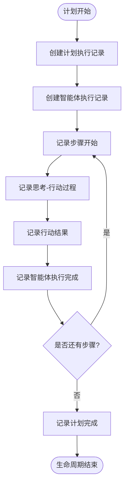
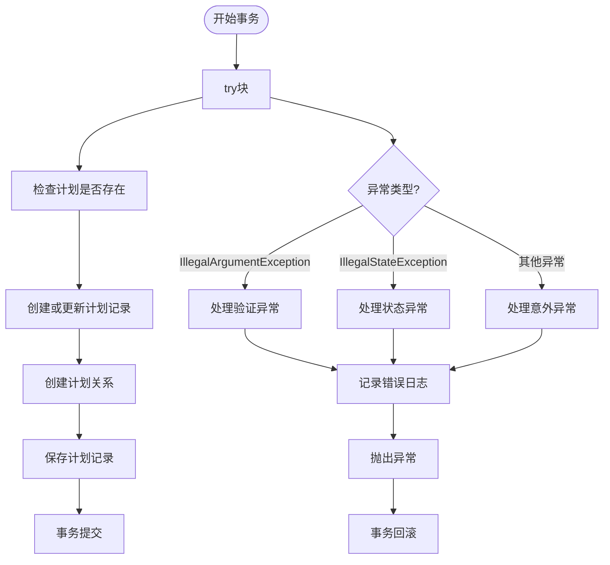
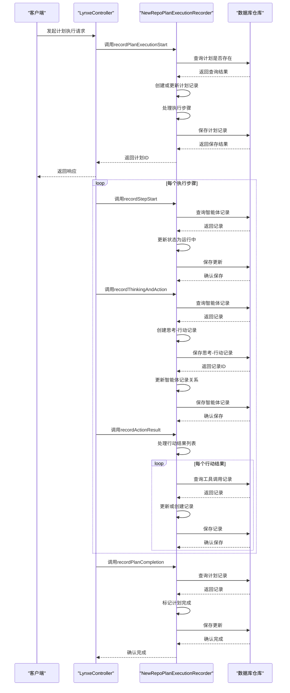
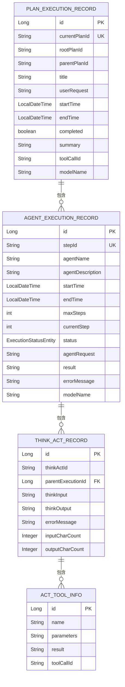
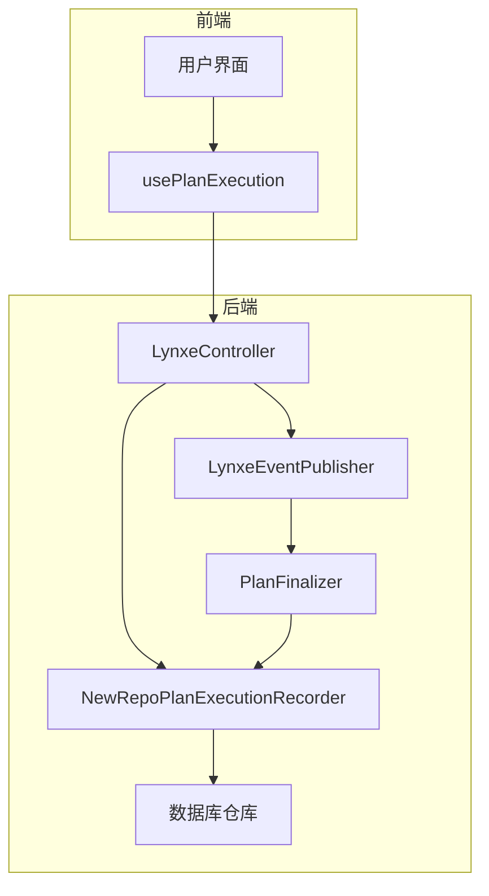

# 计划执行记录服务

<cite>
**本文档引用的文件**   
- [NewRepoPlanExecutionRecorder.java](file://src/main/java/com/alibaba/cloud/ai/lynxe/recorder/service/NewRepoPlanExecutionRecorder.java)
- [PlanExecutionRecorder.java](file://src/main/java/com/alibaba/cloud/ai/lynxe/recorder/service/PlanExecutionRecorder.java)
- [PlanExecutionRecordEntity.java](file://src/main/java/com/alibaba/cloud/ai/lynxe/recorder/entity/po/PlanExecutionRecordEntity.java)
- [AgentExecutionRecordEntity.java](file://src/main/java/com/alibaba/cloud/ai/lynxe/recorder/entity/po/AgentExecutionRecordEntity.java)
- [ThinkActRecordEntity.java](file://src/main/java/com/alibaba/cloud/ai/lynxe/recorder/entity/po/ThinkActRecordEntity.java)
- [ActToolInfoEntity.java](file://src/main/java/com/alibaba/cloud/ai/lynxe/recorder/entity/po/ActToolInfoEntity.java)
- [PlanExecutionRecordRepository.java](file://src/main/java/com/alibaba/cloud/ai/lynxe/recorder/repository/PlanExecutionRecordRepository.java)
- [AgentExecutionRecordRepository.java](file://src/main/java/com/alibaba/cloud/ai/lynxe/recorder/repository/AgentExecutionRecordRepository.java)
- [ThinkActRecordRepository.java](file://src/main/java/com/alibaba/cloud/ai/lynxe/recorder/repository/ThinkActRecordRepository.java)
- [ActToolInfoRepository.java](file://src/main/java/com/alibaba/cloud/ai/lynxe/recorder/repository/ActToolInfoRepository.java)
- [LynxeController.java](file://src/main/java/com/alibaba/cloud/ai/lynxe/runtime/controller/LynxeController.java)
- [PlanFinalizer.java](file://src/main/java/com/alibaba/cloud/ai/lynxe/planning/service/PlanFinalizer.java)
</cite>

## 目录
1. [引言](#引言)
2. [核心组件](#核心组件)
3. [执行记录生命周期](#执行记录生命周期)
4. [事务管理与异常处理](#事务管理与异常处理)
5. [服务调用时序图](#服务调用时序图)
6. [数据模型与持久化](#数据模型与持久化)
7. [集成与事件发布](#集成与事件发布)
8. [结论](#结论)

## 引言
计划执行记录服务是系统中负责捕获和持久化计划执行全过程的核心组件。该服务通过`NewRepoPlanExecutionRecorder`实现，能够完整记录计划从开始、中间步骤到完成的各个事件。服务采用分层数据模型，将计划执行过程分解为多个层次的记录，包括计划执行记录、智能体执行记录、思考-行动记录和工具调用信息。通过事务管理确保数据一致性，并提供完善的异常处理机制。该服务与系统其他组件紧密集成，通过事件发布机制实现松耦合的协作。

## 核心组件

`NewRepoPlanExecutionRecorder`服务实现了`PlanExecutionRecorder`接口，提供了记录计划执行全过程的核心功能。服务通过多个方法协同工作，完整记录执行过程：

- `recordPlanExecutionStart`: 记录计划执行的开始事件
- `recordStepStart`和`recordStepEnd`: 记录中间步骤的开始和结束
- `recordThinkingAndAction`: 记录思考和行动过程
- `recordActionResult`: 记录行动结果
- `recordCompleteAgentExecution`: 记录智能体执行完成
- `recordPlanCompletion`: 记录计划完成

服务通过依赖注入获取多个仓库实例，包括`PlanExecutionRecordRepository`、`AgentExecutionRecordRepository`、`ThinkActRecordRepository`和`ActToolInfoRepository`，用于与数据库进行交互。

**Section sources**
- [NewRepoPlanExecutionRecorder.java](file://src/main/java/com/alibaba/cloud/ai/lynxe/recorder/service/NewRepoPlanExecutionRecorder.java#L46-L857)
- [PlanExecutionRecorder.java](file://src/main/java/com/alibaba/cloud/ai/lynxe/recorder/service/PlanExecutionRecorder.java#L25-L242)

## 执行记录生命周期

计划执行记录的生命周期从计划开始到完成，经历多个阶段的数据写入和更新过程：

**Diagram sources**
- [NewRepoPlanExecutionRecorder.java](file://src/main/java/com/alibaba/cloud/ai/lynxe/recorder/service/NewRepoPlanExecutionRecorder.java#L74-L155)
- [NewRepoPlanExecutionRecorder.java](file://src/main/java/com/alibaba/cloud/ai/lynxe/recorder/service/NewRepoPlanExecutionRecorder.java#L291-L337)
- [NewRepoPlanExecutionRecorder.java](file://src/main/java/com/alibaba/cloud/ai/lynxe/recorder/service/NewRepoPlanExecutionRecorder.java#L387-L449)
- [NewRepoPlanExecutionRecorder.java](file://src/main/java/com/alibaba/cloud/ai/lynxe/recorder/service/NewRepoPlanExecutionRecorder.java#L605-L644)

**Section sources**
- [NewRepoPlanExecutionRecorder.java](file://src/main/java/com/alibaba/cloud/ai/lynxe/recorder/service/NewRepoPlanExecutionRecorder.java#L74-L644)

## 事务管理与异常处理

服务采用Spring的事务管理机制，确保数据操作的原子性和一致性。关键方法使用`@Transactional`注解，确保在发生异常时能够回滚事务。

服务实现了完善的异常处理机制，对不同类型的异常进行分类处理：
- 验证异常（IllegalArgumentException）：表示编程问题，直接重新抛出
- 状态异常（IllegalStateException）：表示系统问题，直接重新抛出
- 其他异常：包装为运行时异常抛出

**Diagram sources**
- [NewRepoPlanExecutionRecorder.java](file://src/main/java/com/alibaba/cloud/ai/lynxe/recorder/service/NewRepoPlanExecutionRecorder.java#L74-L155)
- [NewRepoPlanExecutionRecorder.java](file://src/main/java/com/alibaba/cloud/ai/lynxe/recorder/service/NewRepoPlanExecutionRecorder.java#L781-L853)

**Section sources**
- [NewRepoPlanExecutionRecorder.java](file://src/main/java/com/alibaba/cloud/ai/lynxe/recorder/service/NewRepoPlanExecutionRecorder.java#L74-L155)
- [NewRepoPlanExecutionRecorder.java](file://src/main/java/com/alibaba/cloud/ai/lynxe/recorder/service/NewRepoPlanExecutionRecorder.java#L781-L853)

## 服务调用时序图

服务通过控制器与其他组件集成，以下是计划执行记录服务的调用时序：

**Diagram sources**
- [NewRepoPlanExecutionRecorder.java](file://src/main/java/com/alibaba/cloud/ai/lynxe/recorder/service/NewRepoPlanExecutionRecorder.java#L74-L644)
- [LynxeController.java](file://src/main/java/com/alibaba/cloud/ai/lynxe/runtime/controller/LynxeController.java#L92-L146)

**Section sources**
- [NewRepoPlanExecutionRecorder.java](file://src/main/java/com/alibaba/cloud/ai/lynxe/recorder/service/NewRepoPlanExecutionRecorder.java#L74-L644)
- [LynxeController.java](file://src/main/java/com/alibaba/cloud/ai/lynxe/runtime/controller/LynxeController.java#L92-L146)

## 数据模型与持久化

服务采用分层数据模型，将计划执行过程分解为多个实体，通过JPA进行持久化。

主要实体包括：
- `PlanExecutionRecordEntity`: 计划执行记录实体，存储计划的基本信息和执行结果
- `AgentExecutionRecordEntity`: 智能体执行记录实体，存储智能体执行的详细信息
- `ThinkActRecordEntity`: 思考-行动记录实体，存储思考和行动过程的详细信息
- `ActToolInfoEntity`: 行动工具信息实体，存储工具调用的详细信息

**Diagram sources**
- [PlanExecutionRecordEntity.java](file://src/main/java/com/alibaba/cloud/ai/lynxe/recorder/entity/po/PlanExecutionRecordEntity.java#L42-L283)
- [AgentExecutionRecordEntity.java](file://src/main/java/com/alibaba/cloud/ai/lynxe/recorder/entity/po/AgentExecutionRecordEntity.java#L61-L275)
- [ThinkActRecordEntity.java](file://src/main/java/com/alibaba/cloud/ai/lynxe/recorder/entity/po/ThinkActRecordEntity.java#L53-L185)
- [ActToolInfoEntity.java](file://src/main/java/com/alibaba/cloud/ai/lynxe/recorder/entity/po/ActToolInfoEntity.java#L27-L118)

**Section sources**
- [PlanExecutionRecordEntity.java](file://src/main/java/com/alibaba/cloud/ai/lynxe/recorder/entity/po/PlanExecutionRecordEntity.java#L42-L283)
- [AgentExecutionRecordEntity.java](file://src/main/java/com/alibaba/cloud/ai/lynxe/recorder/entity/po/AgentExecutionRecordEntity.java#L61-L275)
- [ThinkActRecordEntity.java](file://src/main/java/com/alibaba/cloud/ai/lynxe/recorder/entity/po/ThinkActRecordEntity.java#L53-L185)
- [ActToolInfoEntity.java](file://src/main/java/com/alibaba/cloud/ai/lynxe/recorder/entity/po/ActToolInfoEntity.java#L27-L118)

## 集成与事件发布

计划执行记录服务与其他组件紧密集成，通过事件发布机制实现松耦合的协作。

服务通过`LynxeController`接收来自前端的请求，并通过`PlanFinalizer`在计划完成时生成摘要。事件发布机制允许其他组件监听计划执行事件，实现功能扩展。

**Diagram sources**
- [LynxeController.java](file://src/main/java/com/alibaba/cloud/ai/lynxe/runtime/controller/LynxeController.java#L92-L146)
- [PlanFinalizer.java](file://src/main/java/com/alibaba/cloud/ai/lynxe/planning/service/PlanFinalizer.java#L60-L89)
- [LynxeEventPublisher.java](file://src/main/java/com/alibaba/cloud/ai/lynxe/event/LynxeEventPublisher.java#L27-L66)

**Section sources**
- [LynxeController.java](file://src/main/java/com/alibaba/cloud/ai/lynxe/runtime/controller/LynxeController.java#L92-L146)
- [PlanFinalizer.java](file://src/main/java/com/alibaba/cloud/ai/lynxe/planning/service/PlanFinalizer.java#L60-L89)
- [LynxeEventPublisher.java](file://src/main/java/com/alibaba/cloud/ai/lynxe/event/LynxeEventPublisher.java#L27-L66)

## 结论
计划执行记录服务通过`NewRepoPlanExecutionRecorder`实现了完整的计划执行过程记录功能。服务采用分层数据模型，将复杂的执行过程分解为多个层次的记录，确保数据的完整性和可追溯性。通过Spring事务管理确保数据操作的原子性和一致性，并提供完善的异常处理机制。服务与其他组件通过清晰的接口和事件发布机制集成，实现了高内聚、低耦合的设计。该服务为系统的可观察性和调试能力提供了重要支持，是整个系统的核心基础设施之一。