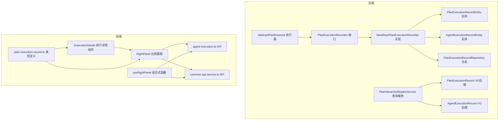
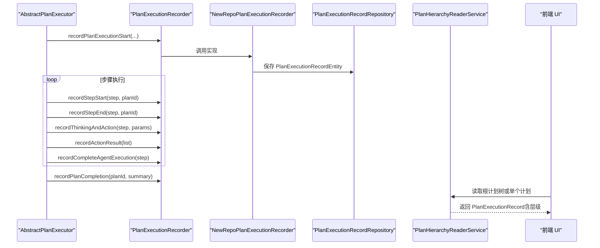
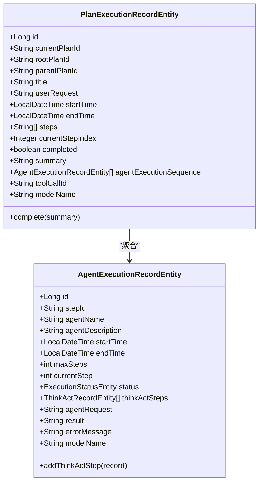
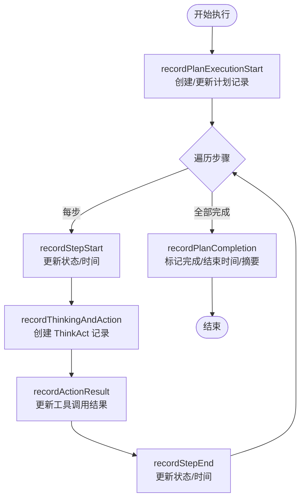
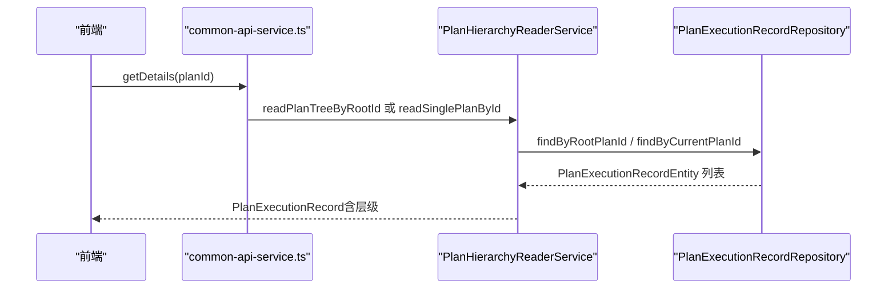
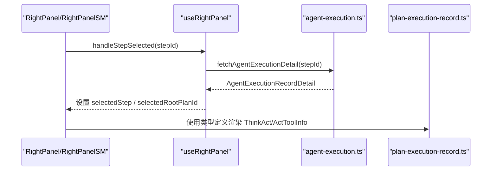
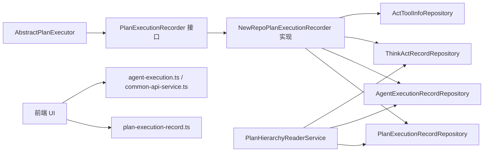

# 计划执行监控

<cite>
**本文引用的文件列表**
- [PlanExecutionRecorder 接口](file://src/main/java/com/alibaba/cloud/ai/lynxe/recorder/service/PlanExecutionRecorder.java)
- [NewRepoPlanExecutionRecorder 实现](file://src/main/java/com/alibaba/cloud/ai/lynxe/recorder/service/NewRepoPlanExecutionRecorder.java)
- [PlanHierarchyReaderService 查询服务](file://src/main/java/com/alibaba/cloud/ai/lynxe/recorder/service/PlanHierarchyReaderService.java)
- [PlanExecutionRecordEntity 实体](file://src/main/java/com/alibaba/cloud/ai/lynxe/recorder/entity/po/PlanExecutionRecordEntity.java)
- [AgentExecutionRecordEntity 实体](file://src/main/java/com/alibaba/cloud/ai/lynxe/recorder/entity/po/AgentExecutionRecordEntity.java)
- [PlanExecutionRecordRepository 仓库](file://src/main/java/com/alibaba/cloud/ai/lynxe/recorder/repository/PlanExecutionRecordRepository.java)
- [PlanExecutionRecord VO（后端）](file://src/main/java/com/alibaba/cloud/ai/lynxe/recorder/entity/vo/PlanExecutionRecord.java)
- [AgentExecutionRecord VO（后端）](file://src/main/java/com/alibaba/cloud/ai/lynxe/recorder/entity/vo/AgentExecutionRecord.java)
- [AbstractPlanExecutor 执行器](file://src/main/java/com/alibaba/cloud/ai/lynxe/runtime/executor/AbstractPlanExecutor.java)
- [plan-execution-record.ts 类型定义（前端）](file://ui-vue3/src/types/plan-execution-record.ts)
- [agent-execution.ts 前端 API](file://ui-vue3/src/api/agent-execution.ts)
- [common-api-service.ts 前端 API](file://ui-vue3/src/api/common-api-service.ts)
- [RightPanel 右侧面板（前端）](file://ui-vue3/src/components/right-panel/RightPanel.vue)
- [RightPanelSM 右侧面板（前端）](file://ui-vue3/src/components/right-panel/RightPanelSM.vue)
- [ExecutionDetails 执行详情组件（前端）](file://ui-vue3/src/components/chat/ExecutionDetails.vue)
- [useRightPanel 组合式函数（前端）](file://ui-vue3/src/composables/useRightPanel.ts)
</cite>

## 目录
1. [简介](#简介)
2. [项目结构](#项目结构)
3. [核心组件](#核心组件)
4. [架构总览](#架构总览)
5. [详细组件分析](#详细组件分析)
6. [依赖关系分析](#依赖关系分析)
7. [性能考量](#性能考量)
8. [故障排查指南](#故障排查指南)
9. [结论](#结论)
10. [附录](#附录)

## 简介
本文件面向“计划执行监控”能力，系统性阐述 PlanExecutionRecord 核心数据结构设计、PlanExecutionRecorder 服务的事件捕获与持久化流程、查询接口与数据检索模式、以及前端 UI 如何通过 plan-execution-record.ts 类型定义与后端执行记录交互。同时给出监控数据的存储策略、性能优化建议、状态分析与异常诊断方法，以及可视化与查询示例。

## 项目结构
围绕“计划执行监控”，后端由“记录接口/实现 + 实体/VO + 仓库 + 查询服务 + 运行时执行器”构成；前端通过类型定义与 API 与后端交互，右侧面板展示执行详情与子计划树。

图表来源
- [PlanExecutionRecorder 接口](file://src/main/java/com/alibaba/cloud/ai/lynxe/recorder/service/PlanExecutionRecorder.java#L1-L242)
- [NewRepoPlanExecutionRecorder 实现](file://src/main/java/com/alibaba/cloud/ai/lynxe/recorder/service/NewRepoPlanExecutionRecorder.java#L1-L857)
- [PlanExecutionRecordEntity 实体](file://src/main/java/com/alibaba/cloud/ai/lynxe/recorder/entity/po/PlanExecutionRecordEntity.java#L1-L283)
- [AgentExecutionRecordEntity 实体](file://src/main/java/com/alibaba/cloud/ai/lynxe/recorder/entity/po/AgentExecutionRecordEntity.java#L1-L275)
- [PlanExecutionRecordRepository 仓库](file://src/main/java/com/alibaba/cloud/ai/lynxe/recorder/repository/PlanExecutionRecordRepository.java#L1-L55)
- [PlanExecutionRecord VO（后端）](file://src/main/java/com/alibaba/cloud/ai/lynxe/recorder/entity/vo/PlanExecutionRecord.java#L1-L337)
- [AgentExecutionRecord VO（后端）](file://src/main/java/com/alibaba/cloud/ai/lynxe/recorder/entity/vo/AgentExecutionRecord.java#L1-L318)
- [AbstractPlanExecutor 执行器](file://src/main/java/com/alibaba/cloud/ai/lynxe/runtime/executor/AbstractPlanExecutor.java#L1-L200)
- [plan-execution-record.ts 类型定义（前端）](file://ui-vue3/src/types/plan-execution-record.ts#L1-L288)
- [agent-execution.ts 前端 API](file://ui-vue3/src/api/agent-execution.ts#L1-L44)
- [common-api-service.ts 前端 API](file://ui-vue3/src/api/common-api-service.ts#L1-L38)
- [RightPanel 右侧面板（前端）](file://ui-vue3/src/components/right-panel/RightPanel.vue#L343-L981)
- [ExecutionDetails 执行详情组件（前端）](file://ui-vue3/src/components/chat/ExecutionDetails.vue#L209-L266)
- [useRightPanel 组合式函数（前端）](file://ui-vue3/src/composables/useRightPanel.ts#L150-L190)

章节来源
- [PlanExecutionRecorder 接口](file://src/main/java/com/alibaba/cloud/ai/lynxe/recorder/service/PlanExecutionRecorder.java#L1-L242)
- [NewRepoPlanExecutionRecorder 实现](file://src/main/java/com/alibaba/cloud/ai/lynxe/recorder/service/NewRepoPlanExecutionRecorder.java#L1-L857)
- [PlanExecutionRecordEntity 实体](file://src/main/java/com/alibaba/cloud/ai/lynxe/recorder/entity/po/PlanExecutionRecordEntity.java#L1-L283)
- [AgentExecutionRecordEntity 实体](file://src/main/java/com/alibaba/cloud/ai/lynxe/recorder/entity/po/AgentExecutionRecordEntity.java#L1-L275)
- [PlanExecutionRecordRepository 仓库](file://src/main/java/com/alibaba/cloud/ai/lynxe/recorder/repository/PlanExecutionRecordRepository.java#L1-L55)
- [PlanExecutionRecord VO（后端）](file://src/main/java/com/alibaba/cloud/ai/lynxe/recorder/entity/vo/PlanExecutionRecord.java#L1-L337)
- [AgentExecutionRecord VO（后端）](file://src/main/java/com/alibaba/cloud/ai/lynxe/recorder/entity/vo/AgentExecutionRecord.java#L1-L318)
- [AbstractPlanExecutor 执行器](file://src/main/java/com/alibaba/cloud/ai/lynxe/runtime/executor/AbstractPlanExecutor.java#L1-L200)
- [plan-execution-record.ts 类型定义（前端）](file://ui-vue3/src/types/plan-execution-record.ts#L1-L288)
- [agent-execution.ts 前端 API](file://ui-vue3/src/api/agent-execution.ts#L1-L44)
- [common-api-service.ts 前端 API](file://ui-vue3/src/api/common-api-service.ts#L1-L38)
- [RightPanel 右侧面板（前端）](file://ui-vue3/src/components/right-panel/RightPanel.vue#L343-L981)
- [ExecutionDetails 执行详情组件（前端）](file://ui-vue3/src/components/chat/ExecutionDetails.vue#L209-L266)
- [useRightPanel 组合式函数（前端）](file://ui-vue3/src/composables/useRightPanel.ts#L150-L190)

## 核心组件
- PlanExecutionRecord 核心数据结构：后端 PO/VO 分层，PO 负责数据库持久化，VO 提供序列化与前端兼容字段（如 currentStepIndex 动态计算、computed 字段等）。
- PlanExecutionRecorder 接口与实现：统一记录入口，覆盖“计划开始/结束”、“步骤开始/结束”、“思考-行动”、“动作结果”、“完整代理执行”等关键事件。
- PlanHierarchyReaderService：按根计划 ID 构建层级树，将子计划挂载到对应代理执行记录下，支持前端递归渲染。
- 前端类型与 API：通过 plan-execution-record.ts 与后端 VO 对齐；通过 agent-execution.ts/common-api-service.ts 拉取详情与根计划树。

章节来源
- [PlanExecutionRecord VO（后端）](file://src/main/java/com/alibaba/cloud/ai/lynxe/recorder/entity/vo/PlanExecutionRecord.java#L1-L337)
- [PlanExecutionRecorder 接口](file://src/main/java/com/alibaba/cloud/ai/lynxe/recorder/service/PlanExecutionRecorder.java#L1-L242)
- [NewRepoPlanExecutionRecorder 实现](file://src/main/java/com/alibaba/cloud/ai/lynxe/recorder/service/NewRepoPlanExecutionRecorder.java#L1-L857)
- [PlanHierarchyReaderService 查询服务](file://src/main/java/com/alibaba/cloud/ai/lynxe/recorder/service/PlanHierarchyReaderService.java#L1-L467)
- [plan-execution-record.ts 类型定义（前端）](file://ui-vue3/src/types/plan-execution-record.ts#L1-L288)
- [agent-execution.ts 前端 API](file://ui-vue3/src/api/agent-execution.ts#L1-L44)
- [common-api-service.ts 前端 API](file://ui-vue3/src/api/common-api-service.ts#L1-L38)

## 架构总览
后端执行器在执行过程中调用 PlanExecutionRecorder 记录关键事件；NewRepoPlanExecutionRecorder 将事件转换为实体并持久化；PlanHierarchyReaderService 将 PO/VO 转换为带层级的 PlanExecutionRecord；前端通过 API 获取详情并渲染。

图表来源
- [AbstractPlanExecutor 执行器](file://src/main/java/com/alibaba/cloud/ai/lynxe/runtime/executor/AbstractPlanExecutor.java#L90-L166)
- [PlanExecutionRecorder 接口](file://src/main/java/com/alibaba/cloud/ai/lynxe/recorder/service/PlanExecutionRecorder.java#L1-L242)
- [NewRepoPlanExecutionRecorder 实现](file://src/main/java/com/alibaba/cloud/ai/lynxe/recorder/service/NewRepoPlanExecutionRecorder.java#L1-L857)
- [PlanExecutionRecordRepository 仓库](file://src/main/java/com/alibaba/cloud/ai/lynxe/recorder/repository/PlanExecutionRecordRepository.java#L1-L55)
- [PlanHierarchyReaderService 查询服务](file://src/main/java/com/alibaba/cloud/ai/lynxe/recorder/service/PlanHierarchyReaderService.java#L1-L467)
- [common-api-service.ts 前端 API](file://ui-vue3/src/api/common-api-service.ts#L1-L38)
- [agent-execution.ts 前端 API](file://ui-vue3/src/api/agent-execution.ts#L1-L44)

## 详细组件分析

### PlanExecutionRecord 数据结构设计
- 后端 PO 层（PlanExecutionRecordEntity）：包含计划标识、标题、请求内容、起止时间、步骤列表、当前步索引、完成状态与摘要、代理执行序列、层级关系字段（rootPlanId、parentPlanId、toolCallId）、模型名等。
- 后端 VO 层（PlanExecutionRecord）：提供序列化控制、动态 currentStepIndex 计算逻辑（基于代理执行序列状态），以及前端友好字段（如 status、progress、message 等）。
- 代理执行记录（AgentExecutionRecordEntity/VO）：记录代理名称、描述、起止时间、最大步数、当前步、状态、请求内容、结果、错误信息、模型名、think-act 步骤列表等。

图表来源
- [PlanExecutionRecordEntity 实体](file://src/main/java/com/alibaba/cloud/ai/lynxe/recorder/entity/po/PlanExecutionRecordEntity.java#L1-L283)
- [AgentExecutionRecordEntity 实体](file://src/main/java/com/alibaba/cloud/ai/lynxe/recorder/entity/po/AgentExecutionRecordEntity.java#L1-L275)

章节来源
- [PlanExecutionRecordEntity 实体](file://src/main/java/com/alibaba/cloud/ai/lynxe/recorder/entity/po/PlanExecutionRecordEntity.java#L1-L283)
- [AgentExecutionRecordEntity 实体](file://src/main/java/com/alibaba/cloud/ai/lynxe/recorder/entity/po/AgentExecutionRecordEntity.java#L1-L275)
- [PlanExecutionRecord VO（后端）](file://src/main/java/com/alibaba/cloud/ai/lynxe/recorder/entity/vo/PlanExecutionRecord.java#L1-L337)
- [AgentExecutionRecord VO（后端）](file://src/main/java/com/alibaba/cloud/ai/lynxe/recorder/entity/vo/AgentExecutionRecord.java#L1-L318)

### PlanExecutionRecorder 事件捕获与持久化
- 计划生命周期：
  - recordPlanExecutionStart：创建/更新计划记录，写入标题、请求、起始时间、步骤列表，建立层级关系（rootPlanId、parentPlanId、toolCallId）。
  - recordPlanCompletion：标记计划完成，设置结束时间与摘要。
- 步骤生命周期：
  - recordStepStart/recordStepEnd：更新代理执行记录状态与时间，维护 currentStep。
  - recordCompleteAgentExecution：根据代理最终状态设置完成状态、结果、错误信息。
- 思考-行动与动作结果：
  - recordThinkingAndAction：为代理创建 ThinkActRecord 并关联 ActToolInfo 列表。
  - recordActionResult：按 toolCallId 更新 ActToolInfo 的结果字段。
- 查询细节：
  - getAgentExecutionDetail：按 stepId 获取代理执行详情，包含 ThinkActRecord 列表与 ActToolInfo 结果。

图表来源
- [PlanExecutionRecorder 接口](file://src/main/java/com/alibaba/cloud/ai/lynxe/recorder/service/PlanExecutionRecorder.java#L1-L242)
- [NewRepoPlanExecutionRecorder 实现](file://src/main/java/com/alibaba/cloud/ai/lynxe/recorder/service/NewRepoPlanExecutionRecorder.java#L1-L857)
- [AbstractPlanExecutor 执行器](file://src/main/java/com/alibaba/cloud/ai/lynxe/runtime/executor/AbstractPlanExecutor.java#L90-L166)

章节来源
- [PlanExecutionRecorder 接口](file://src/main/java/com/alibaba/cloud/ai/lynxe/recorder/service/PlanExecutionRecorder.java#L1-L242)
- [NewRepoPlanExecutionRecorder 实现](file://src/main/java/com/alibaba/cloud/ai/lynxe/recorder/service/NewRepoPlanExecutionRecorder.java#L1-L857)
- [AbstractPlanExecutor 执行器](file://src/main/java/com/alibaba/cloud/ai/lynxe/runtime/executor/AbstractPlanExecutor.java#L90-L166)

### 查询接口与数据检索模式
- 按根计划 ID 读取整棵子计划树：PlanHierarchyReaderService.readPlanTreeByRootId，构建 PlanExecutionRecord 树并填充每个代理的 subPlanExecutionRecords。
- 按当前计划 ID 读取单个计划：readSinglePlanById。
- 按 stepId 读取代理执行详情：getAgentExecutionDetail，返回 ThinkActRecord 列表与 ActToolInfo 结果。
- 前端 API：
  - /api/executor/details/{planId}：获取根计划树或单个计划详情。
  - /api/executor/agent-execution/{stepId}：获取代理执行详情。

图表来源
- [PlanHierarchyReaderService 查询服务](file://src/main/java/com/alibaba/cloud/ai/lynxe/recorder/service/PlanHierarchyReaderService.java#L1-L467)
- [PlanExecutionRecordRepository 仓库](file://src/main/java/com/alibaba/cloud/ai/lynxe/recorder/repository/PlanExecutionRecordRepository.java#L1-L55)
- [common-api-service.ts 前端 API](file://ui-vue3/src/api/common-api-service.ts#L1-L38)

章节来源
- [PlanHierarchyReaderService 查询服务](file://src/main/java/com/alibaba/cloud/ai/lynxe/recorder/service/PlanHierarchyReaderService.java#L1-L467)
- [PlanExecutionRecordRepository 仓库](file://src/main/java/com/alibaba/cloud/ai/lynxe/recorder/repository/PlanExecutionRecordRepository.java#L1-L55)
- [common-api-service.ts 前端 API](file://ui-vue3/src/api/common-api-service.ts#L1-L38)

### 前端 UI 与后端类型对齐
- plan-execution-record.ts 定义了 ExecutionStatus、ActToolInfo、ThinkActRecord、AgentExecutionRecord、PlanExecutionRecord 等类型，与后端 VO 字段一一对应，便于前端渲染与交互。
- 右侧面板 RightPanel/RightPanelSM 通过 useRightPanel 组合式函数选择 stepId，调用 agent-execution.ts 获取代理执行详情，并在 ExecutionDetails 中展示 ThinkAct 步骤与工具调用参数。

图表来源
- [RightPanel 右侧面板（前端）](file://ui-vue3/src/components/right-panel/RightPanel.vue#L343-L981)
- [RightPanelSM 右侧面板（前端）](file://ui-vue3/src/components/right-panel/RightPanelSM.vue#L271-L981)
- [useRightPanel 组合式函数（前端）](file://ui-vue3/src/composables/useRightPanel.ts#L150-L190)
- [agent-execution.ts 前端 API](file://ui-vue3/src/api/agent-execution.ts#L1-L44)
- [plan-execution-record.ts 类型定义（前端）](file://ui-vue3/src/types/plan-execution-record.ts#L1-L288)

章节来源
- [plan-execution-record.ts 类型定义（前端）](file://ui-vue3/src/types/plan-execution-record.ts#L1-L288)
- [agent-execution.ts 前端 API](file://ui-vue3/src/api/agent-execution.ts#L1-L44)
- [RightPanel 右侧面板（前端）](file://ui-vue3/src/components/right-panel/RightPanel.vue#L343-L981)
- [RightPanelSM 右侧面板（前端）](file://ui-vue3/src/components/right-panel/RightPanelSM.vue#L271-L981)
- [useRightPanel 组合式函数（前端）](file://ui-vue3/src/composables/useRightPanel.ts#L150-L190)

## 依赖关系分析
- 执行器依赖 PlanExecutionRecorder 接口，具体实现由 NewRepoPlanExecutionRecorder 提供。
- NewRepoPlanExecutionRecorder 依赖多个仓库（PlanExecutionRecordRepository、AgentExecutionRecordRepository、ThinkActRecordRepository、ActToolInfoRepository）进行持久化。
- PlanHierarchyReaderService 依赖仓库与实体/VO 转换，构建层级树。
- 前端类型与 API 与后端 VO/接口保持一致，确保跨端一致性。

图表来源
- [AbstractPlanExecutor 执行器](file://src/main/java/com/alibaba/cloud/ai/lynxe/runtime/executor/AbstractPlanExecutor.java#L1-L200)
- [PlanExecutionRecorder 接口](file://src/main/java/com/alibaba/cloud/ai/lynxe/recorder/service/PlanExecutionRecorder.java#L1-L242)
- [NewRepoPlanExecutionRecorder 实现](file://src/main/java/com/alibaba/cloud/ai/lynxe/recorder/service/NewRepoPlanExecutionRecorder.java#L1-L857)
- [PlanExecutionRecordRepository 仓库](file://src/main/java/com/alibaba/cloud/ai/lynxe/recorder/repository/PlanExecutionRecordRepository.java#L1-L55)
- [PlanHierarchyReaderService 查询服务](file://src/main/java/com/alibaba/cloud/ai/lynxe/recorder/service/PlanHierarchyReaderService.java#L1-L467)
- [plan-execution-record.ts 类型定义（前端）](file://ui-vue3/src/types/plan-execution-record.ts#L1-L288)
- [agent-execution.ts 前端 API](file://ui-vue3/src/api/agent-execution.ts#L1-L44)
- [common-api-service.ts 前端 API](file://ui-vue3/src/api/common-api-service.ts#L1-L38)

章节来源
- [AbstractPlanExecutor 执行器](file://src/main/java/com/alibaba/cloud/ai/lynxe/runtime/executor/AbstractPlanExecutor.java#L1-L200)
- [PlanExecutionRecorder 接口](file://src/main/java/com/alibaba/cloud/ai/lynxe/recorder/service/PlanExecutionRecorder.java#L1-L242)
- [NewRepoPlanExecutionRecorder 实现](file://src/main/java/com/alibaba/cloud/ai/lynxe/recorder/service/NewRepoPlanExecutionRecorder.java#L1-L857)
- [PlanExecutionRecordRepository 仓库](file://src/main/java/com/alibaba/cloud/ai/lynxe/recorder/repository/PlanExecutionRecordRepository.java#L1-L55)
- [PlanHierarchyReaderService 查询服务](file://src/main/java/com/alibaba/cloud/ai/lynxe/recorder/service/PlanHierarchyReaderService.java#L1-L467)
- [plan-execution-record.ts 类型定义（前端）](file://ui-vue3/src/types/plan-execution-record.ts#L1-L288)
- [agent-execution.ts 前端 API](file://ui-vue3/src/api/agent-execution.ts#L1-L44)
- [common-api-service.ts 前端 API](file://ui-vue3/src/api/common-api-service.ts#L1-L38)

## 性能考量
- 事务边界：NewRepoPlanExecutionRecorder 在关键路径使用 @Transactional，保证事件写入的一致性与原子性。
- 查询优化：
  - PlanExecutionRecordRepository 提供按 currentPlanId、parentPlanId、rootPlanId 的查询，便于快速定位计划树。
  - PlanHierarchyReaderService 在构建层级时使用 Map 快速查找，减少重复扫描。
  - ThinkActRecordRepository 支持按父执行 ID 与 ActToolInfo 关系查询，避免全表扫描。
- 日志与告警：实现中广泛使用 SLF4J 记录关键事件与异常，便于问题定位与性能分析。
- 前端缓存与刷新：useRightPanel 在切换 stepId 时触发刷新，避免重复请求；右侧面板提供“执行中/已完成/待执行”状态指示，提升用户体验。

章节来源
- [NewRepoPlanExecutionRecorder 实现](file://src/main/java/com/alibaba/cloud/ai/lynxe/recorder/service/NewRepoPlanExecutionRecorder.java#L1-L857)
- [PlanExecutionRecordRepository 仓库](file://src/main/java/com/alibaba/cloud/ai/lynxe/recorder/repository/PlanExecutionRecordRepository.java#L1-L55)
- [PlanHierarchyReaderService 查询服务](file://src/main/java/com/alibaba/cloud/ai/lynxe/recorder/service/PlanHierarchyReaderService.java#L1-L467)
- [useRightPanel 组合式函数（前端）](file://ui-vue3/src/composables/useRightPanel.ts#L150-L190)
- [RightPanel 右侧面板（前端）](file://ui-vue3/src/components/right-panel/RightPanel.vue#L343-L981)

## 故障排查指南
- 计划未完成或状态异常：
  - 检查 recordPlanCompletion 是否被调用；确认 PlanExecutionRecordEntity 的 completed 与 endTime 是否正确设置。
  - 查看 PlanExecutionRecord VO 的 currentStepIndex 是否按预期更新。
- 步骤状态不一致：
  - 确认 recordStepStart/recordStepEnd 是否成对调用；检查 AgentExecutionRecordEntity 的状态与时间字段是否更新。
- 思考-行动与动作结果缺失：
  - 确认 recordThinkingAndAction 已创建 ThinkActRecord，并且 ActToolInfoRepository 中存在对应 toolCallId。
  - recordActionResult 应按 toolCallId 更新 ActToolInfo 的 result 字段。
- 子计划层级不显示：
  - PlanHierarchyReaderService 通过 ActToolInfo 与 ThinkActRecord 的 parentExecutionId 关联子计划；若无结果，检查 ActToolInfo/toolCallId 是否正确。
- 前端无法获取详情：
  - 确认 /api/executor/agent-execution/{stepId} 与 /api/executor/details/{planId} 的路径与权限配置正确；查看 useRightPanel 的错误日志与 toast 提示。

章节来源
- [PlanExecutionRecorder 接口](file://src/main/java/com/alibaba/cloud/ai/lynxe/recorder/service/PlanExecutionRecorder.java#L1-L242)
- [NewRepoPlanExecutionRecorder 实现](file://src/main/java/com/alibaba/cloud/ai/lynxe/recorder/service/NewRepoPlanExecutionRecorder.java#L1-L857)
- [PlanHierarchyReaderService 查询服务](file://src/main/java/com/alibaba/cloud/ai/lynxe/recorder/service/PlanHierarchyReaderService.java#L1-L467)
- [agent-execution.ts 前端 API](file://ui-vue3/src/api/agent-execution.ts#L1-L44)
- [common-api-service.ts 前端 API](file://ui-vue3/src/api/common-api-service.ts#L1-L38)
- [useRightPanel 组合式函数（前端）](file://ui-vue3/src/composables/useRightPanel.ts#L150-L190)

## 结论
本方案以 PlanExecutionRecord 为核心，通过 PlanExecutionRecorder 统一捕获执行事件并持久化，结合 PlanHierarchyReaderService 构建层级树，前端通过类型与 API 实现可视化与交互。整体具备良好的扩展性与可观测性，适合在复杂计划执行场景中进行状态跟踪、异常诊断与性能优化。

## 附录
- 监控数据查询示例（后端）：
  - 读取根计划树：PlanHierarchyReaderService.readPlanTreeByRootId(rootPlanId)
  - 读取单个计划：PlanHierarchyReaderService.readSinglePlanById(currentPlanId)
  - 获取代理执行详情：NewRepoPlanExecutionRecorder.getAgentExecutionDetail(stepId)
- 前端查询示例（前端）：
  - 获取计划详情：common-api-service.ts.getDetails(planId)
  - 获取代理执行详情：agent-execution.ts.fetchAgentExecutionDetail(stepId)
- 可视化建议：
  - 使用 RightPanel/RightPanelSM 展示计划树与代理执行状态；
  - 在 ExecutionDetails 中以树形组件递归渲染子计划与 ThinkAct 步骤；
  - 前端可增加“执行进度条”“错误计数”“平均响应时间”等指标卡片。