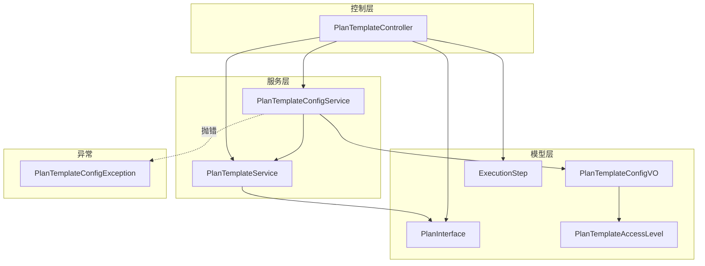
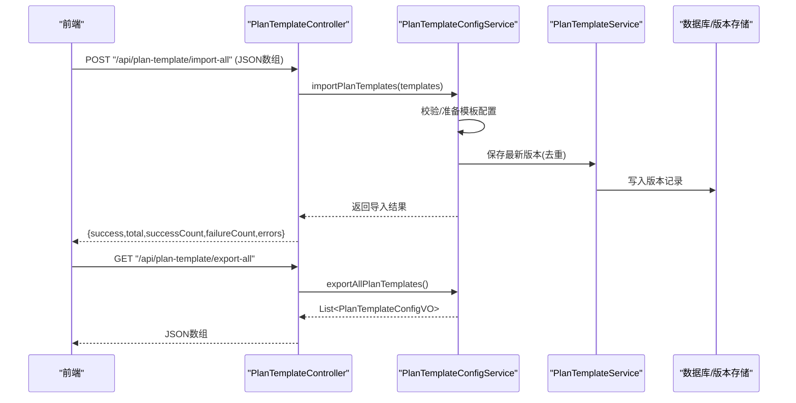
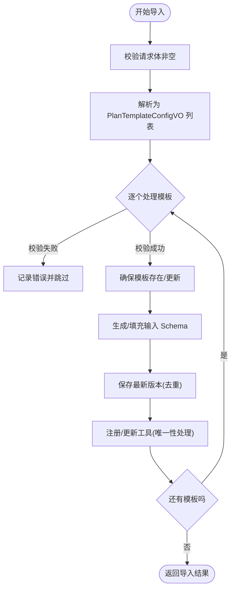
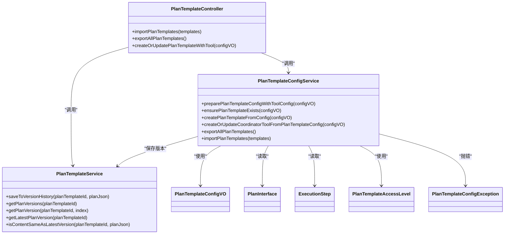

# 计划模板导入导出

<cite>
**本文引用的文件列表**
- [PlanTemplateController.java](file://src/main/java/com/alibaba/cloud/ai/lynxe/planning/controller/PlanTemplateController.java)
- [PlanTemplateConfigService.java](file://src/main/java/com/alibaba/cloud/ai/lynxe/planning/service/PlanTemplateConfigService.java)
- [PlanTemplateService.java](file://src/main/java/com/alibaba/cloud/ai/lynxe/planning/service/PlanTemplateService.java)
- [PlanTemplateConfigVO.java](file://src/main/java/com/alibaba/cloud/ai/lynxe/planning/model/vo/PlanTemplateConfigVO.java)
- [PlanTemplateAccessLevel.java](file://src/main/java/com/alibaba/cloud/ai/lynxe/planning/model/enums/PlanTemplateAccessLevel.java)
- [PlanInterface.java](file://src/main/java/com/alibaba/cloud/ai/lynxe/runtime/entity/vo/PlanInterface.java)
- [ExecutionStep.java](file://src/main/java/com/alibaba/cloud/ai/lynxe/runtime/entity/vo/ExecutionStep.java)
- [IPlanTemplateService.java](file://src/main/java/com/alibaba/cloud/ai/lynxe/planning/service/IPlanTemplateService.java)
- [PlanTemplateConfigException.java](file://src/main/java/com/alibaba/cloud/ai/lynxe/planning/exception/PlanTemplateConfigException.java)
- [plan-template-with-tool-api-service.ts](file://ui-vue3/src/api/plan-template-with-tool-api-service.ts)
- [usePlanTemplateImport.ts](file://ui-vue3/src/composables/usePlanTemplateImport.ts)
- [planTemplateConfig.vue](file://ui-vue3/src/views/configs/planTemplateConfig.vue)
</cite>

## 目录
1. [简介](#简介)
2. [项目结构与职责](#项目结构与职责)
3. [核心组件](#核心组件)
4. [架构总览](#架构总览)
5. [详细组件分析](#详细组件分析)
6. [依赖关系分析](#依赖关系分析)
7. [性能与可扩展性](#性能与可扩展性)
8. [故障排查指南](#故障排查指南)
9. [结论](#结论)
10. [附录：API与数据模型](#附录api与数据模型)

## 简介
本文件系统性梳理 JManus 中“计划模板导入导出”能力，围绕 PlanTemplateController 提供的 REST 接口进行说明，涵盖：
- 导入导出接口的设计与调用方式
- 请求/响应格式与错误码
- PlanTemplateConfigVO 在序列化/反序列化中的角色
- 导入时的参数校验与冲突处理策略（如模板覆盖规则）
- JSON 模板数据示例与前端调用参考
- 导出文件安全性与数据完整性保障，以及大规模迁移最佳实践

## 项目结构与职责
- 控制层：PlanTemplateController 负责对外暴露 REST API，处理导入导出、版本管理、模板查询等。
- 服务层：
  - PlanTemplateConfigService：负责模板配置对象的准备、校验、模板与工具注册、导入导出协调。
  - PlanTemplateService：负责版本历史保存、版本检索、内容去重比较。
- 模型层：
  - PlanTemplateConfigVO：模板配置的序列化载体，包含步骤、工具配置、访问级别等。
  - PlanInterface/ExecutionStep：运行时计划接口与执行步骤，用于从 JSON 反序列化得到的计划对象。
  - PlanTemplateAccessLevel：模板访问级别枚举。
- 异常：PlanTemplateConfigException 提供结构化的错误码与消息。

图表来源
- [PlanTemplateController.java](file://src/main/java/com/alibaba/cloud/ai/lynxe/planning/controller/PlanTemplateController.java#L1-L661)
- [PlanTemplateConfigService.java](file://src/main/java/com/alibaba/cloud/ai/lynxe/planning/service/PlanTemplateConfigService.java#L1-L800)
- [PlanTemplateService.java](file://src/main/java/com/alibaba/cloud/ai/lynxe/planning/service/PlanTemplateService.java#L1-L206)
- [PlanTemplateConfigVO.java](file://src/main/java/com/alibaba/cloud/ai/lynxe/planning/model/vo/PlanTemplateConfigVO.java#L1-L426)
- [PlanTemplateAccessLevel.java](file://src/main/java/com/alibaba/cloud/ai/lynxe/planning/model/enums/PlanTemplateAccessLevel.java#L1-L80)
- [PlanInterface.java](file://src/main/java/com/alibaba/cloud/ai/lynxe/runtime/entity/vo/PlanInterface.java#L1-L183)
- [ExecutionStep.java](file://src/main/java/com/alibaba/cloud/ai/lynxe/runtime/entity/vo/ExecutionStep.java#L1-L179)
- [PlanTemplateConfigException.java](file://src/main/java/com/alibaba/cloud/ai/lynxe/planning/exception/PlanTemplateConfigException.java#L1-L60)

章节来源
- [PlanTemplateController.java](file://src/main/java/com/alibaba/cloud/ai/lynxe/planning/controller/PlanTemplateController.java#L1-L661)
- [PlanTemplateConfigService.java](file://src/main/java/com/alibaba/cloud/ai/lynxe/planning/service/PlanTemplateConfigService.java#L1-L800)
- [PlanTemplateService.java](file://src/main/java/com/alibaba/cloud/ai/lynxe/planning/service/PlanTemplateService.java#L1-L206)

## 核心组件
- PlanTemplateController：提供导入导出、版本管理、模板列表、删除、参数需求查询、模板与工具注册等接口。
- PlanTemplateConfigService：负责模板实体与配置对象之间的转换、输入参数 Schema 生成、模板与工具的创建/更新、导入导出协调。
- PlanTemplateService：负责版本历史的保存与检索，避免重复版本写入，提供 JSON 内容语义等价性比较。
- PlanTemplateConfigVO：模板配置的 JSON 序列化载体，包含步骤、工具配置、访问级别等字段。
- PlanInterface/ExecutionStep：运行时计划接口与步骤，用于从 JSON 反序列化得到的计划对象，支撑参数提取与版本比较。
- PlanTemplateAccessLevel：模板访问级别枚举（只读/可编辑）。
- PlanTemplateConfigException：统一的配置异常，携带错误码。

章节来源
- [PlanTemplateController.java](file://src/main/java/com/alibaba/cloud/ai/lynxe/planning/controller/PlanTemplateController.java#L1-L661)
- [PlanTemplateConfigService.java](file://src/main/java/com/alibaba/cloud/ai/lynxe/planning/service/PlanTemplateConfigService.java#L1-L800)
- [PlanTemplateService.java](file://src/main/java/com/alibaba/cloud/ai/lynxe/planning/service/PlanTemplateService.java#L1-L206)
- [PlanTemplateConfigVO.java](file://src/main/java/com/alibaba/cloud/ai/lynxe/planning/model/vo/PlanTemplateConfigVO.java#L1-L426)
- [PlanTemplateAccessLevel.java](file://src/main/java/com/alibaba/cloud/ai/lynxe/planning/model/enums/PlanTemplateAccessLevel.java#L1-L80)
- [PlanInterface.java](file://src/main/java/com/alibaba/cloud/ai/lynxe/runtime/entity/vo/PlanInterface.java#L1-L183)
- [ExecutionStep.java](file://src/main/java/com/alibaba/cloud/ai/lynxe/runtime/entity/vo/ExecutionStep.java#L1-L179)
- [PlanTemplateConfigException.java](file://src/main/java/com/alibaba/cloud/ai/lynxe/planning/exception/PlanTemplateConfigException.java#L1-L60)

## 架构总览
导入导出流程由前端触发，经由 PlanTemplateController 调用 PlanTemplateConfigService 完成模板与工具的创建/更新，同时通过 PlanTemplateService 保存版本历史；导出则直接返回 PlanTemplateConfigVO 列表。

图表来源
- [PlanTemplateController.java](file://src/main/java/com/alibaba/cloud/ai/lynxe/planning/controller/PlanTemplateController.java#L539-L577)
- [PlanTemplateConfigService.java](file://src/main/java/com/alibaba/cloud/ai/lynxe/planning/service/PlanTemplateConfigService.java#L1-L800)
- [PlanTemplateService.java](file://src/main/java/com/alibaba/cloud/ai/lynxe/planning/service/PlanTemplateService.java#L1-L206)

## 详细组件分析

### 导入导出 REST API 设计
- 基础路径：/api/plan-template
- 导入接口
  - 方法：POST
  - 路径：/import-all
  - 请求体：JSON 数组，元素为 PlanTemplateConfigVO
  - 响应：包含 success、total、successCount、failureCount、errors 的对象
- 导出接口
  - 方法：GET
  - 路径：/export-all
  - 响应：JSON 数组，元素为 PlanTemplateConfigVO
- 其他相关接口（与导入导出协同）
  - GET /list-config：返回所有模板的配置对象（含步骤、工具配置）
  - GET /{planTemplateId}/config：按模板 ID 获取配置对象
  - POST /create-or-update-with-tool：以配置对象创建/更新模板并注册为工具
  - GET /list：列出模板基本信息
  - POST /delete：删除模板
  - GET /{planTemplateId}/parameters：获取模板参数占位符与需求

章节来源
- [PlanTemplateController.java](file://src/main/java/com/alibaba/cloud/ai/lynxe/planning/controller/PlanTemplateController.java#L539-L577)
- [PlanTemplateController.java](file://src/main/java/com/alibaba/cloud/ai/lynxe/planning/controller/PlanTemplateController.java#L534-L551)
- [PlanTemplateController.java](file://src/main/java/com/alibaba/cloud/ai/lynxe/planning/controller/PlanTemplateController.java#L449-L472)
- [PlanTemplateController.java](file://src/main/java/com/alibaba/cloud/ai/lynxe/planning/controller/PlanTemplateController.java#L284-L358)
- [PlanTemplateController.java](file://src/main/java/com/alibaba/cloud/ai/lynxe/planning/controller/PlanTemplateController.java#L360-L392)
- [PlanTemplateController.java](file://src/main/java/com/alibaba/cloud/ai/lynxe/planning/controller/PlanTemplateController.java#L580-L658)

### 请求格式与响应结构
- 导入请求体
  - 类型：数组
  - 元素：PlanTemplateConfigVO 对象
  - 字段要点：planTemplateId、title、steps、directResponse、planType、accessLevel、serviceGroup、toolConfig、createTime、updateTime
- 导出响应体
  - 类型：数组
  - 元素：PlanTemplateConfigVO 对象
- 成功响应通用字段
  - 导入：success、total、successCount、failureCount、errors
  - 导出：数组元素即为模板配置对象
- 失败响应
  - 导入：返回错误信息与 success=false
  - 导出：服务器内部错误时返回空或错误状态

章节来源
- [PlanTemplateController.java](file://src/main/java/com/alibaba/cloud/ai/lynxe/planning/controller/PlanTemplateController.java#L539-L577)
- [PlanTemplateController.java](file://src/main/java/com/alibaba/cloud/ai/lynxe/planning/controller/PlanTemplateController.java#L534-L551)

### 错误码定义
- VALIDATION_ERROR：参数校验失败（如 planTemplateId 缺失）
- DUPLICATE_TITLE：标题重复（唯一约束）
- NOT_FOUND：工具未找到
- INTERNAL_ERROR：内部异常

章节来源
- [PlanTemplateConfigException.java](file://src/main/java/com/alibaba/cloud/ai/lynxe/planning/exception/PlanTemplateConfigException.java#L1-L60)
- [PlanTemplateConfigService.java](file://src/main/java/com/alibaba/cloud/ai/lynxe/planning/service/PlanTemplateConfigService.java#L360-L401)
- [PlanTemplateConfigService.java](file://src/main/java/com/alibaba/cloud/ai/lynxe/planning/service/PlanTemplateConfigService.java#L472-L528)

### PlanTemplateConfigVO 的序列化与反序列化
- 作为导入/导出的数据载体，PlanTemplateConfigVO 承载模板元信息、步骤配置、工具配置与输入 Schema。
- 步骤配置 StepConfig 包含 stepRequirement、agentName、modelName、terminateColumns、selectedToolKeys。
- 工具配置 ToolConfigVO 包含 toolDescription、enableInternalToolcall、enableHttpService、enableInConversation、publishStatus、inputSchema。
- 输入 Schema 参数 InputSchemaParam 包含 name、description、type、required。
- 访问级别 accessLevel 使用 PlanTemplateAccessLevel 枚举，支持字符串反序列化与向后兼容的 readOnly 字段。

章节来源
- [PlanTemplateConfigVO.java](file://src/main/java/com/alibaba/cloud/ai/lynxe/planning/model/vo/PlanTemplateConfigVO.java#L1-L426)
- [PlanTemplateAccessLevel.java](file://src/main/java/com/alibaba/cloud/ai/lynxe/planning/model/enums/PlanTemplateAccessLevel.java#L1-L80)

### 导入时的参数验证与冲突处理
- 参数验证
  - 必填项：planTemplateId、title（默认“未命名计划”）、steps（默认空列表）、directResponse（默认 false）、planType（默认“dynamic_agent”）、accessLevel（默认可编辑）。
  - 工具配置：若缺失则自动补齐默认值；输入 Schema 若为空则根据模板参数自动生成。
- 冲突处理与覆盖规则
  - 模板实体存在性：若不存在则创建，否则更新标题与访问级别。
  - 版本保存：PlanTemplateService 会对比最新版本内容，若相同则不新增版本，避免冗余。
  - 工具注册：同一 serviceGroup + toolName 的工具若存在且 planTemplateId 不同，则先删除旧工具再创建新工具，确保唯一性。
  - 标题唯一性：违反唯一约束时抛出 DUPLICATE_TITLE。
- 异常传播：PlanTemplateConfigService 抛出 PlanTemplateConfigException，包含错误码与消息，控制器捕获并返回结构化错误。

图表来源
- [PlanTemplateController.java](file://src/main/java/com/alibaba/cloud/ai/lynxe/planning/controller/PlanTemplateController.java#L558-L577)
- [PlanTemplateConfigService.java](file://src/main/java/com/alibaba/cloud/ai/lynxe/planning/service/PlanTemplateConfigService.java#L1-L800)
- [PlanTemplateService.java](file://src/main/java/com/alibaba/cloud/ai/lynxe/planning/service/PlanTemplateService.java#L1-L206)

章节来源
- [PlanTemplateConfigService.java](file://src/main/java/com/alibaba/cloud/ai/lynxe/planning/service/PlanTemplateConfigService.java#L147-L221)
- [PlanTemplateConfigService.java](file://src/main/java/com/alibaba/cloud/ai/lynxe/planning/service/PlanTemplateConfigService.java#L257-L361)
- [PlanTemplateConfigService.java](file://src/main/java/com/alibaba/cloud/ai/lynxe/planning/service/PlanTemplateConfigService.java#L577-L680)
- [PlanTemplateService.java](file://src/main/java/com/alibaba/cloud/ai/lynxe/planning/service/PlanTemplateService.java#L90-L110)

### JSON 模板数据示例与调用参考
- 示例结构要点
  - planTemplateId：模板标识
  - title：模板标题
  - steps：步骤数组，每步包含 stepRequirement、agentName、modelName、terminateColumns、selectedToolKeys
  - directResponse：是否直返模式
  - planType：计划类型
  - accessLevel：访问级别
  - serviceGroup：服务分组
  - toolConfig：工具配置
  - createTime/updateTime：时间戳
- 前端调用参考
  - 导出：调用 GET /api/plan-template/export-all，下载返回的 JSON 数组
  - 导入：读取本地 JSON 文件为数组，调用 POST /api/plan-template/import-all
  - UI 组件参考：
    - 导出：planTemplateConfig.vue 中 handleExport
    - 导入：usePlanTemplateImport.ts 中 handleImport
    - API 封装：plan-template-with-tool-api-service.ts 中 exportAllPlanTemplates/importPlanTemplates

章节来源
- [planTemplateConfig.vue](file://ui-vue3/src/views/configs/planTemplateConfig.vue#L256-L288)
- [usePlanTemplateImport.ts](file://ui-vue3/src/composables/usePlanTemplateImport.ts#L66-L119)
- [plan-template-with-tool-api-service.ts](file://ui-vue3/src/api/plan-template-with-tool-api-service.ts#L131-L167)

### 导出文件安全性与数据完整性
- 安全性
  - 导出为纯文本 JSON 数组，无加密或签名；建议在受信网络内传输与存储。
  - 导入前可在前端做格式校验（数组、必填字段），并在服务端做二次校验。
- 数据完整性
  - 版本去重：PlanTemplateService 比较最新版本内容，避免重复写入。
  - JSON 比较：采用语义等价比较（忽略空白与顺序），提升比较准确性。
  - 工具唯一性：同一分组下同名工具仅保留一个，避免冲突。

章节来源
- [PlanTemplateService.java](file://src/main/java/com/alibaba/cloud/ai/lynxe/planning/service/PlanTemplateService.java#L162-L203)
- [PlanTemplateConfigService.java](file://src/main/java/com/alibaba/cloud/ai/lynxe/planning/service/PlanTemplateConfigService.java#L577-L680)

### 大规模模板迁移最佳实践
- 分批导入：将模板拆分为多个 JSON 文件，分批上传，便于监控与回滚。
- 预校验：在导入前对 JSON 进行格式与必填字段校验，减少失败重试。
- 并发控制：避免多用户同时导入导致工具名称冲突，建议串行或加锁。
- 回滚策略：利用版本历史回退到上一稳定版本。
- 审计日志：记录导入/导出操作与结果，便于追踪。

## 依赖关系分析
- 控制器依赖服务：PlanTemplateController 依赖 PlanTemplateConfigService 与 PlanTemplateService 完成导入导出与版本管理。
- 服务依赖模型：PlanTemplateConfigService 依赖 PlanTemplateConfigVO、PlanInterface、ExecutionStep、PlanTemplateAccessLevel。
- 版本比较：PlanTemplateService 通过 PlanTemplateVersionRepository 实现版本持久化与内容等价比较。
- 异常契约：PlanTemplateConfigService 抛出 PlanTemplateConfigException，控制器捕获并返回统一错误结构。

图表来源
- [PlanTemplateController.java](file://src/main/java/com/alibaba/cloud/ai/lynxe/planning/controller/PlanTemplateController.java#L1-L661)
- [PlanTemplateConfigService.java](file://src/main/java/com/alibaba/cloud/ai/lynxe/planning/service/PlanTemplateConfigService.java#L1-L800)
- [PlanTemplateService.java](file://src/main/java/com/alibaba/cloud/ai/lynxe/planning/service/PlanTemplateService.java#L1-L206)
- [PlanTemplateConfigVO.java](file://src/main/java/com/alibaba/cloud/ai/lynxe/planning/model/vo/PlanTemplateConfigVO.java#L1-L426)
- [PlanTemplateAccessLevel.java](file://src/main/java/com/alibaba/cloud/ai/lynxe/planning/model/enums/PlanTemplateAccessLevel.java#L1-L80)
- [PlanTemplateConfigException.java](file://src/main/java/com/alibaba/cloud/ai/lynxe/planning/exception/PlanTemplateConfigException.java#L1-L60)

章节来源
- [PlanTemplateController.java](file://src/main/java/com/alibaba/cloud/ai/lynxe/planning/controller/PlanTemplateController.java#L1-L661)
- [PlanTemplateConfigService.java](file://src/main/java/com/alibaba/cloud/ai/lynxe/planning/service/PlanTemplateConfigService.java#L1-L800)
- [PlanTemplateService.java](file://src/main/java/com/alibaba/cloud/ai/lynxe/planning/service/PlanTemplateService.java#L1-L206)

## 性能与可扩展性
- 版本去重：通过语义等价比较避免重复写入，降低存储与 IO 压力。
- 批量导入：一次导入多个模板，减少往返次数；建议分批处理以控制单次事务大小。
- 工具唯一性检查：按 serviceGroup + toolName 唯一，避免冲突带来的额外删除/创建开销。
- 建议
  - 大批量导入时开启事务边界控制，必要时拆分批次。
  - 对 JSON 比较失败的场景增加降级策略（如回退到字符串比较）。

[本节为通用指导，无需具体文件分析]

## 故障排查指南
- 常见错误
  - VALIDATION_ERROR：请求体为空或缺少 planTemplateId
  - DUPLICATE_TITLE：模板标题重复
  - NOT_FOUND：工具不存在或模板不存在
  - INTERNAL_ERROR：未知异常
- 排查步骤
  - 检查请求体格式与必填字段
  - 查看服务端日志定位异常位置
  - 使用 GET /list 或 /list-config 核对模板是否存在
  - 使用 /versions 与 /get-version 核对版本历史
- 前端辅助
  - 导入前进行格式校验与确认对话框
  - 导出后核对 JSON 结构与字段完整性

章节来源
- [PlanTemplateController.java](file://src/main/java/com/alibaba/cloud/ai/lynxe/planning/controller/PlanTemplateController.java#L539-L577)
- [PlanTemplateConfigService.java](file://src/main/java/com/alibaba/cloud/ai/lynxe/planning/service/PlanTemplateConfigService.java#L360-L401)
- [PlanTemplateConfigService.java](file://src/main/java/com/alibaba/cloud/ai/lynxe/planning/service/PlanTemplateConfigService.java#L472-L528)
- [PlanTemplateConfigException.java](file://src/main/java/com/alibaba/cloud/ai/lynxe/planning/exception/PlanTemplateConfigException.java#L1-L60)

## 结论
该导入导出方案以 PlanTemplateConfigVO 为核心载体，结合 PlanTemplateConfigService 的配置准备与工具注册、PlanTemplateService 的版本去重与比较，实现了安全、可控、可审计的模板迁移能力。配合前端的导出/导入 UI 与 API 封装，用户可以便捷地完成模板的备份、迁移与批量发布。

[本节为总结，无需具体文件分析]

## 附录：API与数据模型

### API 定义
- 导入模板
  - 方法：POST
  - 路径：/api/plan-template/import-all
  - 请求体：数组，元素为 PlanTemplateConfigVO
  - 响应：包含 success、total、successCount、failureCount、errors
- 导出模板
  - 方法：GET
  - 路径：/api/plan-template/export-all
  - 响应：数组，元素为 PlanTemplateConfigVO
- 其他
  - GET /api/plan-template/list-config
  - GET /api/plan-template/{planTemplateId}/config
  - POST /api/plan-template/create-or-update-with-tool
  - GET /api/plan-template/list
  - POST /api/plan-template/delete
  - GET /api/plan-template/{planTemplateId}/parameters
  - POST /api/plan-template/save
  - POST /api/plan-template/versions
  - POST /api/plan-template/get-version

章节来源
- [PlanTemplateController.java](file://src/main/java/com/alibaba/cloud/ai/lynxe/planning/controller/PlanTemplateController.java#L150-L209)
- [PlanTemplateController.java](file://src/main/java/com/alibaba/cloud/ai/lynxe/planning/controller/PlanTemplateController.java#L211-L282)
- [PlanTemplateController.java](file://src/main/java/com/alibaba/cloud/ai/lynxe/planning/controller/PlanTemplateController.java#L284-L358)
- [PlanTemplateController.java](file://src/main/java/com/alibaba/cloud/ai/lynxe/planning/controller/PlanTemplateController.java#L360-L392)
- [PlanTemplateController.java](file://src/main/java/com/alibaba/cloud/ai/lynxe/planning/controller/PlanTemplateController.java#L449-L472)
- [PlanTemplateController.java](file://src/main/java/com/alibaba/cloud/ai/lynxe/planning/controller/PlanTemplateController.java#L534-L551)
- [PlanTemplateController.java](file://src/main/java/com/alibaba/cloud/ai/lynxe/planning/controller/PlanTemplateController.java#L558-L577)

### 数据模型要点
- PlanTemplateConfigVO
  - 字段：title、steps、directResponse、planType、planTemplateId、accessLevel、serviceGroup、toolConfig、createTime、updateTime
  - 步骤：stepRequirement、agentName、modelName、terminateColumns、selectedToolKeys
  - 工具：toolDescription、enableInternalToolcall、enableHttpService、enableInConversation、publishStatus、inputSchema
  - 输入参数：name、description、type、required
- PlanTemplateAccessLevel：枚举值 readOnly/editable
- PlanInterface：计划接口，包含 planType、title、planTemplateId、directResponse 等
- ExecutionStep：执行步骤，包含 stepRequirement、agentName、modelName、selectedToolKeys、terminateColumns 等

章节来源
- [PlanTemplateConfigVO.java](file://src/main/java/com/alibaba/cloud/ai/lynxe/planning/model/vo/PlanTemplateConfigVO.java#L1-L426)
- [PlanTemplateAccessLevel.java](file://src/main/java/com/alibaba/cloud/ai/lynxe/planning/model/enums/PlanTemplateAccessLevel.java#L1-L80)
- [PlanInterface.java](file://src/main/java/com/alibaba/cloud/ai/lynxe/runtime/entity/vo/PlanInterface.java#L1-L183)
- [ExecutionStep.java](file://src/main/java/com/alibaba/cloud/ai/lynxe/runtime/entity/vo/ExecutionStep.java#L1-L179)