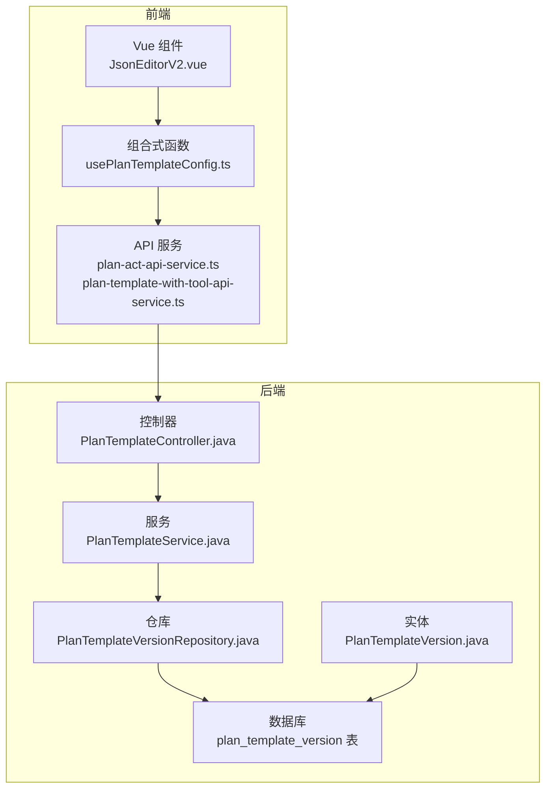
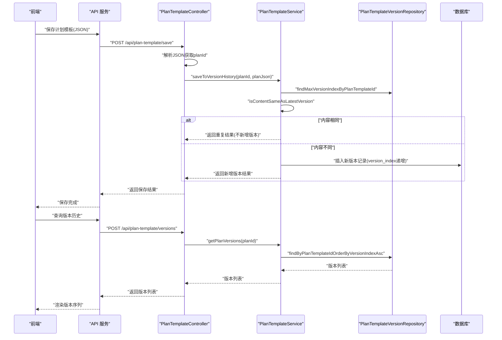
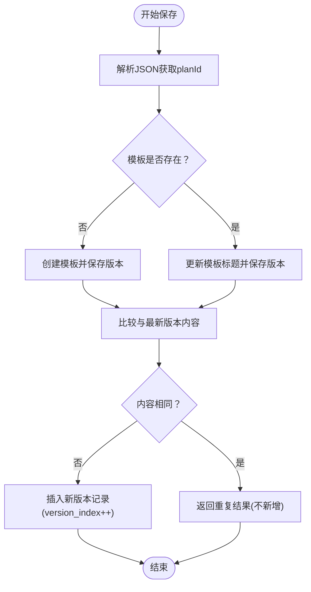
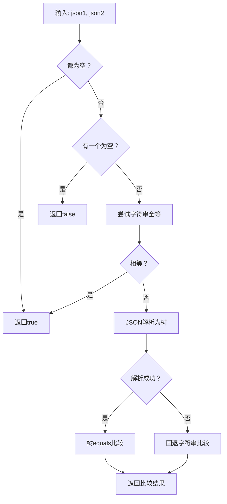
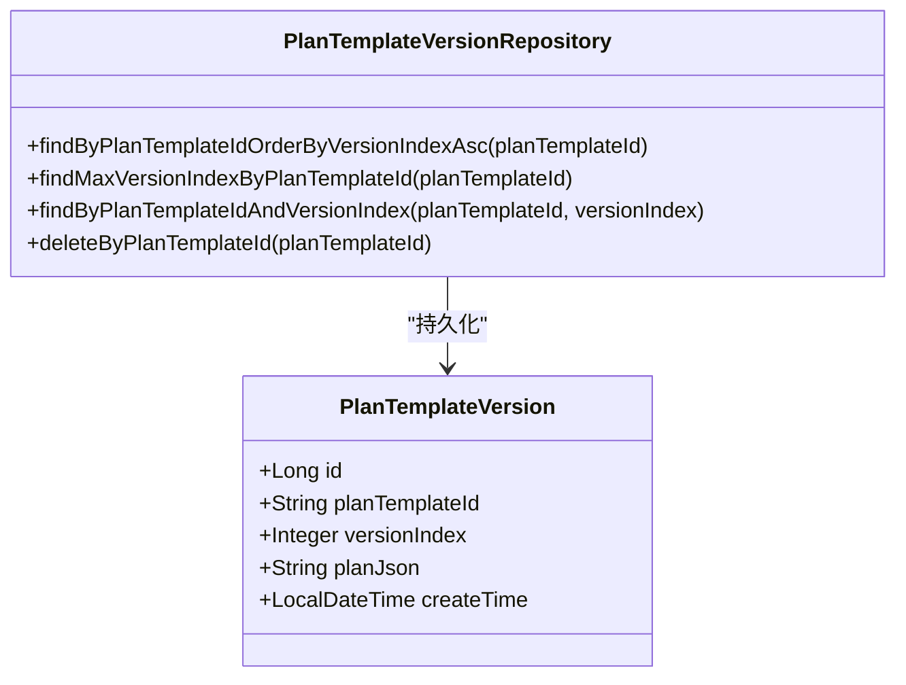
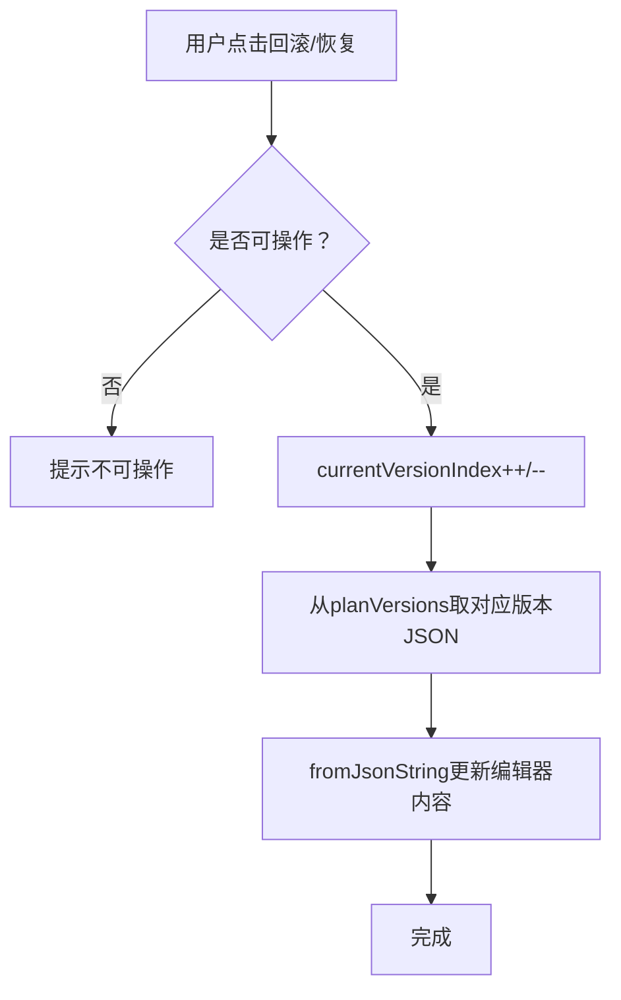
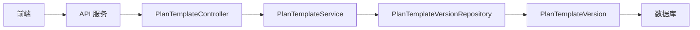

# 计划模板版本控制

<cite>
**本文引用的文件**
- [PlanTemplateService.java](file://src/main/java/com/alibaba/cloud/ai/lynxe/planning/service/PlanTemplateService.java)
- [PlanTemplateVersionRepository.java](file://src/main/java/com/alibaba/cloud/ai/lynxe/planning/repository/PlanTemplateVersionRepository.java)
- [PlanTemplateVersion.java](file://src/main/java/com/alibaba/cloud/ai/lynxe/planning/model/po/PlanTemplateVersion.java)
- [PlanTemplateController.java](file://src/main/java/com/alibaba/cloud/ai/lynxe/planning/controller/PlanTemplateController.java)
- [IPlanTemplateService.java](file://src/main/java/com/alibaba/cloud/ai/lynxe/planning/service/IPlanTemplateService.java)
- [application.yml](file://src/main/resources/application.yml)
- [usePlanTemplateConfig.ts](file://ui-vue3/src/composables/usePlanTemplateConfig.ts)
- [plan-act-api-service.ts](file://ui-vue3/src/api/plan-act-api-service.ts)
- [plan-template-with-tool-api-service.ts](file://ui-vue3/src/api/plan-template-with-tool-api-service.ts)
- [JsonEditorV2.vue](file://ui-vue3/src/components/sidebar/JsonEditorV2.vue)
- [DynamicCronTaskScheduler.java](file://src/main/java/com/alibaba/cloud/ai/lynxe/cron/scheduler/DynamicCronTaskScheduler.java)
</cite>

## 目录
1. [简介](#简介)
2. [项目结构](#项目结构)
3. [核心组件](#核心组件)
4. [架构总览](#架构总览)
5. [详细组件分析](#详细组件分析)
6. [依赖关系分析](#依赖关系分析)
7. [性能考量](#性能考量)
8. [故障排查指南](#故障排查指南)
9. [结论](#结论)
10. [附录](#附录)

## 简介
本文件系统化梳理 JManus 项目中“计划模板版本控制”的实现与使用方法，重点覆盖以下方面：
- 版本创建：基于 PlanTemplateService 的保存逻辑，避免重复内容导致的冗余版本。
- 版本比对与语义等价性：通过 isJsonContentEquivalent 实现忽略格式差异的 JSON 内容等价判断。
- 历史版本管理：PlanTemplateVersion 实体与 PlanTemplateVersionRepository 的持久化与查询。
- 版本索引规则：版本索引从 0 开始递增，无中间空洞。
- 回滚机制：前端在本地维护版本序列并支持回滚/恢复；后端未提供直接的“回滚到指定版本”接口，但可通过版本查询与重存实现。
- 版本查询 API：提供分页获取版本历史与按索引获取指定版本的能力。
- 并发与一致性：事务边界、JSON 比较的健壮性与异常处理。
- 常见问题与解决方案：版本冲突、重复保存、跨服务使用最新版本等。

## 项目结构
围绕版本控制的关键模块分布如下：
- 控制层：PlanTemplateController 提供保存、查询版本、删除模板等 API。
- 业务层：PlanTemplateService 提供版本保存、版本列表与最新版本获取、语义等价性判断。
- 数据访问层：PlanTemplateVersionRepository 提供按模板 ID 查询、最大版本索引查询、按模板+索引查询、批量删除等。
- 实体层：PlanTemplateVersion 映射数据库表 plan_template_version，记录版本索引与 JSON 内容。
- 前端：usePlanTemplateConfig.ts 维护版本序列与回滚/恢复逻辑；JsonEditorV2.vue 提供回滚/恢复按钮交互；API 服务封装版本查询与模板保存。

图表来源
- [PlanTemplateController.java](file://src/main/java/com/alibaba/cloud/ai/lynxe/planning/controller/PlanTemplateController.java#L1-L200)
- [PlanTemplateService.java](file://src/main/java/com/alibaba/cloud/ai/lynxe/planning/service/PlanTemplateService.java#L1-L206)
- [PlanTemplateVersionRepository.java](file://src/main/java/com/alibaba/cloud/ai/lynxe/planning/repository/PlanTemplateVersionRepository.java#L1-L65)
- [PlanTemplateVersion.java](file://src/main/java/com/alibaba/cloud/ai/lynxe/planning/model/po/PlanTemplateVersion.java#L1-L104)

章节来源
- [PlanTemplateController.java](file://src/main/java/com/alibaba/cloud/ai/lynxe/planning/controller/PlanTemplateController.java#L1-L200)
- [PlanTemplateService.java](file://src/main/java/com/alibaba/cloud/ai/lynxe/planning/service/PlanTemplateService.java#L1-L206)
- [PlanTemplateVersionRepository.java](file://src/main/java/com/alibaba/cloud/ai/lynxe/planning/repository/PlanTemplateVersionRepository.java#L1-L65)
- [PlanTemplateVersion.java](file://src/main/java/com/alibaba/cloud/ai/lynxe/planning/model/po/PlanTemplateVersion.java#L1-L104)

## 核心组件
- PlanTemplateService：版本保存、版本列表获取、指定版本获取、最新版本获取、内容等价性判断。
- PlanTemplateVersionRepository：按模板 ID 排序查询、最大版本索引查询、按模板+索引查询、按模板删除。
- PlanTemplateVersion：版本实体，包含模板 ID、版本索引、JSON 内容、创建时间。
- PlanTemplateController：对外暴露保存、查询版本、删除模板等 API；内部调用 PlanTemplateService 完成版本保存。
- 前端 usePlanTemplateConfig.ts：维护版本序列与当前索引，提供回滚/恢复能力；通过 API 服务调用后端版本查询。

章节来源
- [IPlanTemplateService.java](file://src/main/java/com/alibaba/cloud/ai/lynxe/planning/service/IPlanTemplateService.java#L1-L79)
- [PlanTemplateService.java](file://src/main/java/com/alibaba/cloud/ai/lynxe/planning/service/PlanTemplateService.java#L1-L206)
- [PlanTemplateVersionRepository.java](file://src/main/java/com/alibaba/cloud/ai/lynxe/planning/repository/PlanTemplateVersionRepository.java#L1-L65)
- [PlanTemplateVersion.java](file://src/main/java/com/alibaba/cloud/ai/lynxe/planning/model/po/PlanTemplateVersion.java#L1-L104)
- [PlanTemplateController.java](file://src/main/java/com/alibaba/cloud/ai/lynxe/planning/controller/PlanTemplateController.java#L1-L200)
- [usePlanTemplateConfig.ts](file://ui-vue3/src/composables/usePlanTemplateConfig.ts#L231-L276)

## 架构总览
版本控制的整体流程：
- 前端编辑器保存时，调用后端保存接口，后端解析 JSON 获取模板 ID，若不存在则创建模板并保存新版本；若存在则更新标题并保存新版本。
- 后端在保存前进行“与最新版本内容是否相同”的判断，相同则不新增版本，返回重复结果。
- 前端在保存成功后，主动拉取版本列表，维护本地版本序列与当前索引，支持回滚/恢复。

图表来源
- [PlanTemplateController.java](file://src/main/java/com/alibaba/cloud/ai/lynxe/planning/controller/PlanTemplateController.java#L145-L209)
- [PlanTemplateService.java](file://src/main/java/com/alibaba/cloud/ai/lynxe/planning/service/PlanTemplateService.java#L84-L147)
- [PlanTemplateVersionRepository.java](file://src/main/java/com/alibaba/cloud/ai/lynxe/planning/repository/PlanTemplateVersionRepository.java#L33-L57)

## 详细组件分析

### 版本创建与去重
- 保存入口：PlanTemplateController.savePlan 调用 saveToVersionHistory，内部由 PlanTemplateService 完成。
- 去重策略：isContentSameAsLatestVersion 对比最新版本与当前内容，若相同则不新增版本，返回重复标记与最新索引。
- 新版本索引：从最大索引+1 生成，初始为 0。

图表来源
- [PlanTemplateController.java](file://src/main/java/com/alibaba/cloud/ai/lynxe/planning/controller/PlanTemplateController.java#L145-L209)
- [PlanTemplateService.java](file://src/main/java/com/alibaba/cloud/ai/lynxe/planning/service/PlanTemplateService.java#L84-L110)

章节来源
- [PlanTemplateController.java](file://src/main/java/com/alibaba/cloud/ai/lynxe/planning/controller/PlanTemplateController.java#L145-L209)
- [PlanTemplateService.java](file://src/main/java/com/alibaba/cloud/ai/lynxe/planning/service/PlanTemplateService.java#L84-L110)

### 版本比对与语义等价性
- 策略：先尝试字符串全等，再尝试 JSON 解析后节点树比较；若解析失败则回退到字符串比较。
- 适用场景：忽略空白、换行、键顺序等格式差异，仅比较实际内容。

图表来源
- [PlanTemplateService.java](file://src/main/java/com/alibaba/cloud/ai/lynxe/planning/service/PlanTemplateService.java#L173-L203)

章节来源
- [PlanTemplateService.java](file://src/main/java/com/alibaba/cloud/ai/lynxe/planning/service/PlanTemplateService.java#L173-L203)

### 版本索引与持久化
- 索引规则：version_index 从 0 开始，每次新增版本为 max + 1。
- 存储字段：plan_template_id、version_index、plan_json、create_time。
- 查询接口：
  - 按模板 ID 升序列出所有版本。
  - 按模板 ID + 版本索引精确查询。
  - 查询最大版本索引。
  - 按模板 ID 删除全部版本。

图表来源
- [PlanTemplateVersion.java](file://src/main/java/com/alibaba/cloud/ai/lynxe/planning/model/po/PlanTemplateVersion.java#L1-L104)
- [PlanTemplateVersionRepository.java](file://src/main/java/com/alibaba/cloud/ai/lynxe/planning/repository/PlanTemplateVersionRepository.java#L1-L65)

章节来源
- [PlanTemplateVersion.java](file://src/main/java/com/alibaba/cloud/ai/lynxe/planning/model/po/PlanTemplateVersion.java#L1-L104)
- [PlanTemplateVersionRepository.java](file://src/main/java/com/alibaba/cloud/ai/lynxe/planning/repository/PlanTemplateVersionRepository.java#L1-L65)

### 版本查询 API 使用示例
- 分页获取版本历史
  - 方法：POST /api/plan-template/versions
  - 请求体：{"planId": "<模板ID>"}
  - 返回：{"planId": "...","versionCount": n,"versions": ["<版本JSON>","..."]}
- 获取指定版本
  - 方法：POST /api/plan-template/get-version
  - 请求体：{"planId": "<模板ID>","versionIndex": "<索引>"}
  - 返回：{"planId": "...","versionIndex": i,"versionCount": n,"planJson": "<版本JSON>"}

章节来源
- [PlanTemplateController.java](file://src/main/java/com/alibaba/cloud/ai/lynxe/planning/controller/PlanTemplateController.java#L211-L282)
- [plan-act-api-service.ts](file://ui-vue3/src/api/plan-act-api-service.ts#L68-L85)

### 前端版本回滚与恢复
- 前端通过 usePlanTemplateConfig.ts 维护 planVersions 数组与 currentVersionIndex。
- 支持：
  - canRollback / canRestore 计算属性判断可回滚/恢复状态。
  - rollbackVersion / restoreVersion 在本地切换版本。
  - updateVersionsAfterSave 在保存后更新本地版本序列。
- 交互入口：JsonEditorV2.vue 提供回滚/恢复按钮事件处理。

图表来源
- [usePlanTemplateConfig.ts](file://ui-vue3/src/composables/usePlanTemplateConfig.ts#L231-L276)
- [JsonEditorV2.vue](file://ui-vue3/src/components/sidebar/JsonEditorV2.vue#L540-L587)

章节来源
- [usePlanTemplateConfig.ts](file://ui-vue3/src/composables/usePlanTemplateConfig.ts#L231-L276)
- [JsonEditorV2.vue](file://ui-vue3/src/components/sidebar/JsonEditorV2.vue#L540-L587)

### 跨服务使用最新版本
- 例如动态定时任务调度器会从 PlanTemplateService 获取最新版本 JSON 来构建执行计划。
- 若需要使用某模板的特定版本，请在调度器侧自行缓存或传入版本索引（当前实现默认使用最新版本）。

章节来源
- [DynamicCronTaskScheduler.java](file://src/main/java/com/alibaba/cloud/ai/lynxe/cron/scheduler/DynamicCronTaskScheduler.java#L307-L337)

## 依赖关系分析
- 控制层依赖服务层；服务层依赖仓库层；仓库层依赖实体与数据库。
- 前端依赖 API 服务，API 服务调用后端控制器。
- 事务边界：保存版本与删除模板等关键操作标注了事务注解，确保原子性。

图表来源
- [PlanTemplateController.java](file://src/main/java/com/alibaba/cloud/ai/lynxe/planning/controller/PlanTemplateController.java#L1-L200)
- [PlanTemplateService.java](file://src/main/java/com/alibaba/cloud/ai/lynxe/planning/service/PlanTemplateService.java#L1-L206)
- [PlanTemplateVersionRepository.java](file://src/main/java/com/alibaba/cloud/ai/lynxe/planning/repository/PlanTemplateVersionRepository.java#L1-L65)
- [PlanTemplateVersion.java](file://src/main/java/com/alibaba/cloud/ai/lynxe/planning/model/po/PlanTemplateVersion.java#L1-L104)

章节来源
- [PlanTemplateController.java](file://src/main/java/com/alibaba/cloud/ai/lynxe/planning/controller/PlanTemplateController.java#L1-L200)
- [PlanTemplateService.java](file://src/main/java/com/alibaba/cloud/ai/lynxe/planning/service/PlanTemplateService.java#L1-L206)
- [PlanTemplateVersionRepository.java](file://src/main/java/com/alibaba/cloud/ai/lynxe/planning/repository/PlanTemplateVersionRepository.java#L1-L65)
- [PlanTemplateVersion.java](file://src/main/java/com/alibaba/cloud/ai/lynxe/planning/model/po/PlanTemplateVersion.java#L1-L104)

## 性能考量
- JSON 比对：字符串全等优先，解析失败回退字符串比较，避免不必要的异常开销。
- 数据库查询：按模板 ID 排序查询与最大索引查询均为单表扫描，索引建议以 plan_template_id 为主键或建立复合索引以优化排序与范围查询。
- 事务粒度：保存版本与删除模板均在事务内完成，保证一致性，但需注意长事务可能带来的锁竞争。
- 前端版本序列：本地维护版本数组，减少频繁网络请求；保存后统一刷新版本列表。

[本节为通用指导，无需源码引用]

## 故障排查指南
- 保存后未新增版本
  - 可能原因：与最新版本内容完全相同，触发去重逻辑。
  - 处理建议：检查前后内容差异，或强制变更以打破等价性。
- 版本查询为空
  - 可能原因：模板 ID 错误、尚未保存过版本。
  - 处理建议：确认 planId 正确，先保存一次版本。
- 版本索引越界
  - 可能原因：请求的 versionIndex 超出范围。
  - 处理建议：根据 versionCount 计算有效范围，或先拉取版本列表。
- 并发保存导致重复
  - 可能原因：多实例同时保存，且内容恰好相同。
  - 处理建议：依赖后端去重策略；若需严格幂等，可在前端增加去重标记或使用唯一提交令牌。
- 删除模板后版本丢失
  - 可能原因：删除模板时会删除其全部版本。
  - 处理建议：删除前备份或导出模板配置。

章节来源
- [PlanTemplateController.java](file://src/main/java/com/alibaba/cloud/ai/lynxe/planning/controller/PlanTemplateController.java#L211-L282)
- [PlanTemplateService.java](file://src/main/java/com/alibaba/cloud/ai/lynxe/planning/service/PlanTemplateService.java#L84-L147)
- [PlanTemplateVersionRepository.java](file://src/main/java/com/alibaba/cloud/ai/lynxe/planning/repository/PlanTemplateVersionRepository.java#L58-L65)

## 结论
- 本版本控制机制以“内容等价性”为核心，避免重复版本，降低存储与检索成本。
- 版本索引简单可靠，从 0 递增，便于理解与扩展。
- 前端提供回滚/恢复能力，满足编辑态的快速迭代需求。
- 后端未提供直接“回滚到指定版本”的 API，但可通过版本查询与重存实现相同效果。
- 事务与异常处理保障了数据一致性与可用性。

[本节为总结，无需源码引用]

## 附录

### 版本控制 API 规范
- 保存版本
  - 方法：POST /api/plan-template/save
  - 请求体：{"planJson": "<完整JSON>"}
  - 返回：{"status":"success","planId":"...","versionCount":n,"saved":true/false,"duplicate":true/false,"message":"...","versionIndex":i}
- 查询版本历史
  - 方法：POST /api/plan-template/versions
  - 请求体：{"planId": "<模板ID>"}
  - 返回：{"planId":"...","versionCount":n,"versions":["<版本JSON>","..."]}
- 获取指定版本
  - 方法：POST /api/plan-template/get-version
  - 请求体：{"planId": "<模板ID>","versionIndex": "<索引>"}
  - 返回：{"planId":"...","versionIndex":i,"versionCount":n,"planJson":"<版本JSON>"}
- 删除模板
  - 方法：POST /api/plan-template/delete
  - 请求体：{"planId": "<模板ID>"}
  - 返回：{"status":"success","message":"Plan template deleted","planId":"..."}

章节来源
- [PlanTemplateController.java](file://src/main/java/com/alibaba/cloud/ai/lynxe/planning/controller/PlanTemplateController.java#L145-L358)
- [plan-act-api-service.ts](file://ui-vue3/src/api/plan-act-api-service.ts#L68-L85)

### 并发处理与一致性保障
- 事务注解：保存版本与导入/导出等关键路径标注事务，确保写入原子性。
- JSON 比对健壮性：解析失败回退字符串比较，避免异常传播影响流程。
- 应用配置：JPA 关闭 Open Session In View，避免潜在性能与连接泄漏风险。

章节来源
- [PlanTemplateService.java](file://src/main/java/com/alibaba/cloud/ai/lynxe/planning/service/PlanTemplateService.java#L84-L110)
- [application.yml](file://src/main/resources/application.yml#L33-L40)

### 常见问题与解决方案
- 问：如何实现“回滚到指定版本”？
  - 答：后端未提供直接接口。建议：先调用“查询版本历史”，选择目标版本 JSON，然后调用“保存版本”以新版本形式写入；或在调度器侧缓存并使用目标版本 JSON。
- 问：如何避免重复保存？
  - 答：后端已内置内容等价性判断；若仍出现重复，检查 JSON 字段是否包含时间戳等易变值。
- 问：如何在分布式环境下保证一致性？
  - 答：保存版本在单事务内完成；建议在前端增加幂等标识或在网关层做请求去重。

[本节为通用指导，无需源码引用]