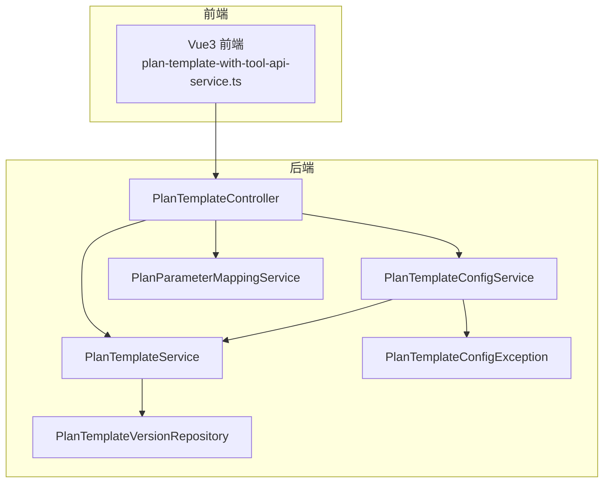
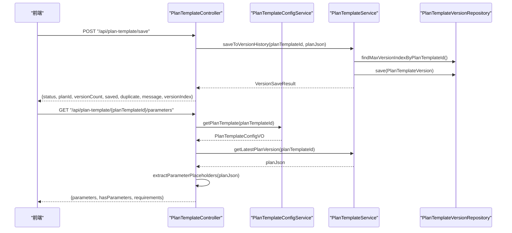
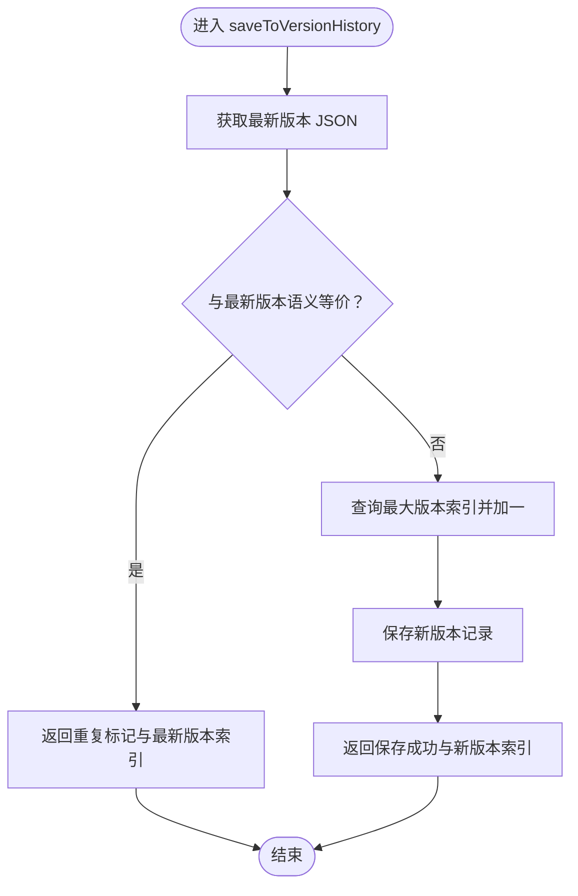
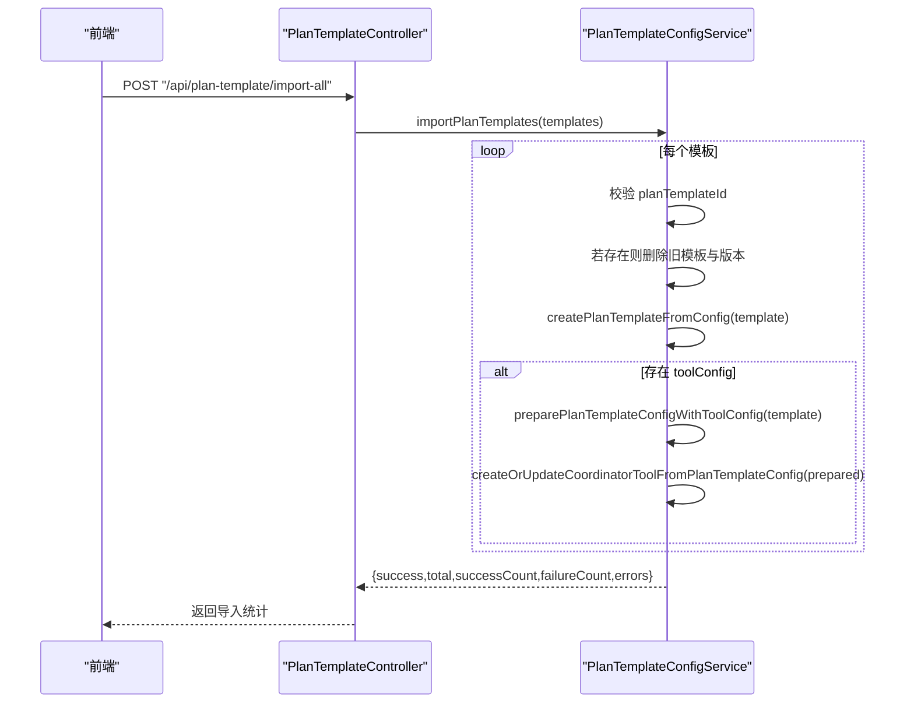
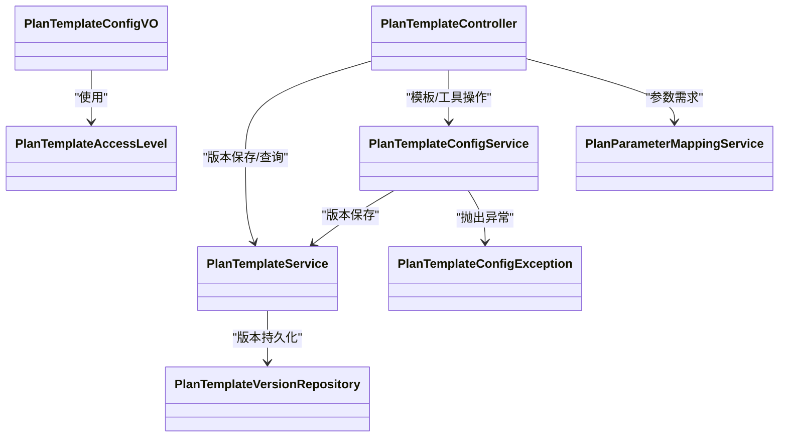

# 计划模板管理

<cite>
**本文引用的文件列表**
- [PlanTemplateController.java](file://src/main/java/com/alibaba/cloud/ai/lynxe/planning/controller/PlanTemplateController.java)
- [PlanTemplateService.java](file://src/main/java/com/alibaba/cloud/ai/lynxe/planning/service/PlanTemplateService.java)
- [PlanTemplateConfigService.java](file://src/main/java/com/alibaba/cloud/ai/lynxe/planning/service/PlanTemplateConfigService.java)
- [PlanTemplateConfigVO.java](file://src/main/java/com/alibaba/cloud/ai/lynxe/planning/model/vo/PlanTemplateConfigVO.java)
- [PlanTemplateAccessLevel.java](file://src/main/java/com/alibaba/cloud/ai/lynxe/planning/model/enums/PlanTemplateAccessLevel.java)
- [PlanTemplateVersionRepository.java](file://src/main/java/com/alibaba/cloud/ai/lynxe/planning/repository/PlanTemplateVersionRepository.java)
- [PlanTemplateConfigException.java](file://src/main/java/com/alibaba/cloud/ai/lynxe/planning/exception/PlanTemplateConfigException.java)
- [PlanParameterMappingService.java](file://src/main/java/com/alibaba/cloud/ai/lynxe/planning/service/PlanParameterMappingService.java)
- [plan-template-with-tool-api-service.ts](file://ui-vue3/src/api/plan-template-with-tool-api-service.ts)
- [planTemplateConfig.vue](file://ui-vue3/src/views/configs/planTemplateConfig.vue)
</cite>

## 目录
1. [简介](#简介)
2. [项目结构与入口](#项目结构与入口)
3. [核心组件](#核心组件)
4. [架构总览](#架构总览)
5. [详细组件分析](#详细组件分析)
6. [依赖关系分析](#依赖关系分析)
7. [性能与可扩展性](#性能与可扩展性)
8. [故障排查与错误处理](#故障排查与错误处理)
9. [最佳实践与使用指南](#最佳实践与使用指南)
10. [结论](#结论)

## 简介
本文件系统化梳理 JManus 中“计划模板管理”能力，围绕以下目标展开：
- 全面解读 PlanTemplateController 提供的 REST API 接口：保存、获取版本历史、删除、参数需求查询、创建/更新模板并注册为工具、导出/导入模板等。
- 深入解析 PlanTemplateService 的版本控制机制：版本比对、语义等价性判断、版本索引管理与持久化。
- 阐述 PlanTemplateConfigVO 数据结构设计原理及其在模板配置中的作用。
- 说明计划模板的访问控制级别（PlanTemplateAccessLevel）与权限管理机制。
- 提供创建、更新与版本管理的最佳实践、API 调用示例与错误处理策略。
- 介绍模板导入导出的实现细节与数据格式规范。

## 项目结构与入口
- 控制层入口位于 PlanTemplateController，提供统一的 REST API。
- 业务层由 PlanTemplateService 和 PlanTemplateConfigService 组成，分别负责版本历史与模板配置/工具注册。
- 数据模型 PlanTemplateConfigVO 定义了模板配置的数据结构；访问级别通过 PlanTemplateAccessLevel 枚举表达。
- 版本持久化通过 PlanTemplateVersionRepository 访问数据库表。

图表来源
- [PlanTemplateController.java](file://src/main/java/com/alibaba/cloud/ai/lynxe/planning/controller/PlanTemplateController.java#L1-L661)
- [PlanTemplateService.java](file://src/main/java/com/alibaba/cloud/ai/lynxe/planning/service/PlanTemplateService.java#L1-L206)
- [PlanTemplateConfigService.java](file://src/main/java/com/alibaba/cloud/ai/lynxe/planning/service/PlanTemplateConfigService.java#L1-L1072)
- [PlanTemplateVersionRepository.java](file://src/main/java/com/alibaba/cloud/ai/lynxe/planning/repository/PlanTemplateVersionRepository.java#L1-L65)
- [PlanTemplateConfigException.java](file://src/main/java/com/alibaba/cloud/ai/lynxe/planning/exception/PlanTemplateConfigException.java#L1-L100)
- [PlanParameterMappingService.java](file://src/main/java/com/alibaba/cloud/ai/lynxe/planning/service/PlanParameterMappingService.java#L1-L400)

章节来源
- [PlanTemplateController.java](file://src/main/java/com/alibaba/cloud/ai/lynxe/planning/controller/PlanTemplateController.java#L1-L661)
- [PlanTemplateService.java](file://src/main/java/com/alibaba/cloud/ai/lynxe/planning/service/PlanTemplateService.java#L1-L206)
- [PlanTemplateConfigService.java](file://src/main/java/com/alibaba/cloud/ai/lynxe/planning/service/PlanTemplateConfigService.java#L1-L1072)
- [PlanTemplateVersionRepository.java](file://src/main/java/com/alibaba/cloud/ai/lynxe/planning/repository/PlanTemplateVersionRepository.java#L1-L65)

## 核心组件
- PlanTemplateController：对外暴露 REST API，协调版本保存、版本查询、模板删除、参数需求提取、模板与工具创建/更新、导出/导入等。
- PlanTemplateService：版本控制核心，负责版本比对、语义等价性判断、版本索引生成与持久化。
- PlanTemplateConfigService：模板配置与工具注册服务，负责模板实体创建/更新、输入参数 Schema 生成、工具实体创建/更新/删除、导出/导入。
- PlanTemplateConfigVO：模板配置数据载体，包含标题、步骤、直接响应、类型、模板ID、访问级别、服务组、工具配置、时间戳等。
- PlanTemplateAccessLevel：访问级别枚举，支持只读/可编辑两种级别。
- PlanTemplateVersionRepository：版本历史数据访问接口。
- PlanTemplateConfigException：模板配置异常类型，携带错误码。
- PlanParameterMappingService：参数占位符提取与参数需求描述生成。

章节来源
- [PlanTemplateController.java](file://src/main/java/com/alibaba/cloud/ai/lynxe/planning/controller/PlanTemplateController.java#L1-L661)
- [PlanTemplateService.java](file://src/main/java/com/alibaba/cloud/ai/lynxe/planning/service/PlanTemplateService.java#L1-L206)
- [PlanTemplateConfigService.java](file://src/main/java/com/alibaba/cloud/ai/lynxe/planning/service/PlanTemplateConfigService.java#L1-L1072)
- [PlanTemplateConfigVO.java](file://src/main/java/com/alibaba/cloud/ai/lynxe/planning/model/vo/PlanTemplateConfigVO.java#L1-L426)
- [PlanTemplateAccessLevel.java](file://src/main/java/com/alibaba/cloud/ai/lynxe/planning/model/enums/PlanTemplateAccessLevel.java#L1-L80)
- [PlanTemplateVersionRepository.java](file://src/main/java/com/alibaba/cloud/ai/lynxe/planning/repository/PlanTemplateVersionRepository.java#L1-L65)
- [PlanTemplateConfigException.java](file://src/main/java/com/alibaba/cloud/ai/lynxe/planning/exception/PlanTemplateConfigException.java#L1-L100)
- [PlanParameterMappingService.java](file://src/main/java/com/alibaba/cloud/ai/lynxe/planning/service/PlanParameterMappingService.java#L1-L400)

## 架构总览
后端采用分层架构：控制器层负责请求编排与响应封装；服务层承载业务逻辑；仓储层负责版本历史持久化；模型层定义配置数据结构与枚举。

图表来源
- [PlanTemplateController.java](file://src/main/java/com/alibaba/cloud/ai/lynxe/planning/controller/PlanTemplateController.java#L1-L661)
- [PlanTemplateService.java](file://src/main/java/com/alibaba/cloud/ai/lynxe/planning/service/PlanTemplateService.java#L1-L206)
- [PlanTemplateConfigService.java](file://src/main/java/com/alibaba/cloud/ai/lynxe/planning/service/PlanTemplateConfigService.java#L1-L1072)
- [PlanTemplateVersionRepository.java](file://src/main/java/com/alibaba/cloud/ai/lynxe/planning/repository/PlanTemplateVersionRepository.java#L1-L65)

## 详细组件分析

### REST API 接口总览与调用流程
- 保存计划模板版本
  - 方法：POST /api/plan-template/save
  - 输入：JSON 字符串 planJson（包含 planTemplateId 或 rootPlanId）
  - 行为：若 planId 缺失或以 new- 开头则生成新 ID；解析标题并写入配置；调用版本保存逻辑；返回版本计数、是否保存、是否重复、消息与版本索引。
  - 关键路径：[PlanTemplateController.savePlan](file://src/main/java/com/alibaba/cloud/ai/lynxe/planning/controller/PlanTemplateController.java#L150-L209)，[PlanTemplateController.saveToVersionHistory](file://src/main/java/com/alibaba/cloud/ai/lynxe/planning/controller/PlanTemplateController.java#L76-L143)，[PlanTemplateService.saveToVersionHistory](file://src/main/java/com/alibaba/cloud/ai/lynxe/planning/service/PlanTemplateService.java#L90-L110)
- 获取版本历史
  - 方法：POST /api/plan-template/versions
  - 输入：planId
  - 输出：版本数量与版本列表（JSON 字符串数组）
  - 关键路径：[PlanTemplateController.getPlanVersions](file://src/main/java/com/alibaba/cloud/ai/lynxe/planning/controller/PlanTemplateController.java#L216-L231)，[PlanTemplateService.getPlanVersions](file://src/main/java/com/alibaba/cloud/ai/lynxe/planning/service/PlanTemplateService.java#L127-L135)
- 获取指定版本
  - 方法：POST /api/plan-template/get-version
  - 输入：planId, versionIndex
  - 输出：该版本的 planJson
  - 关键路径：[PlanTemplateController.getVersionPlan](file://src/main/java/com/alibaba/cloud/ai/lynxe/planning/controller/PlanTemplateController.java#L239-L282)，[PlanTemplateService.getPlanVersion](file://src/main/java/com/alibaba/cloud/ai/lynxe/planning/service/PlanTemplateService.java#L143-L147)
- 获取最新版本
  - 方法：GET /api/plan-template/latest
  - 输出：最新版本 planJson
  - 关键路径：[PlanTemplateService.getLatestPlanVersion](file://src/main/java/com/alibaba/cloud/ai/lynxe/planning/service/PlanTemplateService.java#L154-L160)
- 列出所有模板
  - 方法：GET /api/plan-template/list
  - 输出：模板列表（含 id、title、createTime、updateTime）
  - 关键路径：[PlanTemplateController.getAllPlanTemplates](file://src/main/java/com/alibaba/cloud/ai/lynxe/planning/controller/PlanTemplateController.java#L288-L318)，[PlanTemplateConfigService.getAllPlanTemplates](file://src/main/java/com/alibaba/cloud/ai/lynxe/planning/service/PlanTemplateConfigService.java#L797-L816)
- 删除模板
  - 方法：POST /api/plan-template/delete
  - 输入：planId
  - 行为：删除模板及所有版本
  - 关键路径：[PlanTemplateController.deletePlanTemplate](file://src/main/java/com/alibaba/cloud/ai/lynxe/planning/controller/PlanTemplateController.java#L325-L358)，[PlanTemplateConfigService.deletePlanTemplate](file://src/main/java/com/alibaba/cloud/ai/lynxe/planning/service/PlanTemplateConfigService.java#L816-L860)
- 参数需求查询
  - 方法：GET /api/plan-template/{planTemplateId}/parameters
  - 输出：参数列表、是否有参数、参数需求说明
  - 关键路径：[PlanTemplateController.getParameterRequirements](file://src/main/java/com/alibaba/cloud/ai/lynxe/planning/controller/PlanTemplateController.java#L365-L392)，[PlanParameterMappingService.extractParameterPlaceholders](file://src/main/java/com/alibaba/cloud/ai/lynxe/planning/service/PlanParameterMappingService.java#L1-L200)
- 创建/更新模板并注册为工具
  - 方法：POST /api/plan-template/create-or-update-with-tool
  - 输入：PlanTemplateConfigVO（含可选 toolConfig）
  - 输出：成功标志、模板ID、是否已注册工具
  - 关键路径：[PlanTemplateController.createOrUpdatePlanTemplateWithTool](file://src/main/java/com/alibaba/cloud/ai/lynxe/planning/controller/PlanTemplateController.java#L405-L447)，[PlanTemplateConfigService.createOrUpdateCoordinatorToolFromPlanTemplateConfig](file://src/main/java/com/alibaba/cloud/ai/lynxe/planning/service/PlanTemplateConfigService.java#L410-L463)
- 获取模板配置 VO 列表
  - 方法：GET /api/plan-template/list-config
  - 输出：包含模板与工具配置的 PlanTemplateConfigVO 列表
  - 关键路径：[PlanTemplateController.getAllPlanTemplateConfigVOs](file://src/main/java/com/alibaba/cloud/ai/lynxe/planning/controller/PlanTemplateController.java#L454-L532)，[PlanTemplateConfigService.getAllPlanTemplates](file://src/main/java/com/alibaba/cloud/ai/lynxe/planning/service/PlanTemplateConfigService.java#L797-L816)
- 导出模板
  - 方法：GET /api/plan-template/export-all
  - 输出：PlanTemplateConfigVO 列表（JSON 数组）
  - 关键路径：[PlanTemplateController.exportAllPlanTemplates](file://src/main/java/com/alibaba/cloud/ai/lynxe/planning/controller/PlanTemplateController.java#L539-L551)，[PlanTemplateConfigService.exportAllPlanTemplates](file://src/main/java/com/alibaba/cloud/ai/lynxe/planning/service/PlanTemplateConfigService.java#L922-L937)
- 导入模板
  - 方法：POST /api/plan-template/import-all
  - 输入：PlanTemplateConfigVO 列表（JSON 数组）
  - 输出：导入统计（总数、成功数、失败数、错误列表）
  - 关键路径：[PlanTemplateController.importPlanTemplates](file://src/main/java/com/alibaba/cloud/ai/lynxe/planning/controller/PlanTemplateController.java#L558-L577)，[PlanTemplateConfigService.importPlanTemplates](file://src/main/java/com/alibaba/cloud/ai/lynxe/planning/service/PlanTemplateConfigService.java#L944-L1008)

章节来源
- [PlanTemplateController.java](file://src/main/java/com/alibaba/cloud/ai/lynxe/planning/controller/PlanTemplateController.java#L150-L661)
- [PlanTemplateService.java](file://src/main/java/com/alibaba/cloud/ai/lynxe/planning/service/PlanTemplateService.java#L90-L206)
- [PlanTemplateConfigService.java](file://src/main/java/com/alibaba/cloud/ai/lynxe/planning/service/PlanTemplateConfigService.java#L410-L1008)
- [PlanParameterMappingService.java](file://src/main/java/com/alibaba/cloud/ai/lynxe/planning/service/PlanParameterMappingService.java#L1-L311)

### 版本控制机制与语义等价性判断
- 版本保存流程
  - 若内容与最新版本相同，则不保存新版本，返回重复标记与最新版本索引。
  - 否则计算最大版本索引并递增，保存新版本记录。
  - 关键路径：[PlanTemplateService.saveToVersionHistory](file://src/main/java/com/alibaba/cloud/ai/lynxe/planning/service/PlanTemplateService.java#L90-L110)，[PlanTemplateVersionRepository](file://src/main/java/com/alibaba/cloud/ai/lynxe/planning/repository/PlanTemplateVersionRepository.java#L39-L63)
- 语义等价性判断
  - 先尝试字符串相等，再解析为 JSON 结点进行结构比较，失败时回退到字符串比较。
  - 关键路径：[PlanTemplateService.isJsonContentEquivalent](file://src/main/java/com/alibaba/cloud/ai/lynxe/planning/service/PlanTemplateService.java#L180-L203)
- 版本索引管理
  - 通过查询最大版本索引决定新版本号；按升序返回版本列表。
  - 关键路径：[PlanTemplateService.getPlanVersions](file://src/main/java/com/alibaba/cloud/ai/lynxe/planning/service/PlanTemplateService.java#L127-L135)，[PlanTemplateService.getPlanVersion](file://src/main/java/com/alibaba/cloud/ai/lynxe/planning/service/PlanTemplateService.java#L143-L147)，[PlanTemplateService.getLatestPlanVersion](file://src/main/java/com/alibaba/cloud/ai/lynxe/planning/service/PlanTemplateService.java#L154-L160)

图表来源
- [PlanTemplateService.java](file://src/main/java/com/alibaba/cloud/ai/lynxe/planning/service/PlanTemplateService.java#L90-L110)
- [PlanTemplateService.java](file://src/main/java/com/alibaba/cloud/ai/lynxe/planning/service/PlanTemplateService.java#L180-L203)
- [PlanTemplateVersionRepository.java](file://src/main/java/com/alibaba/cloud/ai/lynxe/planning/repository/PlanTemplateVersionRepository.java#L39-L63)

章节来源
- [PlanTemplateService.java](file://src/main/java/com/alibaba/cloud/ai/lynxe/planning/service/PlanTemplateService.java#L90-L206)
- [PlanTemplateVersionRepository.java](file://src/main/java/com/alibaba/cloud/ai/lynxe/planning/repository/PlanTemplateVersionRepository.java#L1-L65)

### PlanTemplateConfigVO 数据结构设计与作用
- 字段概览
  - 标题、步骤列表（StepConfig）、直接响应、计划类型、模板ID、访问级别、服务组、工具配置、创建/更新时间。
  - StepConfig：步骤需求、代理名称、模型名称、终止列、选中工具键集合。
  - ToolConfigVO：工具描述、启用内部工具调用、启用 HTTP 服务、启用会话内调用、发布状态、输入 Schema。
  - InputSchemaParam：参数名、描述、类型、是否必填。
- 设计要点
  - 使用 Jackson 注解忽略未知字段，增强兼容性。
  - 访问级别通过枚举表达，同时保留只读兼容字段，便于向后兼容。
  - 工具配置与输入 Schema 与模板 JSON 解析结果映射，便于前端展示与工具注册。
- 作用
  - 作为模板配置的统一载体，贯穿模板创建、版本保存、工具注册、导出/导入等流程。
  - 作为前端侧“模板配置页”的数据模型，驱动 UI 展示与交互。

章节来源
- [PlanTemplateConfigVO.java](file://src/main/java/com/alibaba/cloud/ai/lynxe/planning/model/vo/PlanTemplateConfigVO.java#L1-L426)
- [PlanTemplateAccessLevel.java](file://src/main/java/com/alibaba/cloud/ai/lynxe/planning/model/enums/PlanTemplateAccessLevel.java#L1-L80)

### 访问控制级别与权限管理
- 枚举定义
  - READ_ONLY：只读，不可修改或删除。
  - EDITABLE：可编辑，默认级别。
- 映射规则
  - 从字符串反序列化时默认返回 EDITABLE；可通过工具方法设置字符串值。
  - 在模板实体创建/更新时，将访问级别写入数据库字段。
- 前端影响
  - 前端根据 accessLevel 决定 UI 可编辑性与操作按钮显示。
- 关键路径
  - [PlanTemplateAccessLevel.fromValue](file://src/main/java/com/alibaba/cloud/ai/lynxe/planning/model/enums/PlanTemplateAccessLevel.java#L56-L68)
  - [PlanTemplateConfigService.createPlanTemplateFromConfig](file://src/main/java/com/alibaba/cloud/ai/lynxe/planning/service/PlanTemplateConfigService.java#L262-L321)

章节来源
- [PlanTemplateAccessLevel.java](file://src/main/java/com/alibaba/cloud/ai/lynxe/planning/model/enums/PlanTemplateAccessLevel.java#L1-L80)
- [PlanTemplateConfigService.java](file://src/main/java/com/alibaba/cloud/ai/lynxe/planning/service/PlanTemplateConfigService.java#L262-L321)

### 模板导入导出实现细节与数据格式
- 导出
  - 返回 PlanTemplateConfigVO 列表，包含模板基本信息、步骤配置、工具配置与输入 Schema。
  - 关键路径：[PlanTemplateController.exportAllPlanTemplates](file://src/main/java/com/alibaba/cloud/ai/lynxe/planning/controller/PlanTemplateController.java#L539-L551)，[PlanTemplateConfigService.exportAllPlanTemplates](file://src/main/java/com/alibaba/cloud/ai/lynxe/planning/service/PlanTemplateConfigService.java#L922-L937)
- 导入
  - 对每个模板执行校验（必须包含 planTemplateId），若存在则先删除旧模板及版本，再重新创建。
  - 若提供 toolConfig，则准备工具配置并创建/更新协调工具。
  - 返回导入统计（总数、成功数、失败数、错误列表）。
  - 关键路径：[PlanTemplateController.importPlanTemplates](file://src/main/java/com/alibaba/cloud/ai/lynxe/planning/controller/PlanTemplateController.java#L558-L577)，[PlanTemplateConfigService.importPlanTemplates](file://src/main/java/com/alibaba/cloud/ai/lynxe/planning/service/PlanTemplateConfigService.java#L944-L1008)
- 前端集成
  - 前端提供导出/导入按钮，调用对应 API 并处理返回结果。
  - 关键路径：[plan-template-with-tool-api-service.ts](file://ui-vue3/src/api/plan-template-with-tool-api-service.ts#L94-L167)，[planTemplateConfig.vue](file://ui-vue3/src/views/configs/planTemplateConfig.vue#L1-L50)

图表来源
- [PlanTemplateController.java](file://src/main/java/com/alibaba/cloud/ai/lynxe/planning/controller/PlanTemplateController.java#L558-L577)
- [PlanTemplateConfigService.java](file://src/main/java/com/alibaba/cloud/ai/lynxe/planning/service/PlanTemplateConfigService.java#L944-L1008)

章节来源
- [PlanTemplateController.java](file://src/main/java/com/alibaba/cloud/ai/lynxe/planning/controller/PlanTemplateController.java#L539-L577)
- [PlanTemplateConfigService.java](file://src/main/java/com/alibaba/cloud/ai/lynxe/planning/service/PlanTemplateConfigService.java#L922-L1008)
- [plan-template-with-tool-api-service.ts](file://ui-vue3/src/api/plan-template-with-tool-api-service.ts#L94-L167)
- [planTemplateConfig.vue](file://ui-vue3/src/views/configs/planTemplateConfig.vue#L1-L50)

## 依赖关系分析
- 控制器依赖服务与参数映射服务，服务依赖仓储与对象映射。
- 导入/导出流程依赖配置服务与版本服务协作。
- 异常类型集中于配置异常，便于统一处理。

图表来源
- [PlanTemplateController.java](file://src/main/java/com/alibaba/cloud/ai/lynxe/planning/controller/PlanTemplateController.java#L1-L661)
- [PlanTemplateService.java](file://src/main/java/com/alibaba/cloud/ai/lynxe/planning/service/PlanTemplateService.java#L1-L206)
- [PlanTemplateConfigService.java](file://src/main/java/com/alibaba/cloud/ai/lynxe/planning/service/PlanTemplateConfigService.java#L1-L1072)
- [PlanTemplateVersionRepository.java](file://src/main/java/com/alibaba/cloud/ai/lynxe/planning/repository/PlanTemplateVersionRepository.java#L1-L65)
- [PlanTemplateConfigVO.java](file://src/main/java/com/alibaba/cloud/ai/lynxe/planning/model/vo/PlanTemplateConfigVO.java#L1-L426)
- [PlanTemplateAccessLevel.java](file://src/main/java/com/alibaba/cloud/ai/lynxe/planning/model/enums/PlanTemplateAccessLevel.java#L1-L80)
- [PlanTemplateConfigException.java](file://src/main/java/com/alibaba/cloud/ai/lynxe/planning/exception/PlanTemplateConfigException.java#L1-L100)
- [PlanParameterMappingService.java](file://src/main/java/com/alibaba/cloud/ai/lynxe/planning/service/PlanParameterMappingService.java#L1-L400)

章节来源
- [PlanTemplateController.java](file://src/main/java/com/alibaba/cloud/ai/lynxe/planning/controller/PlanTemplateController.java#L1-L661)
- [PlanTemplateService.java](file://src/main/java/com/alibaba/cloud/ai/lynxe/planning/service/PlanTemplateService.java#L1-L206)
- [PlanTemplateConfigService.java](file://src/main/java/com/alibaba/cloud/ai/lynxe/planning/service/PlanTemplateConfigService.java#L1-L1072)
- [PlanTemplateVersionRepository.java](file://src/main/java/com/alibaba/cloud/ai/lynxe/planning/repository/PlanTemplateVersionRepository.java#L1-L65)

## 性能与可扩展性
- 版本比对优化
  - 先做字符串快速相等判断，避免不必要的 JSON 解析开销。
  - 失败回退到结构化比较，保证准确性。
- 批量导入
  - 逐条处理并记录错误，便于定位问题；建议前端分批导入以降低单次请求压力。
- 建议
  - 对超大模板 JSON，考虑分块存储或压缩策略。
  - 对频繁查询最新版本的场景，可在应用层增加缓存（需注意并发一致性）。

[本节为通用建议，无需列出具体文件来源]

## 故障排查与错误处理
- 常见错误类型
  - 参数缺失：如 planTemplateId 为空、请求体为空。
  - 版本重复：内容与最新版本相同，不保存新版本。
  - 导入失败：单条模板导入异常会被记录并汇总返回。
  - 工具配置异常：工具描述、输入 Schema、启用开关等字段校验失败。
- 错误码与处理
  - 使用 PlanTemplateConfigException 携带错误码，便于前端识别与提示。
  - 控制器层捕获异常并返回标准化错误响应。
- 关键路径
  - [PlanTemplateController.savePlan](file://src/main/java/com/alibaba/cloud/ai/lynxe/planning/controller/PlanTemplateController.java#L150-L209)
  - [PlanTemplateController.importPlanTemplates](file://src/main/java/com/alibaba/cloud/ai/lynxe/planning/controller/PlanTemplateController.java#L558-L577)
  - [PlanTemplateConfigService.importPlanTemplates](file://src/main/java/com/alibaba/cloud/ai/lynxe/planning/service/PlanTemplateConfigService.java#L944-L1008)
  - [PlanTemplateConfigException](file://src/main/java/com/alibaba/cloud/ai/lynxe/planning/exception/PlanTemplateConfigException.java#L1-L100)

章节来源
- [PlanTemplateController.java](file://src/main/java/com/alibaba/cloud/ai/lynxe/planning/controller/PlanTemplateController.java#L150-L209)
- [PlanTemplateConfigService.java](file://src/main/java/com/alibaba/cloud/ai/lynxe/planning/service/PlanTemplateConfigService.java#L944-L1008)
- [PlanTemplateConfigException.java](file://src/main/java/com/alibaba/cloud/ai/lynxe/planning/exception/PlanTemplateConfigException.java#L1-L100)

## 最佳实践与使用指南

### 创建与更新模板
- 建议
  - 在创建前先调用“获取模板配置 VO 列表”或“获取模板配置 VO”，确保模板与工具配置完整。
  - 更新模板时，优先使用“创建/更新模板并注册为工具”接口，确保模板 JSON 与工具配置同步。
- API 示例
  - 保存版本：POST /api/plan-template/save（传入 planJson）
  - 创建/更新模板并注册工具：POST /api/plan-template/create-or-update-with-tool（传入 PlanTemplateConfigVO）

章节来源
- [PlanTemplateController.java](file://src/main/java/com/alibaba/cloud/ai/lynxe/planning/controller/PlanTemplateController.java#L150-L447)
- [PlanTemplateConfigService.java](file://src/main/java/com/alibaba/cloud/ai/lynxe/planning/service/PlanTemplateConfigService.java#L410-L463)

### 版本管理
- 建议
  - 在保存前先调用“获取版本历史”确认当前版本数量，避免无意义的重复保存。
  - 使用“获取指定版本”对比不同版本差异，辅助回归测试。
- API 示例
  - 获取版本历史：POST /api/plan-template/versions
  - 获取指定版本：POST /api/plan-template/get-version
  - 获取最新版本：GET /api/plan-template/latest

章节来源
- [PlanTemplateController.java](file://src/main/java/com/alibaba/cloud/ai/lynxe/planning/controller/PlanTemplateController.java#L216-L282)
- [PlanTemplateService.java](file://src/main/java/com/alibaba/cloud/ai/lynxe/planning/service/PlanTemplateService.java#L127-L160)

### 权限与访问控制
- 建议
  - 对只读模板，前端应禁用编辑与删除按钮；对可编辑模板，允许用户进行版本保存与删除。
  - 在导入/导出时，注意模板的访问级别，避免误操作。
- API 示例
  - 设置访问级别：通过 PlanTemplateConfigVO 的 accessLevel 字段传递（字符串或枚举值）。

章节来源
- [PlanTemplateAccessLevel.java](file://src/main/java/com/alibaba/cloud/ai/lynxe/planning/model/enums/PlanTemplateAccessLevel.java#L1-L80)
- [PlanTemplateConfigVO.java](file://src/main/java/com/alibaba/cloud/ai/lynxe/planning/model/vo/PlanTemplateConfigVO.java#L107-L146)

### 导入导出与数据格式
- 导出格式
  - 返回 PlanTemplateConfigVO 列表，包含模板基本信息、步骤配置、工具配置与输入 Schema。
- 导入格式
  - 接收 PlanTemplateConfigVO 列表；每条必须包含 planTemplateId；若存在 toolConfig，将自动创建/更新协调工具。
- 建议
  - 导入前先导出备份，以便回滚。
  - 分批导入，避免单次请求过大导致超时。
- API 示例
  - 导出：GET /api/plan-template/export-all
  - 导入：POST /api/plan-template/import-all（传入 PlanTemplateConfigVO[]）

章节来源
- [PlanTemplateController.java](file://src/main/java/com/alibaba/cloud/ai/lynxe/planning/controller/PlanTemplateController.java#L539-L577)
- [PlanTemplateConfigService.java](file://src/main/java/com/alibaba/cloud/ai/lynxe/planning/service/PlanTemplateConfigService.java#L922-L1008)
- [plan-template-with-tool-api-service.ts](file://ui-vue3/src/api/plan-template-with-tool-api-service.ts#L94-L167)

## 结论
本方案提供了完整的计划模板生命周期管理能力：从保存版本、版本查询、删除，到参数需求提取、模板与工具创建/更新，再到导出/导入。版本控制通过语义等价性判断避免冗余版本，配置模型 PlanTemplateConfigVO 与访问级别枚举保障了前后端一致的数据契约。结合异常类型与前端 API 封装，整体具备良好的可维护性与扩展性。