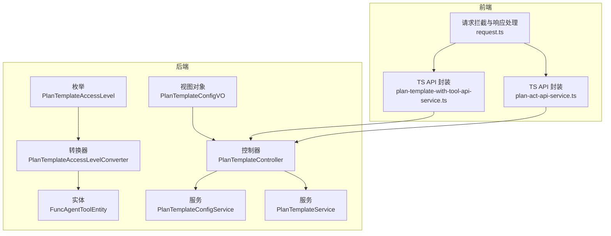
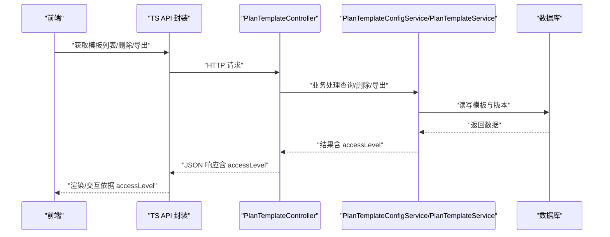
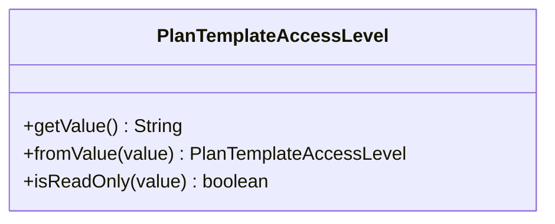
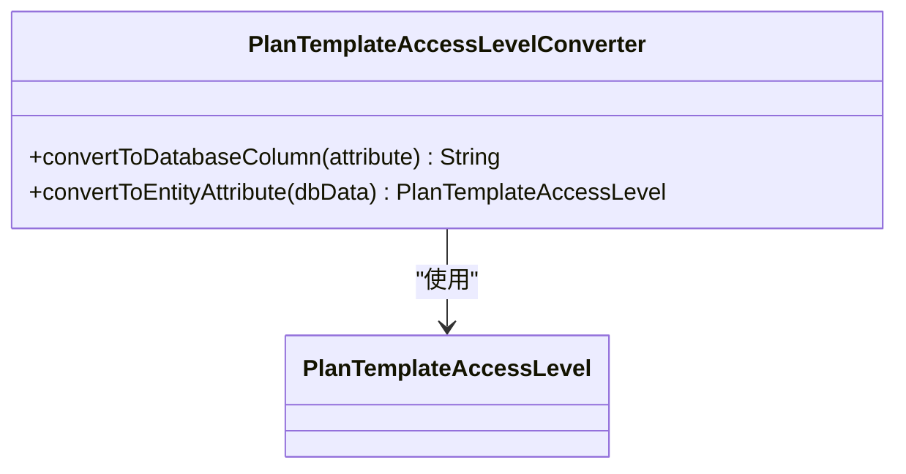
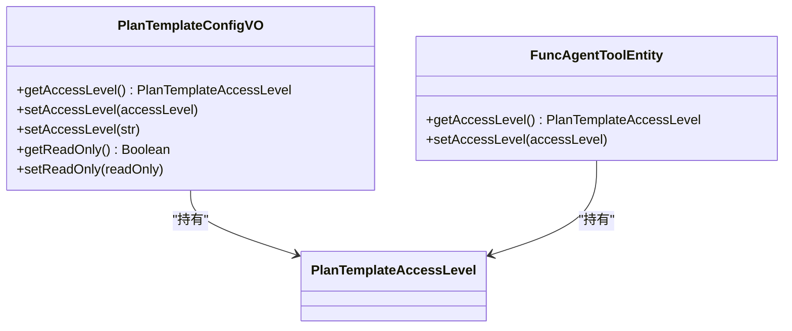
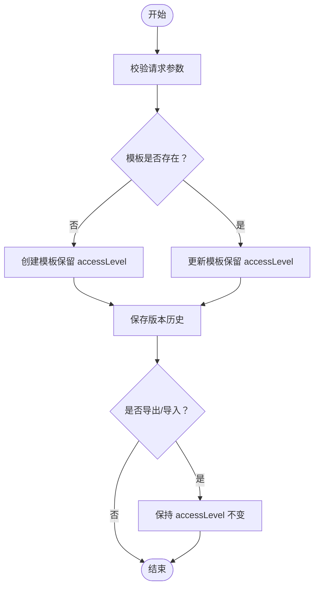
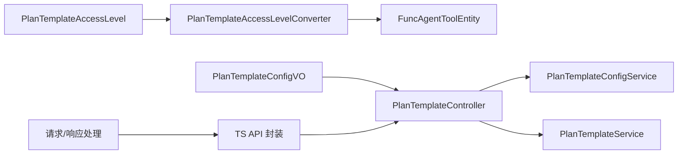

# 计划模板访问控制

<cite>
**本文引用的文件**
- [PlanTemplateAccessLevel.java](file://src/main/java/com/alibaba/cloud/ai/lynxe/planning/model/enums/PlanTemplateAccessLevel.java)
- [PlanTemplateAccessLevelConverter.java](file://src/main/java/com/alibaba/cloud/ai/lynxe/planning/model/converter/PlanTemplateAccessLevelConverter.java)
- [PlanTemplateConfigVO.java](file://src/main/java/com/alibaba/cloud/ai/lynxe/planning/model/vo/PlanTemplateConfigVO.java)
- [FuncAgentToolEntity.java](file://src/main/java/com/alibaba/cloud/ai/lynxe/planning/model/po/FuncAgentToolEntity.java)
- [PlanTemplateController.java](file://src/main/java/com/alibaba/cloud/ai/lynxe/planning/controller/PlanTemplateController.java)
- [PlanTemplateConfigService.java](file://src/main/java/com/alibaba/cloud/ai/lynxe/planning/service/PlanTemplateConfigService.java)
- [PlanTemplateService.java](file://src/main/java/com/alibaba/cloud/ai/lynxe/planning/service/PlanTemplateService.java)
- [PlanTemplateConfigException.java](file://src/main/java/com/alibaba/cloud/ai/lynxe/planning/exception/PlanTemplateConfigException.java)
- [plan-template-with-tool-api-service.ts](file://ui-vue3/src/api/plan-template-with-tool-api-service.ts)
- [plan-act-api-service.ts](file://ui-vue3/src/api/plan-act-api-service.ts)
- [request.ts](file://ui-vue3/src/utils/request.ts)
</cite>

## 目录
1. [简介](#简介)
2. [项目结构](#项目结构)
3. [核心组件](#核心组件)
4. [架构总览](#架构总览)
5. [详细组件分析](#详细组件分析)
6. [依赖关系分析](#依赖关系分析)
7. [性能与安全考量](#性能与安全考量)
8. [故障排查指南](#故障排查指南)
9. [结论](#结论)
10. [附录：API 调用示例与最佳实践](#附录api-调用示例与最佳实践)

## 简介
本文件系统化阐述“计划模板访问控制”机制，围绕以下目标展开：
- 解释 PlanTemplateAccessLevel 枚举的访问级别（可编辑、只读）及其业务语义
- 描述 PlanTemplateAccessLevelConverter 在权限值持久化与反序列化中的作用与实现
- 梳理基于访问级别的权限校验流程与安全控制策略
- 提供访问级别配置的 API 调用示例与最佳实践
- 说明权限变更对模板可见性与可操作性的影响
- 总结权限管理中的常见错误场景与处理方法

## 项目结构
围绕“计划模板访问控制”的关键代码分布在如下模块：
- 枚举与转换器：定义访问级别与数据库映射
- 数据模型：VO/PO 中的访问级别字段与默认值
- 控制器与服务：模板 CRUD、版本管理、工具注册等接口
- 前端 API 封装：模板列表、删除、导出导入等调用封装
- 异常与错误处理：统一异常类型与错误码

图表来源
- [PlanTemplateAccessLevel.java](file://src/main/java/com/alibaba/cloud/ai/lynxe/planning/model/enums/PlanTemplateAccessLevel.java#L1-L80)
- [PlanTemplateAccessLevelConverter.java](file://src/main/java/com/alibaba/cloud/ai/lynxe/planning/model/converter/PlanTemplateAccessLevelConverter.java#L1-L44)
- [FuncAgentToolEntity.java](file://src/main/java/com/alibaba/cloud/ai/lynxe/planning/model/po/FuncAgentToolEntity.java#L1-L200)
- [PlanTemplateConfigVO.java](file://src/main/java/com/alibaba/cloud/ai/lynxe/planning/model/vo/PlanTemplateConfigVO.java#L1-L200)
- [PlanTemplateController.java](file://src/main/java/com/alibaba/cloud/ai/lynxe/planning/controller/PlanTemplateController.java#L1-L200)
- [PlanTemplateConfigService.java](file://src/main/java/com/alibaba/cloud/ai/lynxe/planning/service/PlanTemplateConfigService.java#L1-L200)
- [PlanTemplateService.java](file://src/main/java/com/alibaba/cloud/ai/lynxe/planning/service/PlanTemplateService.java)
- [plan-template-with-tool-api-service.ts](file://ui-vue3/src/api/plan-template-with-tool-api-service.ts#L94-L140)
- [plan-act-api-service.ts](file://ui-vue3/src/api/plan-act-api-service.ts#L68-L85)
- [request.ts](file://ui-vue3/src/utils/request.ts#L38-L64)

章节来源
- [PlanTemplateAccessLevel.java](file://src/main/java/com/alibaba/cloud/ai/lynxe/planning/model/enums/PlanTemplateAccessLevel.java#L1-L80)
- [PlanTemplateAccessLevelConverter.java](file://src/main/java/com/alibaba/cloud/ai/lynxe/planning/model/converter/PlanTemplateAccessLevelConverter.java#L1-L44)
- [PlanTemplateConfigVO.java](file://src/main/java/com/alibaba/cloud/ai/lynxe/planning/model/vo/PlanTemplateConfigVO.java#L1-L200)
- [FuncAgentToolEntity.java](file://src/main/java/com/alibaba/cloud/ai/lynxe/planning/model/po/FuncAgentToolEntity.java#L1-L200)
- [PlanTemplateController.java](file://src/main/java/com/alibaba/cloud/ai/lynxe/planning/controller/PlanTemplateController.java#L280-L360)
- [PlanTemplateConfigService.java](file://src/main/java/com/alibaba/cloud/ai/lynxe/planning/service/PlanTemplateConfigService.java#L1-L200)
- [PlanTemplateService.java](file://src/main/java/com/alibaba/cloud/ai/lynxe/planning/service/PlanTemplateService.java)
- [plan-template-with-tool-api-service.ts](file://ui-vue3/src/api/plan-template-with-tool-api-service.ts#L94-L140)
- [plan-act-api-service.ts](file://ui-vue3/src/api/plan-act-api-service.ts#L68-L85)
- [request.ts](file://ui-vue3/src/utils/request.ts#L38-L64)

## 核心组件
- 访问级别枚举 PlanTemplateAccessLevel
  - 定义两个级别：只读（readOnly）、可编辑（editable）
  - 提供 JSON 序列化/反序列化入口与字符串判定工具
- 访问级别转换器 PlanTemplateAccessLevelConverter
  - 实现 JPA AttributeConverter 接口，负责枚举与数据库字符串值之间的双向转换
  - 默认值策略：空值时回退为可编辑
- 视图对象 PlanTemplateConfigVO
  - 维护 accessLevel 字段；兼容 readOnly 字段用于向后兼容
  - 提供从字符串设置访问级别的便捷方法
- 实体 FuncAgentToolEntity
  - 使用 @Convert 注解绑定转换器，持久化 accessLevel 字段
  - 默认值为可编辑
- 控制器与服务
  - 提供模板列表、删除、导出导入、版本查询等接口
  - 通过服务层完成模板存在性校验、版本保存与工具注册等逻辑
- 前端 API 封装
  - 提供模板列表、删除、导出导入等调用封装
  - 统一响应处理与错误日志

章节来源
- [PlanTemplateAccessLevel.java](file://src/main/java/com/alibaba/cloud/ai/lynxe/planning/model/enums/PlanTemplateAccessLevel.java#L1-L80)
- [PlanTemplateAccessLevelConverter.java](file://src/main/java/com/alibaba/cloud/ai/lynxe/planning/model/converter/PlanTemplateAccessLevelConverter.java#L1-L44)
- [PlanTemplateConfigVO.java](file://src/main/java/com/alibaba/cloud/ai/lynxe/planning/model/vo/PlanTemplateConfigVO.java#L110-L146)
- [FuncAgentToolEntity.java](file://src/main/java/com/alibaba/cloud/ai/lynxe/planning/model/po/FuncAgentToolEntity.java#L70-L100)
- [PlanTemplateController.java](file://src/main/java/com/alibaba/cloud/ai/lynxe/planning/controller/PlanTemplateController.java#L280-L360)
- [PlanTemplateConfigService.java](file://src/main/java/com/alibaba/cloud/ai/lynxe/planning/service/PlanTemplateConfigService.java#L1-L200)
- [plan-template-with-tool-api-service.ts](file://ui-vue3/src/api/plan-template-with-tool-api-service.ts#L94-L140)
- [plan-act-api-service.ts](file://ui-vue3/src/api/plan-act-api-service.ts#L68-L85)
- [request.ts](file://ui-vue3/src/utils/request.ts#L38-L64)

## 架构总览
访问控制贯穿“前端 -> 控制器 -> 服务 -> 实体/仓库 -> 数据库”的链路，其中：
- 访问级别以字符串形式存储于数据库
- JPA 转换器负责枚举与字符串的互转
- 控制器在返回模板配置时携带 accessLevel 字段
- 前端根据 accessLevel 决定模板的可见性与可操作性

图表来源
- [PlanTemplateController.java](file://src/main/java/com/alibaba/cloud/ai/lynxe/planning/controller/PlanTemplateController.java#L280-L360)
- [PlanTemplateConfigService.java](file://src/main/java/com/alibaba/cloud/ai/lynxe/planning/service/PlanTemplateConfigService.java#L1-L200)
- [PlanTemplateService.java](file://src/main/java/com/alibaba/cloud/ai/lynxe/planning/service/PlanTemplateService.java)
- [plan-template-with-tool-api-service.ts](file://ui-vue3/src/api/plan-template-with-tool-api-service.ts#L94-L140)
- [plan-act-api-service.ts](file://ui-vue3/src/api/plan-act-api-service.ts#L68-L85)

## 详细组件分析

### 访问级别枚举 PlanTemplateAccessLevel
- 业务含义
  - 只读：前端不可修改或删除该模板
  - 可编辑：默认级别，允许修改与删除
- 关键点
  - JSON 序列化使用字符串值
  - 反序列化支持空值与未知值回退为可编辑
  - 提供 isReadOnly 工具方法判断字符串是否为只读

图表来源
- [PlanTemplateAccessLevel.java](file://src/main/java/com/alibaba/cloud/ai/lynxe/planning/model/enums/PlanTemplateAccessLevel.java#L1-L80)

章节来源
- [PlanTemplateAccessLevel.java](file://src/main/java/com/alibaba/cloud/ai/lynxe/planning/model/enums/PlanTemplateAccessLevel.java#L1-L80)

### 访问级别转换器 PlanTemplateAccessLevelConverter
- 作用
  - 将枚举映射到数据库字符串列
  - 在实体属性为空时回退为可编辑
- 实现要点
  - convertToDatabaseColumn：空值回退
  - convertToEntityAttribute：通过枚举工厂方法解析字符串

图表来源
- [PlanTemplateAccessLevelConverter.java](file://src/main/java/com/alibaba/cloud/ai/lynxe/planning/model/converter/PlanTemplateAccessLevelConverter.java#L1-L44)
- [PlanTemplateAccessLevel.java](file://src/main/java/com/alibaba/cloud/ai/lynxe/planning/model/enums/PlanTemplateAccessLevel.java#L1-L80)

章节来源
- [PlanTemplateAccessLevelConverter.java](file://src/main/java/com/alibaba/cloud/ai/lynxe/planning/model/converter/PlanTemplateAccessLevelConverter.java#L1-L44)

### 视图对象与实体中的访问级别
- PlanTemplateConfigVO
  - accessLevel 字段：优先使用，若为空则回退为可编辑
  - readOnly 字段：向后兼容，设置 accessLevel 时同步更新
  - 提供 setAccessLevel(String) 便捷方法
- FuncAgentToolEntity
  - 使用 @Convert 绑定转换器
  - accessLevel 默认值为可编辑
  - 支持字符串设置访问级别

图表来源
- [PlanTemplateConfigVO.java](file://src/main/java/com/alibaba/cloud/ai/lynxe/planning/model/vo/PlanTemplateConfigVO.java#L110-L146)
- [FuncAgentToolEntity.java](file://src/main/java/com/alibaba/cloud/ai/lynxe/planning/model/po/FuncAgentToolEntity.java#L190-L200)
- [PlanTemplateAccessLevel.java](file://src/main/java/com/alibaba/cloud/ai/lynxe/planning/model/enums/PlanTemplateAccessLevel.java#L1-L80)

章节来源
- [PlanTemplateConfigVO.java](file://src/main/java/com/alibaba/cloud/ai/lynxe/planning/model/vo/PlanTemplateConfigVO.java#L110-L146)
- [FuncAgentToolEntity.java](file://src/main/java/com/alibaba/cloud/ai/lynxe/planning/model/po/FuncAgentToolEntity.java#L190-L200)

### 权限校验流程与安全控制策略
- 前端侧
  - 基于 accessLevel 决策模板的显示与操作按钮可用性
  - 删除、导出导入等操作前进行参数校验与提示
- 后端侧
  - 控制器对必填参数进行校验（如 planId）
  - 服务层在创建/更新模板时确保模板存在性
  - 版本保存与导出导入流程中保持 accessLevel 的一致性
- 安全建议
  - 前端仅作为“可见性与可操作性”的约束，不替代后端鉴权
  - 对敏感操作（删除、覆盖导入）建议增加后端鉴权与审计日志

图表来源
- [PlanTemplateController.java](file://src/main/java/com/alibaba/cloud/ai/lynxe/planning/controller/PlanTemplateController.java#L280-L360)
- [PlanTemplateConfigService.java](file://src/main/java/com/alibaba/cloud/ai/lynxe/planning/service/PlanTemplateConfigService.java#L1-L200)

章节来源
- [PlanTemplateController.java](file://src/main/java/com/alibaba/cloud/ai/lynxe/planning/controller/PlanTemplateController.java#L280-L360)
- [PlanTemplateConfigService.java](file://src/main/java/com/alibaba/cloud/ai/lynxe/planning/service/PlanTemplateConfigService.java#L1-L200)

### API 调用示例与最佳实践
- 获取所有模板配置（含 accessLevel）
  - 前端调用：/api/plan-template/list-config
  - 返回：模板列表，每个条目包含 accessLevel
- 删除模板
  - 前端调用：/api/plan-template/delete（POST，body: { planId }）
  - 后端：校验 planId，查询模板是否存在，存在则删除并返回成功
- 导出/导入模板
  - 导出：GET /api/plan-template/export-all
  - 导入：POST /api/plan-template/import-all（body: 模板数组）
  - 导入时保持 accessLevel 不变，避免越权风险

最佳实践
- 在前端根据 accessLevel 动态禁用编辑/删除按钮
- 导入时对 accessLevel 进行白名单校验（只接受已知值）
- 对删除操作增加二次确认与审计记录
- 统一异常处理：后端抛出 PlanTemplateConfigException 并返回错误码与消息

章节来源
- [plan-template-with-tool-api-service.ts](file://ui-vue3/src/api/plan-template-with-tool-api-service.ts#L94-L140)
- [plan-act-api-service.ts](file://ui-vue3/src/api/plan-act-api-service.ts#L68-L85)
- [PlanTemplateController.java](file://src/main/java/com/alibaba/cloud/ai/lynxe/planning/controller/PlanTemplateController.java#L280-L360)
- [PlanTemplateConfigException.java](file://src/main/java/com/alibaba/cloud/ai/lynxe/planning/exception/PlanTemplateConfigException.java#L1-L60)

## 依赖关系分析
- 枚举与转换器
  - 枚举提供字符串值与工厂方法
  - 转换器在实体层绑定枚举与字符串列
- 实体与视图对象
  - 实体默认值为可编辑，视图对象提供兼容字段与便捷设置
- 控制器与服务
  - 控制器聚合服务层能力，返回包含 accessLevel 的响应
  - 服务层负责模板存在性、版本保存与工具注册
- 前端 API 封装
  - 统一请求与响应处理，便于在 UI 层应用访问控制策略

图表来源
- [PlanTemplateAccessLevel.java](file://src/main/java/com/alibaba/cloud/ai/lynxe/planning/model/enums/PlanTemplateAccessLevel.java#L1-L80)
- [PlanTemplateAccessLevelConverter.java](file://src/main/java/com/alibaba/cloud/ai/lynxe/planning/model/converter/PlanTemplateAccessLevelConverter.java#L1-L44)
- [FuncAgentToolEntity.java](file://src/main/java/com/alibaba/cloud/ai/lynxe/planning/model/po/FuncAgentToolEntity.java#L1-L200)
- [PlanTemplateConfigVO.java](file://src/main/java/com/alibaba/cloud/ai/lynxe/planning/model/vo/PlanTemplateConfigVO.java#L1-L200)
- [PlanTemplateController.java](file://src/main/java/com/alibaba/cloud/ai/lynxe/planning/controller/PlanTemplateController.java#L1-L200)
- [PlanTemplateConfigService.java](file://src/main/java/com/alibaba/cloud/ai/lynxe/planning/service/PlanTemplateConfigService.java#L1-L200)
- [PlanTemplateService.java](file://src/main/java/com/alibaba/cloud/ai/lynxe/planning/service/PlanTemplateService.java)
- [plan-template-with-tool-api-service.ts](file://ui-vue3/src/api/plan-template-with-tool-api-service.ts#L94-L140)
- [request.ts](file://ui-vue3/src/utils/request.ts#L38-L64)

章节来源
- [PlanTemplateAccessLevel.java](file://src/main/java/com/alibaba/cloud/ai/lynxe/planning/model/enums/PlanTemplateAccessLevel.java#L1-L80)
- [PlanTemplateAccessLevelConverter.java](file://src/main/java/com/alibaba/cloud/ai/lynxe/planning/model/converter/PlanTemplateAccessLevelConverter.java#L1-L44)
- [FuncAgentToolEntity.java](file://src/main/java/com/alibaba/cloud/ai/lynxe/planning/model/po/FuncAgentToolEntity.java#L1-L200)
- [PlanTemplateConfigVO.java](file://src/main/java/com/alibaba/cloud/ai/lynxe/planning/model/vo/PlanTemplateConfigVO.java#L1-L200)
- [PlanTemplateController.java](file://src/main/java/com/alibaba/cloud/ai/lynxe/planning/controller/PlanTemplateController.java#L1-L200)
- [PlanTemplateConfigService.java](file://src/main/java/com/alibaba/cloud/ai/lynxe/planning/service/PlanTemplateConfigService.java#L1-L200)
- [PlanTemplateService.java](file://src/main/java/com/alibaba/cloud/ai/lynxe/planning/service/PlanTemplateService.java)
- [plan-template-with-tool-api-service.ts](file://ui-vue3/src/api/plan-template-with-tool-api-service.ts#L94-L140)
- [request.ts](file://ui-vue3/src/utils/request.ts#L38-L64)

## 性能与安全考量
- 性能
  - 访问级别字符串比较简单，性能开销极低
  - 批量导出/导入时注意 accessLevel 的一致性，避免重复转换
- 安全
  - 前端仅作为“可见性与可操作性”的约束，不替代后端鉴权
  - 对删除、覆盖导入等高危操作建议增加后端鉴权与审计日志
  - 对未知字符串值采用默认回退策略，降低异常传播风险

[本节为通用指导，无需列出具体文件来源]

## 故障排查指南
- 常见错误场景
  - accessLevel 传入未知字符串：枚举工厂方法会回退为可编辑
  - readOnly 与 accessLevel 同时存在：以 accessLevel 为准，readOnly 同步更新
  - 删除模板失败：检查 planId 是否为空或模板不存在
  - 导入失败：检查模板数组格式与字段完整性
- 定位方法
  - 查看控制器日志与异常信息
  - 使用 PlanTemplateConfigException 获取错误码与消息
  - 前端统一响应处理会打印错误详情

章节来源
- [PlanTemplateAccessLevel.java](file://src/main/java/com/alibaba/cloud/ai/lynxe/planning/model/enums/PlanTemplateAccessLevel.java#L56-L77)
- [PlanTemplateConfigVO.java](file://src/main/java/com/alibaba/cloud/ai/lynxe/planning/model/vo/PlanTemplateConfigVO.java#L110-L146)
- [PlanTemplateController.java](file://src/main/java/com/alibaba/cloud/ai/lynxe/planning/controller/PlanTemplateController.java#L320-L360)
- [PlanTemplateConfigException.java](file://src/main/java/com/alibaba/cloud/ai/lynxe/planning/exception/PlanTemplateConfigException.java#L1-L60)
- [request.ts](file://ui-vue3/src/utils/request.ts#L38-L64)

## 结论
- 访问级别以字符串形式持久化，通过 JPA 转换器与枚举工厂方法实现稳定映射
- 前后端协同：后端保证数据一致性，前端负责 UI 层的可见性与可操作性控制
- 最佳实践强调：以 accessLevel 为依据进行前端展示与操作限制，同时在后端完善鉴权与审计

[本节为总结，无需列出具体文件来源]

## 附录：API 调用示例与最佳实践

- 获取模板列表（含 accessLevel）
  - 方法：GET /api/plan-template/list-config
  - 返回：模板列表，每项包含 accessLevel
- 删除模板
  - 方法：POST /api/plan-template/delete
  - 请求体：{ planId }
  - 行为：校验 planId，存在则删除并返回成功
- 导出/导入模板
  - 导出：GET /api/plan-template/export-all
  - 导入：POST /api/plan-template/import-all（body: 模板数组）
  - 注意：导入时保持 accessLevel 不变，避免越权风险

最佳实践
- 前端根据 accessLevel 动态禁用编辑/删除按钮
- 导入时对 accessLevel 进行白名单校验（只接受已知值）
- 对删除操作增加二次确认与审计记录
- 统一异常处理：后端抛出 PlanTemplateConfigException 并返回错误码与消息

章节来源
- [plan-template-with-tool-api-service.ts](file://ui-vue3/src/api/plan-template-with-tool-api-service.ts#L94-L140)
- [plan-act-api-service.ts](file://ui-vue3/src/api/plan-act-api-service.ts#L68-L85)
- [PlanTemplateController.java](file://src/main/java/com/alibaba/cloud/ai/lynxe/planning/controller/PlanTemplateController.java#L280-L360)
- [PlanTemplateConfigException.java](file://src/main/java/com/alibaba/cloud/ai/lynxe/planning/exception/PlanTemplateConfigException.java#L1-L60)