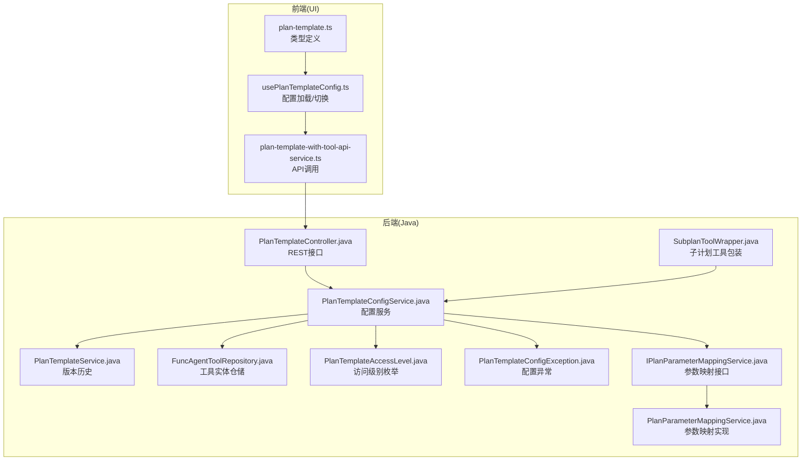
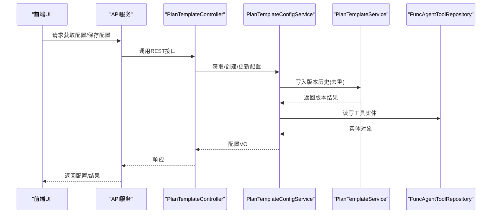
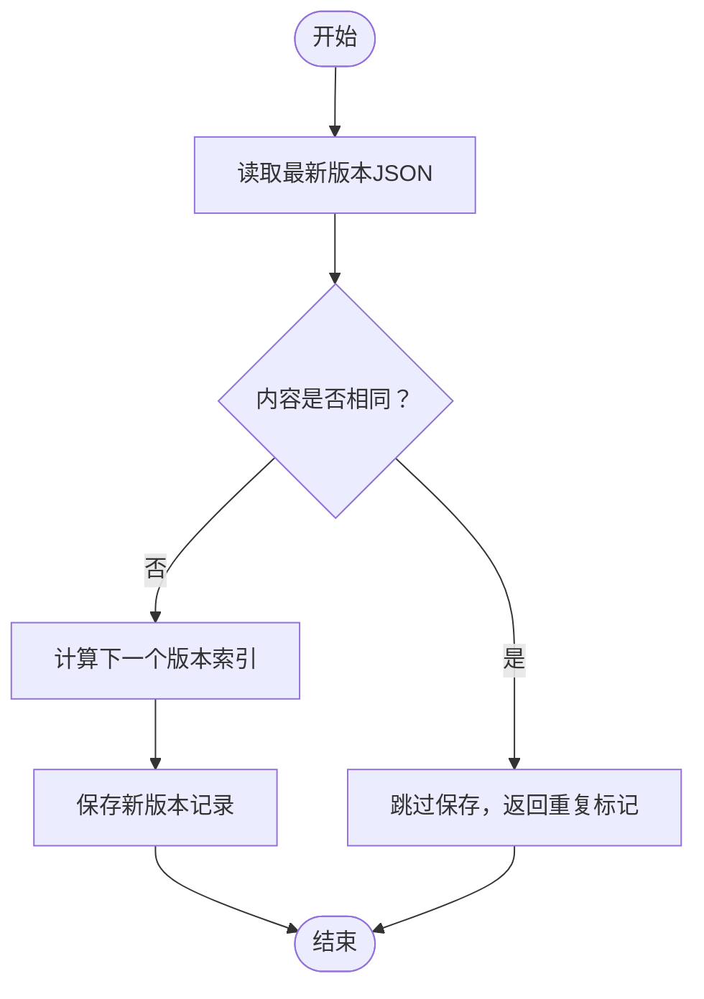
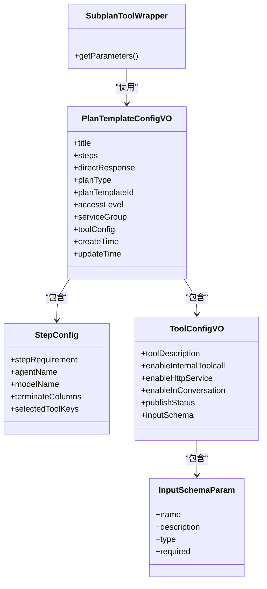
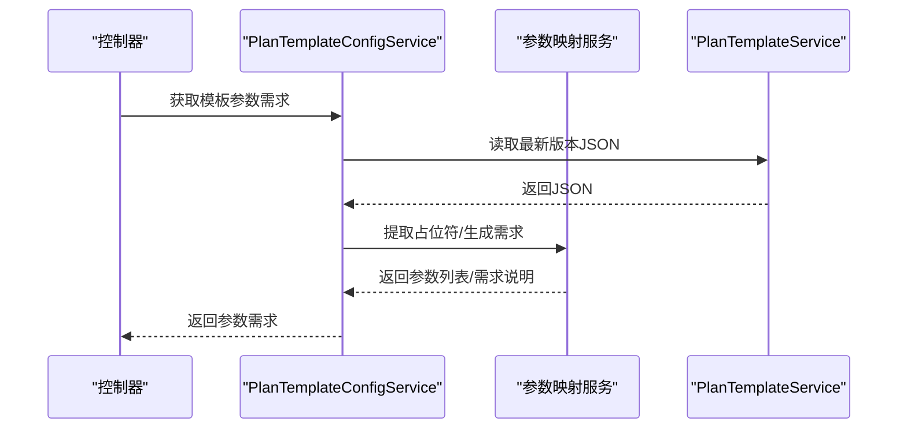
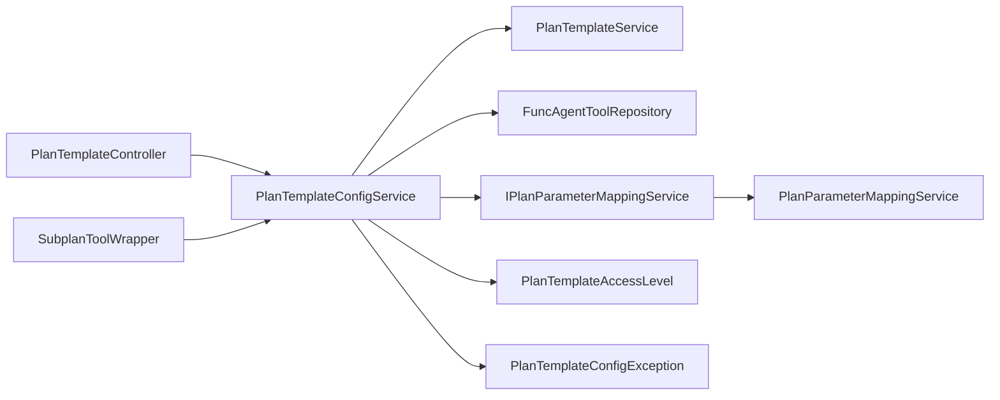

# 计划模板配置管理

<cite>
**本文引用的文件**
- [PlanTemplateConfigVO.java](file://src/main/java/com/alibaba/cloud/ai/lynxe/planning/model/vo/PlanTemplateConfigVO.java)
- [PlanTemplateConfigService.java](file://src/main/java/com/alibaba/cloud/ai/lynxe/planning/service/PlanTemplateConfigService.java)
- [PlanTemplateConfigException.java](file://src/main/java/com/alibaba/cloud/ai/lynxe/planning/exception/PlanTemplateConfigException.java)
- [PlanTemplateAccessLevel.java](file://src/main/java/com/alibaba/cloud/ai/lynxe/planning/model/enums/PlanTemplateAccessLevel.java)
- [FuncAgentToolRepository.java](file://src/main/java/com/alibaba/cloud/ai/lynxe/planning/repository/FuncAgentToolRepository.java)
- [PlanTemplateService.java](file://src/main/java/com/alibaba/cloud/ai/lynxe/planning/service/PlanTemplateService.java)
- [PlanTemplateController.java](file://src/main/java/com/alibaba/cloud/ai/lynxe/planning/controller/PlanTemplateController.java)
- [IPlanParameterMappingService.java](file://src/main/java/com/alibaba/cloud/ai/lynxe/planning/service/IPlanParameterMappingService.java)
- [PlanParameterMappingService.java](file://src/main/java/com/alibaba/cloud/ai/lynxe/planning/service/PlanParameterMappingService.java)
- [SubplanToolWrapper.java](file://src/main/java/com/alibaba/cloud/ai/lynxe/subplan/model/vo/SubplanToolWrapper.java)
- [plan-template.ts](file://ui-vue3/src/types/plan-template.ts)
- [usePlanTemplateConfig.ts](file://ui-vue3/src/composables/usePlanTemplateConfig.ts)
- [plan-template-with-tool-api-service.ts](file://ui-vue3/src/api/plan-template-with-tool-api-service.ts)
</cite>

## 目录
1. [简介](#简介)
2. [项目结构](#项目结构)
3. [核心组件](#核心组件)
4. [架构总览](#架构总览)
5. [详细组件分析](#详细组件分析)
6. [依赖关系分析](#依赖关系分析)
7. [性能考虑](#性能考虑)
8. [故障排查指南](#故障排查指南)
9. [结论](#结论)
10. [附录](#附录)

## 简介
本文件面向“计划模板配置管理”的深度技术文档，围绕 PlanTemplateConfigVO 数据结构设计、PlanTemplateConfigService 的配置验证与持久化能力、版本历史与变更生效机制、热更新支持、复杂配置场景（多工具协同与参数映射）以及异常诊断与性能优化进行系统化阐述。目标是帮助开发者在理解前后端协作流程的同时，掌握配置项的语义、约束与默认值，并能高效地进行配置导入导出、参数映射与工具注册。

## 项目结构
后端采用分层架构：控制器层负责对外接口；服务层封装业务逻辑（含配置准备、创建/更新、版本历史、导入导出等）；仓储层访问数据库实体；前端通过类型定义与组合式函数与后端交互。

图表来源
- [PlanTemplateController.java](file://src/main/java/com/alibaba/cloud/ai/lynxe/planning/controller/PlanTemplateController.java#L73-L142)
- [PlanTemplateConfigService.java](file://src/main/java/com/alibaba/cloud/ai/lynxe/planning/service/PlanTemplateConfigService.java#L42-L1070)
- [PlanTemplateService.java](file://src/main/java/com/alibaba/cloud/ai/lynxe/planning/service/PlanTemplateService.java#L1-L200)
- [FuncAgentToolRepository.java](file://src/main/java/com/alibaba/cloud/ai/lynxe/planning/repository/FuncAgentToolRepository.java#L1-L58)
- [PlanTemplateAccessLevel.java](file://src/main/java/com/alibaba/cloud/ai/lynxe/planning/model/enums/PlanTemplateAccessLevel.java#L1-L80)
- [PlanTemplateConfigException.java](file://src/main/java/com/alibaba/cloud/ai/lynxe/planning/exception/PlanTemplateConfigException.java#L1-L60)
- [IPlanParameterMappingService.java](file://src/main/java/com/alibaba/cloud/ai/lynxe/planning/service/IPlanParameterMappingService.java#L1-L87)
- [PlanParameterMappingService.java](file://src/main/java/com/alibaba/cloud/ai/lynxe/planning/service/PlanParameterMappingService.java#L1-L78)
- [SubplanToolWrapper.java](file://src/main/java/com/alibaba/cloud/ai/lynxe/subplan/model/vo/SubplanToolWrapper.java#L117-L169)
- [plan-template.ts](file://ui-vue3/src/types/plan-template.ts#L54-L90)
- [usePlanTemplateConfig.ts](file://ui-vue3/src/composables/usePlanTemplateConfig.ts#L134-L166)
- [plan-template-with-tool-api-service.ts](file://ui-vue3/src/api/plan-template-with-tool-api-service.ts#L60-L105)

章节来源
- [PlanTemplateController.java](file://src/main/java/com/alibaba/cloud/ai/lynxe/planning/controller/PlanTemplateController.java#L73-L142)
- [PlanTemplateConfigService.java](file://src/main/java/com/alibaba/cloud/ai/lynxe/planning/service/PlanTemplateConfigService.java#L42-L1070)
- [PlanTemplateService.java](file://src/main/java/com/alibaba/cloud/ai/lynxe/planning/service/PlanTemplateService.java#L1-L200)
- [FuncAgentToolRepository.java](file://src/main/java/com/alibaba/cloud/ai/lynxe/planning/repository/FuncAgentToolRepository.java#L1-L58)
- [PlanTemplateAccessLevel.java](file://src/main/java/com/alibaba/cloud/ai/lynxe/planning/model/enums/PlanTemplateAccessLevel.java#L1-L80)
- [PlanTemplateConfigException.java](file://src/main/java/com/alibaba/cloud/ai/lynxe/planning/exception/PlanTemplateConfigException.java#L1-L60)
- [IPlanParameterMappingService.java](file://src/main/java/com/alibaba/cloud/ai/lynxe/planning/service/IPlanParameterMappingService.java#L1-L87)
- [PlanParameterMappingService.java](file://src/main/java/com/alibaba/cloud/ai/lynxe/planning/service/PlanParameterMappingService.java#L1-L78)
- [SubplanToolWrapper.java](file://src/main/java/com/alibaba/cloud/ai/lynxe/subplan/model/vo/SubplanToolWrapper.java#L117-L169)
- [plan-template.ts](file://ui-vue3/src/types/plan-template.ts#L54-L90)
- [usePlanTemplateConfig.ts](file://ui-vue3/src/composables/usePlanTemplateConfig.ts#L134-L166)
- [plan-template-with-tool-api-service.ts](file://ui-vue3/src/api/plan-template-with-tool-api-service.ts#L60-L105)

## 核心组件
- PlanTemplateConfigVO：计划模板配置的数据载体，包含标题、步骤、直接响应、模板类型、模板ID、访问级别、只读标记、服务组、工具配置、创建/更新时间等字段及默认值。
- PlanTemplateConfigService：配置准备、校验、创建/更新计划模板、协调器工具（工具注册）的创建/更新、删除、导出/导入、版本历史写入等核心服务。
- PlanTemplateService：版本历史保存、比较最新版本内容是否相同、查询版本列表与指定版本。
- FuncAgentToolRepository：对 FuncAgentToolEntity 的数据访问，支持按模板ID、名称、服务组+名称等查询与删除。
- PlanTemplateAccessLevel：访问级别枚举（可编辑/只读），用于控制前端可编辑性。
- PlanTemplateConfigException：统一的配置异常类型，携带错误码与消息。
- 参数映射服务：从模板JSON中提取占位符、校验参数完整性、替换参数、生成参数需求说明。
- 子计划工具包装：将配置转换为工具参数JSON模式，供子计划工具使用。

章节来源
- [PlanTemplateConfigVO.java](file://src/main/java/com/alibaba/cloud/ai/lynxe/planning/model/vo/PlanTemplateConfigVO.java#L28-L188)
- [PlanTemplateConfigService.java](file://src/main/java/com/alibaba/cloud/ai/lynxe/planning/service/PlanTemplateConfigService.java#L69-L145)
- [PlanTemplateService.java](file://src/main/java/com/alibaba/cloud/ai/lynxe/planning/service/PlanTemplateService.java#L90-L171)
- [FuncAgentToolRepository.java](file://src/main/java/com/alibaba/cloud/ai/lynxe/planning/repository/FuncAgentToolRepository.java#L31-L57)
- [PlanTemplateAccessLevel.java](file://src/main/java/com/alibaba/cloud/ai/lynxe/planning/model/enums/PlanTemplateAccessLevel.java#L24-L79)
- [PlanTemplateConfigException.java](file://src/main/java/com/alibaba/cloud/ai/lynxe/planning/exception/PlanTemplateConfigException.java#L22-L59)
- [IPlanParameterMappingService.java](file://src/main/java/com/alibaba/cloud/ai/lynxe/planning/service/IPlanParameterMappingService.java#L29-L87)
- [PlanParameterMappingService.java](file://src/main/java/com/alibaba/cloud/ai/lynxe/planning/service/PlanParameterMappingService.java#L39-L78)
- [SubplanToolWrapper.java](file://src/main/java/com/alibaba/cloud/ai/lynxe/subplan/model/vo/SubplanToolWrapper.java#L117-L169)

## 架构总览
后端通过控制器暴露REST接口，服务层完成配置准备、校验与持久化，版本历史由独立服务维护，前端通过类型与组合式函数进行配置加载、切换与提交。

图表来源
- [PlanTemplateController.java](file://src/main/java/com/alibaba/cloud/ai/lynxe/planning/controller/PlanTemplateController.java#L404-L446)
- [PlanTemplateConfigService.java](file://src/main/java/com/alibaba/cloud/ai/lynxe/planning/service/PlanTemplateConfigService.java#L261-L361)
- [PlanTemplateService.java](file://src/main/java/com/alibaba/cloud/ai/lynxe/planning/service/PlanTemplateService.java#L90-L110)
- [FuncAgentToolRepository.java](file://src/main/java/com/alibaba/cloud/ai/lynxe/planning/repository/FuncAgentToolRepository.java#L31-L57)

## 详细组件分析

### 数据结构：PlanTemplateConfigVO 设计与默认值
- 字段与默认值
  - title：字符串，默认空串
  - steps：步骤列表，默认空列表
  - directResponse：布尔，默认false
  - planType：字符串，默认“dynamic_agent”
  - planTemplateId：字符串，必填（服务层校验）
  - accessLevel：枚举，默认可编辑
  - readOnly：兼容字段，默认false；若未设置则以accessLevel为准
  - serviceGroup：字符串，默认“ungrouped”（服务层设置）
  - toolConfig：工具配置，默认空对象（服务层生成或填充）
  - createTime/updateTime：字符串，默认空串
- 步骤子结构 StepConfig
  - stepRequirement、agentName、modelName、terminateColumns、selectedToolKeys
- 工具配置子结构 ToolConfigVO
  - toolDescription：默认空串
  - enableInternalToolcall：默认true（服务层强制）
  - enableHttpService：默认false
  - enableInConversation：默认false
  - publishStatus：默认“PUBLISHED”
  - inputSchema：默认空数组
- 输入参数子结构 InputSchemaParam
  - name、description、type（默认“string”）、required（默认true）

章节来源
- [PlanTemplateConfigVO.java](file://src/main/java/com/alibaba/cloud/ai/lynxe/planning/model/vo/PlanTemplateConfigVO.java#L28-L188)
- [PlanTemplateConfigVO.java](file://src/main/java/com/alibaba/cloud/ai/lynxe/planning/model/vo/PlanTemplateConfigVO.java#L194-L262)
- [PlanTemplateConfigVO.java](file://src/main/java/com/alibaba/cloud/ai/lynxe/planning/model/vo/PlanTemplateConfigVO.java#L268-L351)
- [PlanTemplateConfigVO.java](file://src/main/java/com/alibaba/cloud/ai/lynxe/planning/model/vo/PlanTemplateConfigVO.java#L357-L416)

### 服务：PlanTemplateConfigService 功能矩阵
- 配置准备 preparePlanTemplateConfigWithToolConfig
  - 校验必填字段（模板ID）
  - 确保计划模板存在（不存在则创建）
  - 若未提供工具配置，则创建空对象
  - 若未提供输入参数schema，则从模板JSON提取占位符生成
- 创建/更新计划模板 createPlanTemplateFromConfig
  - 保存/更新 FuncAgentToolEntity
  - 写入版本历史（去重：内容相同则跳过）
  - 设置服务组默认值“ungrouped”
  - 返回配置VO
- 协调器工具创建/更新 createOrUpdateCoordinatorToolFromPlanTemplateConfig
  - 先确保计划模板存在并同步最新配置
  - 准备工具配置（必要时生成输入schema）
  - 按模板ID查找/更新或新建工具实体
- 更新/删除工具 updateCoordinatorTool/deleteCoordinatorTool
  - 强制启用内部工具调用
  - 将输入schema转换为JSON存储
- 导入/导出 importPlanTemplates/exportAllPlanTemplates
  - 导入：覆盖已有模板，先删除再创建
  - 导出：合并模板JSON、步骤、工具配置
- 查询与清理
  - getPlanTemplate/getAllPlanTemplates
  - deletePlanTemplate（级联删除版本与工具）

章节来源
- [PlanTemplateConfigService.java](file://src/main/java/com/alibaba/cloud/ai/lynxe/planning/service/PlanTemplateConfigService.java#L69-L145)
- [PlanTemplateConfigService.java](file://src/main/java/com/alibaba/cloud/ai/lynxe/planning/service/PlanTemplateConfigService.java#L261-L361)
- [PlanTemplateConfigService.java](file://src/main/java/com/alibaba/cloud/ai/lynxe/planning/service/PlanTemplateConfigService.java#L409-L462)
- [PlanTemplateConfigService.java](file://src/main/java/com/alibaba/cloud/ai/lynxe/planning/service/PlanTemplateConfigService.java#L471-L527)
- [PlanTemplateConfigService.java](file://src/main/java/com/alibaba/cloud/ai/lynxe/planning/service/PlanTemplateConfigService.java#L582-L679)
- [PlanTemplateConfigService.java](file://src/main/java/com/alibaba/cloud/ai/lynxe/planning/service/PlanTemplateConfigService.java#L763-L820)
- [PlanTemplateConfigService.java](file://src/main/java/com/alibaba/cloud/ai/lynxe/planning/service/PlanTemplateConfigService.java#L854-L936)
- [PlanTemplateConfigService.java](file://src/main/java/com/alibaba/cloud/ai/lynxe/planning/service/PlanTemplateConfigService.java#L944-L1008)
- [PlanTemplateConfigService.java](file://src/main/java/com/alibaba/cloud/ai/lynxe/planning/service/PlanTemplateConfigService.java#L1014-L1070)

### 版本历史与变更生效机制
- 版本历史保存 saveToVersionHistory
  - 比较新旧内容是否语义相同（忽略格式差异）
  - 相同则不新增版本，返回重复标记与最新索引
  - 不同则递增版本号并保存
- 变更生效
  - 创建/更新计划模板时会同步写入版本历史
  - 工具配置变更通过 createOrUpdateCoordinatorToolFromPlanTemplateConfig 触发模板同步与工具更新
  - 导入覆盖现有模板，确保一致性

图表来源
- [PlanTemplateService.java](file://src/main/java/com/alibaba/cloud/ai/lynxe/planning/service/PlanTemplateService.java#L90-L110)
- [PlanTemplateService.java](file://src/main/java/com/alibaba/cloud/ai/lynxe/planning/service/PlanTemplateService.java#L162-L200)

章节来源
- [PlanTemplateService.java](file://src/main/java/com/alibaba/cloud/ai/lynxe/planning/service/PlanTemplateService.java#L90-L171)

### 热更新支持
- 前端通过组合式函数在加载配置时触发重新渲染与watcher检测，避免同一模板重复加载导致的视图不刷新问题
- 后端通过版本历史去重避免无意义写入，保证变更生效但不产生冗余版本

章节来源
- [usePlanTemplateConfig.ts](file://ui-vue3/src/composables/usePlanTemplateConfig.ts#L274-L302)

### 复杂配置场景示例

#### 场景一：多工具协同配置
- 步骤配置包含 selectedToolKeys，用于绑定多个工具键
- 工具配置 ToolConfigVO 中的 inputSchema 定义了参数模式，服务层会自动从模板JSON占位符生成或从用户提供的参数列表转换为JSON
- 子计划工具包装 SubplanToolWrapper 会将 ToolConfigVO 的 inputSchema 转换为工具参数JSON模式，供工具执行

图表来源
- [PlanTemplateConfigVO.java](file://src/main/java/com/alibaba/cloud/ai/lynxe/planning/model/vo/PlanTemplateConfigVO.java#L194-L262)
- [PlanTemplateConfigVO.java](file://src/main/java/com/alibaba/cloud/ai/lynxe/planning/model/vo/PlanTemplateConfigVO.java#L268-L351)
- [PlanTemplateConfigVO.java](file://src/main/java/com/alibaba/cloud/ai/lynxe/planning/model/vo/PlanTemplateConfigVO.java#L357-L416)
- [SubplanToolWrapper.java](file://src/main/java/com/alibaba/cloud/ai/lynxe/subplan/model/vo/SubplanToolWrapper.java#L117-L169)

章节来源
- [PlanTemplateConfigVO.java](file://src/main/java/com/alibaba/cloud/ai/lynxe/planning/model/vo/PlanTemplateConfigVO.java#L194-L262)
- [PlanTemplateConfigVO.java](file://src/main/java/com/alibaba/cloud/ai/lynxe/planning/model/vo/PlanTemplateConfigVO.java#L268-L351)
- [SubplanToolWrapper.java](file://src/main/java/com/alibaba/cloud/ai/lynxe/subplan/model/vo/SubplanToolWrapper.java#L117-L169)

#### 场景二：参数映射规则定义
- 从模板JSON中提取占位符 <<param>>，生成输入schema参数列表
- 支持参数完整性校验、替换与安全替换
- 控制器提供参数需求查询接口，便于前端展示

图表来源
- [PlanTemplateController.java](file://src/main/java/com/alibaba/cloud/ai/lynxe/planning/controller/PlanTemplateController.java#L364-L391)
- [PlanTemplateConfigService.java](file://src/main/java/com/alibaba/cloud/ai/lynxe/planning/service/PlanTemplateConfigService.java#L185-L230)
- [IPlanParameterMappingService.java](file://src/main/java/com/alibaba/cloud/ai/lynxe/planning/service/IPlanParameterMappingService.java#L39-L87)
- [PlanParameterMappingService.java](file://src/main/java/com/alibaba/cloud/ai/lynxe/planning/service/PlanParameterMappingService.java#L39-L78)

章节来源
- [PlanTemplateController.java](file://src/main/java/com/alibaba/cloud/ai/lynxe/planning/controller/PlanTemplateController.java#L364-L391)
- [PlanTemplateConfigService.java](file://src/main/java/com/alibaba/cloud/ai/lynxe/planning/service/PlanTemplateConfigService.java#L185-L230)
- [IPlanParameterMappingService.java](file://src/main/java/com/alibaba/cloud/ai/lynxe/planning/service/IPlanParameterMappingService.java#L39-L87)
- [PlanParameterMappingService.java](file://src/main/java/com/alibaba/cloud/ai/lynxe/planning/service/PlanParameterMappingService.java#L39-L78)

### 前端集成与配置加载
- 类型定义：前端 types 中 PlanTemplateConfigVO 与 ToolConfigVO 与后端保持一致
- 组合式函数：usePlanTemplateConfig.ts 负责配置加载、切换、去重与延迟刷新，确保同一模板重新加载时也能正确触发视图更新
- API服务：plan-template-with-tool-api-service.ts 提供获取配置、创建/更新带工具的模板、导出/导入等接口

章节来源
- [plan-template.ts](file://ui-vue3/src/types/plan-template.ts#L54-L90)
- [usePlanTemplateConfig.ts](file://ui-vue3/src/composables/usePlanTemplateConfig.ts#L134-L166)
- [plan-template-with-tool-api-service.ts](file://ui-vue3/src/api/plan-template-with-tool-api-service.ts#L60-L105)

## 依赖关系分析
- 服务层依赖
  - PlanTemplateConfigService 依赖 PlanTemplateService（版本历史）、FuncAgentToolRepository（工具实体）、IPlanParameterMappingService（参数映射）、ObjectMapper（序列化）、日志
  - PlanTemplateController 依赖 PlanTemplateConfigService 与 PlanTemplateService
  - SubplanToolWrapper 依赖 PlanTemplateConfigService 与 ObjectMapper
- 枚举与异常
  - PlanTemplateAccessLevel 用于控制访问级别
  - PlanTemplateConfigException 统一异常处理

图表来源
- [PlanTemplateController.java](file://src/main/java/com/alibaba/cloud/ai/lynxe/planning/controller/PlanTemplateController.java#L73-L142)
- [PlanTemplateConfigService.java](file://src/main/java/com/alibaba/cloud/ai/lynxe/planning/service/PlanTemplateConfigService.java#L42-L1070)
- [PlanTemplateService.java](file://src/main/java/com/alibaba/cloud/ai/lynxe/planning/service/PlanTemplateService.java#L1-L200)
- [FuncAgentToolRepository.java](file://src/main/java/com/alibaba/cloud/ai/lynxe/planning/repository/FuncAgentToolRepository.java#L1-L58)
- [IPlanParameterMappingService.java](file://src/main/java/com/alibaba/cloud/ai/lynxe/planning/service/IPlanParameterMappingService.java#L1-L87)
- [PlanParameterMappingService.java](file://src/main/java/com/alibaba/cloud/ai/lynxe/planning/service/PlanParameterMappingService.java#L1-L78)
- [PlanTemplateAccessLevel.java](file://src/main/java/com/alibaba/cloud/ai/lynxe/planning/model/enums/PlanTemplateAccessLevel.java#L1-L80)
- [PlanTemplateConfigException.java](file://src/main/java/com/alibaba/cloud/ai/lynxe/planning/exception/PlanTemplateConfigException.java#L1-L60)
- [SubplanToolWrapper.java](file://src/main/java/com/alibaba/cloud/ai/lynxe/subplan/model/vo/SubplanToolWrapper.java#L71-L84)

## 性能考虑
- 版本历史去重：通过语义比较避免重复写入，减少磁盘与IO压力
- 批量导入：逐条处理并记录失败项，保证整体导入稳定性
- 输入schema生成：从模板JSON占位符生成，避免手工维护成本
- 前端延迟刷新：在同模板重新加载时插入短暂延迟，确保watcher正确触发

章节来源
- [PlanTemplateService.java](file://src/main/java/com/alibaba/cloud/ai/lynxe/planning/service/PlanTemplateService.java#L90-L110)
- [PlanTemplateConfigService.java](file://src/main/java/com/alibaba/cloud/ai/lynxe/planning/service/PlanTemplateConfigService.java#L944-L1008)
- [usePlanTemplateConfig.ts](file://ui-vue3/src/composables/usePlanTemplateConfig.ts#L274-L302)

## 故障排查指南
- 常见异常与定位
  - 重复标题：数据库唯一约束冲突，抛出 DUPLICATE_TITLE
  - 非法参数：参数映射校验失败，抛出 ParameterValidationException
  - 工具不存在：更新/删除工具时找不到实体，抛出 NOT_FOUND
  - 内部错误：其他异常统一封装为 INTERNAL_ERROR
- 诊断步骤
  - 查看控制器返回状态与消息
  - 检查版本历史是否被正确去重
  - 校验模板ID与工具配置是否完整
  - 使用参数需求接口确认缺失参数
- 建议
  - 在导入前备份当前模板
  - 对于批量导入，关注失败统计与错误明细
  - 前端加载同一模板时，确保触发重新渲染

章节来源
- [PlanTemplateConfigService.java](file://src/main/java/com/alibaba/cloud/ai/lynxe/planning/service/PlanTemplateConfigService.java#L366-L400)
- [PlanTemplateController.java](file://src/main/java/com/alibaba/cloud/ai/lynxe/planning/controller/PlanTemplateController.java#L364-L391)
- [PlanTemplateConfigException.java](file://src/main/java/com/alibaba/cloud/ai/lynxe/planning/exception/PlanTemplateConfigException.java#L22-L59)

## 结论
PlanTemplateConfigVO 作为配置的核心载体，配合 PlanTemplateConfigService 的配置准备、版本历史与导入导出能力，实现了从模板到工具的全链路配置管理。通过参数映射与子计划工具包装，系统支持多工具协同与参数驱动的动态执行。版本历史去重与严格的异常处理保障了变更的稳定与可观测性，前端通过组合式函数实现了可靠的配置加载与热更新体验。

## 附录
- 关键接口路径参考
  - 获取所有配置列表：GET /api/plan-template/list-config
  - 获取单个配置：GET /api/plan-template/{planTemplateId}/config
  - 创建/更新带工具的模板：POST /api/plan-template/create-or-update-with-tool
  - 导出全部模板：GET /api/plan-template/export-all
  - 导入模板列表：POST /api/plan-template/import-all
  - 获取参数需求：GET /api/plan-template/{planTemplateId}/parameters
  - 删除模板：POST /api/plan-template/delete

章节来源
- [PlanTemplateController.java](file://src/main/java/com/alibaba/cloud/ai/lynxe/planning/controller/PlanTemplateController.java#L287-L358)
- [PlanTemplateController.java](file://src/main/java/com/alibaba/cloud/ai/lynxe/planning/controller/PlanTemplateController.java#L453-L531)
- [PlanTemplateController.java](file://src/main/java/com/alibaba/cloud/ai/lynxe/planning/controller/PlanTemplateController.java#L538-L550)
- [PlanTemplateController.java](file://src/main/java/com/alibaba/cloud/ai/lynxe/planning/controller/PlanTemplateController.java#L364-L391)
- [PlanTemplateController.java](file://src/main/java/com/alibaba/cloud/ai/lynxe/planning/controller/PlanTemplateController.java#L324-L357)
- [plan-template-with-tool-api-service.ts](file://ui-vue3/src/api/plan-template-with-tool-api-service.ts#L96-L105)
- [plan-template-with-tool-api-service.ts](file://ui-vue3/src/api/plan-template-with-tool-api-service.ts#L130-L139)
- [plan-template-with-tool-api-service.ts](file://ui-vue3/src/api/plan-template-with-tool-api-service.ts#L144-L165)
- [plan-template-with-tool-api-service.ts](file://ui-vue3/src/api/plan-template-with-tool-api-service.ts#L60-L77)