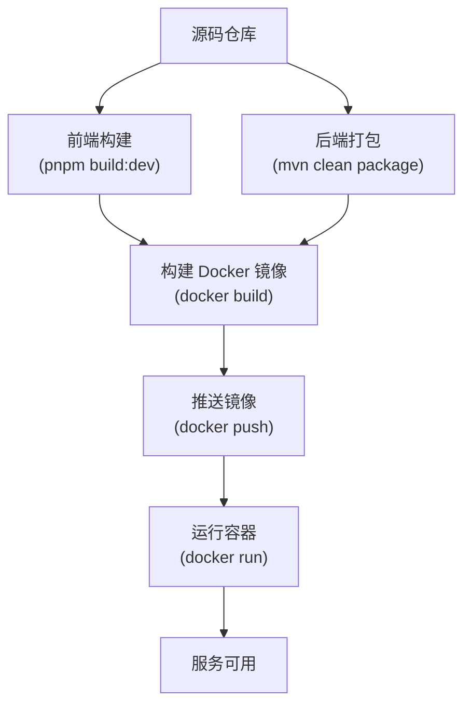
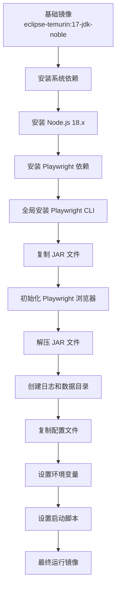
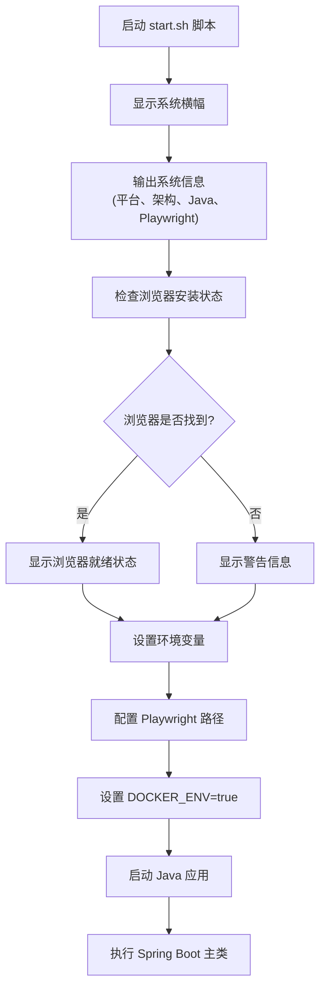
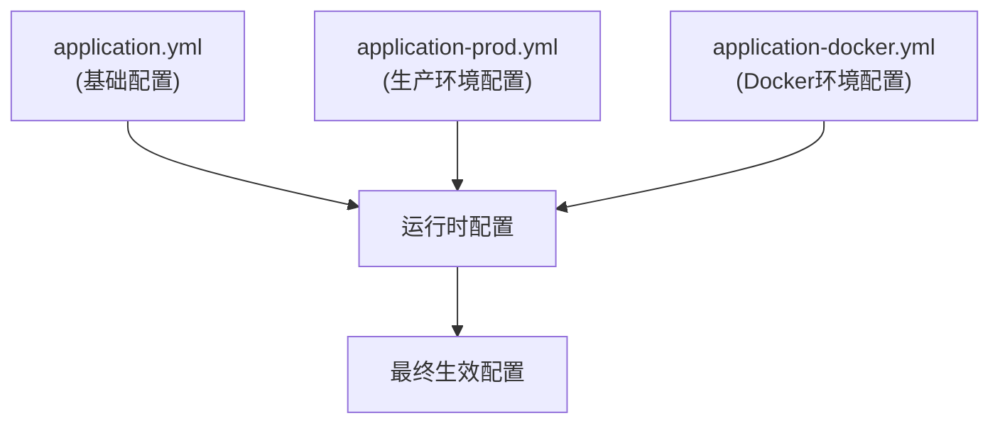
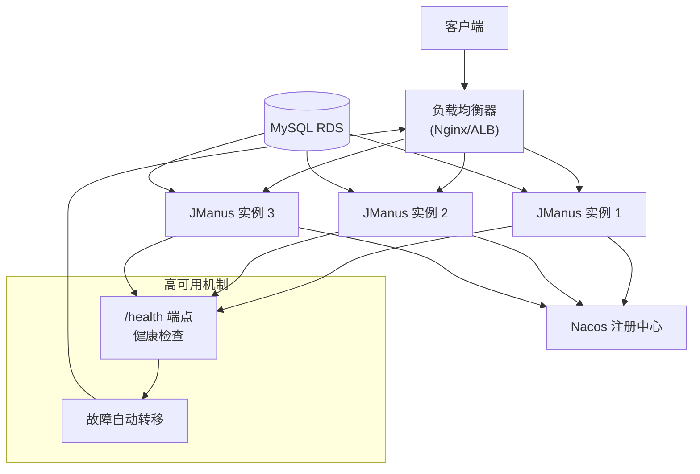
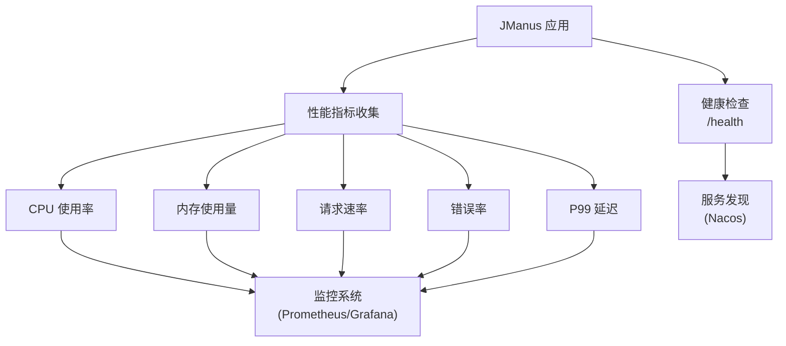
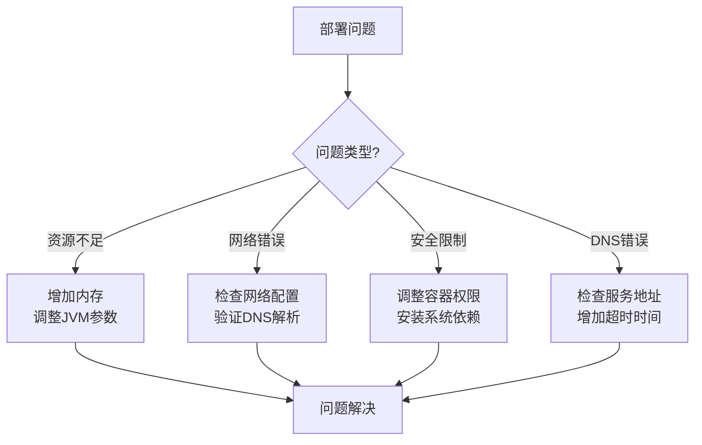

# 部署指南

<cite>
**本文档中引用的文件**  
- [Dockerfile](file://deploy/Dockerfile)
- [Dockerfile-backend](file://Dockerfile-backend)
- [Dockerfile.multiarch](file://Dockerfile.multiarch)
- [start.sh](file://deploy/start.sh)
- [application-prod.yml](file://src/main/resources/application-prod.yml)
- [application.yml](file://src/main/resources/application.yml)
- [application-docker.yml](file://src/main/resources/application-docker.yml)
- [deploy.md](file://deploy.md)
- [docker.mk](file://tools/make/docker.mk)
</cite>

## 目录
1. [简介](#简介)
2. [容器化部署流程](#容器化部署流程)
3. [Dockerfile 构建指令与优化策略](#dockerfile-构建指令与优化策略)
4. [启动脚本功能与配置](#启动脚本功能与配置)
5. [多架构镜像构建方法](#多架构镜像构建方法)
6. [生产环境配置建议](#生产环境配置建议)
7. [高可用部署架构](#高可用部署架构)
8. [数据库连接池与缓存配置](#数据库连接池与缓存配置)
9. [日志管理最佳实践](#日志管理最佳实践)
10. [监控与告警配置](#监控与告警配置)
11. [部署验证步骤](#部署验证步骤)
12. [常见部署问题解决方案](#常见部署问题解决方案)

## 简介

JManus 是一个基于 Spring AI 的 Web 自动化平台，支持通过 Docker 容器化方式进行部署。本指南详细说明了在生产环境中部署 JManus 的完整流程，包括容器化构建、多架构支持、配置优化、高可用架构设计以及监控告警机制。

**Section sources**
- [README.md](file://README.md#L1-L10)
- [deploy.md](file://deploy.md#L1-L24)

## 容器化部署流程

JManus 提供了完整的基于 Docker 的容器化部署方案，支持从源码构建到镜像推送的全流程自动化。部署流程主要包括以下几个步骤：

1. **前端构建**：使用 `pnpm build:dev` 命令构建前端 UI 组件。
2. **后端打包**：使用 Maven 执行 `mvn clean package` 命令打包 Java 应用程序。
3. **镜像构建**：基于 `Dockerfile.multiarch` 或 `Dockerfile-backend` 构建 Docker 镜像。
4. **镜像推送**：将构建好的镜像推送到私有镜像仓库。
5. **容器运行**：使用 `docker run` 命令启动容器实例。

该流程可通过 Makefile 中定义的目标进行自动化执行，确保部署过程的一致性和可重复性。



**Diagram sources**
- [deploy.md](file://deploy.md#L1-L24)
- [docker.mk](file://tools/make/docker.mk#L25-L46)

**Section sources**
- [deploy.md](file://deploy.md#L1-L24)
- [docker.mk](file://tools/make/docker.mk#L25-L46)

## Dockerfile 构建指令与优化策略

JManus 提供了多个 Dockerfile 文件以满足不同场景的需求，每个文件都采用了多阶段构建和性能优化策略。

### 主要 Dockerfile 文件

- **Dockerfile**：用于本地开发和测试环境的标准构建文件。
- **Dockerfile-backend**：用于生产环境的后端专用构建文件，基于预构建的基础镜像。
- **Dockerfile.multiarch**：支持多架构（Multi-Architecture）的通用构建文件，适用于跨平台部署。

### 构建优化策略

1. **依赖合并安装**：将系统依赖、Node.js 和 Playwright 依赖在单一层中安装，减少镜像层数。
2. **JAR 解压优化**：将可执行 JAR 文件解压到目录中，提升应用启动速度。
3. **缓存优化**：合理组织 Dockerfile 指令顺序，最大化利用 Docker 构建缓存。
4. **精简镜像**：安装完成后清理包管理器缓存，减小最终镜像体积。



**Diagram sources**
- [Dockerfile](file://deploy/Dockerfile#L1-L138)
- [Dockerfile.multiarch](file://Dockerfile.multiarch#L1-L162)

**Section sources**
- [Dockerfile](file://deploy/Dockerfile#L1-L138)
- [Dockerfile.multiarch](file://Dockerfile.multiarch#L1-L162)

## 启动脚本功能与配置

`start.sh` 脚本是 JManus 容器的入口点，负责在容器启动时执行环境检查、系统信息输出和应用程序启动。

### 主要功能

1. **系统信息展示**：显示平台架构、Java 版本和 Playwright 版本等关键信息。
2. **浏览器环境检查**：验证 Chromium 浏览器是否正确安装并可执行。
3. **环境变量配置**：设置 `PLAYWRIGHT_BROWSERS_PATH` 和 `DOCKER_ENV` 等关键环境变量。
4. **应用启动**：执行 Java 命令启动 Spring Boot 应用程序。

### 配置选项

- `TARGETPLATFORM`：目标平台信息，由 Docker 构建时自动注入。
- `TARGETARCH`：目标架构信息，用于识别 ARM 或 x86_64 等架构。
- `JAVA_OPTS`：JVM 启动参数，可在 Docker 运行时覆盖。



**Diagram sources**
- [start.sh](file://deploy/start.sh#L1-L91)

**Section sources**
- [start.sh](file://deploy/start.sh#L1-L91)

## 多架构镜像构建方法

JManus 支持通过 `Dockerfile.multiarch` 构建多架构镜像，适用于在不同 CPU 架构（如 x86_64、ARM64）上运行。

### 构建流程

1. **使用 Buildx**：Docker Buildx 支持跨平台构建，可通过 `docker buildx` 命令创建多架构镜像。
2. **基础镜像选择**：使用 `eclipse-temurin:17-jdk-noble` 这类官方支持多架构的镜像作为基础。
3. **平台变量注入**：Docker 构建时自动注入 `TARGETPLATFORM`、`TARGETARCH` 等变量，用于条件判断。

### 构建命令示例

```bash
docker buildx build --platform linux/amd64,linux/arm64 -t jmanus:multiarch --push .
```

此命令将同时为 AMD64 和 ARM64 架构构建镜像，并推送到镜像仓库。

**Section sources**
- [Dockerfile.multiarch](file://Dockerfile.multiarch#L1-L162)

## 生产环境配置建议

生产环境的配置主要通过 `application-prod.yml` 文件进行管理，包含数据库、Nacos 注册中心、日志级别等关键参数。

### 关键配置参数

| 配置项 | 生产环境值 | 说明 |
|-------|-----------|------|
| `spring.datasource.url` | MySQL RDS 地址 | 使用阿里云 RDS 作为生产数据库 |
| `spring.datasource.username` | hotwheel | 数据库用户名 |
| `spring.cloud.nacos.server-addr` | intra-nacos.exexm.com:8848 | Nacos 注册中心地址 |
| `spring.cloud.nacos.discovery.namespace` | prod | 生产环境命名空间 |
| `logging.level.root` | INFO | 根日志级别设置为 INFO |
| `manus.browser.headless` | true | 浏览器运行在无头模式 |

### 配置文件继承关系

JManus 使用 Spring Profile 机制实现配置文件的分层管理：
- `application.yml`：基础通用配置
- `application-prod.yml`：生产环境特定配置
- `application-docker.yml`：Docker 环境优化配置

运行时通过 `--spring.profiles.active=prod,docker` 同时激活多个配置文件。



**Diagram sources**
- [application-prod.yml](file://src/main/resources/application-prod.yml#L1-L47)
- [application.yml](file://src/main/resources/application.yml#L1-L98)
- [application-docker.yml](file://src/main/resources/application-docker.yml#L1-L20)

**Section sources**
- [application-prod.yml](file://src/main/resources/application-prod.yml#L1-L47)
- [application.yml](file://src/main/resources/application.yml#L1-L98)
- [application-docker.yml](file://src/main/resources/application-docker.yml#L1-L20)

## 高可用部署架构

JManus 支持高可用部署架构，通过负载均衡、服务发现和故障转移机制确保服务的持续可用性。

### 架构组件

1. **负载均衡器**：前置 Nginx 或 ALB，实现请求的负载分发。
2. **服务发现**：集成 Nacos 实现服务注册与发现。
3. **多实例部署**：部署多个 JManus 实例，避免单点故障。
4. **健康检查**：通过 `/health` 端点实现容器健康状态检测。

### 故障转移机制

当某个实例出现故障时，Nacos 会自动将其从服务列表中移除，负载均衡器将流量导向健康的实例，实现无缝故障转移。



**Diagram sources**
- [application-prod.yml](file://src/main/resources/application-prod.yml#L19-L37)
- [UserController.java](file://src/main/java/com/alibaba/cloud/ai/lynxe/user/controller/UserController.java#L328-L343)

**Section sources**
- [application-prod.yml](file://src/main/resources/application-prod.yml#L19-L37)
- [UserController.java](file://src/main/java/com/alibaba/cloud/ai/lynxe/user/controller/UserController.java#L328-L343)

## 数据库连接池与缓存配置

JManus 使用 HikariCP 作为数据库连接池，并通过合理的配置确保数据库访问的性能和稳定性。

### HikariCP 连接池配置

| 参数 | 值 | 说明 |
|------|-----|------|
| `maximum-pool-size` | 20 | 最大连接数 |
| `minimum-idle` | 5 | 最小空闲连接数 |
| `connection-timeout` | 30000ms | 连接超时时间 |
| `idle-timeout` | 600000ms | 空闲连接超时时间 |
| `max-lifetime` | 1800000ms | 连接最大生命周期 |
| `leak-detection-threshold` | 60000ms | 连接泄漏检测阈值 |

这些配置在 `application.yml` 中定义，适用于所有环境。

### 缓存配置

JManus 使用 Playwright 的浏览器缓存机制，并通过 `PLAYWRIGHT_BROWSERS_PATH` 环境变量指定缓存路径，避免每次启动都重新下载浏览器。

**Section sources**
- [application.yml](file://src/main/resources/application.yml#L21-L32)
- [Dockerfile](file://deploy/Dockerfile#L117)

## 日志管理最佳实践

JManus 的日志管理遵循以下最佳实践：

1. **日志级别控制**：生产环境设置为 `INFO` 级别，避免过多调试信息影响性能。
2. **日志文件位置**：日志输出到容器内的 `./logs/info.log` 文件。
3. **组件级日志控制**：对不同组件设置不同的日志级别，便于问题排查。

### 日志配置示例

```yaml
logging:
  file:
    name: ./logs/info.log
  level:
    root: INFO
    com.alibaba.cloud.ai.lynxe.agent: DEBUG
    com.alibaba.cloud.ai.lynxe.llm: DEBUG
```

此配置确保核心组件的详细日志被记录，同时控制总体日志量。

**Section sources**
- [application.yml](file://src/main/resources/application.yml#L48-L59)
- [application-prod.yml](file://src/main/resources/application-prod.yml#L44-L47)

## 监控与告警配置

JManus 提供了完善的监控和告警机制，包括健康检查端点和性能指标收集。

### 健康检查端点

- `/health`：基础健康检查，返回服务状态。
- `/actuator/health`：Spring Boot Actuator 健康检查。
- `/endpoints`：获取所有可用端点列表。

### 性能指标收集

通过集成 Nacos 和自定义监控工具，收集以下性能指标：
- CPU 使用率
- 内存使用量
- 请求速率（RPS）
- 错误率
- P99 延迟



**Diagram sources**
- [UserController.java](file://src/main/java/com/alibaba/cloud/ai/lynxe/user/controller/UserController.java#L328-L343)
- [coordinator-tool-api-service.ts](file://ui-vue3/src/api/coordinator-tool-api-service.ts#L102-L121)
- [ServiceOperateTool.java](file://src/main/java/com/alibaba/cloud/ai/lynxe/tool/devops/ServiceOperateTool.java#L257-L268)

**Section sources**
- [UserController.java](file://src/main/java/com/alibaba/cloud/ai/lynxe/user/controller/UserController.java#L328-L343)
- [coordinator-tool-api-service.ts](file://ui-vue3/src/api/coordinator-tool-api-service.ts#L102-L121)
- [ServiceOperateTool.java](file://src/main/java/com/alibaba/cloud/ai/lynxe/tool/devops/ServiceOperateTool.java#L257-L268)

## 部署验证步骤

完成部署后，应执行以下验证步骤确保服务正常运行：

1. **容器状态检查**：
   ```bash
   docker ps | grep jmanus
   ```

2. **日志查看**：
   ```bash
   docker logs <container_id>
   ```

3. **健康检查访问**：
   ```bash
   curl http://localhost:18080/health
   ```

4. **API 端点测试**：
   ```bash
   curl http://localhost:18080/endpoints
   ```

5. **浏览器功能验证**：确保 Playwright 浏览器能够正常启动和执行自动化任务。

**Section sources**
- [start.sh](file://deploy/start.sh#L79-L90)
- [UserController.java](file://src/main/java/com/alibaba/cloud/ai/lynxe/user/controller/UserController.java#L328-L343)

## 常见部署问题解决方案

### 资源不足

**现象**：容器启动失败或频繁 OOM（内存溢出）。

**解决方案**：
- 增加容器内存限制
- 调整 JVM 参数：`-Xmx` 和 `-Xms`
- 启用堆转储：`-XX:+HeapDumpOnOutOfMemoryError`

### 网络配置错误

**现象**：无法连接数据库或 Nacos。

**解决方案**：
- 检查 `application-prod.yml` 中的网络地址
- 验证 DNS 解析是否正常
- 检查防火墙和安全组配置

### 安全策略限制

**现象**：Playwright 浏览器无法启动。

**解决方案**：
- 确保容器具有必要的系统权限
- 安装所有必需的系统依赖库
- 设置正确的环境变量：`DISPLAY=:99`

### DNS 相关错误

**现象**：服务发现失败，日志中出现 `UnknownHostException`。

**解决方案**：
- 检查 Nacos 服务器地址是否正确
- 验证网络连通性
- 增加连接超时时间



**Diagram sources**
- [McpConnectionFactory.java](file://src/main/java/com/alibaba/cloud/ai/lynxe/mcp/service/McpConnectionFactory.java#L184-L205)
- [Dockerfile](file://deploy/Dockerfile#L119)
- [start.sh](file://deploy/start.sh#L70-L75)

**Section sources**
- [McpConnectionFactory.java](file://src/main/java/com/alibaba/cloud/ai/lynxe/mcp/service/McpConnectionFactory.java#L184-L205)
- [Dockerfile](file://deploy/Dockerfile#L119)
- [start.sh](file://deploy/start.sh#L70-L75)