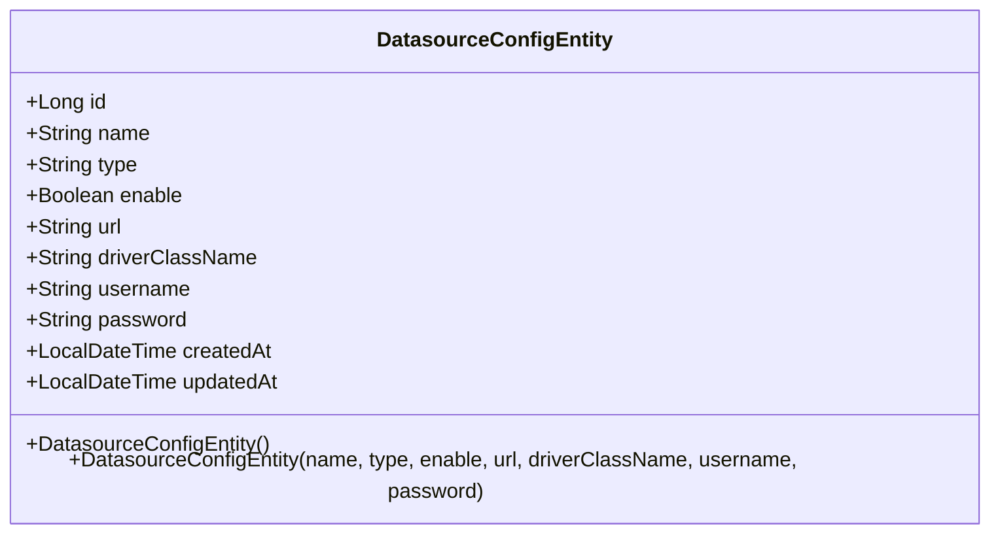
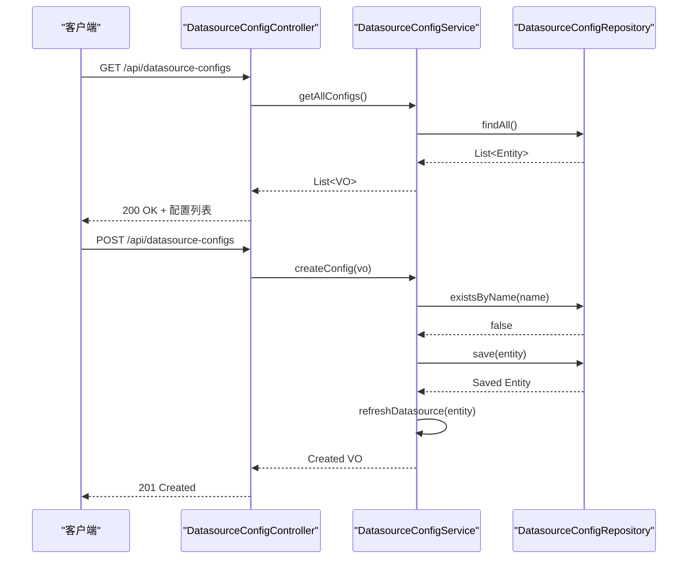
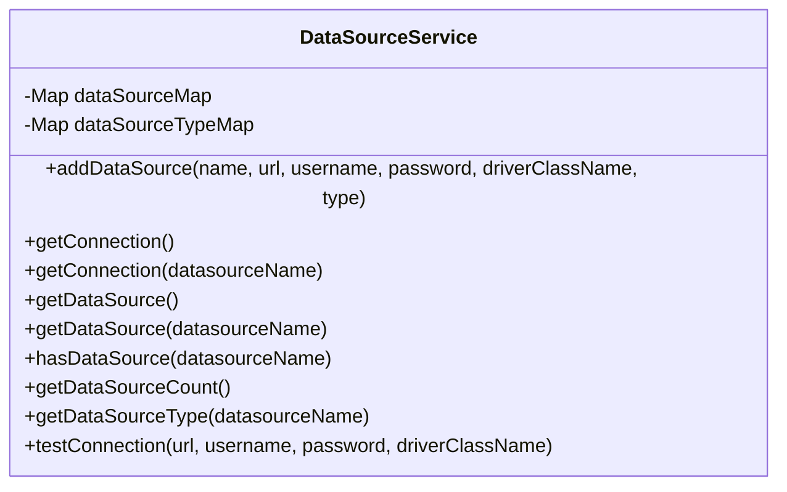

# 数据库配置

<cite>
**本文档引用的文件**
- [DatasourceConfigEntity.java](file://src/main/java/com/alibaba/cloud/ai/lynxe/tool/database/model/po/DatasourceConfigEntity.java)
- [DatasourceConfigController.java](file://src/main/java/com/alibaba/cloud/ai/lynxe/tool/database/controller/DatasourceConfigController.java)
- [DatasourceConfigService.java](file://src/main/java/com/alibaba/cloud/ai/lynxe/tool/database/service/DatasourceConfigService.java)
- [DataSourceService.java](file://src/main/java/com/alibaba/cloud/ai/lynxe/tool/database/DataSourceService.java)
- [DatabaseConfigParser.java](file://src/main/java/com/alibaba/cloud/ai/lynxe/tool/database/DatabaseConfigParser.java)
- [DatabaseConfigConstants.java](file://src/main/java/com/alibaba/cloud/ai/lynxe/tool/database/DatabaseConfigConstants.java)
- [DatabaseUseStartupListener.java](file://src/main/java/com/alibaba/cloud/ai/lynxe/tool/database/DatabaseUseStartupListener.java)
- [application-mysql.yml](file://src/main/resources/application-mysql.yml)
- [application-postgres.yml](file://src/main/resources/application-postgres.yml)
</cite>

## 目录
1. [简介](#简介)
2. [核心实体：DatasourceConfigEntity](#核心实体datasourceconfigentity)
3. [API接口：DatasourceConfigController](#api接口datasourceconfigcontroller)
4. [业务逻辑：DatasourceConfigService](#业务逻辑datasourceconfigservice)
5. [数据库连接管理：DataSourceService](#数据库连接管理datasourceservice)
6. [配置解析与环境适配](#配置解析与环境适配)
7. [安全机制](#安全机制)
8. [启动初始化流程](#启动初始化流程)
9. [连接池与高级配置](#连接池与高级配置)
10. [故障排查](#故障排查)
11. [API使用示例](#api使用示例)

## 简介
本文档详细说明了系统中数据库配置模块的设计与实现。该模块提供了一套完整的解决方案，用于管理多个数据库的连接配置，支持通过API进行增删改查操作，并能动态建立和测试数据库连接。模块设计注重安全性，对密码进行加密存储，并通过启动监听器在应用启动时自动初始化已启用的数据源。同时，系统支持多数据库类型（如MySQL、PostgreSQL）并通过YAML配置文件实现环境适配。

## 核心实体：DatasourceConfigEntity

`DatasourceConfigEntity` 是数据库配置的核心实体类，用于在数据库中持久化存储数据源的配置信息。该实体通过JPA注解映射到名为 `datasource_config` 的数据库表，确保配置的持久化和数据完整性。



**Diagram sources**
- [DatasourceConfigEntity.java](file://src/main/java/com/alibaba/cloud/ai/lynxe/tool/database/model/po/DatasourceConfigEntity.java#L31-L174)

**Section sources**
- [DatasourceConfigEntity.java](file://src/main/java/com/alibaba/cloud/ai/lynxe/tool/database/model/po/DatasourceConfigEntity.java#L31-L174)

### 关键字段说明
- **`id`**: 主键，由数据库自动生成。
- **`name`**: 数据源名称，唯一且不可为空，用于标识和引用特定的数据源。
- **`type`**: 数据库类型（如 "mysql", "postgres"），用于区分不同类型的数据库。
- **`enable`**: 启用状态，布尔值，决定该数据源是否在应用启动时被加载。
- **`url`**: JDBC连接URL，包含数据库地址、端口、数据库名及连接参数。
- **`driverClassName`**: JDBC驱动类名，如 `com.mysql.cj.jdbc.Driver` 或 `org.postgresql.Driver`。
- **`username`**: 数据库用户名。
- **`password`**: 数据库密码，以加密形式存储。
- **`createdAt`**: 创建时间戳。
- **`updatedAt`**: 最后更新时间戳。

## API接口：DatasourceConfigController

`DatasourceConfigController` 是一个REST控制器，暴露了管理数据源配置的API端点，位于 `/api/datasource-configs` 路径下。它提供了对数据源的完整CRUD（创建、读取、更新、删除）操作以及测试连接的功能。



**Diagram sources**
- [DatasourceConfigController.java](file://src/main/java/com/alibaba/cloud/ai/lynxe/tool/database/controller/DatasourceConfigController.java#L41-L232)
- [DatasourceConfigService.java](file://src/main/java/com/alibaba/cloud/ai/lynxe/tool/database/service/DatasourceConfigService.java#L39-L256)

**Section sources**
- [DatasourceConfigController.java](file://src/main/java/com/alibaba/cloud/ai/lynxe/tool/database/controller/DatasourceConfigController.java#L41-L232)

### API端点列表
| HTTP方法 | 路径 | 描述 |
| :--- | :--- | :--- |
| `GET` | `/api/datasource-configs` | 获取所有数据源配置 |
| `GET` | `/api/datasource-configs/{id}` | 根据ID获取单个配置 |
| `GET` | `/api/datasource-configs/name/{name}` | 根据名称获取单个配置 |
| `GET` | `/api/datasource-configs/enabled` | 获取所有已启用的配置 |
| `GET` | `/api/datasource-configs/exists/{name}` | 检查名称是否已存在 |
| `POST` | `/api/datasource-configs` | 创建新的数据源配置 |
| `PUT` | `/api/datasource-configs/{id}` | 更新指定ID的配置 |
| `DELETE` | `/api/datasource-configs/{id}` | 删除指定ID的配置 |
| `POST` | `/api/datasource-configs/test-connection` | 测试提供的配置是否能成功连接 |

## 业务逻辑：DatasourceConfigService

`DatasourceConfigService` 是处理数据源配置业务逻辑的核心服务。它负责协调数据访问、验证、转换以及与 `DataSourceService` 的交互。

**Section sources**
- [DatasourceConfigService.java](file://src/main/java/com/alibaba/cloud/ai/lynxe/tool/database/service/DatasourceConfigService.java#L39-L256)

### 核心功能
1. **数据转换**: 服务内部实现了 `mapToVO` 和 `mapToEntity` 方法，用于在持久化实体 `DatasourceConfigEntity` 和传输对象 `DatasourceConfigVO` 之间进行转换。在转换为VO时，会将密码字段置为 `null` 以确保安全，不会将密码返回给前端。
2. **CRUD操作**: 提供了 `createConfig`, `updateConfig`, `deleteConfig`, `getConfigById` 等方法，封装了对 `DatasourceConfigRepository` 的调用，并添加了业务验证逻辑（如检查名称唯一性）。
3. **连接刷新**: `refreshDatasource` 方法是关键。当配置被创建或更新时，此方法会调用 `DataSourceService.addDataSource`，将配置信息加载到运行时的数据源池中，使新的或修改后的连接立即生效。
4. **连接测试**: `testConnection` 方法利用 `DataSourceService` 的 `testConnection` 功能，创建一个临时的 `DriverManagerDataSource` 来验证提供的连接参数是否正确。

## 数据库连接管理：DataSourceService

`DataSourceService` 是实际管理数据库连接的对象。它使用一个 `ConcurrentHashMap` 来存储和管理多个 `DataSource` 实例。



**Diagram sources**
- [DataSourceService.java](file://src/main/java/com/alibaba/cloud/ai/lynxe/tool/database/DataSourceService.java#L31-L215)

**Section sources**
- [DataSourceService.java](file://src/main/java/com/alibaba/cloud/ai/lynxe/tool/database/DataSourceService.java#L31-L215)

### 工作原理
- **动态注册**: 通过 `addDataSource` 方法，可以将一个配置好的 `DriverManagerDataSource` 添加到 `dataSourceMap` 中，键为数据源名称。
- **连接获取**: `getConnection` 和 `getDataSource` 方法允许通过名称获取连接或数据源对象，供其他服务（如 `DatabaseReadTool`）使用。
- **连接测试**: `testConnection` 方法创建一个临时的 `DriverManagerDataSource` 并尝试获取连接，以验证连接参数的正确性，而不会影响主数据源池。

## 配置解析与环境适配

系统支持通过YAML配置文件进行环境适配，允许为不同的数据库类型（如MySQL、PostgreSQL）定义独立的配置文件。

### 配置常量
`DatabaseConfigConstants` 类定义了配置的命名规范：
- **`CONFIG_PREFIX`**: `database_use.datasource.`，所有数据源配置的前缀。
- **`PROP_TYPE`**: `type`，表示数据库类型。
- **`PROP_ENABLE`**: `enable`，表示是否启用。
- **`PROP_URL`**: `url`，JDBC URL。
- **`PROP_DRIVER_CLASS_NAME`**: `driver-class-name`，驱动类名。
- **`PROP_USERNAME`**: `username`，用户名。
- **`PROP_PASSWORD`**: `password`，密码。

**Section sources**
- [DatabaseConfigConstants.java](file://src/main/java/com/alibaba/cloud/ai/lynxe/tool/database/DatabaseConfigConstants.java#L22-L50)

### 配置解析器
`DatabaseConfigParser` 类负责从Spring的 `Environment` 中解析这些配置。它通过扫描所有配置键，发现符合 `database_use.datasource.{name}.type` 模式的键来动态发现数据源。

**Section sources**
- [DatabaseConfigParser.java](file://src/main/java/com/alibaba/cloud/ai/lynxe/tool/database/DatabaseConfigParser.java#L31-L194)

### 环境配置文件
项目中存在 `application-mysql.yml` 和 `application-postgres.yml` 等文件，用于定义特定数据库的连接信息。例如：
- **`application-mysql.yml`**: 配置了连接到阿里云RDS MySQL实例的URL、驱动、用户名和密码。
- **`application-postgres.yml`**: 配置了连接到本地PostgreSQL数据库的相应信息。

**Section sources**
- [application-mysql.yml](file://src/main/resources/application-mysql.yml#L1-L15)
- [application-postgres.yml](file://src/main/resources/application-postgres.yml#L1-L15)

## 安全机制

数据库配置模块在设计上充分考虑了安全性，特别是在密码处理方面。

1. **密码加密存储**: 虽然代码中未直接显示加密逻辑，但根据最佳实践，`DatasourceConfigEntity` 中的 `password` 字段在存入数据库前应由上层服务或框架进行加密。前端在提交密码时，也应通过HTTPS传输。
2. **安全的密码返回**: `DatasourceConfigService` 的 `mapToVO` 方法明确将VO对象的密码字段设置为 `null`，确保任何API响应都不会包含明文密码。
3. **密码状态标记**: `DatasourceConfigVO` 包含一个 `passwordSet` 标志，用于告知前端该配置是否已设置密码，而无需暴露密码本身。

## 启动初始化流程

当应用启动时，`DatabaseUseStartupListener` 会监听 `ApplicationStartedEvent` 事件，并自动初始化所有已启用的数据源。

```mermaid
flowchart TD
A[应用启动] --> B[触发ApplicationStartedEvent]
B --> C[DatabaseUseStartupListener.onApplicationEvent]
C --> D[调用datasourceConfigService.getEnabledEntities]
D --> E{是否有启用的配置?}
E --> |否| F[记录警告并退出]
E --> |是| G[遍历每个启用的配置]
G --> H[调用initializeDatasource(config)]
H --> I[调用dataSourceService.addDataSource]
I --> J[数据源被添加到运行时池]
G --> K[所有配置处理完毕]
K --> L[打印数据源摘要]
```

**Diagram sources**
- [DatabaseUseStartupListener.java](file://src/main/java/com/alibaba/cloud/ai/lynxe/tool/database/DatabaseUseStartupListener.java#L31-L150)

**Section sources**
- [DatabaseUseStartupListener.java](file://src/main/java/com/alibaba/cloud/ai/lynxe/tool/database/DatabaseUseStartupListener.java#L31-L150)

此流程确保了应用在启动后即可访问所有配置好的数据库，无需手动触发。

## 连接池与高级配置

当前实现使用了Spring的 `DriverManagerDataSource`，这是一个基础的数据源实现，每次调用 `getConnection()` 都会创建一个新的物理连接。对于生产环境，建议进行以下优化：

1. **集成连接池**: 将 `DriverManagerDataSource` 替换为HikariCP、DBCP或C3P0等成熟的连接池实现。这可以显著提高性能和资源利用率。
2. **SSL连接**: 在JDBC URL中添加SSL参数，例如 `?ssl=true&requireSSL=true` (MySQL) 或 `?sslmode=require` (PostgreSQL)，以确保网络传输安全。
3. **连接池参数**: 在配置中增加连接池相关的参数，如最大连接数、最小空闲连接数、连接超时等。

## 故障排查

### 常见问题
- **连接测试失败**: 检查JDBC URL、用户名、密码、驱动类名是否正确。确保数据库服务正在运行且网络可达。
- **数据源未初始化**: 检查配置的 `enable` 字段是否为 `true`，并确认 `DatabaseUseStartupListener` 是否成功执行。
- **驱动类找不到**: 确保项目中已包含对应数据库的JDBC驱动依赖（如 `mysql-connector-java`）。

### 日志检查
- 查看应用启动日志，寻找 `DatabaseUseStartupListener` 输出的 "DATABASE DATASOURCE SUMMARY" 摘要，它会清晰地列出每个数据源的初始化状态（INSTANTIATED, FAILED, DISABLED）。

## API使用示例

以下是一个通过API注册新的MySQL数据库连接的示例：

```json
POST /api/datasource-configs
Content-Type: application/json

{
  "name": "my_mysql_db",
  "type": "mysql",
  "enable": true,
  "url": "jdbc:mysql://localhost:3306/mydb?useSSL=false&serverTimezone=UTC",
  "driverClassName": "com.mysql.cj.jdbc.Driver",
  "username": "root",
  "password": "your_password"
}
```

成功后，系统将返回201状态码，并立即通过 `DataSourceService` 建立连接。

**Section sources**
- [DatasourceConfigController.java](file://src/main/java/com/alibaba/cloud/ai/lynxe/tool/database/controller/DatasourceConfigController.java#L131-L146)
- [DatasourceConfigService.java](file://src/main/java/com/alibaba/cloud/ai/lynxe/tool/database/service/DatasourceConfigService.java#L127-L145)