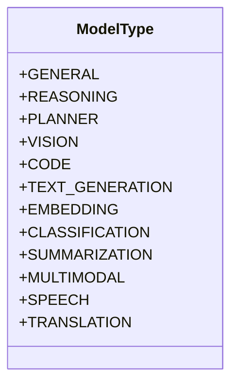
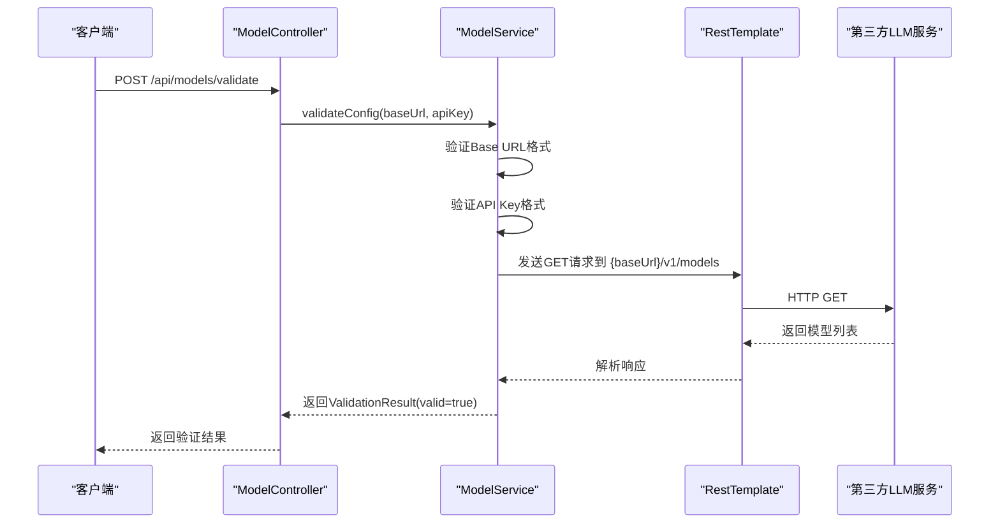
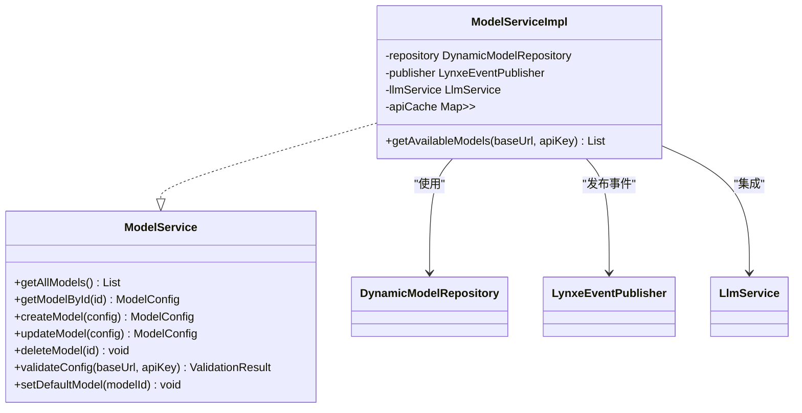
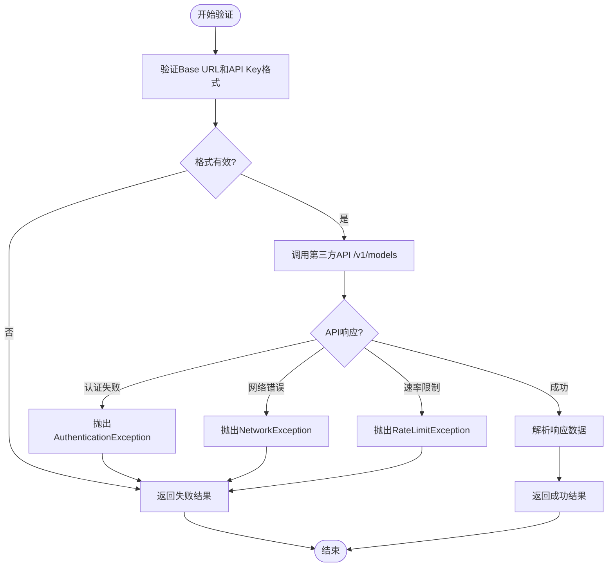

# 模型配置

<cite>
**本文档中引用的文件**  
- [ModelController.java](file://src/main/java/com/alibaba/cloud/ai/lynxe/model/controller/ModelController.java)
- [DynamicModelEntity.java](file://src/main/java/com/alibaba/cloud/ai/lynxe/model/entity/DynamicModelEntity.java)
- [ModelService.java](file://src/main/java/com/alibaba/cloud/ai/lynxe/model/service/ModelService.java)
- [ModelServiceImpl.java](file://src/main/java/com/alibaba/cloud/ai/lynxe/model/service/ModelServiceImpl.java)
- [DefaultLlmConfiguration.java](file://src/main/java/com/alibaba/cloud/ai/lynxe/config/DefaultLlmConfiguration.java)
- [LlmService.java](file://src/main/java/com/alibaba/cloud/ai/lynxe/llm/LlmService.java)
- [ModelType.java](file://src/main/java/com/alibaba/cloud/ai/lynxe/model/model/enums/ModelType.java)
- [ValidationRequest.java](file://src/main/java/com/alibaba/cloud/ai/lynxe/model/model/vo/ValidationRequest.java)
- [ValidationResult.java](file://src/main/java/com/alibaba/cloud/ai/lynxe/model/model/vo/ValidationResult.java)
- [AvailableModel.java](file://src/main/java/com/alibaba/cloud/ai/lynxe/model/model/vo/AvailableModel.java)
- [AuthenticationException.java](file://src/main/java/com/alibaba/cloud/ai/lynxe/model/exception/AuthenticationException.java)
- [NetworkException.java](file://src/main/java/com/alibaba/cloud/ai/lynxe/model/exception/NetworkException.java)
- [RateLimitException.java](file://src/main/java/com/alibaba/cloud/ai/lynxe/model/exception/RateLimitException.java)
- [application.yml](file://src/main/resources/application.yml)
</cite>

## 目录
1. [简介](#简介)
2. [核心数据模型](#核心数据模型)
3. [REST API 接口](#rest-api-接口)
4. [模型服务与集成](#模型服务与集成)
5. [默认模型配置初始化](#默认模型配置初始化)
6. [模型验证与状态管理](#模型验证与状态管理)
7. [LLM 提供商配置](#llm-提供商配置)
8. [常见问题诊断](#常见问题诊断)
9. [总结](#总结)

## 简介

本技术文档全面阐述了系统中模型配置管理的核心组件与机制。文档详细介绍了模型配置的数据模型 `DynamicModelEntity`，包括其字段定义与验证规则；分析了 `ModelController` 提供的 REST API 接口，涵盖模型注册、查询、启用/禁用、测试连接等操作；解释了 `ModelService` 如何与 `LlmService` 集成，实现模型的动态加载、可用性检测和故障转移；说明了 `DefaultLlmConfiguration` 在系统启动时如何初始化默认模型配置；并提供了模型配置的验证流程和常见问题的诊断方法。

**Section sources**
- [ModelController.java](file://src/main/java/com/alibaba/cloud/ai/lynxe/model/controller/ModelController.java#L1-L176)
- [DynamicModelEntity.java](file://src/main/java/com/alibaba/cloud/ai/lynxe/model/entity/DynamicModelEntity.java#L1-L190)

## 核心数据模型

模型配置的核心数据模型是 `DynamicModelEntity`，它是一个 JPA 实体类，用于在数据库中持久化存储模型的配置信息。该实体映射到名为 `dynamic_models` 的数据库表。

### DynamicModelEntity 字段定义

`DynamicModelEntity` 类定义了以下关键字段：

| 字段名 | 类型 | 是否可为空 | 描述 |
| :--- | :--- | :--- | :--- |
| `id` | Long | 否 | 主键，自增 |
| `baseUrl` | String | 否 | LLM 服务的访问端点（Base URL） |
| `apiKey` | String | 否 | 访问 LLM 服务的认证密钥 |
| `headers` | Map<String, String> | 是 | 发送到 LLM 服务的额外 HTTP 头信息 |
| `modelName` | String | 否 | 模型的名称 |
| `modelDescription` | String | 否 | 模型的描述信息 |
| `type` | String | 否 | 模型的类型（如 GENERAL, REASONING 等） |
| `isDefault` | boolean | 否 | 标记该模型是否为默认模型 |
| `temperature` | Double | 是 | 生成文本的随机性参数 |
| `topP` | Double | 是 | 核采样参数 |
| `completionsPath` | String | 是 | 生成补全的 API 路径，默认为 `/v1/chat/completions` |

### 模型类型 (ModelType)

模型类型由 `ModelType` 枚举类定义，涵盖了多种应用场景：

**Diagram sources**
- [ModelType.java](file://src/main/java/com/alibaba/cloud/ai/lynxe/model/model/enums/ModelType.java#L1-L88)

### 数据转换与安全

`DynamicModelEntity` 提供了 `mapToModelConfig()` 方法，用于将实体转换为前端可安全传输的 `ModelConfig` 对象。在此过程中，`apiKey` 会通过 `maskValue()` 方法进行脱敏处理，仅显示前4位和后4位，中间用星号（*）代替，以保护敏感信息。

**Section sources**
- [DynamicModelEntity.java](file://src/main/java/com/alibaba/cloud/ai/lynxe/model/entity/DynamicModelEntity.java#L1-L190)
- [ModelType.java](file://src/main/java/com/alibaba/cloud/ai/lynxe/model/model/enums/ModelType.java#L1-L88)

## REST API 接口

`ModelController` 类提供了管理模型配置的 RESTful API 接口，所有接口均位于 `/api/models` 路径下。

### API 接口列表

| HTTP 方法 | 路径 | 描述 | 请求体 | 响应体 |
| :--- | :--- | :--- | :--- | :--- |
| GET | / | 获取所有模型配置 | 无 | List<ModelConfig> |
| GET | /{id} | 根据 ID 获取单个模型配置 | 无 | ModelConfig |
| POST | / | 创建新的模型配置 | ModelConfig | ModelConfig |
| PUT | /{id} | 更新现有模型配置 | ModelConfig | ModelConfig |
| DELETE | /{id} | 删除模型配置 | 无 | void |
| GET | /types | 获取所有支持的模型类型 | 无 | List<String> |
| POST | /validate | 验证模型配置的有效性 | ValidationRequest | ValidationResult |
| POST | /{id}/set-default | 将指定模型设置为默认模型 | 无 | Map<String, Object> |
| GET | /available-models | 获取第三方提供商可用的模型列表 | 无 | Map<String, Object> |

### 关键接口流程

#### 模型验证 (POST /validate)

此接口用于测试模型配置的连通性和有效性。它接收一个 `ValidationRequest` 对象，包含 `baseUrl` 和 `apiKey`。

**Diagram sources**
- [ModelController.java](file://src/main/java/com/alibaba/cloud/ai/lynxe/model/controller/ModelController.java#L90-L102)
- [ModelServiceImpl.java](file://src/main/java/com/alibaba/cloud/ai/lynxe/model/service/ModelServiceImpl.java#L190-L253)

#### 获取可用模型 (GET /available-models)

此接口用于在前端下拉菜单中填充可用的模型选项。它会查询数据库中的默认模型，并调用其 `baseUrl` 的 `/v1/models` 接口来获取实际可用的模型列表。

**Section sources**
- [ModelController.java](file://src/main/java/com/alibaba/cloud/ai/lynxe/model/controller/ModelController.java#L1-L176)

## 模型服务与集成

`ModelService` 及其实现 `ModelServiceImpl` 是模型配置管理的核心服务层，它与 `LlmService` 紧密集成，实现了模型的动态加载和管理。

### 服务接口与实现

`ModelService` 是一个接口，定义了所有模型管理操作。`ModelServiceImpl` 是其具体实现，负责与数据库交互并处理业务逻辑。

**Diagram sources**
- [ModelService.java](file://src/main/java/com/alibaba/cloud/ai/lynxe/model/service/ModelService.java#L1-L40)
- [ModelServiceImpl.java](file://src/main/java/com/alibaba/cloud/ai/lynxe/model/service/ModelServiceImpl.java#L1-L485)

### 与 LlmService 的集成

`ModelServiceImpl` 通过 `@Autowired` 注入 `LlmService` 实例。当模型配置发生变更（如创建、更新、删除或设置为默认）时，`ModelServiceImpl` 会调用 `llmService.refreshDefaultModelCache()` 方法来刷新 `LlmService` 中的缓存。

`LlmService` 负责管理 `ChatClient` 实例的生命周期。它使用一个 `ConcurrentHashMap` (`chatClientCache`) 来缓存已创建的 `ChatClient` 实例，以提高性能。当默认模型变更时，`LlmService` 会清空其内部缓存，确保后续请求使用最新的模型配置。

**Section sources**
- [ModelServiceImpl.java](file://src/main/java/com/alibaba/cloud/ai/lynxe/model/service/ModelServiceImpl.java#L1-L485)
- [LlmService.java](file://src/main/java/com/alibaba/cloud/ai/lynxe/llm/LlmService.java#L1-L450)

## 默认模型配置初始化

系统通过 `DefaultLlmConfiguration` 组件在启动时提供一套默认的模型配置，特别是针对阿里云的通义千问（Qwen）模型。

### 默认配置常量

`DefaultLlmConfiguration` 类定义了以下静态常量：

| 常量名 | 值 | 描述 |
| :--- | :--- | :--- |
| `DEFAULT_MODEL_NAME` | qwen-plus | 默认模型名称 |
| `DEFAULT_BASE_URL` | https://dashscope.aliyuncs.com/compatible-mode | 阿里云 DashScope 兼容模式端点 |
| `DEFAULT_DESCRIPTION` | Alibaba Cloud DashScope Qwen Plus Model | 模型描述 |
| `DEFAULT_COMPLETIONS_PATH` | /v1/chat/completions | 补全API路径 |

### 初始化流程

虽然 `DefaultLlmConfiguration` 本身不直接创建数据库记录，但它为系统初始化脚本（如 `InitController`）提供了这些默认值。当系统首次启动且数据库中没有模型时，初始化逻辑会使用这些默认值来创建一个初始的模型配置，并将其标记为默认模型。

**Section sources**
- [DefaultLlmConfiguration.java](file://src/main/java/com/alibaba/cloud/ai/lynxe/config/DefaultLlmConfiguration.java#L1-L52)

## 模型验证与状态管理

系统提供了一套完整的模型验证机制，确保配置的模型能够正常工作。

### 验证请求与结果

验证流程使用 `ValidationRequest` 和 `ValidationResult` 两个数据传输对象（DTO）。

- **ValidationRequest**: 包含 `baseUrl` 和 `apiKey` 两个字段，用于发起验证请求。
- **ValidationResult**: 包含 `valid` (布尔值)、`message` (描述信息) 和 `availableModels` (可用模型列表) 字段。

### 验证流程

`ModelServiceImpl.validateConfig()` 方法执行以下步骤：
1.  **格式验证**: 检查 `baseUrl` 是否为有效的 HTTP/HTTPS URL，检查 `apiKey` 是否非空且长度足够。
2.  **API 调用**: 使用 `RestTemplate` 向 `{baseUrl}/v1/models` 发送 GET 请求。
3.  **异常处理**: 
    - `AuthenticationException`: API Key 无效。
    - `NetworkException`: 网络连接失败或超时。
    - `RateLimitException`: 请求频率过高。
4.  **响应解析**: 解析返回的 JSON 响应，提取模型列表并封装到 `AvailableModel` 对象中。

**Diagram sources**
- [ValidationRequest.java](file://src/main/java/com/alibaba/cloud/ai/lynxe/model/model/vo/ValidationRequest.java#L1-L52)
- [ValidationResult.java](file://src/main/java/com/alibaba/cloud/ai/lynxe/model/model/vo/ValidationResult.java#L1-L70)
- [ModelServiceImpl.java](file://src/main/java/com/alibaba/cloud/ai/lynxe/model/service/ModelServiceImpl.java#L190-L253)

### 状态管理

`AvailableModel` 类用于表示从第三方服务获取的可用模型，包含 `modelName`、`displayName` 和 `description` 字段。`ModelServiceImpl` 内部使用一个 `apiCache` 缓存来存储最近的 API 调用结果，有效期为2秒，以减少对第三方服务的频繁调用。

**Section sources**
- [ValidationRequest.java](file://src/main/java/com/alibaba/cloud/ai/lynxe/model/model/vo/ValidationRequest.java#L1-L52)
- [ValidationResult.java](file://src/main/java/com/alibaba/cloud/ai/lynxe/model/model/vo/ValidationResult.java#L1-L70)
- [AvailableModel.java](file://src/main/java/com/alibaba/cloud/ai/lynxe/model/model/vo/AvailableModel.java#L1-L63)
- [ModelServiceImpl.java](file://src/main/java/com/alibaba/cloud/ai/lynxe/model/service/ModelServiceImpl.java#L1-L485)

## LLM 提供商配置

系统支持配置多种兼容 OpenAI 接口的 LLM 提供商。

### 配置步骤

1.  **获取访问凭证**: 从目标 LLM 提供商处获取 API Key。
2.  **确定端点**: 找到提供商的 API Base URL（如 `https://api.openai.com` 或 `https://dashscope.aliyuncs.com/compatible-mode`）。
3.  **填写配置**: 在前端界面或通过 API，填写模型名称、类型、Base URL、API Key 等信息。
4.  **测试连接**: 使用“测试连接”功能验证配置是否正确。
5.  **保存并设为默认**: 保存配置，并可选择将其设为默认模型。

### 参数说明

- **Base URL**: 必须是有效的 HTTP/HTTPS 地址。系统会自动处理路径，例如，如果提供 `https://api.example.com`，系统会尝试访问 `https://api.example.com/v1/models`。
- **API Key**: 必须是有效的密钥，长度通常大于10个字符。
- **Headers**: 可选，用于添加自定义头，如 `X-Request-Source`。
- **Temperature**: 控制输出的随机性，值越高越随机（0.0-1.0）。
- **Top P**: 核采样参数，与 temperature 类似，用于控制输出的多样性。

**Section sources**
- [ModelController.java](file://src/main/java/com/alibaba/cloud/ai/lynxe/model/controller/ModelController.java#L1-L176)
- [DynamicModelEntity.java](file://src/main/java/com/alibaba/cloud/ai/lynxe/model/entity/DynamicModelEntity.java#L1-L190)

## 常见问题诊断

以下是模型配置中常见的问题及其诊断方法。

### 连接超时

- **现象**: 验证或调用模型时长时间无响应，最终报错。
- **原因**: 网络不通、防火墙阻止、目标服务不可达。
- **诊断**: 
    1.  检查 `application.yml` 中的 `lynxe.plan.polling.connect-timeout` 和 `read-timeout` 配置。
    2.  使用 `ping` 或 `telnet` 命令测试 `baseUrl` 的连通性。
    3.  检查服务器防火墙设置。

### 认证失败

- **现象**: 返回 401 Unauthorized 或明确提示 API Key 无效。
- **原因**: API Key 错误、过期或权限不足。
- **诊断**: 
    1.  重新检查并复制 API Key，确保无多余空格。
    2.  登录 LLM 提供商的控制台，确认 Key 的状态和权限。
    3.  查看 `ModelServiceImpl` 日志中的 `AuthenticationException`。

### 响应格式错误

- **现象**: 验证成功，但在实际调用模型时解析响应失败。
- **原因**: 第三方服务返回的 JSON 格式与预期不符。
- **诊断**: 
    1.  检查 `ModelServiceImpl.callThirdPartyApiInternal()` 方法中的 `parseModelsResponse()` 逻辑。
    2.  手动使用 `curl` 命令调用 `{baseUrl}/v1/models`，检查返回的 JSON 结构。
    3.  确认提供商的 API 是否为标准的 OpenAI 兼容格式。

**Section sources**
- [ModelServiceImpl.java](file://src/main/java/com/alibaba/cloud/ai/lynxe/model/service/ModelServiceImpl.java#L1-L485)
- [application.yml](file://src/main/resources/application.yml#L60-L78)

## 总结

本文档详细阐述了系统中模型配置管理的完整架构。从 `DynamicModelEntity` 数据模型到 `ModelController` REST API，再到与 `LlmService` 的深度集成，系统实现了灵活、安全且高效的模型管理。通过 `DefaultLlmConfiguration` 提供了开箱即用的默认配置，通过完善的验证机制和异常处理确保了系统的健壮性。开发者和管理员可以依据本文档，正确配置和管理各种 LLM 提供商，为上层应用提供强大的语言模型支持。