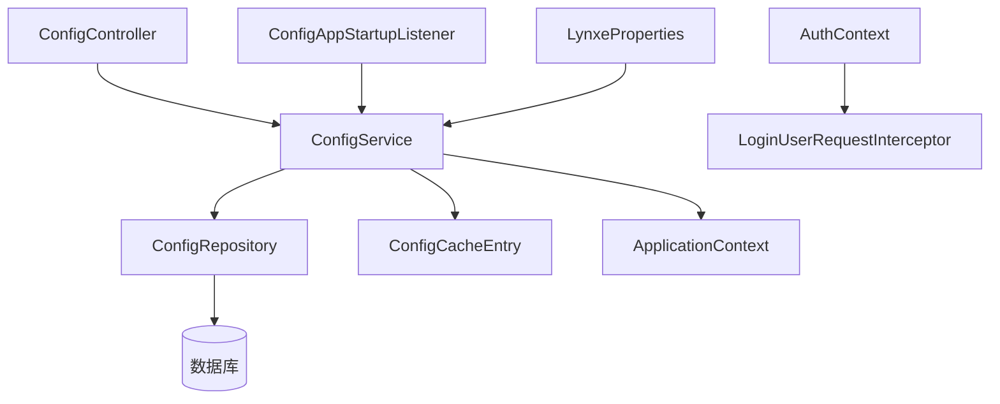
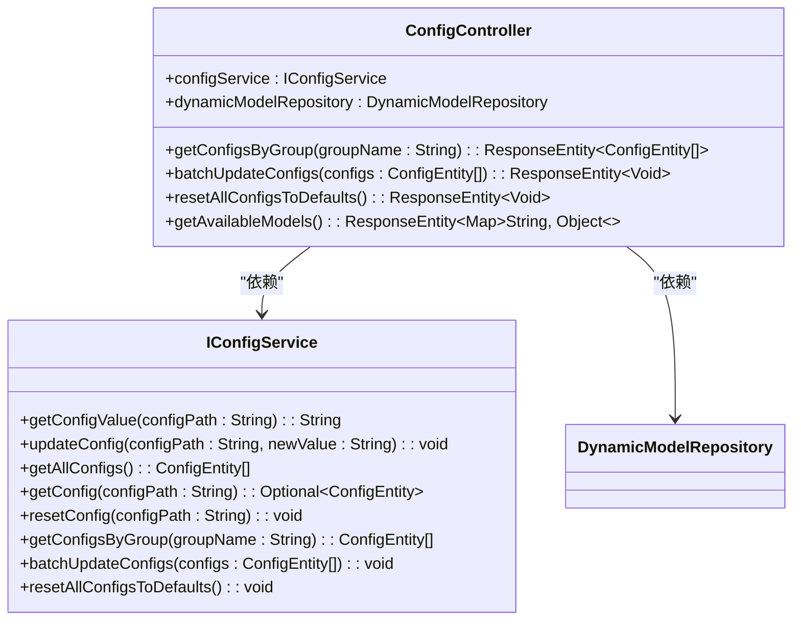
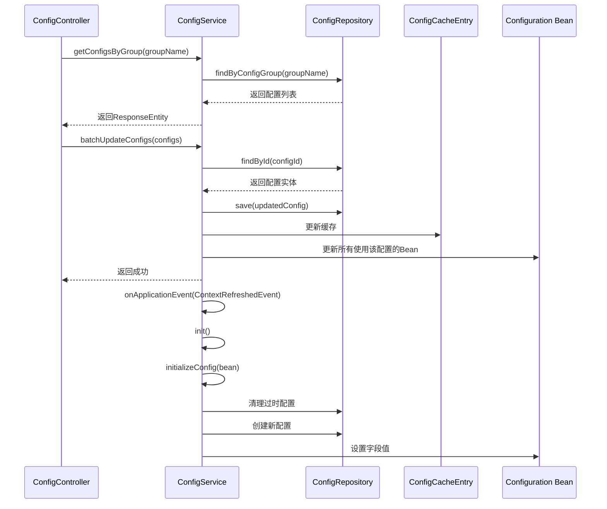
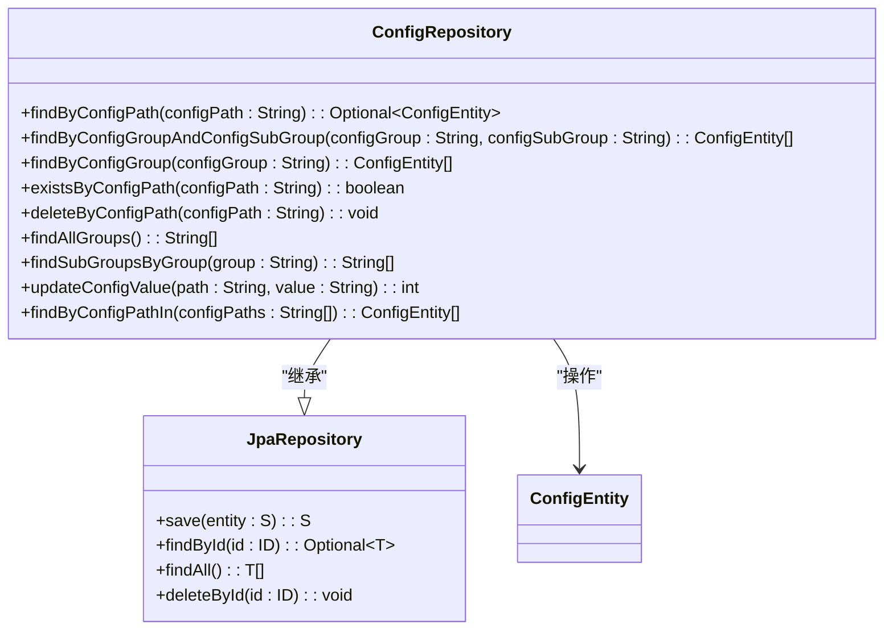
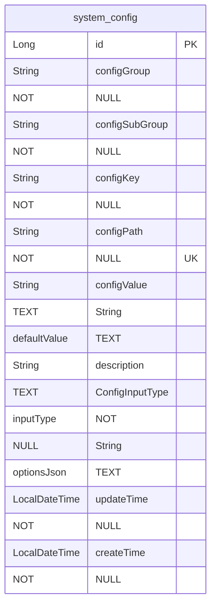
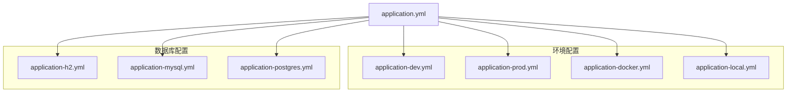
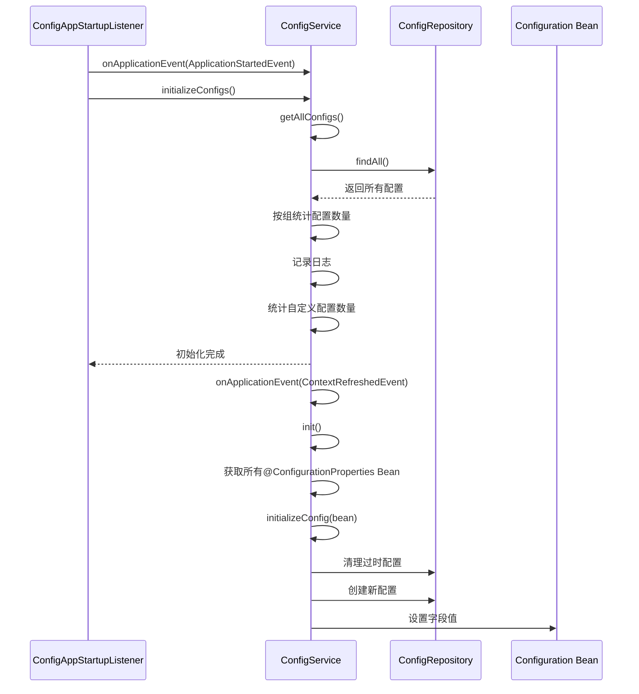
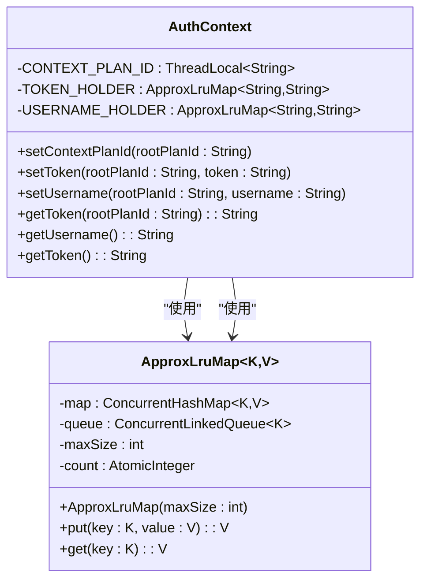
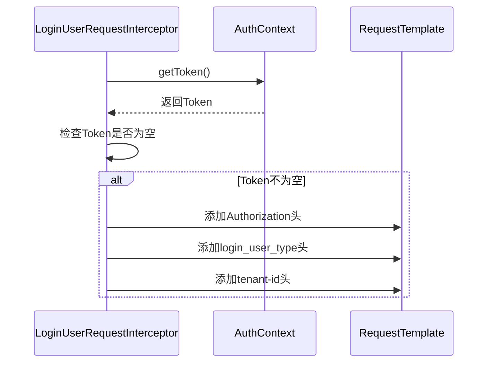

# 系统配置

<cite>
**本文档引用的文件**   
- [ConfigController.java](file://src/main/java/com/alibaba/cloud/ai/lynxe/config/ConfigController.java)
- [ConfigService.java](file://src/main/java/com/alibaba/cloud/ai/lynxe/config/ConfigService.java)
- [ConfigRepository.java](file://src/main/java/com/alibaba/cloud/ai/lynxe/config/repository/ConfigRepository.java)
- [ConfigEntity.java](file://src/main/java/com/alibaba/cloud/ai/lynxe/config/entity/ConfigEntity.java)
- [ConfigCacheEntry.java](file://src/main/java/com/alibaba/cloud/ai/lynxe/config/ConfigCacheEntry.java)
- [ConfigAppStartupListener.java](file://src/main/java/com/alibaba/cloud/ai/lynxe/config/startUp/ConfigAppStartupListener.java)
- [IConfigService.java](file://src/main/java/com/alibaba/cloud/ai/lynxe/config/IConfigService.java)
- [ConfigProperty.java](file://src/main/java/com/alibaba/cloud/ai/lynxe/config/ConfigProperty.java)
- [ConfigOption.java](file://src/main/java/com/alibaba/cloud/ai/lynxe/config/ConfigOption.java)
- [ConfigInputType.java](file://src/main/java/com/alibaba/cloud/ai/lynxe/config/entity/ConfigInputType.java)
- [AuthContext.java](file://src/main/java/com/alibaba/cloud/ai/lynxe/config/rpc/AuthContext.java)
- [LoginUserRequestInterceptor.java](file://src/main/java/com/alibaba/cloud/ai/lynxe/config/rpc/LoginUserRequestInterceptor.java)
- [LynxeProperties.java](file://src/main/java/com/alibaba/cloud/ai/lynxe/config/LynxeProperties.java)
- [application.yml](file://src/main/resources/application.yml)
- [application-dev.yml](file://src/main/resources/application-dev.yml)
- [application-prod.yml](file://src/main/resources/application-prod.yml)
- [application-docker.yml](file://src/main/resources/application-docker.yml)
</cite>

## 目录
1. [系统配置架构](#系统配置架构)
2. [核心组件分析](#核心组件分析)
3. [配置实体与数据结构](#配置实体与数据结构)
4. [REST API接口设计](#rest-api接口设计)
5. [多环境配置管理](#多环境配置管理)
6. [配置动态刷新与缓存机制](#配置动态刷新与缓存机制)
7. [配置初始化流程](#配置初始化流程)
8. [配置安全性处理](#配置安全性处理)
9. [配置使用示例](#配置使用示例)
10. [常见问题排查指南](#常见问题排查指南)

## 系统配置架构

系统配置管理采用典型的三层架构模式，由`ConfigController`、`ConfigService`和`ConfigRepository`三个核心组件构成，实现了职责分离和松耦合设计。



**图示来源**
- [ConfigController.java](file://src/main/java/com/alibaba/cloud/ai/lynxe/config/ConfigController.java)
- [ConfigService.java](file://src/main/java/com/alibaba/cloud/ai/lynxe/config/ConfigService.java)
- [ConfigRepository.java](file://src/main/java/com/alibaba/cloud/ai/lynxe/config/repository/ConfigRepository.java)

**本节来源**
- [ConfigController.java](file://src/main/java/com/alibaba/cloud/ai/lynxe/config/ConfigController.java)
- [ConfigService.java](file://src/main/java/com/alibaba/cloud/ai/lynxe/config/ConfigService.java)
- [ConfigRepository.java](file://src/main/java/com/alibaba/cloud/ai/lynxe/config/repository/ConfigRepository.java)

## 核心组件分析

### ConfigController分析

`ConfigController`作为系统配置的REST API入口，负责处理HTTP请求并将其委托给`ConfigService`进行业务逻辑处理。该控制器提供了配置的查询、批量更新和重置功能。



**图示来源**
- [ConfigController.java](file://src/main/java/com/alibaba/cloud/ai/lynxe/config/ConfigController.java)
- [IConfigService.java](file://src/main/java/com/alibaba/cloud/ai/lynxe/config/IConfigService.java)

**本节来源**
- [ConfigController.java](file://src/main/java/com/alibaba/cloud/ai/lynxe/config/ConfigController.java)

### ConfigService分析

`ConfigService`是配置管理的核心业务逻辑层，实现了`IConfigService`接口。该服务负责配置的初始化、获取、更新、重置等操作，并处理配置变更时的动态刷新。



**图示来源**
- [ConfigService.java](file://src/main/java/com/alibaba/cloud/ai/lynxe/config/ConfigService.java)
- [ConfigRepository.java](file://src/main/java/com/alibaba/cloud/ai/lynxe/config/repository/ConfigRepository.java)
- [ConfigCacheEntry.java](file://src/main/java/com/alibaba/cloud/ai/lynxe/config/ConfigCacheEntry.java)

**本节来源**
- [ConfigService.java](file://src/main/java/com/alibaba/cloud/ai/lynxe/config/ConfigService.java)

### ConfigRepository分析

`ConfigRepository`是数据访问层，继承自`JpaRepository`，提供了对`ConfigEntity`实体的CRUD操作。该仓库接口定义了多种查询方法，支持按配置路径、配置组等条件进行查询。



**图示来源**
- [ConfigRepository.java](file://src/main/java/com/alibaba/cloud/ai/lynxe/config/repository/ConfigRepository.java)
- [ConfigEntity.java](file://src/main/java/com/alibaba/cloud/ai/lynxe/config/entity/ConfigEntity.java)

**本节来源**
- [ConfigRepository.java](file://src/main/java/com/alibaba/cloud/ai/lynxe/config/repository/ConfigRepository.java)

## 配置实体与数据结构

### ConfigEntity实体类

`ConfigEntity`是系统配置的核心数据模型，使用JPA注解映射到数据库表`system_config`。该实体类定义了配置项的各种属性和约束条件。



**图示来源**
- [ConfigEntity.java](file://src/main/java/com/alibaba/cloud/ai/lynxe/config/entity/ConfigEntity.java)

#### 字段定义与约束

| 字段名 | 数据类型 | 约束条件 | 描述 |
|--------|---------|---------|------|
| id | Long | 主键，自增 | 配置项的唯一标识符 |
| configGroup | String | 非空 | 配置组名称 |
| configSubGroup | String | 非空 | 配置子组名称 |
| configKey | String | 非空 | 配置项键名 |
| configPath | String | 非空，唯一 | 配置项完整路径 |
| configValue | String | 文本类型 | 配置项当前值 |
| defaultValue | String | 文本类型 | 配置项默认值 |
| description | String | 文本类型 | 配置项描述 |
| inputType | ConfigInputType | 非空，枚举 | 输入类型 |
| optionsJson | String | 文本类型 | 选项JSON字符串 |
| updateTime | LocalDateTime | 非空 | 最后更新时间 |
| createTime | LocalDateTime | 非空 | 创建时间 |

**本节来源**
- [ConfigEntity.java](file://src/main/java/com/alibaba/cloud/ai/lynxe/config/entity/ConfigEntity.java)

### ConfigInputType枚举

`ConfigInputType`枚举定义了配置项的输入类型，支持多种UI控件类型。

```mermaid
classDiagram
class ConfigInputType {
+TEXT
+SELECT
+CHECKBOX
+BOOLEAN
+NUMBER
}
note right of ConfigInputType
TEXT : 文本输入框
SELECT : 下拉选择框
CHECKBOX : 多选框
BOOLEAN : 单选框(是/否)
NUMBER : 数字输入框
end note
```

**图示来源**
- [ConfigInputType.java](file://src/main/java/com/alibaba/cloud/ai/lynxe/config/entity/ConfigInputType.java)

**本节来源**
- [ConfigInputType.java](file://src/main/java/com/alibaba/cloud/ai/lynxe/config/entity/ConfigInputType.java)

## REST API接口设计

系统配置提供了完整的RESTful API接口，支持配置的增删改查操作。

### API接口表格

| 接口路径 | HTTP方法 | 请求参数 | 响应结构 | 描述 |
|---------|---------|---------|---------|------|
| /api/config/group/{groupName} | GET | groupName: 路径参数 | List<ConfigEntity> | 根据配置组获取配置列表 |
| /api/config/batch-update | POST | List<ConfigEntity> | 200 OK | 批量更新配置项 |
| /api/config/reset-all-defaults | POST | 无 | 200 OK | 重置所有配置为默认值 |
| /api/config/available-models | GET | 无 | Map<String, Object> | 获取可用模型列表 |

### 请求与响应示例

```mermaid
flowchart TD
A[客户端请求] --> B{请求类型}
B --> |GET /api/config/group/browser| C[ConfigController]
C --> D[ConfigService.getConfigsByGroup]
D --> E[ConfigRepository.findByConfigGroup]
E --> F[返回配置列表]
F --> G[ResponseEntity.ok()]
G --> H[返回JSON响应]
B --> |POST /api/config/batch-update| I[ConfigController]
I --> J[ConfigService.batchUpdateConfigs]
J --> K[遍历配置项]
K --> L[ConfigRepository.findById]
L --> M[更新配置值]
M --> N[ConfigRepository.save]
N --> O[更新缓存]
O --> P[更新相关Bean]
P --> Q[返回成功]
```

**图示来源**
- [ConfigController.java](file://src/main/java/com/alibaba/cloud/ai/lynxe/config/ConfigController.java)
- [ConfigService.java](file://src/main/java/com/alibaba/cloud/ai/lynxe/config/ConfigService.java)

**本节来源**
- [ConfigController.java](file://src/main/java/com/alibaba/cloud/ai/lynxe/config/ConfigController.java)

## 多环境配置管理

系统通过Spring Boot的Profile机制实现多环境配置管理，支持开发、测试、生产等不同环境的配置隔离。

### 配置文件结构



**图示来源**
- [application.yml](file://src/main/resources/application.yml)
- [application-dev.yml](file://src/main/resources/application-dev.yml)
- [application-prod.yml](file://src/main/resources/application-prod.yml)
- [application-docker.yml](file://src/main/resources/application-docker.yml)

### 环境激活配置

在`application.yml`中通过`spring.profiles.active`指定激活的配置文件：

```yaml
spring:
  profiles:
    active: prod,docker
```

这种多配置文件机制允许系统在不同部署环境中使用不同的配置参数，如数据库连接、端口号、日志级别等，而无需修改代码。

**本节来源**
- [application.yml](file://src/main/resources/application.yml)
- [application-dev.yml](file://src/main/resources/application-dev.yml)
- [application-prod.yml](file://src/main/resources/application-prod.yml)
- [application-docker.yml](file://src/main/resources/application-docker.yml)

## 配置动态刷新与缓存机制

### ConfigCacheEntry缓存策略

系统使用`ConfigCacheEntry`类实现配置项的本地缓存，提高配置读取性能。

```mermaid
classDiagram
class ConfigCacheEntry~T~ {
-value : T
-lastUpdateTime : long
-EXPIRATION_TIME : long = 30000
+ConfigCacheEntry(value : T)
+getValue() : T
+setValue(value : T)
+isExpired() : boolean
}
note right of ConfigCacheEntry~T~
缓存有效期 : 30秒
使用ConcurrentHashMap存储
实现简单的TTL过期机制
end note
```

**图示来源**
- [ConfigCacheEntry.java](file://src/main/java/com/alibaba/cloud/ai/lynxe/config/ConfigCacheEntry.java)

### 动态刷新机制

当配置项被更新时，系统会自动刷新缓存并通知相关组件：

```mermaid
flowchart TD
A[更新配置] --> B[ConfigService.updateConfig]
B --> C[更新数据库]
C --> D[更新ConfigCacheEntry]
D --> E[获取所有@ConfigurationProperties Bean]
E --> F[遍历Bean字段]
F --> G{字段有@ConfigProperty注解?}
G --> |是| H[检查路径匹配]
H --> I[更新字段值]
I --> J[反射设置新值]
J --> K[配置动态生效]
G --> |否| F
```

**图示来源**
- [ConfigService.java](file://src/main/java/com/alibaba/cloud/ai/lynxe/config/ConfigService.java)
- [ConfigCacheEntry.java](file://src/main/java/com/alibaba/cloud/ai/lynxe/config/ConfigCacheEntry.java)

**本节来源**
- [ConfigService.java](file://src/main/java/com/alibaba/cloud/ai/lynxe/config/ConfigService.java)
- [ConfigCacheEntry.java](file://src/main/java/com/alibaba/cloud/ai/lynxe/config/ConfigCacheEntry.java)

## 配置初始化流程

系统在启动时通过`ConfigAppStartupListener`和`ConfigService`协同完成配置的初始化。



**图示来源**
- [ConfigAppStartupListener.java](file://src/main/java/com/alibaba/cloud/ai/lynxe/config/startUp/ConfigAppStartupListener.java)
- [ConfigService.java](file://src/main/java/com/alibaba/cloud/ai/lynxe/config/ConfigService.java)

**本节来源**
- [ConfigAppStartupListener.java](file://src/main/java/com/alibaba/cloud/ai/lynxe/config/startUp/ConfigAppStartupListener.java)
- [ConfigService.java](file://src/main/java/com/alibaba/cloud/ai/lynxe/config/ConfigService.java)

## 配置安全性处理

### AuthContext权限上下文

`AuthContext`类用于管理异步调用中的权限上下文，避免ThreadLocal数据丢失问题。



**图示来源**
- [AuthContext.java](file://src/main/java/com/alibaba/cloud/ai/lynxe/config/rpc/AuthContext.java)

### LoginUserRequestInterceptor访问拦截

`LoginUserRequestInterceptor`是Feign客户端的请求拦截器，负责在HTTP请求中添加认证信息。



**图示来源**
- [LoginUserRequestInterceptor.java](file://src/main/java/com/alibaba/cloud/ai/lynxe/config/rpc/LoginUserRequestInterceptor.java)
- [AuthContext.java](file://src/main/java/com/alibaba/cloud/ai/lynxe/config/rpc/AuthContext.java)

### 敏感信息处理

系统通过以下机制保护敏感信息：
1. 配置项不直接存储敏感信息，而是通过安全的服务获取
2. 使用`AuthContext`在内存中临时存储认证令牌
3. 通过`LoginUserRequestInterceptor`在请求时动态添加认证信息
4. 配置数据库中的敏感字段应加密存储（需额外实现）

**本节来源**
- [AuthContext.java](file://src/main/java/com/alibaba/cloud/ai/lynxe/config/rpc/AuthContext.java)
- [LoginUserRequestInterceptor.java](file://src/main/java/com/alibaba/cloud/ai/lynxe/config/rpc/LoginUserRequestInterceptor.java)

## 配置使用示例

### 配置属性定义

在`LynxeProperties`类中使用`@ConfigProperty`注解定义配置项：

```java
@ConfigProperty(group = "lynxe", subGroup = "browser", key = "headless", 
                path = "lynxe.browser.headless",
                description = "lynxe.browser.headless.description", 
                defaultValue = "false",
                inputType = ConfigInputType.CHECKBOX,
                options = { @ConfigOption(value = "true", label = "lynxe.browser.headless.option.true"),
                           @ConfigOption(value = "false", label = "lynxe.browser.headless.option.false") })
private volatile Boolean browserHeadless;
```

### 配置读取

```mermaid
flowchart TD
A[调用getBrowserHeadless()] --> B[获取configPath]
B --> C[调用configService.getConfigValue()]
C --> D{缓存中存在?}
D --> |是| E[返回缓存值]
D --> |否| F[从数据库查询]
F --> G[更新缓存]
G --> H[返回值]
E --> H
```

### 配置更新

```mermaid
flowchart TD
A[调用updateConfig()] --> B[查找配置实体]
B --> C[更新配置值]
C --> D[保存到数据库]
D --> E[更新缓存]
E --> F[查找所有@ConfigurationProperties Bean]
F --> G[遍历Bean字段]
G --> H{字段路径匹配?}
H --> |是| I[反射更新字段值]
H --> |否| G
I --> J[配置生效]
```

**本节来源**
- [LynxeProperties.java](file://src/main/java/com/alibaba/cloud/ai/lynxe/config/LynxeProperties.java)
- [ConfigService.java](file://src/main/java/com/alibaba/cloud/ai/lynxe/config/ConfigService.java)

## 常见问题排查指南

### 配置不生效

**问题现象**：修改配置后，系统行为未按预期改变。

**可能原因及解决方案**：
1. **缓存未更新**：检查`ConfigCacheEntry`是否正确更新
   - 解决方案：确认`updateConfig`方法中是否调用了`configCache.put()`
2. **Bean未刷新**：相关组件未收到配置变更通知
   - 解决方案：检查`updateBeanConfig`方法是否正确执行
3. **字段类型不匹配**：配置值无法转换为目标字段类型
   - 解决方案：检查`convertValue`方法支持的类型

### 缓存未更新

**问题现象**：配置更新后，读取的仍是旧值。

**排查步骤**：
1. 检查`ConfigService.updateConfig`方法是否调用了`configCache.put()`
2. 确认`ConfigCacheEntry.isExpired()`方法的过期时间设置
3. 验证缓存键（configPath）是否正确

### 跨环境配置冲突

**问题现象**：不同环境的配置相互影响。

**解决方案**：
1. 确保`spring.profiles.active`正确设置了环境
2. 检查配置文件的优先级，确保环境特定配置覆盖了通用配置
3. 验证数据库中的配置项是否被正确初始化

### 启动时配置初始化失败

**问题现象**：系统启动时配置初始化报错。

**排查步骤**：
1. 检查`ConfigAppStartupListener`是否正确执行
2. 验证数据库连接是否正常
3. 确认`LynxeProperties`类中的`@ConfigurationProperties`注解是否正确

**本节来源**
- [ConfigService.java](file://src/main/java/com/alibaba/cloud/ai/lynxe/config/ConfigService.java)
- [ConfigAppStartupListener.java](file://src/main/java/com/alibaba/cloud/ai/lynxe/config/startUp/ConfigAppStartupListener.java)
- [LynxeProperties.java](file://src/main/java/com/alibaba/cloud/ai/lynxe/config/LynxeProperties.java)