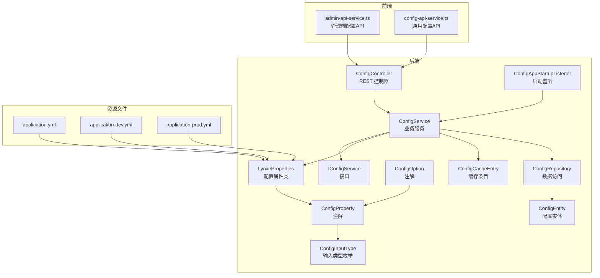
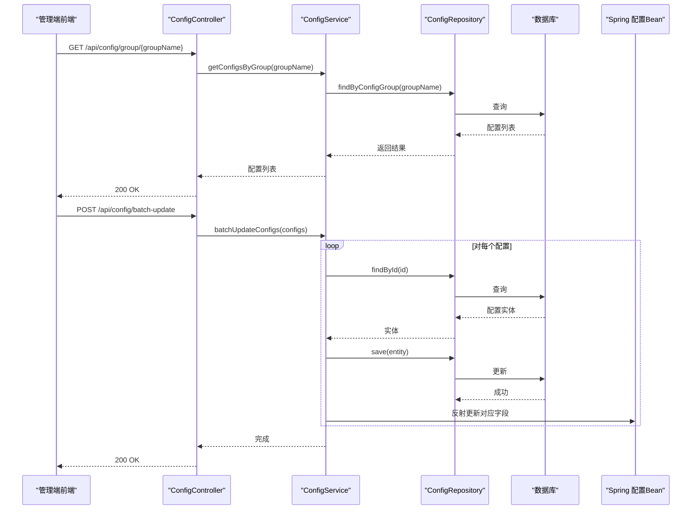
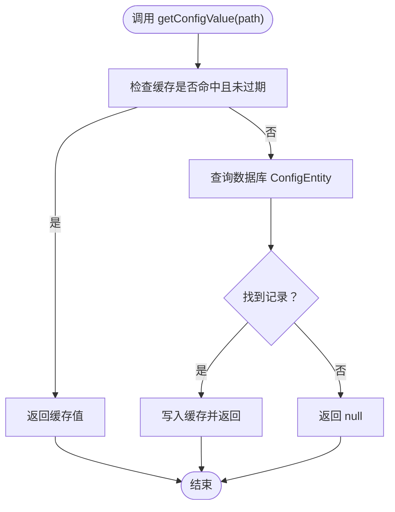
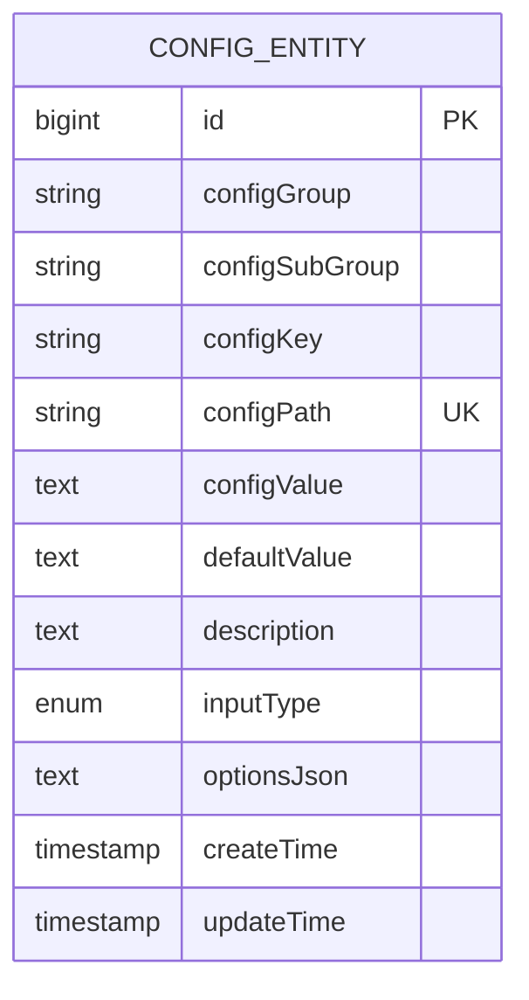
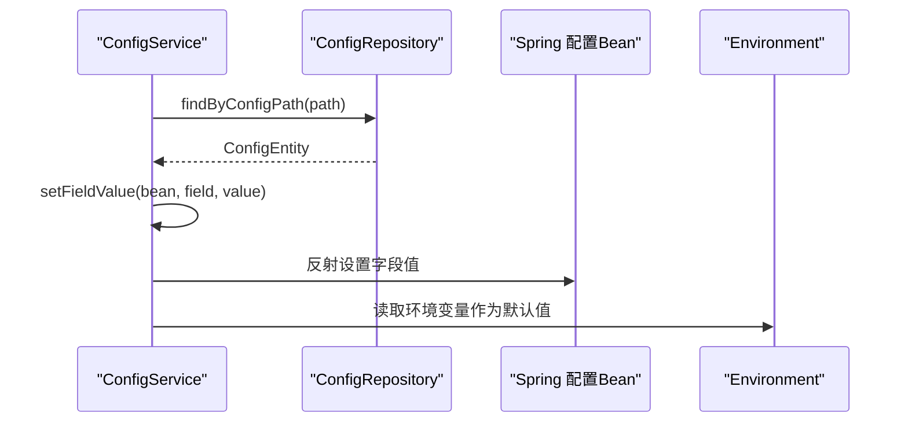
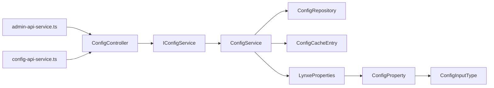

# 配置管理

<cite>
**本文引用的文件**
- [ConfigController.java](file://src/main/java/com/alibaba/cloud/ai/lynxe/config/ConfigController.java)
- [ConfigService.java](file://src/main/java/com/alibaba/cloud/ai/lynxe/config/ConfigService.java)
- [ConfigRepository.java](file://src/main/java/com/alibaba/cloud/ai/lynxe/config/repository/ConfigRepository.java)
- [ConfigEntity.java](file://src/main/java/com/alibaba/cloud/ai/lynxe/config/entity/ConfigEntity.java)
- [IConfigService.java](file://src/main/java/com/alibaba/cloud/ai/lynxe/config/IConfigService.java)
- [ConfigProperty.java](file://src/main/java/com/alibaba/cloud/ai/lynxe/config/ConfigProperty.java)
- [ConfigOption.java](file://src/main/java/com/alibaba/cloud/ai/lynxe/config/ConfigOption.java)
- [ConfigCacheEntry.java](file://src/main/java/com/alibaba/cloud/ai/lynxe/config/ConfigCacheEntry.java)
- [ConfigInputType.java](file://src/main/java/com/alibaba/cloud/ai/lynxe/config/entity/ConfigInputType.java)
- [LynxeProperties.java](file://src/main/java/com/alibaba/cloud/ai/lynxe/config/LynxeProperties.java)
- [ConfigAppStartupListener.java](file://src/main/java/com/alibaba/cloud/ai/lynxe/config/startUp/ConfigAppStartupListener.java)
- [application.yml](file://src/main/resources/application.yml)
- [application-prod.yml](file://src/main/resources/application-prod.yml)
- [application-dev.yml](file://src/main/resources/application-dev.yml)
- [config-api-service.ts](file://ui-vue3/src/api/config-api-service.ts)
- [admin-api-service.ts](file://ui-vue3/src/api/admin-api-service.ts)
</cite>

## 目录
1. [简介](#简介)
2. [项目结构](#项目结构)
3. [核心组件](#核心组件)
4. [架构总览](#架构总览)
5. [详细组件分析](#详细组件分析)
6. [依赖关系分析](#依赖关系分析)
7. [性能与缓存特性](#性能与缓存特性)
8. [配置API使用指南](#配置api使用指南)
9. [多环境配置管理](#多环境配置管理)
10. [验证、默认值与安全](#验证默认值与安全)
11. [最佳实践与运维建议](#最佳实践与运维建议)
12. [故障排查](#故障排查)
13. [结论](#结论)

## 简介
本文件面向系统管理员与开发者，系统性梳理 JManus 项目的“配置管理系统”。内容涵盖：
- 架构与职责：ConfigController、ConfigService、ConfigRepository 的分工与协作
- 数据模型：ConfigEntity 字段与输入类型
- 存储与缓存：数据库持久化、内存缓存与过期策略
- 运行时更新：从数据库到 Spring Bean 的实时同步
- 多环境配置：通过 application.yml 及 application-{env}.yml 的 Profile 切换
- 验证与默认值：注解驱动的校验、默认值与下拉选项
- 安全：敏感信息保护与最小暴露原则
- API 使用：分组查询、批量更新、重置默认值等接口
- 运维：版本控制、备份与恢复建议
- 故障排查：常见问题定位与修复

## 项目结构
配置管理模块位于后端 Java 包 com.alibaba.cloud.ai.lynxe.config 下，采用“控制器-服务-仓储-实体”的分层设计；前端通过独立 API 服务对接配置管理接口。

图表来源
- [ConfigController.java](file://src/main/java/com/alibaba/cloud/ai/lynxe/config/ConfigController.java#L1-L82)
- [ConfigService.java](file://src/main/java/com/alibaba/cloud/ai/lynxe/config/ConfigService.java#L1-L320)
- [ConfigRepository.java](file://src/main/java/com/alibaba/cloud/ai/lynxe/config/repository/ConfigRepository.java#L1-L101)
- [ConfigEntity.java](file://src/main/java/com/alibaba/cloud/ai/lynxe/config/entity/ConfigEntity.java#L1-L218)
- [IConfigService.java](file://src/main/java/com/alibaba/cloud/ai/lynxe/config/IConfigService.java#L1-L81)
- [ConfigProperty.java](file://src/main/java/com/alibaba/cloud/ai/lynxe/config/ConfigProperty.java#L1-L89)
- [ConfigOption.java](file://src/main/java/com/alibaba/cloud/ai/lynxe/config/ConfigOption.java#L1-L64)
- [ConfigCacheEntry.java](file://src/main/java/com/alibaba/cloud/ai/lynxe/config/ConfigCacheEntry.java#L1-L45)
- [ConfigInputType.java](file://src/main/java/com/alibaba/cloud/ai/lynxe/config/entity/ConfigInputType.java#L1-L46)
- [LynxeProperties.java](file://src/main/java/com/alibaba/cloud/ai/lynxe/config/LynxeProperties.java#L1-L552)
- [ConfigAppStartupListener.java](file://src/main/java/com/alibaba/cloud/ai/lynxe/config/startUp/ConfigAppStartupListener.java#L1-L84)
- [application.yml](file://src/main/resources/application.yml#L1-L98)
- [application-dev.yml](file://src/main/resources/application-dev.yml#L1-L20)
- [application-prod.yml](file://src/main/resources/application-prod.yml#L1-L47)
- [admin-api-service.ts](file://ui-vue3/src/api/admin-api-service.ts#L1-L120)
- [config-api-service.ts](file://ui-vue3/src/api/config-api-service.ts#L1-L32)

章节来源
- [ConfigController.java](file://src/main/java/com/alibaba/cloud/ai/lynxe/config/ConfigController.java#L1-L82)
- [ConfigService.java](file://src/main/java/com/alibaba/cloud/ai/lynxe/config/ConfigService.java#L1-L320)
- [ConfigRepository.java](file://src/main/java/com/alibaba/cloud/ai/lynxe/config/repository/ConfigRepository.java#L1-L101)
- [ConfigEntity.java](file://src/main/java/com/alibaba/cloud/ai/lynxe/config/entity/ConfigEntity.java#L1-L218)
- [IConfigService.java](file://src/main/java/com/alibaba/cloud/ai/lynxe/config/IConfigService.java#L1-L81)
- [ConfigProperty.java](file://src/main/java/com/alibaba/cloud/ai/lynxe/config/ConfigProperty.java#L1-L89)
- [ConfigOption.java](file://src/main/java/com/alibaba/cloud/ai/lynxe/config/ConfigOption.java#L1-L64)
- [ConfigCacheEntry.java](file://src/main/java/com/alibaba/cloud/ai/lynxe/config/ConfigCacheEntry.java#L1-L45)
- [ConfigInputType.java](file://src/main/java/com/alibaba/cloud/ai/lynxe/config/entity/ConfigInputType.java#L1-L46)
- [LynxeProperties.java](file://src/main/java/com/alibaba/cloud/ai/lynxe/config/LynxeProperties.java#L1-L552)
- [ConfigAppStartupListener.java](file://src/main/java/com/alibaba/cloud/ai/lynxe/config/startUp/ConfigAppStartupListener.java#L1-L84)
- [application.yml](file://src/main/resources/application.yml#L1-L98)
- [application-dev.yml](file://src/main/resources/application-dev.yml#L1-L20)
- [application-prod.yml](file://src/main/resources/application-prod.yml#L1-L47)
- [admin-api-service.ts](file://ui-vue3/src/api/admin-api-service.ts#L1-L120)
- [config-api-service.ts](file://ui-vue3/src/api/config-api-service.ts#L1-L32)

## 核心组件
- ConfigController：对外提供 REST 接口，负责分组查询、批量更新、重置默认值、可用模型列表等。
- ConfigService：核心业务逻辑，负责初始化配置、缓存、运行时更新、类型转换、批量重置等。
- ConfigRepository：基于 Spring Data JPA 的数据访问层，提供按路径、分组、子组查询与统计。
- ConfigEntity：配置实体，持久化字段包括分组、键、路径、当前值、默认值、描述、输入类型、选项 JSON、时间戳等。
- IConfigService：接口定义，确保在原生镜像模式下的代理兼容性。
- ConfigProperty/ConfigOption：注解体系，定义配置的分层结构、默认值、输入类型与下拉选项。
- ConfigCacheEntry：轻量级内存缓存，带过期时间，减少频繁数据库访问。
- ConfigInputType：输入类型枚举，支持文本、选择框、复选框、布尔、数字等。
- LynxeProperties：以 @ConfigurationProperties 加载的配置属性类，通过 @ConfigProperty 注解声明可管理的配置项。
- ConfigAppStartupListener：应用启动监听器，用于初始化配置状态统计与日志输出。
- application.yml 及 application-{env}.yml：多环境配置入口，Profile 切换与 Nacos 导入。

章节来源
- [ConfigController.java](file://src/main/java/com/alibaba/cloud/ai/lynxe/config/ConfigController.java#L1-L82)
- [ConfigService.java](file://src/main/java/com/alibaba/cloud/ai/lynxe/config/ConfigService.java#L1-L320)
- [ConfigRepository.java](file://src/main/java/com/alibaba/cloud/ai/lynxe/config/repository/ConfigRepository.java#L1-L101)
- [ConfigEntity.java](file://src/main/java/com/alibaba/cloud/ai/lynxe/config/entity/ConfigEntity.java#L1-L218)
- [IConfigService.java](file://src/main/java/com/alibaba/cloud/ai/lynxe/config/IConfigService.java#L1-L81)
- [ConfigProperty.java](file://src/main/java/com/alibaba/cloud/ai/lynxe/config/ConfigProperty.java#L1-L89)
- [ConfigOption.java](file://src/main/java/com/alibaba/cloud/ai/lynxe/config/ConfigOption.java#L1-L64)
- [ConfigCacheEntry.java](file://src/main/java/com/alibaba/cloud/ai/lynxe/config/ConfigCacheEntry.java#L1-L45)
- [ConfigInputType.java](file://src/main/java/com/alibaba/cloud/ai/lynxe/config/entity/ConfigInputType.java#L1-L46)
- [LynxeProperties.java](file://src/main/java/com/alibaba/cloud/ai/lynxe/config/LynxeProperties.java#L1-L552)
- [ConfigAppStartupListener.java](file://src/main/java/com/alibaba/cloud/ai/lynxe/config/startUp/ConfigAppStartupListener.java#L1-L84)
- [application.yml](file://src/main/resources/application.yml#L1-L98)
- [application-dev.yml](file://src/main/resources/application-dev.yml#L1-L20)
- [application-prod.yml](file://src/main/resources/application-prod.yml#L1-L47)

## 架构总览
配置管理采用“注解驱动 + 运行时同步”的架构：
- 启动阶段：扫描带有 @ConfigurationProperties 的 Bean，解析 @ConfigProperty 声明的配置项，写入数据库并设置默认值。
- 运行阶段：ConfigService 提供统一的读取、更新、批量更新、重置默认值能力；ConfigCacheEntry 缓存热点配置；更新后反射回填到对应 Bean 字段。
- 前端：通过 admin-api-service.ts 与 config-api-service.ts 调用后端接口进行配置管理与展示。

图表来源
- [ConfigController.java](file://src/main/java/com/alibaba/cloud/ai/lynxe/config/ConfigController.java#L1-L82)
- [ConfigService.java](file://src/main/java/com/alibaba/cloud/ai/lynxe/config/ConfigService.java#L1-L320)
- [ConfigRepository.java](file://src/main/java/com/alibaba/cloud/ai/lynxe/config/repository/ConfigRepository.java#L1-L101)
- [LynxeProperties.java](file://src/main/java/com/alibaba/cloud/ai/lynxe/config/LynxeProperties.java#L1-L552)

## 详细组件分析

### ConfigController 分析
- 负责对外暴露配置管理接口：
  - 分组查询：根据 groupName 获取配置列表
  - 批量更新：接收配置列表，逐个更新值并触发 Bean 回填
  - 重置默认值：一键将所有配置恢复为默认值
  - 可用模型列表：返回动态模型选项，供前端选择
- 控制器直接依赖 IConfigService 与 DynamicModelRepository，保证接口稳定与可测试性。

章节来源
- [ConfigController.java](file://src/main/java/com/alibaba/cloud/ai/lynxe/config/ConfigController.java#L1-L82)

### ConfigService 分析
- 初始化流程：
  - 监听 ContextRefreshedEvent，扫描带 @ConfigurationProperties 的 Bean
  - 解析 @ConfigProperty，生成或更新数据库中的配置项，优先使用 Environment 中的同名属性值，否则使用注解默认值
  - 清理已废弃的配置项（不在当前 Bean 中定义的旧配置）
- 运行时能力：
  - getConfigValue：先查缓存，未命中则查库并写入缓存
  - updateConfig：更新数据库值、刷新缓存、反射回填 Bean 字段
  - batchUpdateConfigs：批量更新并回填
  - resetAllConfigsToDefaults：遍历所有配置，将非默认值重置为默认值并回填
  - 类型转换：根据目标字段类型对字符串值进行转换（String/Boolean/Integer/Long/Double/Float）
- 缓存策略：ConfigCacheEntry 默认 30 秒过期，提升高频读取性能。

图表来源
- [ConfigService.java](file://src/main/java/com/alibaba/cloud/ai/lynxe/config/ConfigService.java#L165-L180)
- [ConfigCacheEntry.java](file://src/main/java/com/alibaba/cloud/ai/lynxe/config/ConfigCacheEntry.java#L1-L45)

章节来源
- [ConfigService.java](file://src/main/java/com/alibaba/cloud/ai/lynxe/config/ConfigService.java#L1-L320)
- [ConfigCacheEntry.java](file://src/main/java/com/alibaba/cloud/ai/lynxe/config/ConfigCacheEntry.java#L1-L45)

### ConfigRepository 分析
- 提供按路径、分组、子组的查询与统计接口，支持：
  - findByConfigPath、existsByConfigPath、deleteByConfigPath
  - findByConfigGroup、findByConfigGroupAndConfigSubGroup
  - findAllGroups、findSubGroupsByGroup
  - updateConfigValue（原生 JPQL 批量更新）
  - findByConfigPathIn（批量查询）

章节来源
- [ConfigRepository.java](file://src/main/java/com/alibaba/cloud/ai/lynxe/config/repository/ConfigRepository.java#L1-L101)

### ConfigEntity 数据模型
- 关键字段：
  - configGroup、configSubGroup、configKey、configPath：唯一标识一条配置
  - configValue、defaultValue：当前值与默认值（均以字符串存储）
  - description：配置描述
  - inputType：输入类型（ConfigInputType）
  - optionsJson：当输入类型为 SELECT 时存储选项 JSON
  - createTime、updateTime：时间戳
- 约束与索引：configPath 唯一，便于快速定位与去重。

图表来源
- [ConfigEntity.java](file://src/main/java/com/alibaba/cloud/ai/lynxe/config/entity/ConfigEntity.java#L1-L218)
- [ConfigInputType.java](file://src/main/java/com/alibaba/cloud/ai/lynxe/config/entity/ConfigInputType.java#L1-L46)

章节来源
- [ConfigEntity.java](file://src/main/java/com/alibaba/cloud/ai/lynxe/config/entity/ConfigEntity.java#L1-L218)
- [ConfigInputType.java](file://src/main/java/com/alibaba/cloud/ai/lynxe/config/entity/ConfigInputType.java#L1-L46)

### 注解与输入类型
- ConfigProperty：声明配置的三层结构（group.subGroup.key）、路径、描述、默认值、输入类型、下拉选项等。
- ConfigOption：定义下拉/单选/多选的选项集合。
- ConfigInputType：输入类型枚举，支持 TEXT、SELECT、CHECKBOX、BOOLEAN、NUMBER。

章节来源
- [ConfigProperty.java](file://src/main/java/com/alibaba/cloud/ai/lynxe/config/ConfigProperty.java#L1-L89)
- [ConfigOption.java](file://src/main/java/com/alibaba/cloud/ai/lynxe/config/ConfigOption.java#L1-L64)
- [ConfigInputType.java](file://src/main/java/com/alibaba/cloud/ai/lynxe/config/entity/ConfigInputType.java#L1-L46)

### 运行时更新流程（从数据库到 Bean）
- 更新配置后，ConfigService 会扫描所有带 @ConfigurationProperties 的 Bean，匹配对应字段的 @ConfigProperty.path，使用反射将其字段值更新为最新值。
- 类型转换：根据字段类型进行字符串到目标类型的转换，失败时抛出异常。

图表来源
- [ConfigService.java](file://src/main/java/com/alibaba/cloud/ai/lynxe/config/ConfigService.java#L182-L217)
- [LynxeProperties.java](file://src/main/java/com/alibaba/cloud/ai/lynxe/config/LynxeProperties.java#L1-L552)

章节来源
- [ConfigService.java](file://src/main/java/com/alibaba/cloud/ai/lynxe/config/ConfigService.java#L182-L217)
- [LynxeProperties.java](file://src/main/java/com/alibaba/cloud/ai/lynxe/config/LynxeProperties.java#L1-L552)

## 依赖关系分析
- 组件耦合：
  - ConfigController 仅依赖 IConfigService，降低对具体实现的耦合
  - ConfigService 依赖 ConfigRepository、ApplicationContext、Environment，承担核心业务与缓存
  - LynxeProperties 通过 @ConfigurationProperties 与 @ConfigProperty 声明配置项，由 ConfigService 在启动时初始化
- 外部依赖：
  - Spring Boot 自动装配与 AOP 代理
  - Spring Data JPA 与数据库
  - 前端通过 axios 调用 /api/config 下的 REST 接口

图表来源
- [ConfigController.java](file://src/main/java/com/alibaba/cloud/ai/lynxe/config/ConfigController.java#L1-L82)
- [ConfigService.java](file://src/main/java/com/alibaba/cloud/ai/lynxe/config/ConfigService.java#L1-L320)
- [ConfigRepository.java](file://src/main/java/com/alibaba/cloud/ai/lynxe/config/repository/ConfigRepository.java#L1-L101)
- [ConfigCacheEntry.java](file://src/main/java/com/alibaba/cloud/ai/lynxe/config/ConfigCacheEntry.java#L1-L45)
- [LynxeProperties.java](file://src/main/java/com/alibaba/cloud/ai/lynxe/config/LynxeProperties.java#L1-L552)
- [ConfigProperty.java](file://src/main/java/com/alibaba/cloud/ai/lynxe/config/ConfigProperty.java#L1-L89)
- [ConfigInputType.java](file://src/main/java/com/alibaba/cloud/ai/lynxe/config/entity/ConfigInputType.java#L1-L46)
- [admin-api-service.ts](file://ui-vue3/src/api/admin-api-service.ts#L1-L120)
- [config-api-service.ts](file://ui-vue3/src/api/config-api-service.ts#L1-L32)

章节来源
- [ConfigController.java](file://src/main/java/com/alibaba/cloud/ai/lynxe/config/ConfigController.java#L1-L82)
- [ConfigService.java](file://src/main/java/com/alibaba/cloud/ai/lynxe/config/ConfigService.java#L1-L320)
- [ConfigRepository.java](file://src/main/java/com/alibaba/cloud/ai/lynxe/config/repository/ConfigRepository.java#L1-L101)
- [ConfigCacheEntry.java](file://src/main/java/com/alibaba/cloud/ai/lynxe/config/ConfigCacheEntry.java#L1-L45)
- [LynxeProperties.java](file://src/main/java/com/alibaba/cloud/ai/lynxe/config/LynxeProperties.java#L1-L552)
- [ConfigProperty.java](file://src/main/java/com/alibaba/cloud/ai/lynxe/config/ConfigProperty.java#L1-L89)
- [ConfigInputType.java](file://src/main/java/com/alibaba/cloud/ai/lynxe/config/entity/ConfigInputType.java#L1-L46)
- [admin-api-service.ts](file://ui-vue3/src/api/admin-api-service.ts#L1-L120)
- [config-api-service.ts](file://ui-vue3/src/api/config-api-service.ts#L1-L32)

## 性能与缓存特性
- 缓存策略：ConfigCacheEntry 默认 30 秒过期，减少数据库压力；高频读取场景显著降低延迟。
- 批量更新：ConfigRepository 提供 updateConfigValue 原生 JPQL 批量更新，配合 ConfigService 的批量回填，提升整体吞吐。
- 类型转换：在运行时进行一次字符串到目标类型的转换，避免重复解析成本。
- 启动清理：启动阶段清理不再使用的旧配置，保持配置表整洁，减少冗余查询。

章节来源
- [ConfigCacheEntry.java](file://src/main/java/com/alibaba/cloud/ai/lynxe/config/ConfigCacheEntry.java#L1-L45)
- [ConfigRepository.java](file://src/main/java/com/alibaba/cloud/ai/lynxe/config/repository/ConfigRepository.java#L84-L91)
- [ConfigService.java](file://src/main/java/com/alibaba/cloud/ai/lynxe/config/ConfigService.java#L182-L217)

## 配置API使用指南
- 分组查询
  - 方法：GET /api/config/group/{groupName}
  - 用途：按组获取配置列表
  - 响应：List<ConfigEntity>
- 批量更新
  - 方法：POST /api/config/batch-update
  - 请求体：List<ConfigEntity>（仅需 id 与 configValue）
  - 用途：一次性更新多个配置项
- 重置默认值
  - 方法：POST /api/config/reset-all-defaults
  - 用途：将所有配置恢复为默认值
- 可用模型列表
  - 方法：GET /api/config/available-models
  - 用途：返回动态模型选项，供前端选择
  - 响应：Map<String, Object>，包含 options 与 total

前端对接参考：
- 管理端配置 API：见 [admin-api-service.ts](file://ui-vue3/src/api/admin-api-service.ts#L1-L120)
- 通用配置 API：见 [config-api-service.ts](file://ui-vue3/src/api/config-api-service.ts#L1-L32)

章节来源
- [ConfigController.java](file://src/main/java/com/alibaba/cloud/ai/lynxe/config/ConfigController.java#L46-L81)
- [admin-api-service.ts](file://ui-vue3/src/api/admin-api-service.ts#L1-L120)
- [config-api-service.ts](file://ui-vue3/src/api/config-api-service.ts#L1-L32)

## 多环境配置管理
- 入口文件：
  - application.yml：全局基础配置，包含 profile 激活（prod,docker）
  - application-dev.yml：开发环境配置，Nacos 发现与配置导入
  - application-prod.yml：生产环境配置，数据库连接、JPA 方言、Nacos 命名空间与分组、配置导入
- Profile 切换：通过 spring.profiles.active 激活 prod 与 docker 组合，实现不同环境的差异化加载。
- Nacos 导入：通过 spring.config.import 引入远程配置，实现集中式配置管理与热更新。

章节来源
- [application.yml](file://src/main/resources/application.yml#L1-L98)
- [application-dev.yml](file://src/main/resources/application-dev.yml#L1-L20)
- [application-prod.yml](file://src/main/resources/application-prod.yml#L1-L47)

## 验证、默认值与安全
- 验证与默认值：
  - 注解驱动：@ConfigProperty 的 defaultValue 与 inputType 提供默认值与输入约束
  - 下拉选项：@ConfigOption 支持 SELECT 类型的选项集，optionsJson 存储
  - 运行时默认值：LynxeProperties 中部分字段在未配置时提供硬编码默认值，确保健壮性
- 类型转换：ConfigService.convertValue 将字符串转换为目标类型，不支持的类型会抛出异常
- 安全敏感配置：
  - 建议将敏感信息（如数据库密码、Nacos 凭据）置于外部密钥管理或环境变量中，避免直接写入仓库
  - 通过 Nacos 管理敏感配置，结合命名空间隔离与只读权限控制
  - 对外暴露的 API 应限制敏感字段返回，必要时在 DTO 层过滤

章节来源
- [ConfigProperty.java](file://src/main/java/com/alibaba/cloud/ai/lynxe/config/ConfigProperty.java#L1-L89)
- [ConfigOption.java](file://src/main/java/com/alibaba/cloud/ai/lynxe/config/ConfigOption.java#L1-L64)
- [ConfigService.java](file://src/main/java/com/alibaba/cloud/ai/lynxe/config/ConfigService.java#L219-L245)
- [LynxeProperties.java](file://src/main/java/com/alibaba/cloud/ai/lynxe/config/LynxeProperties.java#L1-L552)
- [application-prod.yml](file://src/main/resources/application-prod.yml#L1-L47)

## 最佳实践与运维建议
- 版本控制：
  - 将 application-{env}.yml 与自定义配置纳入版本管理，保留变更历史
  - 对关键配置的修改建立变更审批流程
- 备份与恢复：
  - 定期导出 system_config 表（含 configValue、defaultValue、optionsJson），作为配置快照
  - 生产环境使用只读副本进行备份，避免影响主库性能
- 运行监控：
  - 启动监听器输出配置数量与自定义值统计，便于巡检
  - 监控配置更新成功率与回填耗时
- 热更新与灰度：
  - 通过 Nacos 进行灰度发布，逐步扩大生效范围
  - 更新前先执行 reset-all-defaults 验证回滚路径
- 前端交互：
  - 使用 admin-api-service.ts 的批量更新接口，减少请求次数
  - 对 SELECT 类型配置，前端渲染 optionsJson 并校验用户输入

章节来源
- [ConfigAppStartupListener.java](file://src/main/java/com/alibaba/cloud/ai/lynxe/config/startUp/ConfigAppStartupListener.java#L1-L84)
- [ConfigService.java](file://src/main/java/com/alibaba/cloud/ai/lynxe/config/ConfigService.java#L301-L317)
- [admin-api-service.ts](file://ui-vue3/src/api/admin-api-service.ts#L1-L120)

## 故障排查
- 配置未生效
  - 检查 @ConfigProperty 的 path 是否与 application-{env}.yml 中的键一致
  - 确认 Environment 中是否存在同名属性覆盖
- 更新后 Bean 未变化
  - 确认对应字段存在 @ConfigProperty 注解且 path 匹配
  - 查看日志中是否有 setFieldValue 失败的异常
- 批量更新失败
  - 检查请求体中的 id 是否存在，以及 configValue 是否符合字段类型
  - 关注事务边界与回填过程的日志
- 缓存命中异常
  - 确认 ConfigCacheEntry 的过期时间是否过短导致频繁失效
  - 如需强制刷新，可在更新后等待缓存过期或重启应用

章节来源
- [ConfigService.java](file://src/main/java/com/alibaba/cloud/ai/lynxe/config/ConfigService.java#L182-L217)
- [ConfigCacheEntry.java](file://src/main/java/com/alibaba/cloud/ai/lynxe/config/ConfigCacheEntry.java#L1-L45)
- [ConfigRepository.java](file://src/main/java/com/alibaba/cloud/ai/lynxe/config/repository/ConfigRepository.java#L84-L91)

## 结论
该配置管理系统以注解驱动为核心，结合数据库持久化与内存缓存，在启动阶段完成配置初始化，并在运行时通过反射实现配置到 Bean 的实时同步。其 REST 接口简洁明确，支持分组查询、批量更新与一键重置默认值，适合多环境部署与集中式配置管理。建议在生产环境中配合 Nacos 与严格的变更流程，确保配置的安全与稳定。